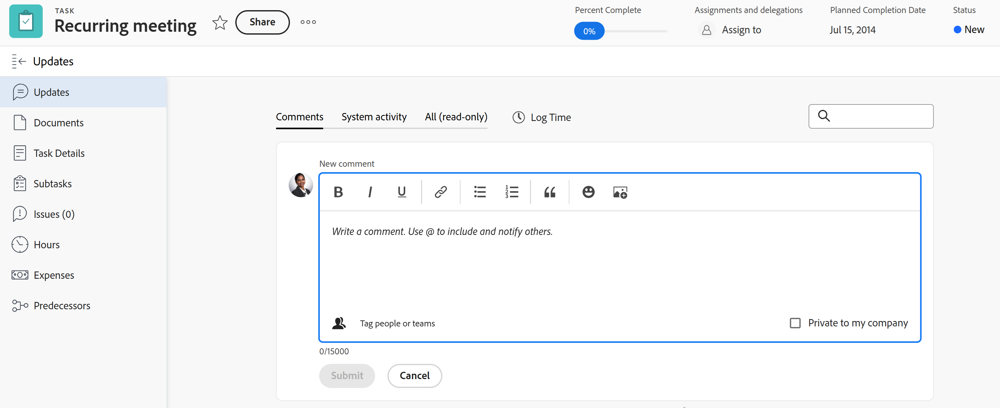

# Panoramica della sezione Aggiornamenti

<!-- Audited: 1/2024 -->

<!--
The highlighted information on this page refers to functionality not yet generally available. It is available only in the Preview environment for all customers or in Production for customers who enabled fast releases. 

For information about fast releases, see [Enable or disable fast releases for your organization](/help/quicksilver/administration-and-setup/set-up-workfront/configure-system-defaults/enable-fast-release-process.md).

For information about the current release schedule, see [Second Quarter 2024 release overview](/help/quicksilver/product-announcements/product-releases/24-q2-release-activity/24-q2-release-overview.md).
-->

Nella sezione Aggiornamenti di un oggetto vengono visualizzati i commenti degli utenti sull&#39;oggetto o gli aggiornamenti di sistema che tengono traccia delle modifiche apportate all&#39;oggetto.

<!--
>[!IMPORTANT]
>
>We are currently redesigning the commenting experience in Adobe Workfront.
>
>Depending on what objects you access the commenting experience for, you might see the following functionality for the Updates section:
>* The new experience
>* The legacy experience
>* The new and the legacy experience
>
>For more information about the new commenting experience and its availability, see [New commenting experience](../../product-announcements/betas/new-commenting-experience-beta/unified-commenting-experience.md). 
>
> The legacy commenting experience has been removed from projects, tasks, issues, and documents in the Preview environment. 
>
>The new commenting experience is available only for the Updates section of Workfront objects, and it is not available when you access updates from the following areas:
>
> * Home
> * Summary panel in lists
> * Summary panel in timesheets 
> * Summary panel in the Workload Balancer
>
>The new commenting experience is available in the Summary panel in lists, timesheets, and the Workload Balancer in the Preview environment and in the Production environment for customers who have opted for the fast release process.
-->

## Panoramica della sezione Aggiornamenti

La sezione Aggiornamenti di un oggetto mostra gli aggiornamenti di sistema e fino a 200 degli aggiornamenti più recenti effettuati dagli utenti negli ultimi 90 giorni.

<!--Info for April 11: Add the following right under the screen shot above:-->

I seguenti oggetti dispongono di una sezione Aggiornamenti in cui è possibile aggiungere commenti o rivedere gli aggiornamenti di sistema:

* Progetti
* Attività
* Problemi
* Programmi
* Portfolio
* Modelli
* Attività modello
* Utenti
* Schede orario
* Team
* Obiettivi
* Schede nell’area Schede
* Iterazioni

<!--info for April 11: remove all the information below, all the way down to the following section: -->

<!--
Depending on what objects you access the commenting experience for, you might find the following experience for the Updates section:

* Both the new and legacy commenting experience for the following objects: 

  * Project
  * Task (this includes Stories)
  * Issue
  * Document

    >[!TIP]
    >
    >Use the New commenting option to display the new commenting experience (when you enable it) or the legacy commenting experience (when you disable it). The new commenting experience is the default. For more information, see [New commenting experience](../../product-announcements/betas/new-commenting-experience-beta/unified-commenting-experience.md). 

* Only the new commenting experience for the objects listed below. There is no option to enable the legacy commenting experience for these objects:   

  * Goal

    >[!NOTE]
    >
    >You must have an additional license to Adobe Workfront Goals to be able to access this area of Workfront. For more information, see [Requirements to use Workfront Goals](../../workfront-goals/goal-management/access-needed-for-wf-goals.md). 

  * Card on a board
  * Team
  * Template
  * Template Task
  * Timesheet
  * Program
  * Portfolio
  * User

* Only the legacy commenting experience for the following objects:

  * Iterations

    There is no option to enable the new commenting experience for iterations. For more information, see [Manage iteration comments](/help/quicksilver/agile/use-scrum-in-an-agile-team/iterations/manage-iteration-updates.md). 
-->

<!--Info for April 11: reword the section title below to: Overview of the Updates section; and remove the preview tags-->

### Panoramica della sezione Aggiornamenti

* La sezione Aggiornamenti visualizza le informazioni nelle seguenti schede:

   * **Commenti**: visualizza i commenti degli utenti e le relative risposte. Utilizzare la scheda Commenti per aggiungere nuovi commenti o rispondere a quelli esistenti. Per informazioni sull&#39;aggiornamento degli oggetti, vedere [Aggiorna lavoro](../updating-work-items-and-viewing-updates/update-work.md).
   * **Attività di sistema**: visualizza gli aggiornamenti del sistema, ovvero messaggi informativi creati da Workfront per registrare determinati eventi su un oggetto. Ad esempio, le modifiche nei campi di stato, nome o personalizzati vengono acquisite con gli aggiornamenti del sistema. L&#39;amministratore del Workfront o del gruppo può abilitare gli aggiornamenti di sistema per gli oggetti. Tutte le risposte ai record di attività del sistema nell’esperienza di commento legacy vengono popolate nella scheda Attività del sistema come di sola lettura. Per ulteriori informazioni, consulta [Configurare gli aggiornamenti di sistema](../../administration-and-setup/set-up-workfront/system-tracked-update-feeds/configure-system-updates.md).
   * **Tutto (sola lettura)**: visualizza in un’unica posizione i commenti degli utenti e quelli relativi all’attività di sistema. Questa è una scheda di sola visualizzazione. Non è possibile rispondere a commenti o assegnare tag ad altri utenti nei commenti esistenti nella scheda Tutti. Per rispondere a un commento specifico, utilizzare il collegamento dalla scheda Tutti alla scheda Commenti. Per informazioni sull&#39;aggiornamento degli oggetti, vedere [Aggiorna lavoro](../updating-work-items-and-viewing-updates/update-work.md).

     >[!NOTE]
     >
     >Le schede Commenti e Attività di sistema vengono aggiornate in tempo reale. Per visualizzare gli aggiornamenti più recenti, è necessario aggiornare la scheda Tutti.

* Gli oggetti seguenti hanno esperienze simili in tutte e tre le schede della sezione Aggiornamenti:

   * Progetti
   * Attività
   * Problemi
   * Programmi
   * Portfolio
   * Utenti
   * Schede orario

* I seguenti oggetti non dispongono di una scheda Attività di sistema o Tutte e l&#39;esperienza nella scheda Commenti corrisponde a quella di tutti gli altri oggetti:

   * Team
   * Modello
   * Attività modello

* I seguenti oggetti non dispongono di una scheda Attività di sistema o di una scheda Tutto e l&#39;esperienza nella scheda Commenti è diversa da quella di tutti gli altri oggetti:
   * Iterazioni
   * Scheda ad hoc

     Per ulteriori informazioni sugli aggiornamenti sulle schede, consulta [Aggiungere una scheda ad hoc a una bacheca](/help/quicksilver/agile/get-started-with-boards/add-card-to-board.md).

* I seguenti oggetti non dispongono di una scheda Tutto e l&#39;esperienza nella scheda Commenti corrisponde a quella della maggior parte degli oggetti:

   * Obiettivi

     Per ulteriori informazioni sugli aggiornamenti sugli obiettivi, consulta [Gestisci commenti obiettivo](/help/quicksilver/workfront-goals/goal-management/manage-goal-comments.md).

<!-- info for April 11: hide the entire section below: -->

<!--
### Overview of the legacy Updates section 

The legacy Updates section shows the following information:

* **User updates**: Comments made by users and replies to those comments. 
* **System updates**: Informational messages that Workfront creates to record certain events on an objects. For example, you can capture changes in status, name, or custom fields with system updates. Your Workfront or group administrator can enable system updates for your objects. For more information, see [Configure system updates](../../administration-and-setup/set-up-workfront/system-tracked-update-feeds/configure-system-updates.md).

The following objects don't record system updates:

* Team
* Template
* Template Task
* Iterations
-->

## Aggiornamenti che vengono visualizzati anche su oggetti di livello superiore

I commenti, le risposte o gli aggiornamenti di sistema di determinati oggetti vengono visualizzati anche nella sezione Aggiornamenti degli oggetti di livello superiore.

Ad esempio, quando si aggiunge un aggiornamento a un&#39;attività, l&#39;aggiornamento viene visualizzato nella sezione Aggiornamenti relativa all&#39;attività e nella sezione Aggiornamenti relativa al progetto contenente l&#39;attività.

Nella tabella seguente vengono illustrati gli oggetti i cui commenti vengono visualizzati anche sugli oggetti di livello superiore:

<table style="table-layout:auto"> 
 <col> 
 <col> 
 <thead> 
  <tr> 
   <th><strong>Oggetto in cui è stato aggiunto l’aggiornamento originale</strong> </th> 
   <th> 
<strong>Oggetti di livello superiore in cui viene visualizzato anche l'aggiornamento originale</strong> 
 </th> 
  </tr> 
 </thead> 
 <tbody> 
  <tr> 
   <td>Problema</td> 
   <td>Progetto</td> 
  </tr> 
  <tr> 
   <td>Attività</td> 
   <td>Progetto</td> 
  </tr> 
  <tr> 
   <td>Progetto</td> 
   <td>Programma, Portfolio</td> 
  </tr> 
  <tr data-mc-conditions=""> 
   <td>Documento </td> 
   <td>Oggetto in cui è allegato un documento, Project </td> 
  </tr> 
  <tr> 
   <td>Programma</td> 
   <td>Portfolio</td> 
  </tr> 
  <tr> 
   <td>Utente</td> 
   <td>Team</td> 
  </tr> 
  <tr> 
   <td>Scheda orario</td> 
   <td>
Utente, team

   
<b>NOTA</b>

   
I commenti delle schede orario vengono visualizzati nella sezione Aggiornamenti dell’utente che crea il commento e nella sezione Aggiornamenti del proprio team predefinito.

   </td> 
  </tr> 
  <tr> 
   <td>Attività modello</td> 
   <td>Modello</td> 
  </tr> 
  <tr> 
   <td>Storia</td> 
   <td>Iterazione, team</td> 
  </tr> 
  <tr> 
   <td>Iterazione</td> 
   <td>Team</td> 
  </tr>

<tr> 
   <td>Risultato</td> 
   <td>Obiettivo</td> 
  </tr> 
  <tr> 
   <td>Attività</td> 
   <td>Obiettivo</td> 
  </tr> 
 </tbody> 
</table>

<!--info for April 11: hide the note below-->

<!--
>[!NOTE]
>
>Replies added to system updates do not roll up to the parent object. Only direct replies on a child object and replies added to existing updates roll up to parent objects.
>
>For information about the object hierarchy in Adobe Workfront, see [Understand objects in Adobe Workfront](../../workfront-basics/navigate-workfront/workfront-navigation/understand-objects.md).
>
> It is not possible to reply to system updates in the new commenting experience. For more information, see [New commenting experience](../../product-announcements/betas/new-commenting-experience-beta/unified-commenting-experience.md).
-->

## Limitazioni della sezione Aggiornamenti

Nella sezione Aggiornamenti di un team e quando si immettono aggiornamenti per conto di altri utenti, esistono alcune limitazioni.

### Limitazioni per utenti e team

Quando visualizzi gli aggiornamenti per utenti e team, considera quanto segue:

* Non è possibile aggiungere nuovi commenti nella sezione Aggiornamenti di un team.

* La sezione Aggiornamenti per i team è compilata con gli aggiornamenti immessi sui seguenti oggetti:

   * Utenti
   * Storie
   * Schede orario
   * Iterazioni

* È possibile aggiungere una risposta a un aggiornamento visualizzato in un team. La risposta viene visualizzata nella sezione Aggiornamenti del team e nella sezione Aggiornamenti dell’oggetto a cui appartiene.

* Nella sezione Aggiornamenti per utenti e team, puoi visualizzare gli aggiornamenti immessi negli ultimi 90 giorni.

  Se desideri visualizzare tutti gli aggiornamenti effettuati su un utente o su un team, oltre il limite di 90 giorni, puoi creare un rapporto per le note. Il rapporto non deve avere un filtro temporale che visualizzi tutti gli aggiornamenti apportati per utenti o team. Per ulteriori informazioni, consulta [Creare un rapporto personalizzato](../../reports-and-dashboards/reports/creating-and-managing-reports/create-custom-report.md).

### Limitazioni nell’inserimento di commenti per conto di un altro utente

Gli amministratori di Adobe Workfront e gli amministratori di gruppi possono accedere come altri utenti ed eseguire azioni in Workfront, ad esempio immettere commenti.

Per informazioni, consulta [Accedi come altro utente](../../administration-and-setup/add-users/create-and-manage-users/log-in-as-another-user.md).

Quando accedi come altro utente e aggiungi commenti, considera quanto segue:

* Eventuali commenti formulati per conto di un altro utente sono indicati nel commento.

* Un amministratore gruppo può aggiungere commenti per conto di un altro utente, ma non può eliminarli. Solo un amministratore di Adobe Workfront può eliminare un commento fatto per conto di un altro utente.

* Un amministratore di Workfront o di gruppo può modificare un commento aggiunto per conto di un altro utente solo quando si disconnette come utente e accede nuovamente come utente. Non possono eliminare un commento per conto di un altro utente.

## Visualizzare gli aggiornamenti di sistema per gli elementi di lavoro con il rapporto Scrittura contabile

Il rapporto Scrittura contabile presenta gli aggiornamenti di sistema dall&#39;area Aggiornamenti di progetti, attività e problemi.

Il rapporto ti consente di visualizzare:

* Quante modifiche di stato si sono verificate
* Quando un&#39;attività o un problema è stato eliminato
* Modifica dei valori nei campi personalizzati importanti nel corso di un progetto
* Quali date importanti sono cambiate nel corso di un progetto
* Se la priorità cambia nel corso di un progetto
* Se il proprietario di un progetto cambia

Per ulteriori informazioni, consulta [Rapporto sulla sezione Aggiornamenti](../../reports-and-dashboards/reports/creating-and-managing-reports/create-journal-entry-report.md).
