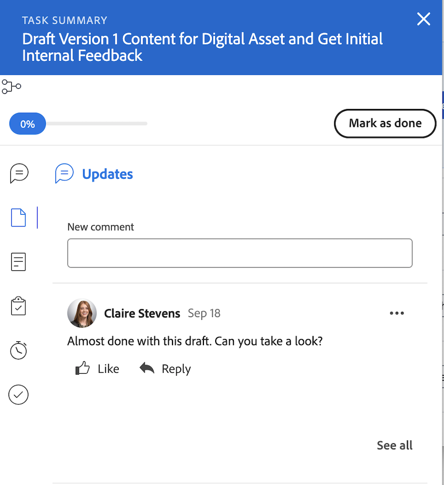

# Passa dalla home legacy alla nuova home

La pagina Home legacy verrà rimossa da Workfront il 10/17 con la versione Q4. Questo articolo fornisce informazioni sulle funzionalità che saranno disponibili nella nuova home e consigli per gli amministratori di Workfront che spostano gli utenti nella nuova esperienza Home.

Per ulteriori informazioni sul deprecamento della home legacy, vedere la [Guida deprecazione della home legacy].

## Comprendere cosa cambia dalla home legacy alla nuova home

### Elenco di lavoro

#### Organizzazione del lavoro con il widget Il mio lavoro

Il widget Il mio lavoro è stato creato in forma di widget per rispecchiare il più possibile l’elenco di lavoro della Home precedente. Gli utenti possono raggruppare e filtrare il proprio elenco di lavoro nel widget Il mio lavoro con filtri e raggruppamenti simili:

| **Filtro** | **Raggruppamento** |
|------------|-----------|
| - Lavorazione in corso su   - Pronto per iniziare   - Non pronto   - Richiesto   - Delegato   - Completato | - Progetto   - Stato   - Scadenza   - Niente |

**I gruppi home legacy non sono disponibili nella nuova home**

* Data di completamento pianificata - Rinominata in Scadenza nella nuova Home
* Inizio pianificato
* Conferma data
* La mia priorità

| **Pagina principale precedente** | **Nuova Home** |
|------------|-----------|
|  |  |

#### Delega lavoro

Gli utenti possono comunque delegare il lavoro dalla Nuova Home nei seguenti widget:

* Il mio lavoro
* Le mie attività
* I miei problemi
* Le mie approvazioni

Gli utenti possono trovare il lavoro loro delegato nei seguenti widget:

* Il mio widget Lavoro utilizzando il filtro Delegato a me
* Le mie approvazioni utilizzando il filtro Approvazioni delegate

| **Pagina principale precedente** | **Nuova Home** |
|------------|-----------|
|  |  |

#### Utilizzare la vista calendario

La vista Calendario non è più disponibile in Nuova Home; tuttavia, nella roadmap relativa alle Priorità è presente un calendario sostitutivo.

#### Crea un&#39;attività personale

Gli utenti non possono più creare un’attività personale esattamente come facevano nella Home precedente, ma possono creare cose da fare.

#### Visualizza le approvazioni che ho inviato

Gli utenti possono visualizzare le approvazioni inviate in Nuova Home nel widget Approvazioni personali utilizzando il filtro Approvazioni inviate.

#### Aggiungi elementi a Mia priorità

Gli utenti non hanno più accesso alla funzione Mia priorità nella Nuova Home. Stiamo introducendo una nuova colonna My Focus con priorità che sostituiranno questa.

Se necessario, gli utenti possono utilizzare il widget Bacheche per tenere traccia degli elementi con priorità alta.

### Aggiorna elementi di lavoro

Nella Home page legacy, gli utenti possono utilizzare il pannello destro per aggiornare il proprio lavoro. In Nuova Home, gli utenti ora utilizzano il pannello Riepilogo per aggiornare il lavoro. Questo è lo stesso pannello di Riepilogo disponibile in Progetti, Attività, Problemi e Documenti.

#### Utilizzare il pannello Riepilogo

Nel Riepilogo, gli utenti possono

* Aggiornare la percentuale di completamento
* Aggiungi un aggiornamento
* Passare all&#39;area Documenti per caricare un documento
* Visualizzare i dettagli degli elementi di lavoro e aggiornare i campi personalizzati
Gli amministratori di Workfront possono personalizzare i campi da visualizzare nel Riepilogo del modello di layout. Per ulteriori informazioni, vedere [Personalizzare la home e il riepilogo utilizzando un modello di layout](/help/quicksilver/administration-and-setup/customize-workfront/use-layout-templates/customize-home-summary-layout-template.md).
* Modificare lo stato dell&#39;elemento di lavoro
* Visualizza le sottoattività
* Registra ore
* Visualizza i processi di approvazione allegati
* Carica file - Questa funzionalità è nuova

| **Pagina principale precedente** | **Nuova Home** |
|------------|-----------|
|  |  |

#### Apri il pannello di riepilogo

Gli utenti possono aprire il pannello Riepilogo passando il cursore sull&#39;elemento di lavoro e facendo clic sull&#39;icona **Riepilogo** .

Per ulteriori informazioni sull&#39;utilizzo del pannello Riepilogo, vedere [Panoramica di riepilogo](/help/quicksilver/workfront-basics/the-new-workfront-experience/summary-overview.md).

#### Usa azioni rapide

Oltre al pannello Riepilogo, gli utenti possono utilizzare le azioni rapide per

* Registra ore
* Aggiungi un aggiornamento
* Aggiornare un modulo personalizzato
* Carica un file

Per individuare il menu Azioni rapide, passa il puntatore sull&#39;elemento di lavoro. L&#39;elenco delle azioni rapide viene visualizzato accanto al pulsante **Lavoraci** o **Fine**.

### Visualizzare approvazioni e richieste del team

Gli utenti possono comunque gestire le approvazioni e le richieste dei team in Nuova Home utilizzando i seguenti widget:

* La mia approvazione
* Tutte le approvazioni
* Richieste team

Per informazioni sull&#39;aggiunta di widget alla nuova home page, vedere [Aggiungere, modificare o rimuovere widget nella nuova home].

## Scopri i widget disponibili

I widget sono le basi della Nuova Home. Aggiungendo i widget alla home page, gli utenti possono scegliere il tipo di informazioni visualizzate per soddisfare al meglio le proprie esigenze di lavoro. Alcuni widget sono disponibili solo per tipi di licenza specifici, in quanto gli oggetti di cui tengono traccia sono disponibili solo per tali licenze.

Gli amministratori di Workfront possono personalizzare i widget disponibili in Nuova Home utilizzando un modello di layout. Per ulteriori informazioni, vedere [Personalizzare la nuova home utilizzando un modello di layout](/help/quicksilver/administration-and-setup/customize-workfront/use-layout-templates/customize-new-home-layout-template.md).

+++ Espandere per visualizzare un elenco dettagliato dei widget disponibili
Di seguito sono riportati gli 11 widget attualmente disponibili tra cui scegliere e un riepilogo delle informazioni visualizzate:

* **Il mio lavoro**\
   Visualizza tutte le attività, i problemi e le richieste assegnati in un&#39;unica posizione. È possibile fare clic sul pulsante Lavoraci per iniziare a lavorare su un elemento oppure sul pulsante Fine per contrassegnarli come completati. È inoltre possibile aggiornare le informazioni (Stato, Condizione, Percentuale di completamento) relative alle attività e ai problemi, registrare i tempi e aggiungere aggiornamenti dal widget Il mio lavoro.

* **Bacheche**\
    Visualizza tutte le bacheche create o che sono state invitate a utilizzare. Puoi anche creare una nuova bacheca basata sui seguenti modelli: Bacheca di base, Bacheca Kanban, Bacheca retrospettiva, Bacheca dinamica.

* **Progetti personali**\
    Visualizza _progetti di cui sei proprietario_ o _progetti di cui sei proprietario_ in un elenco. È possibile utilizzare filtri, viste o raggruppamenti esistenti per personalizzare l’elenco oppure creare un progetto direttamente dal widget.

* **Le mie attività**\
    Visualizza le attività assegnate all&#39;utente in un elenco. È possibile utilizzare filtri, viste o raggruppamenti esistenti per personalizzare l&#39;elenco oppure creare un&#39;attività direttamente dal widget. Puoi anche delegare le tue attività mentre sei lontano dall&#39;ufficio.

* **Problemi personali**\
    Visualizza i problemi assegnati all&#39;utente in un elenco. Puoi utilizzare i filtri, le viste o i raggruppamenti esistenti per personalizzare l’elenco, oppure puoi creare un problema direttamente dal widget. Questo widget include solo i problemi i cui progetti associati sono impostati su Corrente e non include i progetti completati. Puoi anche delegare i tuoi problemi mentre sei lontano dall&#39;ufficio.

* **Richieste personali**\
    Visualizza tutte le richieste inviate, un filtro per visualizzare solo le richieste aperte e un pulsante che apre il pannello di riepilogo di una richiesta.

* **Richieste team**\
    Mostra tutte le richieste in sospeso per i team di cui fai parte, ordinate per team, nonché i pulsanti per assegnare direttamente una richiesta a un utente o per lavorarci di persona.

* **La mia approvazione**\
    Mostra tutte le approvazioni assegnate o delegate in attesa, un pulsante per delegare le approvazioni e pulsanti per prendere decisioni di approvazione direttamente all’interno del widget.

* **Tutte le approvazioni**\
        Visualizza 2 grafici con informazioni sul tempo medio di approvazione e sulle decisioni, nonché visualizzazioni elenco delle approvazioni in sospeso e in ritardo. Questa funzionalità fa parte di una versione graduale ed è attualmente disponibile solo per clienti specifici.

* **Menzioni**\
    Visualizza i thread di commenti recenti provenienti da Workfront, in modo simile alla pagina My Updates (I miei aggiornamenti). Puoi utilizzare il pulsante di risposta per comporre una risposta all’interno del widget. Questo widget mostra anche i commenti aggiunti sulle attività e sui problemi che ti vengono assegnati, che hai assegnato a un altro utente, di cui sei proprietario, per cui sei il contatto principale o che hai creato, purché l’attività o il problema sia stato aggiornato negli ultimi 30 giorni.

* **Da fare**\
    Questo widget univoco consente di aggiungere elementi a un elenco di controllo personale che puoi modificare liberamente. Le cose da fare vengono tracciate come attività nel progetto personale e rimangono fino a due settimane dopo il completamento.

  >[!NOTE]
  >
  >È necessario disporre dell&#39;autorizzazione per creare le attività da fare nel widget Da fare e nel widget verranno visualizzate solo le attività personali immesse dall&#39;utente corrente.

+++

### Visualizza i widget disponibili per ogni tipo di licenza

Per impostazione predefinita, la home page è compilata con alcuni widget specifici in base al tipo di licenza. Le tabelle seguenti descrivono i widget visualizzati dagli utenti di ciascun tipo di licenza la prima volta che accedono alla nuova home.

<table border="1" class="inlineTable">
    <tr>
        <td><b>Nuovo tipo di licenza</b></td>
        <td><b>Widget predefiniti</b></td>
    </tr>
    <tr>
        <td>Standard</td>
        <td>I miei progetti, il mio lavoro, le menzioni, le cose da fare</td>
    </tr>
    <tr>
        <td>Light</td>
        <td>Il mio lavoro, la mia approvazione</td>
    </tr>
    <tr>
        <td>Collaboratore</td>
        <td>Le mie richieste, menzioni, la mia approvazione, bacheche</td>
    </tr>
    <tr>
        <td>Esterno</td>
        <td>La mia approvazione</td>
    </tr>
</table>

<table border="1" class="inlineTable">
    <tr>
        <td><b>Tipo di licenza corrente</b></td>
        <td><b>Widget predefiniti</b></td>
    </tr>
    <tr>
        <td>Piano</td>
        <td>Progetti, menzioni e cose da fare personali</td>
    </tr>
    <tr>
        <td>Lavoro</td>
        <td>Il mio lavoro, le mie menzioni, le mie cose da fare</td>
    </tr>
    <tr>
        <td>Revisiona</td>
        <td>Il mio lavoro, menzioni</td>
    </tr>
    <tr>
        <td>Richiesta</td>
        <td>I miei progetti, La mia approvazione</td>
    </tr>
    <tr>
        <td>Contribuisci</td>
        <td>Il mio lavoro, menzioni</td>
    </tr>
    <tr>
        <td>Esterno</td>
        <td>La mia approvazione</td>
    </tr>
</table>

## Prepararsi per l’obsolescenza

Per ridurre al minimo le interruzioni per te e la tua organizzazione, di seguito sono riportati alcuni consigli che aiuteranno a facilitare la transizione.

### Inizia la transizione alla nuova home

Il nostro consiglio principale è quello di iniziare la transizione alla nuova Home il prima possibile. A livello organizzativo, ciò significa che l’amministratore personalizza le esperienze degli utenti tramite modelli di layout, simili alla Home page precedente, per assicurarsi che ogni utente disponga di ciò di cui ha bisogno.

Consigliamo agli amministratori di:

1. Creare un nuovo layout predefinito per la pagina iniziale utilizzando i modelli di layout (oppure, facoltativamente, crearne uno per ogni utente, team, gruppo o mansione che richiede un layout univoco). Per ulteriori informazioni, vedere [Personalizzare la nuova home utilizzando un modello di layout](/help/quicksilver/administration-and-setup/customize-workfront/use-layout-templates/customize-new-home-layout-template.md).

1. Assegnare i nuovi modelli di layout a un numero limitato di utenti di prova, che possono verificare che i widget e le impostazioni generali soddisfino le proprie esigenze di lavoro.

1. Riassegnare gli altri utenti al layout Nuova home page.

Procedendo in questo modo, gli utenti avranno il tempo di adattarsi alla nuova esperienza e di personalizzare le nuove pagine iniziali in base alle loro esigenze. Per informazioni su come personalizzare i widget nella nuova home page, vedere [Rimuovere, aggiungere e ridisporre i widget].

### Risorse per gli utenti finali

**Articoli della Guida**

* [Gestisci il tuo lavoro con il widget Il mio lavoro]

**Corso di formazione**

* [Rimuovi, aggiungi e ridisponi i widget nell&#39;esercitazione Home](https://experienceleague.adobe.com/it/docs/workfront-learn/tutorials-workfront/home/remove-add-and-rearrange-widgets)
* [Nozioni di base sui lavoratori in Adobe Workfront](https://adobe-ats.sabacloud.com/Saba/Web_spf/PRODTNT100/app/me/learningeventdetail/cours000000000098821?regId=regdw000000001250612)

>[!IMPORTANT]
>
>Questo è un corso gratuito, ma per accedervi devi effettuare l’accesso e registrarti.