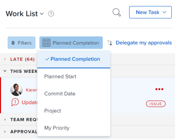
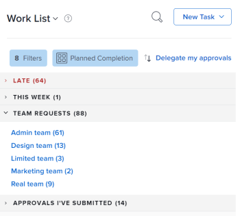

# Introduzione a [!UICONTROL Pagina principale]

Esistono due modi per visualizzare il lavoro nel [!UICONTROL Pagina principale] dall&#39;area [!UICONTROL Elenco lavori] o il Calendario.

## Elenco lavori

La [!UICONTROL Elenco lavori] consente di visualizzare tutti i lavori assegnati in un&#39;unica posizione:

![[!UICONTROL Elenco lavori] pannelli](assets/worklist-and-right-panel-home.png)

A. Utilizza il pannello a sinistra per filtrare, ordinare e selezionare il lavoro assegnato.

B. Dopo aver selezionato un elemento di lavoro nel pannello a sinistra, utilizza il pannello a destra per interagire con i campi personalizzati, apportare aggiornamenti e registrare il tempo.

Per ulteriori informazioni sull’utilizzo di [!UICONTROL Elenco dei lavori domestici], vedi i seguenti articoli:

* [Visualizza gli elementi nel [!UICONTROL Elenco lavori] in [!UICONTROL Pagina principale] area](../../../workfront-basics/using-home/using-the-home-area/display-items-in-home-work-list.md)
* [Crea elementi di lavoro dal [!UICONTROL Pagina principale] area](../../../workfront-basics/using-home/using-the-home-area/create-work-items-in-home.md)

## Calendario

Il Calendario consente di visualizzare il lavoro visualizzandolo quando gli elementi di lavoro sono dovuti e ti consente di bloccare il tempo necessario per completarli:

A. Utilizza il [!UICONTROL Calendario] per creare una mappa visiva del lavoro da completare. Fai clic e trascina gli elementi di lavoro dal [!UICONTROL Elenco lavori] sul Calendario per bloccare il tempo di lavoro.

B. Utilizza l&#39;opzione di sincronizzazione del calendario per sincronizzarla con il tuo [!DNL Outlook] calendario. Gestisci le riunioni e lavora tutto in un&#39;unica posizione.

C. Utilizza il [!UICONTROL Dettagli] per aprire un nuovo pannello a destra in cui è possibile visualizzare ulteriori informazioni sull’elemento di lavoro.

D. Usa la barra di scadenza per tenere traccia di quando il lavoro assegnato a te è dovuto.

Per ulteriori informazioni su come utilizzare il Calendario Home, vedi [Utilizza la [!UICONTROL Calendario Home] visualizzare](../../../workfront-basics/using-home/using-the-home-area/use-home-calendar-view.md).

## Trova il tuo lavoro

La [!UICONTROL Pagina principale] area è il tuo punto vendita unico per trovare attività, problemi e approvazioni assegnati a te. Il filtro e le opzioni di ordinamento incorporati nel [!UICONTROL Pagina principale] area lavorare insieme per aiutarvi a lavorare nel modo desiderato. È possibile utilizzare [!UICONTROL Ordina per] opzione per raggruppare gli elementi e quindi utilizzare il filtro per concentrarsi sul lavoro che deve essere completato.

>[!NOTE]
>
>Le opzioni di filtro e ordinamento sono memorizzate nel browser. Se utilizzi sempre lo stesso browser sullo stesso computer (e non cancelli i dati del sito) i filtri e l&#39;ordinamento non cambieranno, ma se passi a un browser o a un computer, i filtri e l&#39;ordinamento saranno diversi.

### Raggruppa elementi di lavoro simili con &#39;[!UICONTROL Raggruppa per]opzione &#39;

La [!UICONTROL Ordina per] consente di raggruppare elementi simili nell’elenco di lavoro. Puoi ordinare per:

* [!UICONTROL Completamento pianificato]
* [!UICONTROL Inizio pianificato]
* [!UICONTROL Conferma data]
* [!UICONTROL Progetto]
* [!UICONTROL La mia priorità]

Per ulteriori informazioni sull’utilizzo dei raggruppamenti, consulta [Visualizza gli elementi nel [!UICONTROL Elenco lavori] in [!UICONTROL Pagina principale] area](../../../workfront-basics/using-home/using-the-home-area/display-items-in-home-work-list.md).

### Limitare la messa a fuoco con i filtri

La [!UICONTROL Elenco lavori] Filtro consente di limitare lo stato attivo a specifici elementi di lavoro.

Di seguito sono riportati alcuni esempi di come filtrare gli elementi visualizzati in Home:

* Filtrare per tipo e stato dell&#39;elemento.

   Ad esempio, se desideri visualizzare tutte le attività, puoi selezionare la [!UICONTROL Attività] filtro. Se desideri essere più specifico di questo e visualizzare solo le attività pronte per iniziare a lavorare, seleziona la [!UICONTROL Pronto per l&#39;inizio] filtri sotto [!UICONTROL Attività] filtro.

* Filtra solo per tipo di elemento.

   Ad esempio, puoi selezionare [!UICONTROL Problemi] per visualizzare tutti i problemi in tutti gli stati ([!UICONTROL Utilizzo] o [!UICONTROL Richiesto]) o [!UICONTROL Approvazioni] per visualizzare tutti gli elementi di lavoro, richiedere le approvazioni di accesso, scheda attività, documento e bozza.

* Filtra solo per stato.

   Ad esempio, puoi selezionare la [!UICONTROL Completato] per visualizzare le attività e i problemi completati. Sono incluse le attività Personali, ma non le approvazioni.

Per ulteriori informazioni sull’utilizzo dei filtri, consulta [Visualizza gli elementi nel [!UICONTROL Elenco lavori] in [!UICONTROL Pagina principale] area](../../../workfront-basics/using-home/using-the-home-area/display-items-in-home-work-list.md).

### Accedere al lavoro assegnato al team

La [!UICONTROL Pagina principale] area dispone di un raggruppamento permanente dedicato alle richieste del team con un collegamento diretto alla pagina di richiesta del team. Utilizza questo raggruppamento per visualizzare e accedere alle richieste per uno qualsiasi dei team in uso.

>[!NOTE]
>
>La [!UICONTROL Filtro] e [!UICONTROL Ordina per] le opzioni non influiscono [!UICONTROL Richieste del team] raggruppamento. Questo raggruppamento è visibile purché il lavoro sia stato assegnato al team.

Per ulteriori informazioni sull’accesso alle richieste del team, consulta l’articolo [[!UICONTROL Gestisci] richieste di lavoro e di team nel [!UICONTROL Pagina principale] area](../../../workfront-basics/using-home/using-the-home-area/manage-work-and-team-requests-home.md).

### Monitoraggio del lavoro inviato

Tieni traccia del lavoro inviato per l’approvazione direttamente da [!UICONTROL Elenco lavori]. È possibile ricordare all&#39;approvatore il lavoro che richiede l&#39;approvazione. Se necessario, è inoltre possibile richiamare l’approvazione.

>[!NOTE]
>
>La [!UICONTROL Filtro] e [!UICONTROL Ordina per] le opzioni non influiscono [!UICONTROL Approvazioni inviate] raggruppamento. Questo raggruppamento è visibile finché il lavoro è in attesa di approvazione.

## Dare priorità a ciò che è importante per te

La [!UICONTROL Elenco lavori] consente di visualizzare e assegnare priorità al lavoro che è importante per te con il [!UICONTROL Ordinamento prioritario] opzione . Puoi aggiungere fino a 20 elementi al tuo [!UICONTROL Priorità] elenco. Utilizza la [!UICONTROL Altro] per aggiungere elementi di lavoro all&#39;elenco delle priorità.

>[!NOTE]
>
>Qualsiasi elemento di lavoro aggiunto a [!UICONTROL Priorità] sono visibili solo a voi e nessuno può dare priorità al lavoro per voi.

Per ulteriori informazioni su come utilizzare [!UICONTROL Priorità], vedi [Dare priorità al lavoro [!UICONTROL Pagina principale] area](../../../workfront-basics/using-home/using-the-home-area/prioritize-work-in-home.md).

## Completato

Usa il pannello di destra in [!UICONTROL Pagina principale] per aggiornare e completare il lavoro.

### Lavora in uno spazio personalizzato per te

Le [!DNL Adobe Workfront] l’amministratore può aggiungere fino a 16 campi personalizzati per semplificare la ricerca e l’aggiornamento delle informazioni necessarie. La maggior parte dei campi è modificabile e non è quindi necessario passare all’elemento di lavoro.

Per aggiornare uno qualsiasi dei campi in questa area, fai clic sul campo.

>[!NOTE]
>
>Non è possibile aggiornare il [!UICONTROL Data impegno] in quest&#39;area.

### Aggiornare i colleghi con informazioni importanti

Comunicare in modo rapido ed efficiente con i collaboratori del [!UICONTROL Pagina principale] area. Fai domande ai tuoi colleghi, avvisali degli aggiornamenti recenti o rispondi ai commenti diretti. Inoltre, puoi aggiornare altri sullo stato di avanzamento:

* Aggiornamento della [!UICONTROL Data impegno]

   <!--
  <note type="note">
  This is the only place you can update the Commit Date in Home.
   
  </note>
  -->

* Generazione di rapporti su come ti senti
* Aggiornamento della barra di completamento della percentuale

Per ulteriori informazioni sulla comunicazione nella [!UICONTROL Pagina principale] area, vedere [Aggiorna lavoro](../../../workfront-basics/updating-work-items-and-viewing-updates/update-work.md).

### Registrati il tuo tempo

Tenere traccia delle ore lavorate sui singoli elementi di lavoro. È possibile scegliere un tipo di ora generale, ad esempio [!UICONTROL Ora attività]oppure puoi scegliere un tipo di ora specifico per il progetto configurato dal tuo [!DNL Workfront] amministratore.

Per ulteriori informazioni su come registrare il tempo nel [!UICONTROL Pagina principale] area, vedere la sezione [Pagina principale](../../../timesheets/create-and-manage-timesheets/log-time.md#home) nell&#39;articolo [Tempo di log](../../../timesheets/create-and-manage-timesheets/log-time.md).

