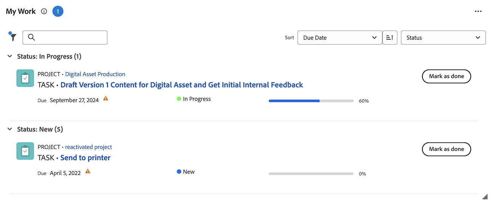

# Contrassegna un elemento come [!UICONTROL completato] nell&#39;area [!UICONTROL Home]

È possibile contrassegnare un’attività o un problema come completato se si è l’assegnatario dell’attività o del problema. Quando contrassegni un&#39;attività o un problema come [!UICONTROL Completato], lo stato dell&#39;attività o del problema viene modificato in [!UICONTROL Completo].

>[!NOTE]
>
>Il pulsante [!UICONTROL Fine] non viene visualizzato a meno che tu non sia una delle risorse assegnate all&#39;attività o al problema.

+++ Espandi per visualizzare i requisiti di accesso per la funzionalità in questo articolo.

## Requisiti di accesso

Per eseguire i passaggi descritti in questo articolo, è necessario disporre dei seguenti diritti di accesso:

<table style="table-layout:auto"> 
 <col> 
 </col> 
 <col> 
 </col> 
 <tbody> 
  <tr> 
   <td role="rowheader"><strong>[!DNL Adobe Workfront plan*]</strong></td> 
   <td> 
Qualsiasi
 </td> 
  </tr> 
  <tr> 
   <td role="rowheader"><strong>[!DNL Adobe Workfront] licenza*</strong></td> 
   <td> 
[!UICONTROL Work] o versione successiva
 </td> 
  </tr> 
  <tr> 
   <td role="rowheader"><strong>Configurazioni del livello di accesso*</strong></td> 
   <td> 
Accesso a [!UICONTROL Edit] per attività e problemi
 
Nota: se non disponi ancora dell'accesso, chiedi all'amministratore [!DNL Workfront] se ha impostato restrizioni aggiuntive nel tuo livello di accesso. Per informazioni su come un amministratore di [!DNL Workfront] può modificare il tuo livello di accesso, vedi <a href="../../../administration-and-setup/add-users/configure-and-grant-access/create-modify-access-levels.md" class="MCXref xref">Creare o modificare livelli di accesso personalizzati</a>.
 </td> 
  </tr> 
  <tr> 
   <td role="rowheader"><strong>Autorizzazioni oggetto</strong></td> 
   <td> 
Autorizzazioni per contribuire o superiore alle attività e ai problemi su cui devi lavorare
 
Per informazioni sulla richiesta di accesso aggiuntivo, vedere <a href="../../../workfront-basics/grant-and-request-access-to-objects/request-access.md" class="MCXref xref">Richiedere l'accesso agli oggetti </a>.
 </td> 
  </tr> 
 </tbody> 
</table>

&#42;Per conoscere il piano, il tipo di licenza o l&#39;accesso di cui si dispone, contattare l&#39;amministratore [!DNL Workfront].

+++

## Contrassegnare un elemento di lavoro come completato nel widget Il mio lavoro

1. Fai clic sull&#39;icona **[!UICONTROL Main Menu]**  nell&#39;angolo superiore destro, quindi fai clic su **[!UICONTROL Home]**.
1. (Condizionale) Fai clic su **Personalizza** per aggiungere il widget **Il mio lavoro**.
1. Trova l&#39;elemento di lavoro, quindi fai clic su **[!UICONTROL Contrassegna come completato]** sull&#39;elemento di lavoro.
Per informazioni dettagliate su come potrebbe apparire questo pulsante, vedere [Comprendere le opzioni del pulsante [!UICONTROL Fine]](#understand-the-options-of-the-done-button).
   

## Contrassegnare un elemento di lavoro come completato nel pannello Riepilogo

È possibile contrassegnare un elemento di lavoro come completato nel widget Attività personali e Problemi personali utilizzando il pannello Riepilogo.

1. Fai clic sull&#39;icona **[!UICONTROL Main Menu]**  nell&#39;angolo superiore destro, quindi fai clic su **[!UICONTROL Home]**.
1. (Condizionale) Fai clic su **Personalizza** per aggiungere i widget **Le mie attività** o **I miei problemi**.
1. Passa il puntatore del mouse sull&#39;elemento di lavoro, quindi fai clic sull&#39;icona **Riepilogo**.
   
1. Fai clic su **Contrassegna come completato** nella parte superiore del pannello Riepilogo.

## Comprendere le opzioni del pulsante [!UICONTROL Fine]

Per impostazione predefinita, facendo clic sul pulsante [!UICONTROL Fine] su un elemento di lavoro, lo stato dell&#39;elemento diventa [!UICONTROL Completo] (per le attività) o [!UICONTROL Risolto] (per i problemi).

L&#39;amministratore di [!DNL Adobe Workfront] può personalizzare gli stati associati al pulsante [!UICONTROL Fine] e applicare tali personalizzazioni al team predefinito.

A seconda del numero di stati associati al pulsante [!UICONTROL Fine] o del numero di risorse assegnate all&#39;attività o al problema, l&#39;aspetto del pulsante [!UICONTROL Fine] può cambiare.

* [Pulsante [!UICONTROL Fine] associato a uno stato](#done-button-associated-with-one-status)
* [Pulsante [!UICONTROL Fine] associato a più stati](#done-button-associated-with-multiple-statuses)
* [Pulsante [!UICONTROL Fine] per gli elementi assegnati a più risorse](#done-button-for-items-assigned-to-multiple-resources)

### Pulsante [!UICONTROL Fine] associato a uno stato

Quando il pulsante [!UICONTROL Fine] è associato a uno stato e l&#39;elemento di lavoro è assegnato solo a te, il pulsante indica **[!UICONTROL Fine]**. Quando fai clic su di esso, lo stato dell&#39;attività o del problema viene modificato in quello associato al pulsante [!UICONTROL Fine].

Per capire quale stato è associato al pulsante [!UICONTROL Fine], controlla nelle [!UICONTROL Impostazioni team] del team predefinito la sezione [!UICONTROL Pulsante Fine], come descritto in [Modifica impostazioni team](../../../people-teams-and-groups/create-and-manage-teams/edit-team-settings.md).

Se non sei assegnato a un team predefinito, lo stato predefinito viene scelto quando fai clic su [!UICONTROL Fine], come descritto in precedenza in [Comprendere le opzioni del pulsante [!UICONTROL Fine]](#understand-the-options-of-the-done-button).

### Pulsante [!UICONTROL Fine] associato a più stati

Quando il pulsante [!UICONTROL Fine] è associato a più stati, il pulsante mostra la parola **[!UICONTROL Fine]** seguita da un menu a discesa. In questo scenario, non puoi fare clic su [!UICONTROL Fine]. È necessario selezionare uno stato dal menu a discesa. Selezionare lo stato più adatto al completamento dell&#39;elemento di lavoro. In questo modo si modifica lo stato dell&#39;elemento di lavoro.

Per informazioni su come associare più stati al pulsante [!UICONTROL Fine], vedere [Configurazione del pulsante [!UICONTROL Fine] per le attività](../../../people-teams-and-groups/create-and-manage-teams/configure-the-done-button-for-tasks.md) e [Configurazione del pulsante [!UICONTROL Fine] per i problemi](../../../people-teams-and-groups/create-and-manage-teams/configure-the-done-button-for-issues.md).

### Pulsante [!UICONTROL Fine] per gli elementi assegnati a più risorse

Quando l&#39;attività o il problema è assegnato a più risorse, il pulsante mostra la parola **[!UICONTROL Fine]** seguita da un menu a discesa. Nel menu a discesa, puoi scegliere tra **[!UICONTROL Fine con la mia parte]** (che informa i membri del team che hai completato l&#39;attività) o lo stato associato al pulsante [!UICONTROL Fine] (che completa l&#39;elemento). Dopo aver selezionato **[!UICONTROL Fine con la mia parte]**, l&#39;elemento di lavoro viene rimosso dall&#39;elenco di lavoro, ma rimane nell&#39;elenco di lavoro di quelli ancora assegnati all&#39;elemento di lavoro.\
Se il pulsante Fine è associato a più stati, questi saranno elencati in **Fine con la mia parte**.

>[!NOTE]
>
>In un&#39;attività o in un problema con più assegnatari, ogni utente è responsabile di indicare che la propria assegnazione all&#39;attività o al problema è stata effettivamente completata. Per questo motivo, ogni assegnatario deve fare clic su [!UICONTROL Fine] per mostrare che ha completato il lavoro assegnato all&#39;elemento.

