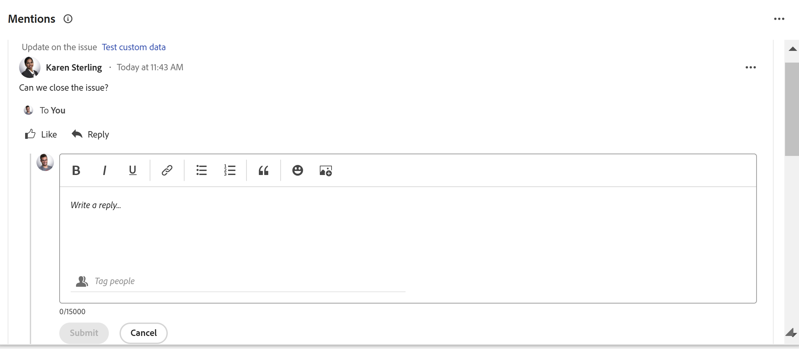

# Aggiornare o modificare un elemento di lavoro nell&#39;area [!UICONTROL Home]

<!--Audited: 04/2024-->

<!--The highlighted information on this page refers to functionality not yet generally available. It is available only in the Preview environment for all customers. After the monthly releases to Production, the same features are also available in the Production environment for customers who enabled fast releases.    

For information about fast releases, see [Enable or disable fast releases for your organization](/help/quicksilver/administration-and-setup/set-up-workfront/configure-system-defaults/enable-fast-release-process.md). -->

Puoi visualizzare e aggiungere aggiornamenti a un elemento di lavoro all&#39;interno dell&#39;area [!UICONTROL Home] in [!DNL Adobe Workfront]. È inoltre possibile modificare altri dati relativi all&#39;elemento di lavoro se si dispone dell&#39;accesso per modificarlo.

## Requisiti di accesso

+++ Espandi per visualizzare i requisiti di accesso per la funzionalità in questo articolo.

<table style="table-layout:auto"> 
 <col> 
 </col> 
 <col> 
 </col> 
 <tbody> 
  <tr> 
   <td role="rowheader"><strong>[!DNL Adobe Workfront package]</strong></td> 
   <td> 
Qualsiasi
 </td> 
  </tr> 
  <tr> 
   <td role="rowheader"><strong>[!DNL Adobe Workfront] licenza*</strong></td> 
   <td> 
Standard

   
Lavoro o superiore
 </td> 
  </tr> 
  <tr> 
   <td role="rowheader"><strong>Configurazione del livello di accesso</strong></td> 
   <td> 
Accesso a [!UICONTROL Edit] per attività e problemi
 </td> 
  </tr> 
  <tr> 
   <td role="rowheader"><strong>Autorizzazioni oggetto</strong></td> 
   <td> 
Autorizzazioni per contribuire o superiore alle attività e ai problemi su cui devi lavorare
 </td> 
  </tr> 
 </tbody> 
</table>

Per informazioni, consulta [Requisiti di accesso nella documentazione di Workfront](/help/quicksilver/administration-and-setup/add-users/access-levels-and-object-permissions/access-level-requirements-in-documentation.md).

+++

<!--not sure if this  from the old UI: we don't have a Work List anymore - should this section come off? 

## View updates on a work item

You can view updates on any work item in the [!UICONTROL Work List]:

1. Click the **[!UICONTROL Main Menu]**  in the upper-right corner, or the **Main Menu**  in the upper-left corner, if available, then click **[!UICONTROL Home]**.
1. In the **[!UICONTROL Work List]** area, select the item where you want to view updates.\
   Updates are displayed in the right panel.

-->

## Panoramica dei widget in cui è possibile aggiungere commenti o modificare elementi nell’area Home

È possibile aggiungere commenti nei seguenti widget nell&#39;area Home:

| Widget | Descrizione |
|--------------|---------------------------------------------------------------------------------------------------|
| Bacheche | Visualizza tutte le bacheche create o che sono state invitate a utilizzare |
| Il mio lavoro | Visualizza le attività e i problemi assegnati all&#39;utente |
| I miei progetti | Visualizza i progetti di cui sei proprietario o a cui lavori |
| Le mie attività | Visualizza le attività assegnate a te |
| I miei problemi | Visualizza le Issues assegnate a te |
| Le mie richieste | Visualizza tutte le richieste inviate |
| Le mie approvazioni | Visualizza tutte le approvazioni in sospeso, assegnate, delegate e inviate |
| Menzioni | Visualizza i thread di commenti recenti in Workfront, in modo analogo alla pagina Aggiornamenti personali, nonché un pulsante di risposta che consente di comporre una risposta all’interno del widget. |

È possibile modificare gli elementi di lavoro nei seguenti widget nell&#39;area Home:

| Widget | Descrizione |
|--------------|---------------------------------------------------------------------------------------------------|
| Bacheche | Visualizza tutte le bacheche create o che sono state invitate a utilizzare |
| Il mio lavoro | Visualizza le attività e i problemi assegnati all&#39;utente |
| I miei progetti | Visualizza i progetti di cui sei proprietario o a cui lavori |
| Le mie attività | Visualizza le attività assegnate a te |
| I miei problemi | Visualizza le Issues assegnate a te |
| Le mie richieste | Visualizza tutte le richieste inviate |
| Le mie approvazioni | Visualizza tutte le approvazioni in sospeso, assegnate, delegate e inviate |

## Aggiungere un commento a un elemento di lavoro nel widget Il mio lavoro

Puoi fornire aggiornamenti su qualsiasi elemento di lavoro nel widget [!UICONTROL Il mio lavoro]:

1. Fai clic sull&#39;icona **[!UICONTROL Main Menu]**  nell&#39;angolo superiore destro o sull&#39;icona **Main Menu**  nell&#39;angolo superiore sinistro, se disponibile, quindi fai clic su **[!UICONTROL Home]**.
1. (Condizionale) Fai clic su **Personalizza** per aggiungere il widget [!UICONTROL **Il mio lavoro**].

1. Individuare l&#39;elemento di lavoro che si desidera aggiornare nel widget [!UICONTROL **Il mio lavoro**].
1. Passa il puntatore del mouse sul nome, quindi fai clic sull&#39;icona **Aggiungi nuovo aggiornamento**.

   

1. Inizia a digitare il commento.
1. (Facoltativo) Nella casella **Assegna tag a persone o team**, inizia a digitare il nome o l&#39;e-mail di un utente o di un team che desideri includere in questo commento, quindi selezionalo quando viene visualizzato nell&#39;elenco.
1. (Facoltativo) Utilizza le opzioni nella barra degli strumenti Testo formattato per formattare il testo, aggiungere emoticon, collegamenti o immagini al commento, per migliorarne il contenuto.
1. Fai clic su **Invia** per aggiungere il commento all&#39;elemento di lavoro.

   >[!IMPORTANT]
   >
   >È possibile modificare il commento solo entro 15 minuti dall&#39;invio. Per modificare un commento, fai clic sul menu **Altro** nell&#39;angolo superiore destro del commento, quindi fai clic su **Modifica**.

   Per informazioni più dettagliate sull&#39;aggiunta di aggiornamenti, vedere [Aggiorna lavoro](/help/quicksilver/workfront-basics/updating-work-items-and-viewing-updates/update-work.md).

## Aggiungere un commento a un elemento nel widget Menzioni

1. Aggiungi il widget **Menzioni** alla tua area Home.

1. Individua l’elemento incluso in un aggiornamento per e al quale desideri rispondere.

1. Fai clic su **Risposta**.

   

1. Inizia a digitare il commento.
1. (Facoltativo) Nella casella **Assegna tag a persone**, inizia a digitare il nome di un utente o di un team che desideri includere in questo commento, quindi selezionalo quando viene visualizzato nell&#39;elenco.
1. (Facoltativo) Utilizza le opzioni nella barra degli strumenti Testo formattato per formattare il testo, aggiungere emoticon, collegamenti o immagini al commento, per migliorarne il contenuto.
1. Fai clic su **Invia** per aggiungere il commento all&#39;elemento di lavoro.

   >[!IMPORTANT]
   >
   >È possibile modificare il commento solo entro 15 minuti dall&#39;invio. Per modificare un commento, fai clic sul menu **Altro** nell&#39;angolo superiore destro del commento, quindi fai clic su **Modifica**.

   Per informazioni più dettagliate sull&#39;aggiunta di aggiornamenti, vedere [Aggiorna lavoro](/help/quicksilver/workfront-basics/updating-work-items-and-viewing-updates/update-work.md).

## Modificare un elemento di lavoro

È possibile modificare qualsiasi campo di qualsiasi elemento di lavoro a cui si ha accesso per la modifica.

1. Fai clic sull&#39;icona **[!UICONTROL Main Menu]**  nell&#39;angolo superiore destro o sull&#39;icona **Main Menu**  nell&#39;angolo superiore sinistro, se disponibile, quindi fai clic su **[!UICONTROL Home]**.
1. (Condizionale) Fai clic su **Personalizza** per aggiungere il widget **Il mio lavoro**.

1. Passa il puntatore del mouse sull&#39;elemento di lavoro, quindi fai clic sull&#39;icona **Riepilogo**.
   

1. Nel pannello Riepilogo, posizionate il cursore sul campo da modificare.
Se si dispone dei diritti per modificare il campo, il campo viene evidenziato quando si passa il puntatore del mouse su di esso.
1. Fai clic sul campo da modificare, quindi apporta l’aggiornamento desiderato.
1. Fai clic lontano dal campo per salvare le modifiche.
