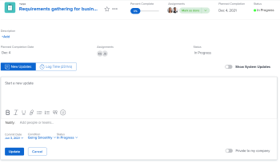

# Aggiornare o modificare un elemento di lavoro in [!UICONTROL Home] area

<!--Audited: April 2024-->

È possibile visualizzare e aggiungere aggiornamenti a un elemento di lavoro all&#39;interno di [!UICONTROL Home] area in [!DNL Adobe Workfront]. È inoltre possibile modificare altri dati relativi all&#39;elemento di lavoro se si dispone dell&#39;accesso per modificarlo.

## Requisiti di accesso

Per eseguire i passaggi descritti in questo articolo, è necessario disporre dei seguenti diritti di accesso:

<table style="table-layout:auto"> 
 <col> 
 </col> 
 <col> 
 </col> 
 <tbody> 
  <tr> 
   <td role="rowheader"><strong>[!DNL Adobe Workfront plan]</strong></td> 
   <td> 
Qualsiasi
 </td> 
  </tr> 
  <tr> 
   <td role="rowheader"><strong>[!DNL Adobe Workfront] licenza*</strong></td> 
   <td> 
Nuovo: Standard

   Oppure

Corrente: [!UICONTROL Work] o versione successiva
 </td> 
  </tr> 
  <tr> 
   <td role="rowheader"><strong>Configurazione del livello di accesso</strong></td> 
   <td> 
Accesso a [!UICONTROL Edit] per attività e problemi
 </td> 
  </tr> 
  <tr> 
   <td role="rowheader"><strong>Autorizzazioni oggetto</strong></td> 
   <td> 
Autorizzazioni per contribuire o superiore alle attività e ai problemi su cui devi lavorare
 </td> 
  </tr> 
 </tbody> 
</table>

*Per conoscere il piano, il tipo di licenza o l&#39;accesso di cui si dispone, contattare [!DNL Workfront] amministratore. Per ulteriori informazioni, consulta [Requisiti di accesso nella documentazione di Workfront](/help/quicksilver/administration-and-setup/add-users/access-levels-and-object-permissions/access-level-requirements-in-documentation.md).

## Visualizzare gli aggiornamenti su un elemento di lavoro

È possibile visualizzare gli aggiornamenti su qualsiasi elemento di lavoro nel [!UICONTROL Elenco lavori]:

1. Fai clic su **[!UICONTROL Menu principale]**  nell&#39;angolo superiore destro o **Menu principale**  nell’angolo superiore sinistro, se disponibile, fai clic su **[!UICONTROL Home]**.
1. In **[!UICONTROL Elenco lavori]** , selezionare l&#39;elemento in cui si desidera visualizzare gli aggiornamenti.\
   Gli aggiornamenti vengono visualizzati nel pannello di destra.

1. (Facoltativo) Per filtrare gli aggiornamenti del sistema in modo da visualizzare solo gli aggiornamenti utente, attiva **[!UICONTROL Mostra aggiornamenti di sistema]** a Off.

   

## Fornire aggiornamenti su un elemento di lavoro

È possibile fornire aggiornamenti su qualsiasi elemento di lavoro nel [!UICONTROL Lavoro] Elenco:

1. Fai clic su **[!UICONTROL Menu principale]**  nell&#39;angolo superiore destro o **Menu principale**  nell’angolo superiore sinistro, se disponibile, fai clic su **[!UICONTROL Home]**.
1. In **[!UICONTROL Elenco lavori]** , selezionare l&#39;elemento in cui si desidera fornire un aggiornamento.
1. Nel pannello di destra, fai clic su **[!UICONTROL Aggiorna]** per visualizzare un campo di testo.

   

1. Nel campo fornito, specifica l’aggiornamento.
1. (Facoltativo) Specificare una delle seguenti informazioni:\
   **[!UICONTROL Conferma data]:** Selezionare una data dal selettore data quando si esegue il commit per il completamento dell&#39;elemento di lavoro.\
   **[!UICONTROL Come sta andando?]:** Seleziona una nuova condizione per l’attività o il problema. Per ulteriori informazioni sulle condizioni di attività e problemi, consulta [Aggiorna condizione per attività e problemi](../../../manage-work/projects/updating-work-in-a-project/update-condition-for-tasks-and-issues.md).\
   **[!UICONTROL Stato]:** Seleziona un nuovo stato per l’attività o il problema. Per ulteriori informazioni sugli stati delle attività, vedere [Aggiorna stato attività](../../../manage-work/projects/updating-work-in-a-project/update-task-status.md). Per ulteriori informazioni sugli stati dei problemi, vedi [Accedere all’elenco degli stati dei problemi di sistema](../../../administration-and-setup/customize-workfront/creating-custom-status-and-priority-labels/issue-statuses.md).\
   **[!UICONTROL Barra di completamento]:** Indicare la percentuale di lavoro completata facendo scorrere la barra di avanzamento fino alla percentuale desiderata. È inoltre possibile fare doppio clic sulla barra di completamento e immettere la percentuale di completamento.

1. Clic **[!UICONTROL Aggiorna]**.

## Modificare un elemento di lavoro

È possibile modificare qualsiasi campo di qualsiasi elemento di lavoro a cui si ha accesso per la modifica.

1. Fai clic su **[!UICONTROL Menu principale]**  nell&#39;angolo superiore destro o **Menu principale**  nell’angolo superiore sinistro, se disponibile, fai clic su **[!UICONTROL Home]**.
1. In **[!UICONTROL Elenco lavori]** , selezionare l&#39;elemento che si desidera modificare.\
   Tutti i campi che puoi visualizzare vengono visualizzati nel pannello di destra.

1. Nel pannello a destra, passa il cursore sul campo da modificare.\
   Se si dispone dei diritti per modificare il campo, il campo viene evidenziato quando si passa il puntatore del mouse su di esso.

   

1. Fai clic sul campo da modificare, quindi apporta l’aggiornamento desiderato.
1. Fai clic lontano dal campo per salvare le modifiche.
