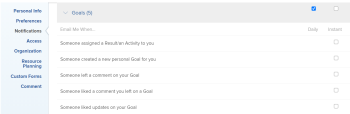

# Notifiche: Obiettivi

Puoi abilitare le notifiche e-mail per gli eventi che si verificano in [!DNL Adobe Workfront Goals] nel tuo profilo. Un utente con una licenza [!UICONTROL Plan] può abilitarli anche per altri utenti. Per informazioni, vedere [[!DNL Adobe Workfront] notifiche](../../workfront-basics/using-notifications/wf-notifications.md).

## Requisiti di accesso

<!--

(NOTE: because there are conditions for who sees this, I added this from the How To articles/ template although this is not a How To. But I like the format, so I thought keeping it consistent might help users. We may decide to update this when we have access and prereq for overview-type articles)

-->

+++ Espandi per visualizzare i requisiti di accesso per la funzionalità in questo articolo. 

<table style="table-layout:auto"> 
 <col> 
 <col> 
 <tbody> 
  <tr> 
   <td role="rowheader"><strong>[!DNL Adobe Workfront package]</strong></td> 
   <td> 
Qualsiasi
 </td> 
  </tr> 
  <tr> 
   <td role="rowheader"><strong>[!DNL Adobe Workfront] licenza</strong></td> 
   <td>
   
Collaboratore o versione successiva

    
Richiedi o superiore
 </td> 
  </tr> 
  <tr> 
   <td role="rowheader"><strong>Prodotti aggiuntivi</strong></td> 
   <td>[!DNL Workfront Goals] 
Per informazioni su [!DNL Workfront Goals], vedere <a href="../../workfront-goals/goal-management/wf-goals-overview.md" class="MCXref xref">[!DNL Adobe Workfront Goals] panoramica</a>.
 </td> 
  </tr> 
  <tr> 
   <td role="rowheader"><strong>Configurazioni del livello di accesso*</strong></td> 
   <td> 
Accesso [!UICONTROL View] a [!DNL Goals] o versione successiva
</td> 
  </tr>
 </tbody> 
</table>

Per informazioni, consulta [Requisiti di accesso nella documentazione di Workfront](/help/quicksilver/administration-and-setup/add-users/access-levels-and-object-permissions/access-level-requirements-in-documentation.md).

+++

## Prerequisiti

* L&#39;utente di cui si desidera aggiornare le [!DNL Goals] notifiche deve disporre di un modello di layout che includa l&#39;area [!DNL Goals] nel [!UICONTROL menu principale].

## [!DNL Goals] notifiche nell&#39;area [!UICONTROL profilo utente]

Le notifiche elencate nella tabella seguente ti avvisano di eventi che si verificano in [!DNL Workfront Goals], ad esempio di un utente che ti assegna un obiettivo, un risultato o un&#39;attività o di un utente che aggiorna un obiettivo, un risultato o un&#39;attività di tua proprietà. Per informazioni sulla configurazione delle notifiche ricevute, vedere [Modificare le proprie notifiche e-mail](../../workfront-basics/using-notifications/activate-or-deactivate-your-own-event-notifications.md).

>[!NOTE]
>
>Le notifiche istantanee per [!DNL Goals] sono disabilitate per impostazione predefinita. Non puoi abilitare o disabilitare le notifiche giornaliere e non ricevi e-mail di riepilogo giornaliero per gli eventi in questa categoria. È possibile abilitare o disabilitare singole notifiche istantanee per la categoria [!DNL Goals].

Vedi anche [Notifiche evento](../../workfront-basics/using-notifications/event-notifications.md).

<table style="table-layout:auto"> 
 <col> 
 <col> 
 <tbody> 
  <tr> 
   <td><strong>Notifica</strong></td> 
   <td> 
<strong>Campi inclusi</strong> 
 
<strong>*Solo notifiche immediate</strong>
 </td> 
  </tr> 
  <tr> 
   <td><strong>Qualcuno mi ha assegnato un risultato/un'attività</strong></td> 
   <td> 
Nome della persona che ha assegnato il risultato o l'attività all'utente
 
Periodo dell’obiettivo per il risultato o l’attività
 
Nome del risultato o dell'attività
 
Il pulsante <strong>[!UICONTROL Apri in Web app]</strong> che apre il pannello [!UICONTROL Dettagli obiettivo]
 
Il pulsante <strong>[!UICONTROL Change Notifications Settings]</strong> che consente di gestire le notifiche.
 </td> 
  </tr> 
  <tr> 
   <td><strong>Qualcuno ha creato un nuovo obiettivo personale</strong> </td> 
   <td> 
Nome della persona che ha assegnato l’obiettivo
 
Periodo dell’obiettivo
 
Nome dell’obiettivo
 
Il pulsante <strong>[!UICONTROL Apri in Web app]</strong> che apre il pannello [!UICONTROL Dettagli obiettivo]
 
Il pulsante <strong>[!UICONTROL Change Notifications Settings]</strong> che consente di gestire le notifiche.
 </td> 
  </tr> 
  <tr> 
   <td><strong>Qualcuno ha lasciato un commento sul mio obiettivo</strong></td> 
   <td> 
Nome della persona che ha lasciato il commento
 
Periodo dell’obiettivo 
 
Nome dell’obiettivo
 
Testo del commento
 
Il pulsante <strong>[!UICONTROL Apri in Web app]</strong> che apre il pannello [!UICONTROL Dettagli obiettivo]
 
Il pulsante <strong>[!UICONTROL Change Notifications Settings]</strong> che consente di gestire le notifiche.
 </td> 
  </tr> 
  <tr> 
  </tbody> 
</table>

<!--these were removed at some point: 

   <td><strong>Someone liked my comment on a Goal</strong></td> 
   <td> 
The name of the person who liked the comment
 
The Period of the goal 
 
The name of the goal
 
The text of the comment 
 
The <strong>[!UICONTROL Open in web app]</strong> button which opens the [!UICONTROL Goal Details] panel
 
The <strong>[!UICONTROL Change Notifications Settings]</strong> button which allows you to manage your notifications.
 </td> 
  </tr> 
  <tr> 
   <td><strong>Someone liked an update on my Goal</strong></td> 
   <td> 
You receive an email when someone likes a comment you made on a goal or when you update the progress of your results or activities on the goal. 
 
The name of the person who liked the update
 
The Period of the goal 
 
The name of the goal
 
The <strong>[!UICONTROL Open in web app]</strong> button which opens the [!UICONTROL Goal Details] panel
 
The <strong>[!UICONTROL Change Notifications Settings]</strong> button which allows you to manage your notifications.
 </td> 
  </tr> 
 -->

<!--
NOTE FOR NAME OF GOAL IN LAST TABLE CELL: check this. Is this true? Didn't triggger when this was written; add anything else? Maybe the type of the update is mentioned?!
-->
