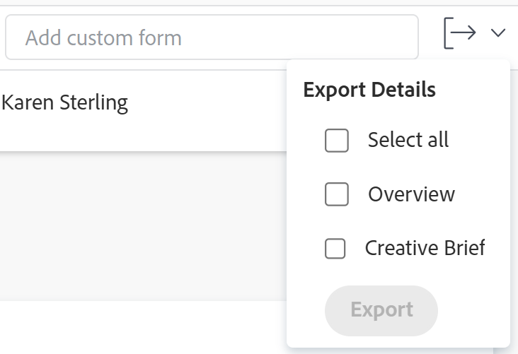

# Esportare moduli personalizzati e dettagli oggetto

<!--Audited: 10/2025-->

È possibile esportare le informazioni della panoramica e del modulo personalizzato dalla sezione Dettagli di un oggetto in un file PDF. È quindi possibile stampare o condividere il PDF con altri utenti.

Questa funzionalità è supportata per i seguenti oggetti:

* Progetti
* Attività
* Problemi
* Portfolio
* Programmi

<!--
* Billing records
 
After you open a billing record on a project, you can use the Details area to attach a custom form to the record and fill it out. You can also export billing record information from the Details area.
 </li>
  -->

>[!NOTE]
>
>I campi nella sezione Dettagli rimossi dal Workfront o dall&#39;amministratore del gruppo utilizzando un modello di layout non vengono visualizzati.

## Requisiti di accesso

+++ Espandi per visualizzare i requisiti di accesso per la funzionalità in questo articolo.

<table style="table-layout:auto"> 
 <col> 
 <col> 
 <tbody> 
  <tr> 
   <td role="rowheader"> 
Pacchetto Adobe Workfront
 </td> 
   <td>Qualsiasi</td> 
  </tr> 
  <tr> 
   <td role="rowheader"> 
Licenza Adobe Workfront
 </td> 
   <td>
Per i problemi:

   <ul><li>
Collaboratore o versione successiva
</li>
   <li>
Richiedente o versione successiva
 </li></ul>
   
Per progetti e attività:

   <ul><li>
Chiaro o superiore
</li>
   <li>
Revisore o versione successiva
</li></ul>
    </td> 
  </tr> 
  <tr> 
   <td role="rowheader">Configurazioni del livello di accesso</td> 
   <td> 
Visualizza o successiva per Progetti, Attività e Problemi
  </td> 
  </tr> 
  <tr> 
   <td role="rowheader"> 
Autorizzazioni oggetto
 </td> 
   <td> 
Visualizza o autorizzazioni superiori per il progetto, l'attività o il problema di cui si desidera esportare il modulo
 </td> 
  </tr> 
 </tbody> 
</table>

Per informazioni, consulta [Requisiti di accesso nella documentazione di Workfront](/help/quicksilver/administration-and-setup/add-users/access-levels-and-object-permissions/access-level-requirements-in-documentation.md).

+++

<!--Old:
<table style="table-layout:auto"> 
 <col> 
 <col> 
 <tbody> 
  <tr> 
   <td role="rowheader"> 
Adobe Workfront plan*
 </td> 
   <td>Any</td> 
  </tr> 
  <tr> 
   <td role="rowheader"> 
Adobe Workfront license*
 </td> 
   <td> 
Request or higher for issues
 
Review or higher for projects and tasks
 </td> 
  </tr> 
  <tr data-mc-conditions=""> 
   <td role="rowheader"><strong>Access level configurations*</strong> </td> 
   <td> 
View or higher for Projects, Tasks, and Issues
 
Note: If you still don't have access, ask your Workfront administrator if they set additional restrictions in your access level. For information on how a Workfront administrator can change your access level, see <a href="../../administration-and-setup/add-users/configure-and-grant-access/create-modify-access-levels.md" class="MCXref xref">Create or modify custom access levels</a>.
 </td> 
  </tr> 
  <tr data-mc-conditions=""> 
   <td role="rowheader"> 
Object permissions
 </td> 
   <td> 
View or higher permissions to the project, task, or issue whose form you want to export
 
For information on requesting additional access, see <a href="../../workfront-basics/grant-and-request-access-to-objects/request-access.md" class="MCXref xref">Request access to objects </a>.
 </td> 
  </tr> 
 </tbody> 
</table>-->

## Prerequisiti

Prima di iniziare, è necessario disporre di tutti i seguenti elementi:

1. Creare un modulo personalizzato per un oggetto specifico da cui esportare.
1. Far allegare il modulo personalizzato all’oggetto

   Oppure

   Disporre dell&#39;accesso corretto per allegare un modulo personalizzato e modificare le informazioni nel modulo.

Per informazioni sulla creazione di moduli personalizzati, vedere [Creare un modulo personalizzato](/help/quicksilver/administration-and-setup/customize-workfront/create-manage-custom-forms/form-designer/design-a-form/design-a-form.md).

Per informazioni su come allegare i moduli agli oggetti, vedere [Aggiungere un modulo personalizzato a un oggetto](../../workfront-basics/work-with-custom-forms/add-a-custom-form-to-an-object.md).

## Esportare le informazioni nella sezione Dettagli

L&#39;esportazione delle informazioni dalla sezione Dettagli di un oggetto è identica per tutti gli oggetti in cui è supportato.

1. Vai a un progetto, attività, portfolio, programma o problema per il quale disponi almeno delle autorizzazioni di visualizzazione.
1. Fare clic sull&#39;elemento **&quot;Dettagli&quot;** nel pannello sinistro, ad esempio **Dettagli attività**.
1. (Facoltativo) Se all&#39;oggetto non è allegato alcun modulo personalizzato, iniziare a digitare il nome di un modulo personalizzato nel **Aggiungi campo modulo personalizzato**, quindi fare clic su di esso quando viene visualizzato nell&#39;elenco.

   Puoi aggiungere fino a 10 moduli.

1. (Facoltativo) Aggiorna le informazioni nella sezione Dettagli, quindi fai clic su **Salva modifiche**.
1. Fai clic sul menu a discesa **Esporta** nell&#39;angolo superiore destro, seleziona **Panoramica** o i moduli da esportare, quindi fai clic su **Esporta**.

   È inoltre possibile selezionare **Seleziona tutto** se si desidera esportare l&#39;area Panoramica e tutti i moduli personalizzati.

   

   >[!TIP]
   >
   >Possono esistere i seguenti scenari:
   >
   >   * Quando il gruppo o l’amministratore Workfront deseleziona tutti i campi nell’area Panoramica e all’oggetto sono allegati moduli personalizzati, la sezione Panoramica non viene visualizzata.
   >   * Quando l’amministratore del gruppo o di Workfront deseleziona tutti i campi nell’area Panoramica e all’oggetto non sono allegati moduli personalizzati, il menu a discesa Esporta non è visibile.
   >   * Se all’oggetto non sono allegati moduli personalizzati, è possibile esportare solo l’area Panoramica.
   >   * I campi personalizzati che si trovano dietro la logica e non sono visibili nel modulo non vengono esportati. Per informazioni sull&#39;aggiunta di logica a un modulo personalizzato, vedere [Aggiungere regole di logica a moduli e campi personalizzati](/help/quicksilver/administration-and-setup/customize-workfront/create-manage-custom-forms/form-designer/design-a-form/display-skip-logic-form-designer.md).

   Un file PDF viene prodotto e scaricato sul computer. Il file PDF contiene le seguenti informazioni:

   * Nome dell&#39;oggetto a cui è associato il modulo
   * Nome dell&#39;utente che ha esportato il PDF
   * Data e ora di produzione del PDF
   * Nome dei moduli esportati
   * Informazioni contenute nei campi compilati nel modulo
