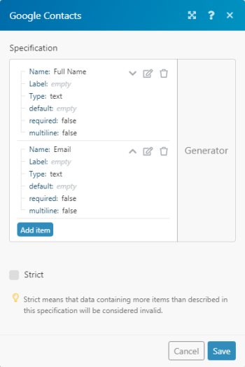
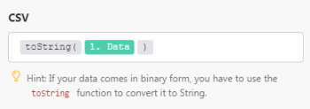

# CSV

I moduli [!DNL Adobe Workfront Fusion] [!UICONTROL CSV] ti consentono di creare file CSV e analizzare il testo CSV da un valore di testo ricevuto o da un file.

## Requisiti di accesso

Per utilizzare le funzionalità di questo articolo, è necessario disporre dei seguenti diritti di accesso:

<table style="table-layout:auto">
 <col> 
 <col> 
 <tbody> 
  <tr> 
   <td role="rowheader">[!DNL Adobe Workfront] piano*</td>
  <td> 
[!UICONTROL Pro] o versione successiva
 </td>
  </tr> 
  <tr data-mc-conditions=""> 
   <td role="rowheader">[!DNL Adobe Workfront] licenza*</td>
   <td> 
[!UICONTROL Plan], [!UICONTROL Work]
 </td> 
  </tr> 
  <tr> 
   <td role="rowheader">[!DNL Adobe Workfront Fusion] licenza**</td> 
   <td>
   
Requisiti di licenza correnti: nessun requisito di licenza [!DNL Workfront Fusion].

   
Oppure

   
Requisito licenza legacy: [!UICONTROL [!DNL Workfront Fusion] per automazione e integrazione lavoro], [!UICONTROL [!DNL Workfront Fusion] per automazione lavoro]

   </td> 
  </tr> 
  <tr> 
   <td role="rowheader">Prodotto</td> 
   <td>
   
Fabbisogno prodotto corrente: se si dispone del piano [!UICONTROL Select] o [!UICONTROL Prime] [!DNL Adobe Workfront], l'organizzazione deve acquistare [!DNL Adobe Workfront Fusion] e [!DNL Adobe Workfront] per utilizzare le funzionalità descritte in questo articolo. [!DNL Workfront Fusion] è incluso nel piano [!UICONTROL Ultimate] [!DNL Workfront].

   
Oppure

   
Requisiti del prodotto legacy: la tua organizzazione deve acquistare [!DNL Adobe Workfront Fusion] e [!DNL Adobe Workfront] per utilizzare le funzionalità descritte in questo articolo.

   </td> 
  </tr> 
 </tbody> 
</table>

Per conoscere il piano, il tipo di licenza o l&#39;accesso disponibili, contattare l&#39;amministratore [!DNL Workfront].

Per informazioni sulle [!DNL Adobe Workfront Fusion] licenze, vedere [[!DNL Adobe Workfront Fusion] licenze](../../workfront-fusion/get-started/license-automation-vs-integration.md).

## [!UICONTROL Crea CSV]

L&#39;aggregatore [!UICONTROL Crea CSV] consente di creare un testo CSV dai valori di testo ricevuti.

Per ulteriori informazioni sugli aggregatori, vedere [Modulo Aggregator in [!DNL Adobe Workfront Fusion]](../../workfront-fusion/modules/aggregator-module.md).

<table style="table-layout:auto">
    <tr>
        <td>[!UICONTROL Modulo Source]</td>
        <td>Seleziona il modulo utilizzato per aggregare i campi necessari.</td>
    </tr>
    <tr>
        <td>Campi Aggregati [!UICONTROL]</td>
        <td>Selezionare i campi da aggregare dall'elenco dei campi disponibili.</td>
    </tr>
    <tr>
        <td>[!UICONTROL Includi intestazioni nella prima riga]</td>
        <td>Seleziona questa opzione per includere le intestazioni nel risultato.</td>
    </tr>
    <tr>
        <td>[!UICONTROL Raggruppa per]</td>
        <td>Immettere il filtro per raggruppare i risultati. Ad esempio, inserisci una data.</td>
    </tr>
    <tr>
        <td>[!UICONTROL Interrompi elaborazione dopo un'aggregazione vuota]</td>
        <td>Selezionare questa opzione per interrompere lo scenario quando non sono presenti risultati.</td>
    </tr>
</table>

## [!UICONTROL Crea CSV (avanzato)]

L&#39;aggregatore [!UICONTROL Crea CSV (avanzato)] consente di creare un testo CSV dai valori di testo ricevuti. Utilizza una struttura di dati che definisce le colonne CSV nel file CSV risultante. Una volta definite, le colonne vengono visualizzate come campi nella configurazione del modulo CSV e possono essere mappate a un modulo successivo nello scenario.

Per ulteriori informazioni sugli aggregatori, vedere [Modulo Aggregator in [!DNL Adobe Workfront Fusion]](../../workfront-fusion/modules/aggregator-module.md).

<table style="table-layout:auto">
 <col> 
 <col> 
 <tbody> 
  <tr> 
   <td role="rowheader">[!UICONTROL Modulo Source]</td> 
   <td>Seleziona il modulo app che utilizzi per aggregare i campi necessari.</td> 
  </tr> 
  <tr> 
   <td role="rowheader">[!UICONTROL Data Structure]</td> 
   <td> 
Seleziona la struttura dati per aggregare i campi nel modo desiderato. Dopo aver definito la struttura dati, puoi mappare gli elementi ai campi corrispondenti.
 
Per ulteriori informazioni, vedere <a href="../../workfront-fusion/modules/data-structures.md" class="MCXref xref">Strutture dati in [!DNL Adobe Workfront Fusion]</a>.
 </td> 
  </tr> 
  <tr> 
   <td role="rowheader">[!UICONTROL Includi intestazioni nella prima riga] </td> 
   <td>Seleziona questa opzione per includere le intestazioni nel risultato. </td> 
  </tr> 
  <tr> 
   <td role="rowheader">[!UICONTROL Raggruppa per] </td> 
   <td>Immettere il filtro per raggruppare i risultati. Ad esempio, inserisci una data. </td> 
  </tr> 
  <tr> 
   <td role="rowheader">[!UICONTROL Interrompi elaborazione dopo un'aggregazione vuota] </td> 
   <td>Selezionare questa opzione per interrompere lo scenario quando non sono presenti risultati. </td> 
  </tr> 
 </tbody> 
</table>

Supponiamo che tu voglia esportare i tuoi contatti Google in un file CSV con due colonne "Nome completo" e "E-mail". Il bundle di output del modulo [!UICONTROL Contatti Google] &gt;[!UICONTROL Ottieni contatti da un gruppo] presenta la seguente struttura. Gli indirizzi e-mail sono archiviati all'interno dell'elemento <code>[!UICONTROL Emails[]]</code>, che è un array di raccolte, ciascuna delle quali contiene due elementi: <code>Label</code> e <code>Email</code>.

  

Se utilizzi il semplice modulo [!DNL Create CSV], ti verrà offerto un elenco di caselle di controllo corrispondenti agli elementi di primo livello di un bundle. Se si tenta di selezionare <code>Full name</code> e <code>Emails</code> elementi, il modulo [!UICONTROL Crea CSV] genera il seguente output, che probabilmente non è quello desiderato:

"emails","fullName"

"[oggetto oggetto]","Shon Winer"

"[oggetto]","Lizeth Fulmore"

"[oggetto]","Hilario Gullatt"

"[oggetto]","Abby Eisenbarth"

Poiché l'elemento <code>Full Name</code> è di tipo semplice Testo, l'esportazione è corretta. Tuttavia, l'elemento <code>Emails</code>, che è di tipo complesso Array di raccolte, viene esportato come [oggetto Object], ovvero nel modo in cui le raccolte e le matrici vengono trasformate in testo per impostazione predefinita. Per ulteriori informazioni, vedere <a href="../../workfront-fusion/mapping/item-data-types.md" class="MCXref xref">Tipi di dati degli elementi in Adobe Workfront Fusion</a>.

Per esportare il contenuto dell'elemento <code>Email </code> della prima raccolta dell'array <code>Emails[]</code>, è necessario utilizzare il modulo [!UICONTROL Create CSV (advanced)]. Il modulo ti consente di definire singole colonne del file CSV e di mappare ad esse gli elementi, inclusi quelli nidificati.

<ol>
<li value="1">Inserisci il modulo [!UICONTROL Create CSV (advanced)] in uno scenario e apri la relativa configurazione.</li>
<li value="2">Fare clic sul pulsante <strong>[!UICONTROL Add]</strong> accanto al campo [!UICONTROL Data structure] per creare una nuova struttura dati.</li>
<li value="3"> 
Scrivere un nome per la struttura dati e fare clic sul pulsante <strong>[!UICONTROL Add item]</strong> per aggiungere le singole colonne. Se desideri esportare due colonne: "Nome completo" e "E-mail", la struttura dati risultante sarà simile alla seguente:
 
  
 </li>
<li value="4"> 
Dopo aver definito correttamente la struttura dati, i campi corrispondenti a ogni singola colonna devono essere visualizzati nella configurazione del modulo [!UICONTROL Crea CSV (avanzato)] per consentire la mappatura degli elementi. Prendere il primo elemento dall'array <code>[!UICONTROL Emails[]]</code> e mappare il relativo elemento <code>Email </code> al campo/colonna E-mail:
 
  
 </li>
<li value="5"> 
Esegui lo scenario. Poiché l'elemento <code>Emails[1]: Email</code> mappato alla colonna "E-mail" è di tipo semplice Testo, ora viene esportato correttamente:
 
"Nome completo","E-mail"
 
"Shon Winer","Shon@Winer.com"
 
"Lizeth Fulmore","Lizeth@Fulmore.com"
 
"Hilario Gullatt","Hilario@Gullatt.com"
 
"Abby Eisenbarth","Abby@Eisenbarth.com"
 </li>
</ol>

## [!UICONTROL Analisi del CSV]

Il trasformatore [!UICONTROL Analisi CSV] consente di analizzare il testo CSV da un valore di testo ricevuto o da un file.

<table style="table-layout:auto">
 <col> 
 <col> 
 <tbody> 
  <tr> 
   <td role="rowheader">[!UICONTROL Numero di colonne]</td> 
   <td>Specifica il numero di colonne nel file CSV.</td> 
  </tr> 
  <tr> 
   <td role="rowheader">[!UICONTROL CSV contiene intestazioni]</td> 
   <td> 
Seleziona questa opzione se la prima riga del testo CSV contiene intestazioni.
 
Nota: il modulo non utilizza queste intestazioni per etichettare le colonne nell’output. Questo campo assicura, invece, che le intestazioni non vengano incluse nei dati di output.
 </td> 
  </tr> 
  <tr> 
   <td role="rowheader">[!UICONTROL delimiterType]</td> 
   <td> 
Seleziona il delimitatore per il file CSV. Il delimitatore è il carattere di testo che indica il limite tra valori o campi separati.
 
    <ul> 
     <li>[!UICONTROL Virgola]</li> 
     <li>[!UICONTROL Tab]</li> 
     <li> 
[!UICONTROL Altro]
 
Se si seleziona [!UICONTROL Altro], immettere il carattere di delimitazione utilizzato dal file CSV per separare i valori. È necessario immettere esattamente un carattere. 
 </li> 
    </ul> </td> 
  </tr> 
  <tr> 
   <td role="rowheader">[!UICONTROL Mantieni virgolette all'interno di un campo senza virgolette]</td> 
   <td>Abilita questa opzione per mantenere le virgolette.</td> 
  </tr> 
  <tr> 
   <td role="rowheader">[!UICONTROL CSV]</td> 
   <td>Immetti o mappa il file CSV da analizzare.
Nota: 
Se i dati sono in formato binario (in genere da un file), è necessario utilizzare la funzione "toString()" per convertire i dati binari in [!UICONTROL String]:

</td> 
  </tr> 
 </tbody> 
</table>
