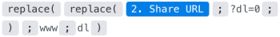

# [!DNL Dropbox] moduli

In un [!DNL Adobe Workfront Fusion] scenario, puoi automatizzare i flussi di lavoro che utilizzano [!UICONTROL Dropbox] o [!DNL Dropbox Business]nonché a collegarlo a più applicazioni e servizi di terze parti.Ciò consente di automatizzare attività quali il monitoraggio, la ricerca, il recupero, l&#39;inserimento in elenco, la creazione e la modifica di file e cartelle nel [!UICONTROL Dropbox].

Per istruzioni sulla creazione di uno scenario, consulta [Creare uno scenario in [!DNL Adobe Workfront Fusion]](../../workfront-fusion/scenarios/create-a-scenario.md).

Per informazioni sui moduli, consulta [Moduli in [!DNL Adobe Workfront Fusion]](../../workfront-fusion/modules/modules.md).

## Requisiti di accesso

Per utilizzare le funzionalità di questo articolo, è necessario disporre dei seguenti diritti di accesso:

<table style="table-layout:auto">
 <col> 
 <col> 
 <tbody> 
  <tr> 
   <td role="rowheader">[!DNL Adobe Workfront] piano*</td>
  <td> <p>[!UICONTROL Pro] o versione successiva</p> </td>
  </tr> 
  <tr data-mc-conditions=""> 
   <td role="rowheader">[!DNL Adobe Workfront] licenza*</td>
   <td> <p>[!UICONTROL Plan], [!UICONTROL Work]</p> </td> 
  </tr> 
  <tr> 
   <td role="rowheader">[!DNL Adobe Workfront Fusion] licenza**</td> 
   <td>
   <p>Fabbisogno di licenza corrente: No [!DNL Workfront Fusion] requisito di licenza.</p>
   <p>Oppure</p>
   <p>Requisito licenza legacy: [!UICONTROL [!DNL Workfront Fusion] per l'automazione e l'integrazione del lavoro] </p>
   </td> 
  </tr> 
  <tr> 
   <td role="rowheader">Prodotto</td> 
   <td>
   <p>Fabbisogno prodotto corrente: se si dispone di [!UICONTROL Select] o [!UICONTROL Prime] [!DNL Adobe Workfront] Pianifica, la tua organizzazione deve acquistare [!DNL Adobe Workfront Fusion] nonché [!DNL Adobe Workfront] per utilizzare la funzionalità descritta in questo articolo. [!DNL Workfront Fusion] è incluso in [!UICONTROL Ultimate] [!DNL Workfront] piano.</p>
   <p>Oppure</p>
   <p>Requisiti del prodotto legacy: la tua organizzazione deve acquistare [!DNL Adobe Workfront Fusion] nonché [!DNL Adobe Workfront] per utilizzare la funzionalità descritta in questo articolo.</p>
   </td> 
  </tr> 
 </tbody> 
</table>

Per conoscere il piano, il tipo di licenza o l&#39;accesso di cui si dispone, contattare [!DNL Workfront] amministratore.

Per informazioni su [!DNL Adobe Workfront Fusion] licenze, consulta [[!DNL Adobe Workfront Fusion] licenze](../../workfront-fusion/get-started/license-automation-vs-integration.md).

## Prerequisiti

* Da utilizzare [!DNL Dropbox] moduli, è necessario disporre di un [!DNL Dropbox] account.

>[!IMPORTANT]
>
>Il Dropbox deve approvare le applicazioni con più di 50 utenti.
>
>Per ulteriori informazioni, cerca &quot;Approvazione produzione&quot; nella guida per gli sviluppatori di Dropbox.


## Creare una connessione a [!DNL Dropbox]

Per creare una connessione per [!DNL Dropbox] moduli:

1. Clic **[!UICONTROL Aggiungi]** accanto alla casella Connessione.

1. Compila i campi seguenti:

   <table style="table-layout:auto"> 
      <col class="TableStyle-TableStyle-List-options-in-steps-Column-Column1">
      </col>
      <col class="TableStyle-TableStyle-List-options-in-steps-Column-Column2">
      </col>
      <tbody>
        <tr>
        <td role="rowheader">[!UICONTROL Nome connessione]</td>
        <td>
          <p>Immettere un nome per la connessione.</p>
        </td>
        <tr>
        <td role="rowheader">[!UICONTROL Environment]</td>
        <td>Seleziona se la connessione è per un ambiente di produzione o non di produzione.</td>
        </tr>
        <tr>
        <td role="rowheader">[!UICONTROL Type]</td>
        <td>Specificare se ci si connette a un account di servizio o a un account personale.</td>
        </tr>
        </tr>
        <tr>
        <td role="rowheader">[!UICONTROL ID client]</td>
        <td>Immetti il [!UICONTROL Dropbox] [!UICONTROL Client ID]. </tr>
        <tr>
        <td role="rowheader">[!UICONTROL Segreto client]</td>
        <td>Immetti il [!DNL Dropbox] [!UICONTROL Segreto Client]. </td>
        </tr>
        <tr>
        <td role="rowheader">Tipo di account [!UICONTROL]</td>
        <td>Specificare se si desidera connettersi a un account di Dropbox personale o aziendale (Dropbox Business).</td>
        </tr>
      </tbody>
    </table>

1. Clic **[!UICONTROL Continua]** per salvare la connessione e tornare al modulo.## [!DNL Dropbox] moduli e relativi campi

## [!DNL Dropbox] moduli e relativi campi

Quando si configura [!DNL Dropbox] moduli, [!DNL Workfront Fusion] visualizza i campi elencati di seguito. Oltre a questi, ulteriori [!DNL Dropbox] I campi potrebbero essere visualizzati in base a fattori quali il livello di accesso nell’app o nel servizio. Un titolo in grassetto in un modulo indica un campo obbligatorio.

Se viene visualizzato il pulsante Mappa sopra un campo o una funzione, è possibile utilizzarlo per impostare variabili e funzioni per tale campo. Per ulteriori informazioni, consulta [Mappare le informazioni da un modulo all’altro in [!DNL Adobe Workfront Fusion]](../../workfront-fusion/mapping/map-information-between-modules.md).


* [Moduli trigger](#trigger-modules)
* [Moduli per ottenere [!DNL Dropbox] file e cartelle](#modules-for-getting-dropbox-files-and-folders)
* [Moduli per la creazione e la modifica [!DNL Dropbox] file e cartelle](#modules-for-creating-and-editing-dropbox-files-and-folders)
* [Altri moduli](#other-modules)

### Moduli trigger

#### [!UICONTROL File di controllo]

Questo modulo del tipo Trigger restituisce i dettagli del file quando viene modificato il file in una cartella specificata.

<table style="table-layout:auto">
 <col> 
 <col> 
 <tbody> 
  <tr> 
   <td>[!UICONTROL Connection] </td> 
   <td> <p>Per istruzioni sulla connessione [!DNL Dropbox] account a [!DNL Workfront Fusion], vedi <a href="#create-a-connection-to-dropbox" class="MCXref xref">Creare una connessione a [!DNL Dropbox]</a> in questo articolo.</p> </td> 
  </tr> 
  <tr> 
   <td>[!UICONTROL Folder] </td> 
   <td> <p>Selezionare la cartella in cui si desidera verificare le modifiche.</p> </td> 
  </tr> 
  <tr> 
   <td>[!UICONTROL Guarda anche le sottocartelle]</td> 
   <td> <p> Abilita questa opzione per monitorare anche le sottocartelle nella cartella selezionata per i file modificati.</p> </td> 
  </tr> 
  <tr> 
   <td>[!UICONTROL Limit] </td> 
   <td> <p>Immettere o mappare il numero massimo di record che il modulo deve restituire durante ogni ciclo di esecuzione dello scenario.</p> </td> 
  </tr> 
 </tbody> 
</table>

### Moduli per ottenere [!DNL Dropbox] file e cartelle

* [[!UICONTROL Cerca file/cartelle]](#search-filesfolders)
* [[!UICONTROL Scaricare un file]](#download-a-file)
* [[!UICONTROL Ottenere i metadati di una cartella]](#get-a-folder-metadata)
* [[!UICONTROL Elencare tutti i file/sottocartelle in una cartella]](#list-all-filessubfolders-in-a-folder)
* [[!UICONTROL Elenca revisioni file]](#list-file-revisions)

#### [!UICONTROL Cerca file/cartelle]

Questo modulo di ricerca cerca i record in un oggetto in [!DNL Dropbox] che corrispondono alla query di ricerca specificata.

Puoi mappare queste informazioni nei moduli successivi nello scenario.

<table style="table-layout:auto">
 <col> 
 <col> 
 <tbody> 
  <tr> 
   <td>[!UICONTROL Connection] </td> 
   <td> <p>Per istruzioni sulla connessione [!DNL Dropbox] account a [!DNL Workfront Fusion], vedi <a href="#create-a-connection-to-dropbox" class="MCXref xref">Creare una connessione a [!DNL Dropbox]</a> in questo articolo.</p> </td> 
  </tr> 
  <tr> 
   <td>[!UICONTROL - Ricerca] </td> 
   <td> <p>Immettere il termine di ricerca.</p> </td> 
  </tr> 
  <tr> 
   <td>[!UICONTROL Folder] </td> 
   <td> <p>Selezionare la cartella in cui si desidera eseguire la ricerca. Questo modulo esegue ricerche nell’intero [!DNL Dropbox] se non si seleziona una cartella.</p> </td> 
  </tr> 
  <tr> 
   <td>Stato file</td> 
   <td> <p> Selezionare lo stato del file per limitare la ricerca allo stato selezionato.</p> </td> 
  </tr> 
  <tr> 
   <td>Categorie di file</td> 
   <td> <p> Selezionare le categorie di file per limitare la ricerca alle categorie selezionate.</p> </td> 
  </tr> 
  <tr> 
   <td>Estensioni file</td> 
   <td> <p> Scegliere le estensioni di file che si desidera cercare.</p> </td> 
  </tr> 
  <tr> 
   <td>Limite </td> 
   <td> <p>Immettere o mappare il numero massimo di record che il modulo deve restituire durante ogni ciclo di esecuzione dello scenario.</p> </td> 
  </tr> 
 </tbody> 
</table>

#### [!UICONTROL Scaricare un file]

Questo modulo di azione scarica un file da una cartella.

È possibile specificare il file e la relativa posizione.

Il modulo restituisce l’ID del file e dei campi associati, insieme a eventuali campi e valori personalizzati a cui la connessione accede. Puoi mappare queste informazioni nei moduli successivi nello scenario.

>[!NOTE]
>
>Questo modulo è utile per fornire file ai moduli successivi.

Durante la configurazione di questo modulo, vengono visualizzati i campi seguenti.

<table style="table-layout:auto">
 <col> 
 <col> 
 <tbody> 
  <tr> 
   <td>[!UICONTROL Connection] </td> 
   <td> <p>Per istruzioni sulla connessione [!DNL Dropbox] account a [!DNL Workfront Fusion], vedi <a href="#create-a-connection-to-dropbox" class="MCXref xref">Creare una connessione a [!DNL Dropbox]</a> in questo articolo.</p> </td> 
  </tr> 
  <tr> 
   <td>Modalità di selezione dei file</td> 
   <td> <p> Selezionare se si desidera mappare il percorso del file oppure selezionare il file manualmente.</p> </td> 
  </tr> 
  <tr> 
   <td> <p>Percorso file / File</p> </td> 
   <td> <p style="font-weight: bold;">Percorso file</p> <p>Immetti o mappa il percorso di destinazione del file.</p> <p style="font-weight: bold;">File</p> <p>Seleziona il file dal menu.</p> </td> 
  </tr> 
 </tbody> 
</table>

#### [!UICONTROL Ottenere i metadati di una cartella]

Questo modulo di azione recupera i dettagli della cartella condivisa.

Specifica l’ID della cartella.

Il modulo restituisce l’ID della cartella e dei campi associati, insieme a eventuali campi e valori personalizzati a cui la connessione accede. Puoi mappare queste informazioni nei moduli successivi nello scenario.

Durante la configurazione di questo modulo, vengono visualizzati i campi seguenti.

<table style="table-layout:auto">
 <col> 
 <col> 
 <tbody> 
  <tr> 
   <td>[!UICONTROL Connection] </td> 
   <td> <p>Per istruzioni sulla connessione [!DNL Dropbox] account a [!DNL Workfront Fusion], vedi <a href="#create-a-connection-to-dropbox" class="MCXref xref">Creare una connessione a [!DNL Dropbox]</a> in questo articolo.</p> </td> 
  </tr> 
  <tr> 
   <td>ID cartella condivisa</td> 
   <td> <p> Immetti o mappa l’ID della cartella di cui desideri recuperare i dettagli.</p> </td> 
  </tr> 
 </tbody> 
</table>

#### [!UICONTROL Elencare tutti i file/sottocartelle in una cartella]

Questo modulo di azione elenca i file o le cartelle presenti in una cartella specifica.

Specifica l’ID della cartella.

Il modulo restituisce gli ID dei file o delle cartelle e di tutti i campi associati, insieme a eventuali campi e valori personalizzati a cui la connessione accede. Puoi mappare queste informazioni nei moduli successivi nello scenario.

Durante la configurazione di questo modulo, vengono visualizzati i campi seguenti.

<table style="table-layout:auto">
 <col> 
 <col> 
 <tbody> 
  <tr> 
   <td>[!UICONTROL Connection] </td> 
   <td> <p>Per istruzioni sulla connessione [!DNL Dropbox] account a [!DNL Workfront Fusion], vedi <a href="#create-a-connection-to-dropbox" class="MCXref xref">Creare una connessione a [!DNL Dropbox]</a> in questo articolo.</p> </td> 
  </tr> 
  <tr> 
   <td>Elenco </td> 
   <td> <p>Specificare se si desidera recuperare file o cartelle.</p> </td> 
  </tr> 
  <tr> 
   <td>Mostra solo file scaricabili</td> 
   <td> <p> Abilita questa opzione per restituire solo i file scaricabili. Alcuni tipi di file, ad esempio i documenti di Google, non sono scaricabili.</p> </td> 
  </tr> 
  <tr> 
   <td>Cartella </td> 
   <td> <p>Immettere o mappare la cartella da cui si desidera recuperare file o cartelle.</p> </td> 
  </tr> 
  <tr> 
   <td>Limite </td> 
   <td> <p>Immettere o mappare il numero massimo di record che il modulo deve elencare durante ogni ciclo di esecuzione dello scenario.</p> </td> 
  </tr> 
 </tbody> 
</table>

#### [!UICONTROL Elenca revisioni file]

Questo modulo di azione recupera tutte le revisioni di file (una cronologia delle versioni) di un determinato file.\
Specifica l’ID del file.

Il modulo restituisce tutti i campi standard associati al record, insieme a tutti i campi e i valori personalizzati a cui la connessione accede. Puoi mappare queste informazioni nei moduli successivi nello scenario.

Durante la configurazione di questo modulo, vengono visualizzati i campi seguenti.

<table style="table-layout:auto"> 
 <col> 
 <col> 
 <tbody> 
  <tr> 
   <td>[!UICONTROL Connection] </td> 
   <td> <p>Per istruzioni sulla connessione [!DNL Dropbox] account a [!DNL Workfront Fusion], vedi <a href="#create-a-connection-to-dropbox" class="MCXref xref">Creare una connessione a [!DNL Dropbox]</a> in questo articolo.</p> </td> 
  </tr> 
  <tr> 
   <td>Modalità di selezione dei file</td> 
   <td> <p> Selezionare se si desidera mappare il percorso del file oppure selezionare il file manualmente.</p> </td> 
  </tr> 
  <tr> 
   <td> <p>Percorso file / File</p> </td> 
   <td> <p style="font-weight: bold;">Percorso file</p> <p>Immetti o mappa il percorso di destinazione del file.</p> <p style="font-weight: bold;">File</p> <p>Seleziona il file dal menu.</p> </td> 
  </tr> 
  <tr> 
   <td> <p>Limite</p> </td> 
   <td> <p>Immettere o mappare il numero massimo di record che il modulo deve elencare durante ogni ciclo di esecuzione dello scenario.</p> </td> 
  </tr> 
 </tbody> 
</table>

### Moduli per la creazione e la modifica [!DNL Dropbox] file e cartelle

* [[!UICONTROL Carica] un file](#upload-a-file)
* [[!UICONTROL Creare una cartella]](#create-a-folder)
* [[!UICONTROL Creare/sovrascrivere un file di testo]](#createoverwrite-a-text-file)
* [[!UICONTROL Creare/aggiornare un collegamento di condivisione]](#createupdate-a-share-link)
* [[!UICONTROL Ripristinare un file]](#restore-a-file)
* [[!UICONTROL Spostare un file o una cartella]](#move-a-filefolder)
* [[!UICONTROL Rinominare un file o una cartella]](#rename-a-filefolder)
* [[!UICONTROL Eliminare un file o una cartella]](#delete-a-filefolder)

#### [!UICONTROL Carica un file]

Questo modulo di azione carica un file in una cartella.

È possibile specificare informazioni quali la posizione del file, il file che si desidera caricare e un nuovo nome facoltativo per il file.

Il modulo restituisce l’ID del file e dei campi associati, insieme a eventuali campi e valori personalizzati a cui la connessione accede. Puoi mappare queste informazioni nei moduli successivi nello scenario.

Durante la configurazione di questo modulo, vengono visualizzati i campi seguenti.

<table style="table-layout:auto"> 
 <col> 
 <col> 
 <tbody> 
  <tr> 
   <td>[!UICONTROL Connection] </td> 
   <td> <p>Per istruzioni sulla connessione [!DNL Dropbox] account a [!DNL Workfront Fusion], vedi <a href="#create-a-connection-to-dropbox" class="MCXref xref">Creare una connessione a [!DNL Dropbox]</a> in questo articolo.</p> </td> 
  </tr> 
  <tr> 
   <td>[!UICONTROL Folder]</td> 
   <td> <p> Seleziona la cartella del tuo [!DNL Dropbox] desideri caricare il file in.</p> </td> 
  </tr> 
  <tr> 
   <td> <p>[!UICONTROL File di origine]</p> </td> 
   <td> <p>Immetti o mappa il file che desideri aggiungere al [!DNL Dropbox] cartella selezionata in precedenza.</p> <p style="font-weight: bold;">[!UICONTROL Nome file]</p> <p>Immettere o mappare il nome del file, inclusa l'estensione.</p> <p style="font-weight: bold;">[!UICONTROL File data]</p> <p>Immetti o mappa i dati del file (da un modulo precedente, ad esempio [!UICONTROL Google Drive] &gt;[!UICONTROL Get a File)].</p> <p>Nota: la dimensione massima del file caricato è 150 MB.</p> </td> 
  </tr> 
  <tr> 
   <td>[!UICONTROL Sovrascrive un file esistente]</td> 
   <td> <p> Abilita questa opzione per sostituire il file esistente con il nuovo file. Se questa opzione viene lasciata disattivata, il file caricato viene rinominato.</p> </td> 
  </tr> 
 </tbody> 
</table>

#### [!UICONTROL Creare una cartella]

Questo modulo di azione crea una nuova cartella.

Specificate il percorso e il nome della cartella.

Il modulo restituisce l’ID della cartella e dei campi associati, insieme a eventuali campi e valori personalizzati a cui la connessione accede. Puoi mappare queste informazioni nei moduli successivi nello scenario.

Durante la configurazione di questo modulo, vengono visualizzati i campi seguenti.

<table style="table-layout:auto"> 
 <col> 
 <col> 
 <tbody> 
  <tr> 
   <td>[!UICONTROL Connection] </td> 
   <td> <p>Per istruzioni sulla connessione [!DNL Dropbox] account a [!DNL Workfront Fusion], vedi <a href="#create-a-connection-to-dropbox" class="MCXref xref">Creare una connessione a [!DNL Dropbox]</a> in questo articolo.</p> </td> 
  </tr> 
  <tr> 
   <td>[!UICONTROL Nome cartella] </td> 
   <td> <p>Immettere il nome della nuova cartella.</p> </td> 
  </tr> 
  <tr> 
   <td> <p>[!UICONTROL Folder]</p> </td> 
   <td> <p>Immetti o mappa il percorso in cui desideri creare una nuova cartella.</p> <p>Nota:   <p>Se si utilizza un [!DNL Dropbox Business] con spazi del team, è necessario rimuovere la barra <code>/</code>, o non fare clic su <strong>[!UICONTROL Fare clic qui] per scegliere la cartella</strong> per creare una cartella di team nella radice.</p> <p>Se la barra non viene rimossa, viene generato un errore <code>[409] path/malformed_path/..</code> viene restituito.</p> </p> </td> 
  </tr> 
  <tr> 
   <td>[!UICONTROL Rinomina automaticamente]</td> 
   <td> <p> Abilita questa opzione per rinominare la nuova cartella, se nel percorso di destinazione esiste già una cartella con lo stesso nome.</p> </td> 
  </tr> 
 </tbody> 
</table>

#### [!UICONTROL Creare/sovrascrivere un file di testo]

Questo modulo di azione crea un file DOC o sovrascrive il contenuto di un file esistente.

È possibile specificare il file di origine e la cartella.

Il modulo restituisce l’ID della cartella e dei campi associati, insieme a eventuali campi e valori personalizzati a cui la connessione accede. Puoi mappare queste informazioni nei moduli successivi nello scenario.

Durante la configurazione di questo modulo, vengono visualizzati i campi seguenti.

<table style="table-layout:auto"> 
 <col> 
 <col> 
 <tbody> 
  <tr> 
   <td>[!UICONTROL Connection] </td> 
   <td> <p>Per istruzioni sulla connessione [!DNL Dropbox] account a [!DNL Workfront Fusion], vedi <a href="#create-a-connection-to-dropbox" class="MCXref xref">Creare una connessione a [!DNL Dropbox]</a> in questo articolo.</p> </td> 
  </tr> 
  <tr> 
   <td>[!UICONTROL Seleziona per]</td> 
   <td> <p> Selezionare se si desidera creare o sovrascrivere un file DOC.</p> </td> 
  </tr> 
  <tr> 
   <td>[!UICONTROL Folder] </td> 
   <td> <p>Selezionare il percorso di destinazione in cui si desidera creare un file.</p> </td> 
  </tr> 
  <tr> 
   <td> <p>[!UICONTROL File di origine]</p> </td> 
   <td> <p>Immetti o mappa il file che desideri aggiungere al [!DNL Dropbox] cartella.</p> <p style="font-weight: bold;">Nome file</p> <p>Immettete il nome del nuovo file DOC (senza estensione).</p> <p style="font-weight: bold;">Contenuto file</p> <p>Immettete il contenuto del testo del file DOC.</p> </td> 
  </tr> 
 </tbody> 
</table>

#### [!UICONTROL Creare/aggiornare un collegamento di condivisione]

Questo modulo crea un collegamento pubblico a un file.

Specificare il file e le informazioni sul collegamento.

Il modulo restituisce l’ID del collegamento e di tutti i campi associati, insieme a eventuali campi e valori personalizzati a cui la connessione accede. Puoi mappare queste informazioni nei moduli successivi nello scenario.

Durante la configurazione di questo modulo, vengono visualizzati i campi seguenti.

<table style="table-layout:auto"> 
 <col> 
 <col> 
 <tbody> 
  <tr> 
   <td>[!UICONTROL Connection] </td> 
   <td> <p>Per istruzioni sulla connessione [!DNL Dropbox] account a [!DNL Workfront Fusion], vedi <a href="#create-a-connection-to-dropbox" class="MCXref xref">Creare una connessione a [!DNL Dropbox]</a> in questo articolo.</p> </td> 
  </tr> 
  <tr> 
   <td>[!UICONTROL Modalità di selezione dei file]</td> 
   <td> <p> Selezionare se si desidera mappare o immettere il percorso del file oppure selezionare il file manualmente.</p> </td> 
  </tr> 
  <tr> 
   <td> <p>[!UICONTROL Percorso File / File]</p> </td> 
   <td> <p style="font-weight: bold;">[!UICONTROL Percorso File]</p> <p>Immetti o mappa il percorso di destinazione del file.</p> <p style="font-weight: bold;">[!UICONTROL File]</p> <p>Seleziona il file dal menu.</p> </td> 
  </tr> 
  <tr> 
   <td> <p>Visibilità richiesta [!UICONTROL]</p> </td> 
   <td> <p>Seleziona se il collegamento è pubblico, per team o con password limitata.</p> <p>Nota: le opzioni [!UICONTROL Solo team] e [!UICONTROL Accesso con password] sono disponibili solo per gli utenti con [!DNL Dropbox Pro] o versione successiva.</p> </td> 
  </tr> 
  <tr> 
   <td>Data di scadenza del collegamento [!UICONTROL]</td> 
   <td> <p> Immetti la data e l’ora in cui il collegamento scadrà e non sarà più accessibile. Se questo campo viene lasciato vuoto, il collegamento non scade. Per un elenco dei formati di data e ora supportati consulta <a href="../../workfront-fusion/mapping/type-coercion.md" class="MCXref xref" data-mc-variable-override="">Tipo di coercizione in [!DNL Adobe Workfront Fusion]</a>.</p> <p>Nota: le opzioni [!UICONTROL Solo team] e [!UICONTROL Accesso con password] sono disponibili solo per gli utenti che dispongono di [!UICONTROL Dropbox Pro] o versioni successive.</p> </td> 
  </tr> 
  <tr> 
   <td> <p>Livello di accesso di [!UICONTROL Link]</p> </td> 
   <td> <p>Imposta l’autorizzazione per il destinatario del collegamento.</p> <p><strong>Visualizzatore [!UICONTROL]</strong> Gli utenti che utilizzano il collegamento possono visualizzare e commentare il contenuto.</p> <p><strong>[!UICONTROL Editor]</strong> Gli utenti che utilizzano il collegamento possono modificare, visualizzare e commentare il contenuto.</p> <p><strong>[!UICONTROL Max]</strong> Gli utenti che utilizzano il collegamento ricevono il livello di accesso massimo su cui puoi impostare il collegamento.</p> </td> 
  </tr> 
 </tbody> 
</table>

#### [!UICONTROL Ripristinare un file]

Questo modulo ripristina una versione precedente di un file.

È possibile specificare il file e il numero della revisione desiderata.

Il modulo restituisce l’ID della versione e tutti i campi associati, insieme a eventuali campi e valori personalizzati a cui la connessione accede. Puoi mappare queste informazioni nei moduli successivi nello scenario.

Durante la configurazione di questo modulo, vengono visualizzati i campi seguenti.

<table style="table-layout:auto"> 
 <col> 
 <col> 
 <tbody> 
  <tr> 
   <td>[!UICONTROL Connection] </td> 
   <td> <p>Per istruzioni sulla connessione [!DNL Dropbox] account a [!DNL Workfront Fusion], vedi <a href="#create-a-connection-to-dropbox" class="MCXref xref">Creare una connessione a [!DNL Dropbox]</a> in questo articolo.</p> </td> 
  </tr> 
  <tr> 
   <td>[!UICONTROL Modalità di selezione dei file]</td> 
   <td> <p> Selezionare se si desidera mappare o immettere il percorso del file oppure selezionare il file manualmente.</p> </td> 
  </tr> 
  <tr> 
   <td> <p>[!UICONTROL Percorso File] / [!UICONTROL File]</p> </td> 
   <td> <p><strong>[!UICONTROL Percorso File]</strong> </p> <p>Immetti o mappa il percorso di destinazione del file.</p> <p><strong>[!UICONTROL File]</strong> </p> <p>Seleziona il file dal menu.</p> </td> 
  </tr> 
  <tr> 
   <td> <p>[!UICONTROL Revisione]</p> </td> 
   <td> <p>Immettere o mappare il numero di revisione della revisione da ripristinare.</p> </td> 
  </tr> 
 </tbody> 
</table>

#### [!UICONTROL Spostare un file o una cartella]

Questo modulo di azione sposta un file o una cartella in una posizione diversa.

È possibile specificare il file o la cartella e come e dove si desidera spostarlo.

Il modulo restituisce l’ID del file o della cartella e dei campi associati, insieme a eventuali campi e valori personalizzati a cui la connessione accede. Puoi mappare queste informazioni nei moduli successivi nello scenario.

Durante la configurazione di questo modulo, vengono visualizzati i campi seguenti.

<table style="table-layout:auto"> 
 <col> 
 <col> 
 <tbody> 
  <tr> 
   <td>[!UICONTROL Connection] </td> 
   <td> <p>Per istruzioni sulla connessione [!DNL Dropbox] account a [!DNL Workfront Fusion], vedi <a href="#create-a-connection-to-dropbox" class="MCXref xref">Creare una connessione a [!DNL Dropbox]</a> in questo articolo.</p> </td> 
  </tr> 
  <tr> 
   <td>[!UICONTROL Modalità di selezione dei file] </td> 
   <td> <p>Selezionare se si desidera mappare o immettere il percorso del file oppure selezionare il file manualmente.</p> </td> 
  </tr> 
  <tr> 
   <td> <p>[!UICONTROL Percorso File/Cartella] / [!UICONTROL File/Cartella]</p> </td> 
   <td> <p style="font-weight: bold;">[!UICONTROL Percorso file/cartella]</p> <p>Immettere o mappare il percorso di destinazione al file o alla cartella.</p> <p style="font-weight: bold;">[!UICONTROL file/cartella]</p> <p>Seleziona il file o la cartella dal menu.</p> </td> 
  </tr> 
  <tr> 
   <td> <p>[!UICONTROL Nella Cartella]</p> </td> 
   <td> <p>Immettere o mappare il percorso di destinazione del file o della cartella.</p> </td> 
  </tr> 
  <tr> 
   <td> <p>[!UICONTROL Nuovo Nome]</p> </td> 
   <td> <p>Immettere il nuovo nome per il file o la cartella nella nuova posizione.</p> </td> 
  </tr> 
  <tr> 
   <td> <p>[!UICONTROL Rinomina automaticamente]</p> </td> 
   <td> <p>Abilitare questa opzione per assicurarsi che, se esiste un file o una cartella con lo stesso nome, il modulo rinomini il nuovo file o la nuova cartella aggiungendo ([!UICONTROL NUMBER]) dopo il nome del file o della cartella. In caso contrario, il file o la cartella nel percorso di destinazione viene sovrascritto.</p> </td> 
  </tr> 
  <tr> 
   <td> <p>[!UICONTROL Consenti trasferimento proprietà]</p> </td> 
   <td> <p>Abilita questa opzione per consentire gli spostamenti per proprietario, anche se comporterebbe un trasferimento di proprietà per il contenuto spostato.</p> </td> 
  </tr> 
 </tbody> 
</table>

#### [!UICONTROL Rinominare un file o una cartella]

Questo modulo di azione rinomina un file o una cartella.

Specificare il file o la cartella e il nuovo nome.

Il modulo restituisce l’ID del file o della cartella e dei campi associati, insieme a eventuali campi e valori personalizzati a cui la connessione accede. Puoi mappare queste informazioni nei moduli successivi nello scenario.

Durante la configurazione di questo modulo, vengono visualizzati i campi seguenti.

<table style="table-layout:auto"> 
 <col> 
 <col> 
 <tbody> 
  <tr> 
   <td>[!UICONTROL Connection] </td> 
   <td> <p>Per istruzioni sulla connessione [!DNL Dropbox] account a [!DNL Workfront Fusion], vedi <a href="#create-a-connection-to-dropbox" class="MCXref xref">Creare una connessione a [!DNL Dropbox]</a> in questo articolo.</p> </td> 
  </tr> 
  <tr> 
   <td>Modalità di selezione dei file</td> 
   <td> <p> Selezionare se si desidera mappare o immettere il percorso del file oppure selezionare il file manualmente.</p> </td> 
  </tr> 
  <tr> 
   <td> <p>Percorso file/cartella/File/Cartella</p> </td> 
   <td> <p style="font-weight: bold;">Percorso file/cartella</p> <p>Immettere o mappare il percorso di destinazione al file o alla cartella.</p> <p style="font-weight: bold;">File/Cartella</p> <p>Seleziona il file o la cartella dal menu.</p> </td> 
  </tr> 
  <tr> 
   <td>Rinomina </td> 
   <td> <p>Immettere il [!UICONTROL nome destinazione] per il file, inclusa l'estensione.</p> </td> 
  </tr> 
 </tbody> 
</table>

#### [!UICONTROL Eliminare un file o una cartella]

Questo modulo di azione elimina un file o una cartella.

Specificare il file o la cartella.

Il modulo restituisce l’ID del record ed eventuali campi associati, insieme a eventuali campi e valori personalizzati a cui la connessione accede. Puoi mappare queste informazioni nei moduli successivi nello scenario.

Durante la configurazione di questo modulo, vengono visualizzati i campi seguenti.

<table style="table-layout:auto"> 
 <col> 
 <col> 
 <tbody> 
  <tr> 
   <td>[!UICONTROL Connection] </td> 
   <td> <p>Per istruzioni sulla connessione [!DNL Dropbox] account a [!DNL Workfront Fusion], vedi <a href="#create-a-connection-to-dropbox" class="MCXref xref">Creare una connessione a [!DNL Dropbox]</a> in questo articolo.</p> </td> 
  </tr> 
  <tr> 
   <td>[!UICONTROL Modalità di selezione dei file]</td> 
   <td> <p> Selezionare se si desidera mappare o immettere il percorso del file oppure selezionare il file manualmente.</p> </td> 
  </tr> 
  <tr> 
   <td> <p>[!UICONTROL Percorso File] / [!UICONTROL File]</p> </td> 
   <td> <p style="font-weight: bold;">[!UICONTROL Percorso File]</p> <p>Immetti o mappa il percorso di destinazione del file.</p> <p style="font-weight: bold;">[!UICONTROL File]</p> <p>Seleziona il file dal menu.</p> </td> 
  </tr> 
 </tbody> 
</table>

### Altri moduli

#### [!UICONTROL Effettuare una chiamata API]

Questo modulo di azione consente di effettuare una chiamata autenticata personalizzata al [!DNL Dropbox] API. In questo modo, puoi creare un’automazione del flusso di dati che non può essere eseguita dall’altro [!DNL Dropbox] moduli.

Durante la configurazione di questo modulo, vengono visualizzati i campi seguenti.

<table style="table-layout:auto"> 
 <col> 
 <col> 
 <tbody> 
  <tr> 
   <td>[!UICONTROL Connection] </td> 
   <td> <p>Per istruzioni sulla connessione [!DNL Dropbox] account a [!DNL Workfront Fusion], vedi <a href="#create-a-connection-to-dropbox" class="MCXref xref">Creare una connessione a [!DNL Dropbox]</a> in questo articolo.</p> </td> 
  </tr> 
  <tr> 
   <td> <p>[!UICONTROL URL]</p> </td> 
   <td> <p>Immettere un percorso relativo per Immettere un percorso relativo a <code>https://api.dropboxapi.com</code>. Ad esempio: <code>/2/files/list_folder</code></p> <p>Nota: per un elenco degli endpoint disponibili, vedere <a href="https://www.dropbox.com/developers/documentation/http/documentation">Documentazione di Dropbox API v2</a>.</p> </td> 
  </tr> 
  <tr> 
   <td> <p>[!UICONTROL Method]</p> </td> 
   <td> <p>Seleziona il metodo di richiesta HTTP necessario per configurare la chiamata API. Per ulteriori informazioni, consulta <a href="../../workfront-fusion/modules/http-request-methods.md" class="MCXref xref" data-mc-variable-override="">Metodi di richiesta HTTP in [!DNL Adobe Workfront Fusion]</a>.</p> </td> 
  </tr> 
  <tr> 
   <td>[!UICONTROL Headers] </td> 
   <td> <p>Inserisci le intestazioni di richiesta desiderate. [!DNL Workfront Fusion] aggiunge automaticamente le intestazioni di autorizzazione.</p> </td> 
  </tr> 
  <tr> 
   <td>[!UICONTROL Stringa Di Query]</td> 
   <td> <p> Immettere la stringa di query richiesta.</p> </td> 
  </tr> 
  <tr> 
   <td>[!UICONTROL Body] </td> 
   <td> <p>Aggiungi il contenuto body per la chiamata API sotto forma di oggetto JSON standard.</p> <p>Nota:   <p>Quando si utilizzano istruzioni condizionali quali <code>if</code> nel JSON, inserisci le virgolette al di fuori dell’istruzione condizionale.</p> 
     <div class="example" data-mc-autonum="<b>Example: </b>">  
      <p>  </p> 
     </div> </p> </td> 
  </tr> 
 </tbody> 
</table>

>[!INFO]
>
>**Esempio:** La seguente chiamata API restituisce i primi 10 file dalla [!DNL /Text files] cartella nel tuo [!DNL Dropbox] account:
>
>URL: `/2/files/list_folder`
>
>Corpo:
> 
>`{`
>
>`"path": "/Text files",`
>
>`"limit": 10,`
>
>`"recursive": false,`
>
>`"include_deleted": false`
>
>`}`
>
>Le corrispondenze della ricerca si trovano nell’Output del modulo in [!UICONTROL Bundle] > [!UICONTROL Corpo] > voci.
>
>Nel nostro esempio, sono stati restituiti 10 biglietti:

## Problemi comuni

* [Impossibile caricare o aggiornare un file](#unable-to-upload-or-update-a-file)
* [L’immagine a cui si fa riferimento tramite un collegamento condiviso non viene riprodotta](#image-referenced-via-a-shared-link-does-not-render)

### Impossibile caricare o aggiornare un file

Esistono diverse situazioni in cui il caricamento o l’aggiornamento di un file non riesce:

* Il file caricato è troppo grande e supera la dimensione massima consentita per il file [!DNL Dropbox] o ha utilizzato tutte le risorse [!DNL Dropbox] quota di archiviazione dell&#39;account. È necessario eliminare i file esistenti dal [!DNL Dropbox] o aggiornare il piano.
* La cartella selezionata in precedenza, in cui viene caricato il file, non esiste più. Lo scenario si interrompe e devi selezionare nuovamente la cartella di destinazione.

### L’immagine a cui si fa riferimento tramite un collegamento condiviso non viene riprodotta

L&#39;URL restituito da [!UICONTROL Dropbox] >[!UICONTROL Creare un collegamento condiviso] non si collega direttamente a un’immagine, ma a una [!DNL Dropbox] pagina. Per forzare il download dell&#39;immagine, sostituisci la `?dl=0` con `?dl=1`. Per forzare il rendering dell&#39;immagine (ad esempio, in un browser Web o in Facebook Messenger), aggiungi `&raw=1` all&#39;URL.

Se devi ottenere il collegamento diretto o non elaborato dell’immagine per il sito web o per altri [!DNL Workfront Fusion] moduli, devi modificare l’URL condiviso iniziale nel modo seguente:

URL originale:

`https://www.dropbox.com/s/ia8qtvs20f3a5ux/Screen%20Shot%202018-10-15%20at%204.21.11%20PM.png?dl=0`

1. Sostituisci `www` con `dl`.
1. Rimuovi `?dl=0`.

URL finale:

`https://dl.dropbox.com/s/ia8qtvs20f3a5ux/Screen%20Shot%202018-10-15%20at%204.21.11%20PM.png`

Per modificare automaticamente l’URL, puoi utilizzare `replace()` funzione due volte:

* Sostituisci www con dl

  

* E per rimuovere ?dl=0

  

Per eseguire questa operazione in un unico passaggio, combina le seguenti funzioni:



Puoi anche copiarlo e incollarlo nel campo. Sostituisci `1.url` con l’URL.

```
{{replace(replace(1.url; "?dl=0"; ""); "www"; "dl")}}
```
