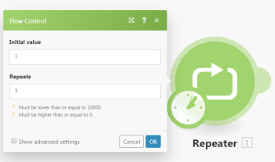

# Controllo del flusso in Adobe Workfront Fusion

Quando crei o modifichi uno scenario, puoi configurare le impostazioni per controllare il modo in cui i dati scorrono all’interno di esso.

## Requisiti di accesso

Per utilizzare le funzionalità di questo articolo, è necessario disporre dei seguenti diritti di accesso:

<table style="table-layout:auto"> 
 <col> 
 <col> 
 <tbody> 
  <tr> 
   <td role="rowheader">[!DNL Adobe Workfront] piano*</td>
  <td> 
[!UICONTROL Pro] o superiore
 </td>
  </tr> 
  <tr data-mc-conditions=""> 
   <td role="rowheader">[!DNL Adobe Workfront] licenza*</td>
   <td> 
[!UICONTROL Plan], [!UICONTROL Work]
 </td> 
  </tr> 
  <tr> 
   <td role="rowheader">[!DNL Adobe Workfront Fusion] licenza**</td> 
   <td> 
[!UICONTROL [!DNL Workfront Fusion] per automazione e integrazione del lavoro] 
   
[!UICONTROL [!DNL Workfront Fusion] per automazione del lavoro
  </td> 
  </tr> 
  <tr> 
   <td role="rowheader">Prodotto</td> 
   <td>La tua organizzazione deve acquistare [!DNL Adobe Workfront Fusion] nonché [!DNL Adobe Workfront] per utilizzare le funzionalità descritte in questo articolo.</td> 
  </tr> 
 </tbody> 
</table>

Per sapere quale piano, tipo di licenza o accesso hai, contatta il tuo [!DNL Workfront] amministratore.

Per informazioni su [!DNL Adobe Workfront Fusion] licenze, vedi [[!DNL Adobe Workfront Fusion] licenze](../../workfront-fusion/get-started/license-automation-vs-integration.md).

## Ripetitore

Puoi utilizzare un [!UICONTROL Ripetitore] modulo per ripetere un&#39;attività un numero di volte specificato. A [!UICONTROL Ripetitore] modulo genera bundle uno dopo l&#39;altro.

Ad esempio, puoi utilizzare un [!UICONTROL Ripetitore] modulo per inviare cinque e-mail con i soggetti &quot;Hello 1&quot;, &quot;Hello 2&quot; e così via, collegando il **[!UICONTROL E-mail] >[!UICONTROL Inviami un&#39;e-mail]** al [!UICONTROL Ripetitore] modulo .

Per utilizzare un [!UICONTROL Ripetitore] modulo:

1. Fai clic sul pulsante [!UICONTROL Controllo del flusso] icona  nella parte inferiore dello schermo, quindi fai clic su **[!UICONTROL Ripetitore]** nel menu visualizzato.
1. Fai clic sul pulsante [!UICONTROL Ripetitore] bundle, quindi fai clic su **[!UICONTROL Connetti automaticamente]** nella casella visualizzata.
1. In [!UICONTROL Controllo del flusso] nella casella visualizzata, digitare il numero di ripetizioni (bundle in uscita) desiderate nella **[!UICONTROL Ripeti]** scatola.

   Nel nostro esempio di e-mail, digita 5.

   

   Il valore dell&#39;elemento aumenta in ogni ripetizione di questo valore specificato nel **[!UICONTROL Passaggio]** campo, che è possibile visualizzare selezionando **[!UICONTROL Mostra impostazioni avanzate]**. Per impostazione predefinita, questo numero è 1.

1. Fai clic su **[!UICONTROL OK]** per chiudere **[!UICONTROL Controllo del flusso]** scatola.

1. Fai clic sull’app o sul modulo di servizio connesso al [!UICONTROL Ripetitore] modulo .
1. Nella casella visualizzata, digitare le informazioni che si desidera ripetere.

   Nel nostro esempio di e-mail, digita Hello nel [!UICONTROL Oggetto] casella, quindi mappa `i` dal modulo Repeater (Ripetitore).

   

| Voce | Descrizione |
|---|---|
| [!UICONTROL Valore iniziale] | Immettere o mappare il numero che si desidera impostare come modulo `i` nella prima iterazione. Il valore predefinito è 1. |
| [!UICONTROL Si ripete] | Immetti o mappa il numero di volte in cui desideri che il modulo venga ripetuto. Questo numero deve essere maggiore o uguale a 0 e minore o uguale a 10.000. |
| [!UICONTROL Step] | Questo è il numero in base al quale il modulo aumenta il valore di `i`. Il valore predefinito è 1. |

{style=&quot;table-layout:auto&quot;}

>[!NOTE]
>
>Il numero di ripetizioni non è determinato dal valore di `i`come sarebbe in un ciclo di programmazione. Il modulo ripeterà il numero di volte indicato nel [!UICONTROL Ripeti] campo . Il valore `i` modifiche a ogni iterazione del [!DNL repeater] e può essere mappato su moduli successivi. L&#39;esempio precedente mappa il valore di `i` nel messaggio Hello, che genera messaggi che leggono &quot;Hello 1&quot;, &quot;Hello 2&quot; e così via.

## [!UICONTROL Iteratore]

Un [!UICONTROL Iteratore] è un tipo speciale di modulo che converte un array in una serie di bundle. Ogni elemento dell’array sarà un bundle separato nel [!UICONTROL Iteratore] output del modulo. Per ulteriori informazioni, consulta [[!UICONTROL Iteratore] modulo in [!DNL Adobe Workfront Fusion]](../../workfront-fusion/modules/iterator-module.md).

## Aggregatore array

Un aggregatore di array è un tipo speciale di modulo che consente di unire diversi bundle in un unico bundle. Per ulteriori informazioni, consulta [[!UICONTROL Aggregatore] Modulo in Adobe Workfront Fusion](../../workfront-fusion/modules/aggregator-module.md).

## [!UICONTROL Router]

La [!UICONTROL Router] Il modulo ti consente di suddividere il flusso in più percorsi ed elaborare i dati all’interno di ogni percorso in modo diverso. Una volta [!UICONTROL Router] Il modulo riceve un bundle, lo inoltra a ogni rotta collegata nell&#39;ordine in cui le rotte sono state collegate al [!UICONTROL Router] modulo . Per ulteriori informazioni, consulta [Modulo router in [!DNL Adobe Workfront Fusion]](../../workfront-fusion/modules/router-module.md).

<!--

<h2>Directives</h2>

The error handling directives allow you to control how your scenario reacts to errors. For more information, see <a href="../../workfront-fusion/errors/advanced-error-handling.md" class="MCXref xref">Advanced error handling in Adobe Workfront Fusion</a> and <a href="../../workfront-fusion/errors/directives-for-error-handling.md" class="MCXref xref">Directives for error handling in Adobe Workfront Fusion</a>.

-->
