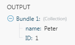

# [!UICONTROL JSON] moduli

Il [!DNL Adobe Workfront Fusion] [!UICONTROL JSON] fornisce moduli per elaborare i dati in formato JSON in modo che [!DNL Adobe Workfront Fusion] può lavorare ulteriormente con il contenuto di dati o creare nuovo contenuto JSON.

## Requisiti di accesso

Per utilizzare le funzionalità di questo articolo, è necessario disporre dei seguenti diritti di accesso:

<table style="table-layout:auto"> 
 <col> 
 <col> 
 <tbody> 
  <tr> 
   <td role="rowheader">[!DNL Adobe Workfront] piano*</td>
  <td> <p>[!UICONTROL Pro] o versione successiva</p> </td>
  </tr> 
  <tr data-mc-conditions=""> 
   <td role="rowheader">[!DNL Adobe Workfront] licenza*</td>
   <td> <p>[!UICONTROL Plan], [!UICONTROL Work]</p> </td> 
  </tr> 
  <tr> 
   <td role="rowheader">[!DNL Adobe Workfront Fusion] licenza**</td> 
   <td>
   <p>Fabbisogno di licenza corrente: No [!DNL Workfront Fusion] requisito di licenza.</p>
   <p>Oppure</p>
   <p>Requisito licenza legacy: [!UICONTROL [!DNL Workfront Fusion] per l'automazione e l'integrazione del lavoro], [!UICONTROL [!DNL Workfront Fusion] per automazione lavoro]</p>
   </td> 
  </tr> 
  <tr> 
   <td role="rowheader">Prodotto</td> 
   <td>
   <p>Fabbisogno prodotto corrente: se si dispone di [!UICONTROL Select] o [!UICONTROL Prime] [!DNL Adobe Workfront] Pianifica, la tua organizzazione deve acquistare [!DNL Adobe Workfront Fusion] nonché [!DNL Adobe Workfront] per utilizzare la funzionalità descritta in questo articolo. [!DNL Workfront Fusion] è incluso in [!UICONTROL Ultimate] [!DNL Workfront] piano.</p>
   <p>Oppure</p>
   <p>Requisiti del prodotto legacy: la tua organizzazione deve acquistare [!DNL Adobe Workfront Fusion] nonché [!DNL Adobe Workfront] per utilizzare la funzionalità descritta in questo articolo.</p>
   </td> 
  </tr> 
 </tbody> 
</table>

Per conoscere il piano, il tipo di licenza o l&#39;accesso di cui si dispone, contattare [!DNL Workfront] amministratore.

Per informazioni su [!DNL Adobe Workfront Fusion] licenze, consulta [[!DNL Adobe Workfront Fusion] licenze](../../workfront-fusion/get-started/license-automation-vs-integration.md).

## Analizza JSON

* [Struttura dei dati](#data-structure)
* [Confronto tra raccolta e array](#collection-vs-array)

### Struttura dei dati

La struttura dati descrive come sono organizzati i dati JSON e consente la mappatura di singoli elementi JSON ad altri moduli nello scenario. Se non fornisci la struttura Dati, puoi eseguire manualmente il modulo e [!DNL Workfront Fusion] costruirà la struttura dal JSON fornito:

1. Aggiungi il [!UICONTROL Analizza JSON] modulo a uno scenario.
1. In **[!UICONTROL Stringa JSON]** , immetti il JSON da cui desideri creare una struttura dati.
1. Non collegare altri moduli a [!UICONTROL Analizza JSON] modulo. Perché [!DNL Workfront Fusion] non conosce ancora la struttura dei dati JSON, non è ancora possibile mappare i dati da [!UICONTROL Analizza JSON] ad altri moduli nello scenario.
1. Esegui manualmente lo scenario. Ciò consente [!UICONTROL Analizza JSON] per identificare la struttura JSON dal JSON fornito.
1. È ora possibile collegare i seguenti moduli. Gli elementi del modulo JSON di analisi sono ora disponibili per la mappatura.

Per ulteriori informazioni, consulta [Strutture di dati in [!UICONTROL Adobe Workfront Fusion]](../../workfront-fusion/modules/data-structures.md).

### Confronto tra raccolta e array

Se il campo stringa JSON contiene una raccolta `{ ... }`, L’output è un singolo bundle contenente gli elementi della raccolta.

>[!INFO]
>
>**Esempio:**
>
>```
>{
>       "name" : "Peter",
>
>    
   "ID" : 1
>}
>```
>
>

Se il campo stringa JSON contiene un array `[ ... ]`, l’output è una serie di bundle. ogni bundle contiene un elemento dell’array.

>[!INFO]
>
>**Esempio:**
>
>```
>[
>   {
>       "name" : "Peter",
>       "ID" : 1
>   },
>
>  
 {
>       "name" : "Mike",
>       "ID" : 2
>   }
>]
>```
>
>

## [!UICONTROL JSON] moduli e relativi campi

Quando si configura [!DNL JSON] moduli, [!DNL Workfront Fusion] visualizza i campi elencati di seguito. Insieme a questi, potrebbero essere visualizzati campi JSON aggiuntivi, a seconda di fattori come il livello di accesso nell’app o nel servizio. Un titolo in grassetto in un modulo indica un campo obbligatorio.

Se viene visualizzato il pulsante Mappa sopra un campo o una funzione, è possibile utilizzarlo per impostare variabili e funzioni per tale campo. Per ulteriori informazioni, consulta [Mappare le informazioni da un modulo all’altro in [!DNL Adobe Workfront Fusion]](../../workfront-fusion/mapping/map-information-between-modules.md).


* [Aggrega a JSON](#aggregate-to-json)
* [Converti JSON in XML](#convert-json-to-xml)
* [Analizza JSON](#parse-json)
* [Crea JSON](#create-json)
* [Trasforma JSON](#transform-json)

### [!UICONTROL Aggrega a JSON]

Questo modulo aggregatore aggrega l’output di un modulo precedente in JSON.

<table style="table-layout:auto"> 
 <col data-mc-conditions=""> 
 <col data-mc-conditions=""> 
 <tbody> 
  <tr> 
   <td role="rowheader">[!UICONTROL Modulo di origine] </td> 
   <td> <p>Seleziona il modulo che restituisce i dati da aggregare in JSON.</p> </td> 
  </tr> 
  <tr> 
   <td role="rowheader">[!UICONTROL Struttura dati]</td> 
   <td> <p>Seleziona la struttura dati da utilizzare per creare JSON. La struttura dati determina quali altri campi sono disponibili in questo modulo. Per ulteriori informazioni, consulta <a href="#data-structure" class="MCXref xref">Struttura dei dati</a> in questo articolo.</p> </td> 
  </tr> 
  <tr> 
   <td role="rowheader">[!UICONTROL Rientro]</td> 
   <td> <p> Seleziona se desideri applicare un rientro al JSON utilizzando schede, due spazi o quattro spazi.</p> </td> 
  </tr> 
  <tr> 
   <td role="rowheader">[!UICONTROL Raggruppa per]</td> 
   <td>Definire un'espressione in base alla quale raggruppare l'output aggregato. Questa espressione può contenere uno o più elementi mappati. I dati aggregati vengono quindi separati in gruppi utilizzando il valore di questa espressione. Ogni gruppo produce come bundle separato con una chiave (l’espressione valutata) e un valore (il testo aggregato). Puoi utilizzare la chiave come filtro nei moduli successivi.</td> 
  </tr> 
  <tr> 
   <td role="rowheader">[!UICONTROL Interrompi elaborazione dopo un'aggregazione vuota]</td> 
   <td>Abilita questa opzione per interrompere lo scenario quando non ci sono risultati.</td> 
  </tr> 
 </tbody> 
</table>

### [!UICONTROL Converti JSON in XML]

Questo modulo di azione converte una stringa JSON in XML.

<table style="table-layout:auto"> 
 <col data-mc-conditions=""> 
 <col data-mc-conditions=""> 
 <tbody> 
  <tr> 
   <td role="rowheader">[!UICONTROL JSON string] </td> 
   <td> <p>Immetti o mappa il JSON da convertire in XML.</p> </td> 
  </tr> 
 </tbody> 
</table>

### [!UICONTROL Analizza JSON]

Questo modulo di azione analizza una stringa JSON in una struttura di dati, consentendo di accedere ai dati all’interno della stringa JSON.

<table style="table-layout:auto"> 
 <col data-mc-conditions=""> 
 <col data-mc-conditions=""> 
 <tbody> 
  <tr> 
   <td role="rowheader">[!UICONTROL Struttura dati]</td> 
   <td> <p>Seleziona la struttura dati da utilizzare per creare JSON. Per ulteriori informazioni, consulta <a href="#data-structure" class="MCXref xref">Struttura dei dati</a> in questo articolo.</p> </td> 
  </tr> 
  <tr> 
   <td role="rowheader">[!UICONTROL JSON string] </td> 
   <td> <p>Immetti o mappa il JSON da analizzare.</p> </td> 
  </tr> 
 </tbody> 
</table>

### [!UICONTROL Crea JSON]

Questo modulo di azione crea JSON da una struttura di dati.

<table style="table-layout:auto"> 
 <col data-mc-conditions=""> 
 <col data-mc-conditions=""> 
 <tbody> 
  <tr> 
   <td role="rowheader">Struttura dei dati</td> 
   <td> <p>Seleziona la struttura dati da utilizzare per creare JSON. Per ulteriori informazioni, consulta <a href="#data-structure" class="MCXref xref">Struttura dei dati</a> in questo articolo.</p> </td> 
  </tr> 
 </tbody> 
</table>

### [!UICONTROL Trasforma JSON]

Questo modulo di azione trasforma un oggetto in una stringa json.

<table style="table-layout:auto"> 
 <col data-mc-conditions=""> 
 <col data-mc-conditions=""> 
 <tbody> 
  <tr> 
   <td role="rowheader">[!UICONTROL Object]</td> 
   <td> <p>Inserisci o mappa l’oggetto da trasformare in JSON.</p> </td> 
  </tr> 
 </tbody> 
</table>

## Trasformazione dei record di dati in JSON

>[!INFO]
>
>**Esempio:** Nell&#39;esempio seguente viene illustrato come trasformare i record di dati da [!DNL Google Sheets] nel formato JSON:
>
>1. Posiziona [!DNL Google Sheets] > [!UICONTROL Seleziona righe] nel tuo scenario per recuperare i dati. Configura il modulo per recuperare le righe dal [!DNL Google] foglio di calcolo. Imposta&#x200B;**[!UICONTROL Numero massimo di righe restituite]** a un numero ridotto, ma maggiore di uno a scopo di test (ad esempio, tre). Esegui il [!DNL Google Sheets] facendo clic con il pulsante destro del mouse e scegliendo &quot;**[!UICONTROL Esegui solo questo modulo]**.&quot; Verifica l’output del modulo.
>
1. Connetti [!UICONTROL Aggregatore Array] modulo dopo il [!DNL Google Sheets] modulo. Nella configurazione del modulo, scegli [!DNL Google Sheets] modulo in **[!UICONTROL Nodo di origine]** campo. Lascia gli altri campi così come sono per il momento.
>
1. Connetti [!UICONTROL JSON] > [!UICONTROL Crea JSON] modulo dopo il [!UICONTROL Aggregatore Array] modulo. La configurazione del modulo richiede una struttura dati che descriva il formato JSON. Clic **[!UICONTROL Aggiungi]** per aprire l’impostazione della struttura dati. Il modo più semplice per creare questa struttura dati è generarla automaticamente da un campione JSON. Clic **[!UICONTROL Generatore]** e incolla il tuo esempio JSON per **[!UICONTROL Dati di esempio]** campo:
>
**Esempio:**
>   
```
{

"books": [

{

"id": "ID",

"title": "Title",

"author": "Author"

}

]

}
```
>
1. Fai clic su **[!UICONTROL Salva]**. Il [!UICONTROL Specifiche] Nella struttura Dati ora contiene la struttura generata.
1. Modifica il nome della struttura dati in un nome più specifico e fai clic su **[!UICONTROL Salva]**. Un campo corrispondente all’attributo dell’array principale viene visualizzato come campo mappabile nella configurazione del modulo JSON.
>
1. Fai clic su **[!UICONTROL Mappa]** accanto al campo e mappare il `Array[]` dall&#39;output dell&#39;aggregatore di array.
>
1. Clic **[!UICONTROL OK]** per chiudere [!UICONTROL JSON] configurazione del modulo.
>
1. Apri la configurazione del [!UICONTROL Aggregatore Array] modulo. Modificare il **[!UICONTROL Struttura di destinazione]** da [!UICONTROL Personalizzato] al [!UICONTROL JSON] campo del modulo corrispondente all’attributo dell’array principale. Mappare gli elementi da [!DNL Google Sheets] ai campi appropriati.
>
1. Clic **[!UICONTROL OK]** per chiudere [!UICONTROL Aggregatore Array] configurazione del modulo.
>
1. Esegui lo scenario.
>
Il [!UICONTROL JSON] Il modulo restituisce il formato JSON corretto.
>
1. Apri la configurazione del [!DNL Google Sheets] e aumentare il [!UICONTROL Numero massimo di righe restituite] deve essere maggiore del numero di righe nel foglio di calcolo per elaborare tutti i dati.

## Risoluzione dei problemi

### Impossibile mappare i dati da [!UICONTROL Analizza JSON] modulo

Assicurati che il contenuto JSON sia mappato correttamente in [!UICONTROL Analizza JSON] e che la struttura dei dati sia definita correttamente. Per ulteriori informazioni, consulta [Trasformazione dei record di dati in JSON](#transforming-data-records-to-json) in questo articolo.

### Il modulo genera un errore quando si utilizzano istruzioni condizionali in JSON

Quando si utilizzano istruzioni condizionali quali `if` nel JSON, inserisci le virgolette al di fuori dell’istruzione condizionale.

>[!INFO]
>
**Esempio:**
>

