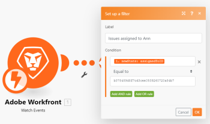

# [!DNL Adobe Workfront] moduli

È possibile utilizzare [!DNL Adobe Workfront Fusion] [!DNL Adobe Workfront] per automatizzare i processi all&#39;interno di [!DNL Workfront]. Se hai [!UICONTROL [!DNL Workfront Fusion] per automazione e integrazione del lavoro] è inoltre possibile utilizzarla per connettersi ad app e servizi di terze parti.

La [!DNL Workfront] connettore non viene conteggiato rispetto al numero di app attive disponibili per la tua organizzazione. Tutti gli scenari, anche se utilizzano solo [!DNL Workfront] app, conteggia rispetto al conteggio totale degli scenari dell&#39;organizzazione.

Per ulteriori informazioni sulle app e sugli scenari disponibili per la tua organizzazione, vedi [Organizzazioni](../../workfront-fusion/organizations/organizations-and-teams.md#organiza2) in [[!DNL Adobe Workfront Fusion] organizzazioni e team](../../workfront-fusion/organizations/organizations-and-teams.md).

Se hai bisogno di istruzioni su come creare uno scenario, vedi [Crea uno scenario in [!DNL Adobe Workfront Fusion]](../../workfront-fusion/scenarios/create-a-scenario.md). Per informazioni sui moduli, consulta [Moduli in [!DNL Adobe Workfront Fusion]](../../workfront-fusion/modules/modules.md).

## Requisiti di accesso

Per utilizzare le funzionalità di questo articolo, è necessario disporre dei seguenti diritti di accesso:

<table style="table-layout:auto">
 <col> 
 <col> 
 <tbody> 
  <tr> 
   <td role="rowheader">[!DNL Adobe Workfront] piano*</td>
  <td> 
[!UICONTROL Pro] o superiore
 </td>
  </tr> 
  <tr data-mc-conditions=""> 
   <td role="rowheader">[!DNL Adobe Workfront] licenza*</td>
   <td> 
[!UICONTROL Plan], [!UICONTROL Work]
 </td> 
  </tr> 
  <tr> 
   <td role="rowheader">[!DNL Adobe Workfront Fusion] licenza**</td> 
   <td> 
[!UICONTROL [!DNL Workfront Fusion] per automazione e integrazione del lavoro] 
  
[!UICONTROL [!DNL Workfront Fusion] per automazione del lavoro
</td> 
  </tr> 
  <tr> 
   <td role="rowheader">Prodotto</td> 
   <td>La tua organizzazione deve acquistare [!DNL Adobe Workfront Fusion] nonché [!DNL Adobe Workfront] per utilizzare le funzionalità descritte in questo articolo.</td> 
  </tr> 
 </tbody> 
</table>

Per sapere quale piano, tipo di licenza o accesso hai, contatta il tuo [!DNL Workfront] amministratore.

Per informazioni su [!DNL Adobe Workfront Fusion] licenze, vedi [[!DNL Adobe Workfront Fusion] licenze](../../workfront-fusion/get-started/license-automation-vs-integration.md).

## Connetti [!DNL Workfront] a [!DNL Workfront Fusion]

La [!DNL Workfront] Il connettore utilizza OAuth 2.0 per connettersi a [!DNL Workfront].

Puoi creare una connessione al tuo [!DNL Workfront] account direttamente dall&#39;interno di un [!DNL Workfront Fusion] modulo .

1. In qualsiasi [!DNL Workfront] modulo app, fai clic su **[!UICONTROL Aggiungi]** accanto al [!UICONTROL Connessione] scatola.
1. Immetti il nome dell&#39;istanza nell&#39;URL. Esempio: `https://<your instance>.my.workfront.com`.
1. Fai clic su **[!UICONTROL Successivo]**.
1. Fai clic su **[!UICONTROL Accesso SAML]** per creare la connessione e tornare al modulo .

   Oppure

   Inserisci il nome utente e la password, quindi fai clic su **[!UICONTROL Accedere]** per creare la connessione e tornare al modulo .

   >[!NOTE]
   >
   >* Se non trovi un pulsante di accesso SAML, la tua organizzazione non ha abilitato Single Sign-On (SSO). Puoi accedere con il tuo nome utente e password.
      >   
      >   Per ulteriori informazioni sull&#39;SSO, vedi [Panoramica dell’accesso single sign-on [!DNL Adobe Workfront]](../../administration-and-setup/add-users/single-sign-on/sso-in-workfront.md)
   >   
   >* Connessioni OAuth 2.0 al [!DNL Workfront] L’API non si basa più sulle chiavi API.

## [!DNL Workfront] moduli e relativi campi

Quando si configura [!DNL Workfront] moduli, [!DNL Workfront Fusion] visualizza i campi elencati di seguito. Oltre a questi, ulteriori [!DNL Workfront] potrebbero essere visualizzati, a seconda di fattori quali il livello di accesso nell’app o nel servizio. Un titolo in grassetto in un modulo indica un campo obbligatorio.

Se trovi il pulsante mappa sopra un campo o una funzione, puoi utilizzarlo per impostare variabili e funzioni per quel campo. Per ulteriori informazioni, consulta [Mappare informazioni da un modulo a un altro in [!DNL Adobe Workfront Fusion]](../../workfront-fusion/mapping/map-information-between-modules.md).

* [Triggers](#triggers)
* [Azioni](#actions)
* [Ricerche](#searches)

### Triggers

<!--
* [Watch Events](#watch-events) 
* [Watch Record](#watch-record) 
* [Watch Field](#watch-field)
-->

+++ **[!UICONTROL Eventi di controllo]**

Questo modulo trigger esegue uno scenario in tempo reale quando in Workfront vengono aggiunti, aggiornati o eliminati oggetti di un tipo specifico

Il modulo restituisce tutti i campi standard associati al record, insieme a eventuali campi e valori personalizzati a cui accede la connessione. Puoi mappare queste informazioni nei moduli successivi nello scenario .

1. Fai clic su **[!UICONTROL Aggiungi]** a destra del **Webhook** scatola.

1. Configura il webhook nel **[!UICONTROL Aggiungi un gancio]** che viene visualizzata.

   Quando si configura questo modulo, vengono visualizzati i campi seguenti.

   <table style="table-layout:auto"> 
    <col> 
    <col> 
    <tbody> 
     <tr> 
      <td>[!UICONTROL Webhook name]</td> 
      <td>(Facoltativo) Digitare un nuovo nome per il webhook</td> 
     </tr> 
     <tr> 
      <td>[!UICONTROL Connection]</td> 
      <td> 
Per istruzioni su come collegare le [!DNL Workfront] app a [!DNL Workfront Fusion], vedi <a href="#connect-workfront-to-workfront-fusion" class="MCXref xref">Connetti [!DNL Workfront] a [!DNL Workfront Fusion]</a> in questo articolo.
 </td> 
     </tr> 
     <tr> 
      <td>[!UICONTROL Tipo di record]</td> 
      <td>Seleziona il tipo di [!DNL Workfront] registrare che si desidera che il modulo visualizzi.</td> 
     </tr> 
     <tr> 
      <td>[!UICONTROL State]</td> 
      <td>Seleziona se visualizzare il vecchio stato o il nuovo stato.<ul><li>
<b>[!UICONTROL Nuovo stato]</b>

Attiva uno scenario in cui il record cambia <b>a</b> un valore specificato.

Ad esempio, se lo stato è impostato su [!UICONTROL New State] e il filtro è impostato su [!UICONTROL Status] [!UICONTROL Equals] [!UICONTROL In Progress], il webhook attiva uno scenario in cui lo [!UICONTROL Status] diventa [!UICONTROL In Progress], indipendentemente dallo stato precedente. 
</li><li>
<b>[!UICONTROL Stato precedente]</b>

Attiva uno scenario in cui il record cambia <b>da</b> un valore specificato.

Ad esempio, se lo stato è impostato su [!UICONTROL Old State] e il filtro è impostato su [!UICONTROL Status] [!UICONTROL Equals] [!UICONTROL In Progress], il webhook attiva uno scenario in cui uno [!UICONTROL Status] che è attualmente [!UICONTROL In Progress] diventa un altro stato. 
</li></ul></td> 
     </tr> 
     <tr data-mc-conditions=""> 
      <td> 
[!UICONTROL Filtri eventi]
 </td> 
      <td> 
Puoi impostare i filtri in modo che vengano cercati solo i record che soddisfano i criteri selezionati.
 
Per ogni filtro, immetti il campo da valutare dal filtro, l’operatore e il valore che desideri che il filtro consenta. È possibile utilizzare più di un filtro aggiungendo regole AND.
 
Nota: Non è possibile modificare i filtri esistenti [!DNL Workfront] i webhook. Per impostare filtri diversi per [!DNL Workfront] sottoscrizioni di eventi, rimuovere il webhook corrente e crearne uno nuovo.
 
Per ulteriori informazioni sui filtri evento, vedi <a href="#event-subscription-filters-in-the-workfront-watch-events-modules" class="MCXref xref">Filtri di abbonamento agli eventi nel [!DNL Workfront] &gt; Moduli [!UICONTROL Watch Events]</a> in questo articolo.
 </td> 
     </tr> 
     <tr data-mc-conditions=""> 
      <td>Escludere gli eventi creati da questa connessione</td> 
      <td>Abilita questa opzione per escludere gli eventi creati o aggiornati utilizzando lo stesso connettore utilizzato da questo modulo di attivazione. Ciò può impedire situazioni in cui uno scenario potrebbe attivarsi da solo, causando la sua ripetizione in un ciclo infinito.</td> 
     </tr> 
     <tr> 
      <td>[!UICONTROL Origine record]</td> 
      <td> 
Scegliere se si desidera che lo scenario venga visualizzato <strong>[!UICONTROL Solo Nuovi Record]</strong>, <strong>[!UICONTROL Solo Record Aggiornati]</strong>, <strong>[!UICONTROL Record nuovi e aggiornati]</strong>oppure <strong>[!DNL Deleted Records Only]</strong>.
 
Nota: Se scegli <strong>[!UICONTROL Record nuovi e aggiornati]</strong>, la creazione del webhook crea 2 sottoscrizioni di eventi (per lo stesso indirizzo webhook).
 </td> 
     </tr> 
    </tbody> 
   </table>

Dopo la creazione del webhook, puoi visualizzare l’indirizzo dell’endpoint a cui vengono inviati gli eventi.

Per ulteriori informazioni, consulta la sezione . [Esempi di payload di eventi](../../wf-api/general/event-subs-api.md#examples-of-event-payloads) in [!DNL Workfront] Articolo dell’Aiuto [API iscrizione agli eventi](../../wf-api/general/event-subs-api.md).

Vedi un elenco [!DNL Workfront] tipi di oggetti per i quali è possibile utilizzare questo modulo in [[!DNL Workfront] object types available for each [!DNL Workfront] modulo](#workfront-object-types-available-for-each-workfront-module).

+++

+++ **[!UICONTROL Campo di osservazione]**

Questo modulo trigger esegue uno scenario quando un campo specificato viene aggiornato. Il modulo restituisce sia il vecchio che il nuovo valore del campo specificato. Puoi mappare queste informazioni nei moduli successivi nello scenario .

Quando si configura questo modulo, vengono visualizzati i campi seguenti.

<table style="table-layout:auto">
 <col> 
 <col> 
 <tbody> 
  <tr> 
   <td>[!UICONTROL Connection]</td> 
   <td> 
Per istruzioni su come collegare le [!DNL Workfront] app a [!DNL Workfront Fusion], vedi <a href="#connect-workfront-to-workfront-fusion" class="MCXref xref">Connetti [!DNL Workfront] a [!DNL Workfront Fusion]</a> in questo articolo.
 </td> 
  </tr> 
  <tr> 
   <td>[!UICONTROL Tipo di record]</td> 
   <td> 
Seleziona il tipo di [!DNL Workfront] registrare che si desidera che il modulo visualizzi.
 
Ad esempio, selezionare [!UICONTROL Task] se si desidera iniziare a eseguire lo scenario ogni volta che un campo record viene aggiornato in un'attività.
 </td> 
  </tr> 
  <tr> 
   <td>[!UICONTROL Field]</td> 
   <td>Seleziona il campo che desideri che il modulo verifichi gli aggiornamenti. Questi campi riflettono i campi [!DNL Workfront] l'amministratore ha configurato il tracciamento.</td> 
  </tr> 
  <tr> 
   <td>[!UICONTROL Uscite]</td> 
   <td>Selezionare le informazioni che si desidera includere nel pacchetto di output per questo modulo.</td> 
  </tr> 
  <tr> 
   <td>[!UICONTROL Limit]</td> 
   <td> 
Immettere o mappare il numero massimo di record che si desidera restituire dal modulo durante ogni ciclo di esecuzione degli scenari.
 </td> 
  </tr> 
 </tbody> 
</table>

Vedi un elenco [!DNL Workfront] tipi di oggetti per i quali è possibile utilizzare questo modulo in [[!DNL Workfront] object types available for each [!DNL Workfront] modulo](#workfront-object-types-available-for-each-workfront-module).

+++

+++ **[!UICONTROL Registra]**

Questo modulo trigger esegue uno scenario in cui vengono aggiunti, aggiornati o entrambi oggetti di un tipo specifico. Il modulo restituisce tutti i campi standard associati al record o ai record, insieme a tutti i campi e i valori personalizzati a cui accede la connessione. Puoi mappare queste informazioni nei moduli successivi nello scenario . Nell&#39;output, il modulo indica se ogni record è nuovo o aggiornato.

I record aggiunti e aggiornati nel periodo di tempo specificato vengono restituiti come nuovi record.

Quando si configura questo modulo, vengono visualizzati i campi seguenti.

<table style="table-layout:auto"> 
 <col> 
 <col> 
 <tbody> 
  <tr> 
   <td role="rowheader">[!UICONTROL Connection]</td> 
   <td> 
Per istruzioni su come collegare le [!DNL Workfront] app a [!DNL Workfront Fusion], vedi <a href="#connect-workfront-to-workfront-fusion" class="MCXref xref">Connetti [!DNL Workfront] a [!DNL Workfront Fusion]</a> in questo articolo.
 </td> 
  </tr> 
  <tr> 
   <td role="rowheader">[!UICONTROL Filter]</td> 
   <td> 
Scegliere se si desidera che lo scenario venga visualizzato <strong>[!UICONTROL Solo Nuovi Record]</strong>, <strong>[!UICONTROL Solo Record Aggiornati]</strong>oppure <strong>[!UICONTROL Record nuovi e aggiornati]</strong>.
 </td> 
  </tr> 
  <tr> 
   <td role="rowheader">[!UICONTROL Tipo di record]</td> 
   <td> 
(Visualizza dopo aver scelto un <strong>Filtro</strong>.) Seleziona il tipo di [!DNL Workfront] registrare che si desidera che il modulo visualizzi.
 
Ad esempio, se desideri avviare lo scenario ogni volta che viene creato un nuovo progetto, seleziona [!UICONTROL Project]
 </td> 
  </tr> 
  <tr> 
   <td role="rowheader">[!UICONTROL Uscite]</td> 
   <td> 
Selezionare le informazioni che si desidera includere nel pacchetto di output per questo modulo.
 </td> 
  </tr> 
  <tr> 
   <td role="rowheader">[!UICONTROL Filtro opzionale]</td> 
   <td> 
(Avanzata) digita una stringa di codice API per definire eventuali parametri o codici aggiuntivi che definiranno i criteri. 
 </td> 
  </tr> 
  <tr> 
   <td role="rowheader">[!UICONTROL Limit]</td> 
   <td> 
Immettere o mappare il numero massimo di record che si desidera restituire dal modulo durante ogni ciclo di esecuzione degli scenari.
 </td> 
  </tr> 
 </tbody> 
</table>

Vedi un elenco [!DNL Workfront] tipi di oggetti per i quali è possibile utilizzare questo modulo in [[!DNL Workfront] object types available for each [!DNL Workfront] modulo](#workfront-object-types-available-for-each-workfront-module).

+++

### Azioni

<!--
* [Convert object](#convert-object) 
* [Create a record (attaching custom forms)](#create-a-record-attaching-custom-forms) 
* [Create a record](#create-a-record) 
* [Custom API Call](#custom-api-call) 
* [Delete Record](#delete-record) 
* [Download Document](#download-document) 
* [Misc Action](#misc-action) 
* [Read a Record](#read-a-record) 
* [Update Record](#update-record) 
* [Upload Document](#upload-document)
-->

+++ **[!UICONTROL Converti oggetto]**

Questo modulo di azione effettua una delle seguenti conversioni:

* Converti problema in progetto
* Converti problema in attività
* Converti attività in progetto

<table style="table-layout:auto"> 
 <col> 
 <col> 
 <tbody> 
  <tr> 
   <td>[!UICONTROL Connection]</td> 
   <td> 
Per istruzioni su come collegare le [!DNL Workfront] app a [!DNL Workfront Fusion], vedi <a href="#connect-workfront-to-workfront-fusion" class="MCXref xref">Connetti [!DNL Workfront] a [!DNL Workfront Fusion]</a> in questo articolo.
 </td> 
  </tr> 
  <tr data-mc-conditions=""> 
   <td>[!UICONTROL Tipo di oggetto]</td> 
   <td> 
Selezionare il tipo di oggetto da convertire. Questo è il tipo di oggetto prima della conversione.
 </td> 
  </tr> 
  <tr data-mc-conditions=""> 
   <td>[!UICONTROL Converti in]</td> 
   <td>Selezionare l’oggetto in cui si desidera convertirlo. Questo è il tipo di oggetto dopo la conversione.</td> 
  </tr> 
  <tr> 
   <td>[!UICONTROL &lt;object&gt; ID]</td> 
   <td> 
Immettere l'ID dell'oggetto. 
 
Nota: Quando si immette l’ID di un oggetto, è possibile iniziare a digitare il nome dell’oggetto, quindi selezionarlo dall’elenco. Il modulo immette quindi l’ID appropriato nel campo .
 </td> 
  </tr> 
  <tr data-mc-conditions=""> 
   <td>ID modello [!UICONTROL]</td> 
   <td> 
Se effettui la conversione in un progetto, seleziona l’ID modello da utilizzare per il progetto.
 
Nota: Quando si immette l’ID di un oggetto, è possibile iniziare a digitare il nome dell’oggetto, quindi selezionarlo dall’elenco. Il modulo immette quindi l’ID appropriato nel campo .
 </td> 
  </tr> 
  <tr data-mc-conditions=""> 
   <td>[!UICONTROL Moduli personalizzati]</td> 
   <td>Selezionare i moduli personalizzati da aggiungere all’oggetto appena convertito, quindi immettere i valori dei campi del modulo personalizzato.</td> 
  </tr> 
  <tr data-mc-conditions=""> 
   <td>[!UICONTROL Opzioni]</td> 
   <td> 
Abilitare tutte le opzioni desiderate per la conversione dell’oggetto. Le opzioni sono disponibili a seconda dell’oggetto da cui si sta convertendo in o da.
 </td> 
  </tr> 
 </tbody> 
</table>

+++

+++ **[!UICONTROL Creare un record (allegando moduli personalizzati)]**

Questo modulo di azione crea un oggetto, ad esempio un progetto, un&#39;attività o un problema in [!DNL Workfront]e consente di aggiungere un modulo personalizzato al nuovo oggetto. Il modulo ti consente di selezionare i campi dell’oggetto disponibili nel modulo.

Specifica l&#39;ID del record.

Il modulo restituisce l’ID del record e di tutti i campi associati, insieme a eventuali campi e valori personalizzati a cui accede la connessione. Puoi mappare queste informazioni nei moduli successivi nello scenario .

È possibile utilizzare questo modulo, ad esempio, per creare un&#39;attività in [!DNL Workfront] quando un client aggiunge una nuova riga in un [!DNL Google Sheets] elenco delle attività da eseguire.

Quando si configura questo modulo, vengono visualizzati i campi seguenti.

Assicurati di fornire il numero minimo di campi di input. Ad esempio, se desideri creare un problema, devi fornire un ID progetto padre valido nel campo ID progetto per indicare dove deve trovarsi il problema in Workfront. Puoi usare il pannello di mappatura per mappare queste informazioni da un altro modulo dello scenario, oppure puoi immetterle manualmente digitando il nome e selezionandolo dall’elenco.

<table style="table-layout:auto">
 <col> 
 </col> 
 <col> 
 </col> 
 <tbody> 
  <tr> 
   <td>[!UICONTROL Connection]</td> 
   <td> 
Per istruzioni su come collegare le [!DNL Workfront] app a [!DNL Workfront Fusion], vedi <a href="#connect-workfront-to-workfront-fusion" class="MCXref xref">Connetti [!DNL Workfront] a [!DNL Workfront Fusion]</a> in questo articolo.
 </td> 
  </tr> 
  <tr> 
   <td>[!UICONTROL Tipo di record]</td> 
   <td> 
Seleziona il tipo di [!DNL Workfront] registrare che si desidera creare il modulo.
 
Ad esempio, se desideri creare un progetto, seleziona [!UICONTROL Project] dall’elenco a discesa, quindi assicurati di avere accesso ai dati (dai moduli precedenti nello scenario) che verranno compilati dal progetto.
 </td> 
  </tr> 
  <tr data-mc-conditions=""> 
   <td>[!UICONTROL Seleziona campi da mappare]</td> 
   <td> 
Selezionare i campi disponibili per l’immissione dei dati. Ciò ti consente di utilizzare questi campi senza dover scorrere quelli di cui non hai bisogno.
 
Per i campi nei moduli personalizzati, utilizza la <b>[!UICONTROL Allega modulo personalizzato]</b> campo .
 </td> 
  </tr> 
  <tr data-mc-conditions=""> 
   <td>[!UICONTROL Allega modulo personalizzato]</td> 
   <td>Selezionare i moduli personalizzati che si desidera aggiungere al nuovo oggetto, quindi immettere i valori per tali campi.</td> 
  </tr> 
 </tbody> 
</table>

Vedi un elenco [!DNL Workfront] tipi di oggetti per i quali è possibile utilizzare questo modulo in [[!DNL Workfront] object types available for each [!DNL Workfront] modulo](#workfront-object-types-available-for-each-workfront-module).

>[!NOTE]
>
>* Quando si immette l’ID di un oggetto, è possibile iniziare a digitare il nome dell’oggetto, quindi selezionarlo dall’elenco. Il modulo immette quindi l’ID appropriato nel campo .
>* Quando si immette il testo di un campo personalizzato o di un [!UICONTROL Nota] (Commento o risposta), è possibile utilizzare i tag HTML nel [!UICONTROL Testo nota] per creare testo RTF, ad esempio testo in grassetto o corsivo.
>
>  Per ulteriori informazioni sugli aggiornamenti di testo RTF, consulta [Aggiungere un aggiornamento a un elemento di lavoro](../../workfront-basics/updating-work-items-and-viewing-updates/update-work.md#add) in [Aggiorna lavoro](../../workfront-basics/updating-work-items-and-viewing-updates/update-work.md).

+++

+++ **[!UICONTROL Crea record]**

Questo modulo di azione crea un oggetto, ad esempio un progetto, un&#39;attività o un problema in Workfront. Il modulo ti consente di selezionare i campi dell’oggetto disponibili nel modulo.

Specifica l&#39;ID del record.

Il modulo restituisce l’ID del record e di tutti i campi associati, insieme a eventuali campi e valori personalizzati a cui accede la connessione. Puoi mappare queste informazioni nei moduli successivi nello scenario .

È possibile utilizzare questo modulo, ad esempio, per creare un&#39;attività in [!DNL Workfront] quando un client aggiunge una nuova riga in un elenco di attività da eseguire in Google Sheets.

Quando si configura questo modulo, vengono visualizzati i campi seguenti.

Assicurati di fornire il numero minimo di campi di input. Ad esempio, se desideri creare un problema, devi fornire un ID progetto padre valido nel campo ID progetto per indicare dove deve trovarsi il problema in Workfront. Puoi usare il pannello di mappatura per mappare queste informazioni da un altro modulo dello scenario, oppure puoi immetterle manualmente digitando il nome e selezionandolo dall’elenco.

<table style="table-layout:auto">
 <col> 
 </col> 
 <col> 
 </col> 
 <tbody> 
  <tr> 
   <td>[!UICONTROL Connection]</td> 
   <td> 
Per istruzioni su come collegare le [!DNL Workfront] app a [!DNL Workfront Fusion], vedi <a href="#connect-workfront-to-workfront-fusion" class="MCXref xref">Connetti [!DNL Workfront] a [!DNL Workfront Fusion]</a> in questo articolo.
 </td> 
  </tr> 
  <tr> 
   <td>[!UICONTROL Tipo di record]</td> 
   <td> 
Seleziona il tipo di [!DNL Workfront] registrare che si desidera creare il modulo.
 
Ad esempio, se desideri creare un progetto, seleziona [!UICONTROL Project] dall’elenco a discesa, quindi assicurati di avere accesso ai dati (dai moduli precedenti nello scenario) che verranno compilati dal progetto.
 </td> 
  </tr> 
  <tr data-mc-conditions=""> 
   <td>[!UICONTROL Seleziona campi da mappare]</td> 
   <td>Selezionare i campi disponibili per l’immissione dei dati. Ciò ti consente di utilizzare questi campi senza dover scorrere quelli di cui non hai bisogno.</td> 
  </tr> 
 </tbody> 
</table>

Vedi un elenco [!DNL Workfront] tipi di oggetti per i quali è possibile utilizzare questo modulo in [[!DNL Workfront] object types available for each [!DNL Workfront] modulo](#workfront-object-types-available-for-each-workfront-module).

>[!NOTE]
>
>* Quando si immette l’ID di un oggetto, è possibile iniziare a digitare il nome dell’oggetto, quindi selezionarlo dall’elenco. Il modulo immette quindi l’ID appropriato nel campo .
>* Quando si immette il testo di un campo personalizzato o di un [!UICONTROL Nota] (Commento o risposta), è possibile utilizzare i tag HTML nel [!UICONTROL Testo nota] per creare testo RTF, ad esempio testo in grassetto o corsivo.
>
>  Per ulteriori informazioni sugli aggiornamenti di testo RTF, consulta [Aggiungere un aggiornamento a un elemento di lavoro](../../workfront-basics/updating-work-items-and-viewing-updates/update-work.md#add) in [Aggiorna lavoro](../../workfront-basics/updating-work-items-and-viewing-updates/update-work.md).

+++

+++ **[!UICONTROL Chiamata API personalizzata]**

Questo modulo di azione ti consente di effettuare una chiamata autenticata personalizzata al [!DNL Workfront] API. In questo modo, puoi creare un’automazione del flusso di dati che non può essere eseguita dall’altro [!DNL Workfront] moduli.

Il modulo restituisce le seguenti informazioni:

* **[!UICONTROL Codice di stato]** (numero): Indica il successo o il fallimento della richiesta HTTP. Questi sono codici standard che puoi cercare su Internet.
* **[!UICONTROL Intestazioni]** (oggetto): Un contesto più dettagliato per il codice di risposta/stato che non si riferisce al corpo dell&#39;output. Non tutte le intestazioni che compaiono in un&#39;intestazione di risposta sono intestazioni di risposta, quindi alcune potrebbero non essere utili per te.

   Le intestazioni di risposta dipendono dalla richiesta HTTP scelta durante la configurazione del modulo.

* **[!UICONTROL Corpo]** (oggetto): A seconda della richiesta HTTP scelta durante la configurazione del modulo, è possibile che vengano restituiti alcuni dati. Tali dati, come i dati di una richiesta GET, sono contenuti in questo oggetto.

Puoi mappare queste informazioni nei moduli successivi nello scenario .

Quando si configura questo modulo, vengono visualizzati i campi seguenti.

<table style="table-layout:auto"> 
 <col> 
 <col> 
 <tbody> 
  <tr> 
   <td role="rowheader">[!UICONTROL Connection]</td> 
   <td> 
Per istruzioni su come collegare le [!DNL Workfront] app a [!DNL Workfront Fusion], vedi <a href="#connect-workfront-to-workfront-fusion" class="MCXref xref">Connetti [!DNL Workfront] a [!DNL Workfront Fusion]</a> in questo articolo.
 </td> 
  </tr> 
  <tr> 
   <td role="rowheader">URL</td> 
   <td> 
Immettere un percorso relativo a<code> https://&lt;WORKFRONT_DOMAIN&gt;/attask/api/&lt;API_VERSION&gt;/</code>.
 </td> 
  </tr> 
  <tr> 
   <td role="rowheader">[!UICONTROL Versione API]</td> 
   <td>Seleziona la versione del [!DNL Workfront] API che desideri utilizzare nel modulo.</td> 
  </tr> 
  <tr> 
   <td role="rowheader">[!UICONTROL, Metodo]</td> 
   td&gt; 
Seleziona il metodo di richiesta HTTP necessario per configurare la chiamata API. Per ulteriori informazioni, consulta <a href="../../workfront-fusion/modules/http-request-methods.md" class="MCXref xref" data-mc-variable-override="">metodi di richiesta HTTP in [!DNL Adobe Workfront Fusion]</a>.
 </td> 
  </tr> 
  <tr> 
   <td role="rowheader">[!UICONTROL Headers]</td> 
   <td> 
Aggiungi le intestazioni della richiesta sotto forma di un oggetto JSON standard. Questo determina il tipo di contenuto della richiesta.
 
Ad esempio:<code> {"Content-type":"application/json"}</code>
 
Nota: Se ricevi errori ed è difficile determinarne l’origine, considera la possibilità di modificare le intestazioni in base al [!DNL Workfront] documentazione. Se la chiamata API personalizzata restituisce un errore di richiesta HTTP 422, prova a utilizzare un <code>"Content-Type":"text/plain"</code> intestazione.
 </td> 
  </tr> 
  <tr> 
   <td role="rowheader">[!UICONTROL Query String]</td> 
   <td> 
Aggiungi la query per la chiamata API sotto forma di un oggetto JSON standard.
 
Ad esempio: <code>{"name":"something-urgent"}</code>
 
Suggerimento: È consigliabile inviare informazioni tramite il corpo JSON anziché come parametri di query.
 </td> 
  </tr> 
  <tr> 
   <td role="rowheader">[!UICONTROL Body]</td> 
   <td> 
Aggiungi il contenuto del corpo per la chiamata API sotto forma di un oggetto JSON standard.
 
Nota:  
Quando si utilizzano istruzioni condizionali come <code>if</code> nel JSON, inserisci le virgolette al di fuori dell’istruzione condizionale.
 
     
Example: </b>"> 
      
  
 
     
 
 </td> 
  </tr> 
 </tbody> 
</table>

Vedi un elenco [!DNL Workfront] tipi di oggetti per i quali è possibile utilizzare questo modulo in [[!DNL Workfront] object types available for each [!DNL Workfront] modulo](#workfront-object-types-available-for-each-workfront-module).

+++

+++ **[!UICONTROL Elimina record]**

Questo modulo di azione elimina un oggetto, ad esempio un progetto, un&#39;attività o un problema in Workfront.

Specifica l&#39;ID del record.

Il modulo restituisce l’ID del record e di tutti i campi associati, insieme a eventuali campi e valori personalizzati a cui accede la connessione. Puoi mappare queste informazioni nei moduli successivi nello scenario .

Quando si configura questo modulo, vengono visualizzati i campi seguenti.

<table style="table-layout:auto">
 <col> 
 <col> 
 <tbody> 
  <tr> 
   <td>[!UICONTROL Connection]</td> 
   <td> 
Per istruzioni su come collegare le [!DNL Workfront] app a [!DNL Workfront Fusion], vedi <a href="#connect-workfront-to-workfront-fusion" class="MCXref xref">Connetti [!DNL Workfront] a [!DNL Workfront Fusion]</a> in questo articolo.
 </td> 
  </tr> 
  <tr> 
   <td>[!UICONTROL Forza eliminazione]</td> 
   <td>Abilita questa opzione per assicurarti che il record venga eliminato, anche se la [!DNL Workfront] L’interfaccia utente richiede la conferma dell’eliminazione.</td> 
  </tr> 
  <tr data-mc-conditions=""> 
   <td>ID</td> 
   <td> 
Inserisci l'univoco [!DNL Workfront] ID del record che si desidera eliminare dal modulo.
 
Per ottenere l'ID, apri la [!DNL Workfront] nel browser e copia il testo alla fine dell'URL dopo "ID=." Ad esempio: https://my.workfront.com/project/view?ID=<i>5e43010c03286a2a555e1d0a75d6a86e</i>
 </td> 
  </tr> 
  <tr> 
   <td>[!UICONTROL Tipo di record]</td> 
   <td>Seleziona il tipo di [!DNL Workfront] registrare che si desidera eliminare il modulo.</td> 
  </tr> 
 </tbody> 
</table>

Vedi un elenco [!DNL Workfront] tipi di oggetti per i quali è possibile utilizzare questo modulo in [[!DNL Workfront] object types available for each [!DNL Workfront] modulo](#workfront-object-types-available-for-each-workfront-module).

+++

+++ **[!UICONTROL Scarica Documento]**

Questo modulo di azione scarica un documento da Workfront.

Specifica l&#39;ID del record.

Il modulo restituisce il contenuto, il nome del file, l&#39;estensione del file e le dimensioni del file del documento. Puoi mappare queste informazioni nei moduli successivi nello scenario .

Quando si configura questo modulo, vengono visualizzati i campi seguenti.

<table style="table-layout:auto">
 <col> 
 <col> 
 <tbody> 
  <tr> 
   <td>[!UICONTROL Connection]</td> 
   <td> 
Per istruzioni su come collegare le [!DNL Workfront] app a [!DNL Workfront Fusion], vedi <a href="#connect-workfront-to-workfront-fusion" class="MCXref xref">Connetti [!DNL Workfront] a [!DNL Workfront Fusion]</a> in questo articolo.
 </td> 
  </tr> 
  <tr> 
   <td>[!UICONTROL Document ID]</td> 
   <td> 
Mappa o immetti manualmente l'univoco [!DNL Workfront] ID del documento da scaricare nel modulo.
 
Per ottenere l'ID, apri la [!DNL Workfront] nel browser e copia il testo alla fine dell'URL dopo "ID=." Ad esempio: https://my.workfront.com/project/view?ID=<i>5e43010c03286a2a555e1d0a75d6a86e</i>
 </td> 
  </tr> 
 </tbody> 
</table>

Vedi un elenco [!DNL Workfront] tipi di oggetti per i quali è possibile utilizzare questo modulo in [[!DNL Workfront] object types available for each [!DNL Workfront] modulo](#workfront-object-types-available-for-each-workfront-module).

+++

+++ **[!UICONTROL Azioni varie]**

Questo modulo di azione ti consente di eseguire azioni rispetto all’API.

Quando si configura questo modulo, vengono visualizzati i campi seguenti.

<table style="table-layout:auto"> 
 <col> 
 <col> 
 <tbody> 
  <tr> 
   <td>[!UICONTROL Connection]</td> 
   <td> 
Per istruzioni su come collegare le [!DNL Workfront] app a [!DNL Workfront Fusion], vedi <a href="#connect-workfront-to-workfront-fusion" class="MCXref xref">Connetti [!DNL Workfront] a [!DNL Workfront Fusion]</a> in questo articolo.
 </td> 
  </tr> 
  <tr data-mc-conditions=""> 
   <td>[!UICONTROL Tipo di record]</td> 
   <td> 
Seleziona il tipo di [!DNL Workfront] registrare con cui si desidera interagire il modulo.
 </td> 
  </tr> 
  <tr data-mc-conditions=""> 
   <td>[!UICONTROL Action]</td> 
   <td> 
Selezionare l'azione che si desidera eseguire nel modulo.
 
Potrebbe essere necessario compilare campi aggiuntivi, a seconda del [!UICONTROL Record Type] e dell’azione [!UICONTROL Action] scelta. Alcune combinazioni di queste due impostazioni possono richiedere solo un ID record, mentre altre (come Progetto per <strong>[!UICONTROL Tipo di record]</strong> e [!UICONTROL Allega modello] per <strong>[!UICONTROL Action]</strong>) richiede informazioni aggiuntive (ad esempio un ID oggetto e un ID modello).
 
Per informazioni dettagliate sui singoli campi, consulta la sezione <a href="http://developer.workfront.com/">Documentazione per gli sviluppatori di Workfront</a>. 
 
    <ol> 
     <li value="1"> 
Selezionare il tipo di record dal menu di navigazione a sinistra nella [!DNL Workfront] pagina della documentazione per gli sviluppatori. I tipi seguenti hanno le proprie pagine:
 
      <ul> 
       <li> 
[!UICONTROL Projects]
 </li> 
       <li> 
[!UICONTROL Tasks]
 </li> 
       <li> 
[!UICONTROL Issues]
 </li> 
       <li> 
[!UICONTROL Users]
 </li> 
       <li> 
[!UICONTROL Documents]
 </li> 
      </ul> 
Per tutti gli altri tipi di record, selezionare <b>[!UICONTROL Altri oggetti e endpoint]</b>, quindi individuare il tipo di record nelle pagine ordinate in ordine alfabetico.
 </li> 
     <li value="2"> 
Nella pagina del tipo di record appropriato, cerca l’azione (Ctrl+F o Comando+F).
 </li> 
     <li value="3"> 
Visualizza le descrizioni dei campi disponibili nell’azione selezionata.
 </li> 
    </ol> 
Nota:  
Durante la creazione di una bozza tramite [!DNL Workfront] Modulo [!UICONTROL Misc Action] , si consiglia di creare una bozza senza opzioni avanzate, quindi di aggiornare la bozza utilizzando [!DNL Workfront Proof] API SOAP.
 
Per ulteriori informazioni sulla creazione di una bozza con il [!DNL Workfront] API (che questo modulo utilizza), consulta <a href="../../wf-api/tips-tricks-and-troubleshooting/api-create-proof-options-json.md" class="MCXref xref">Aggiungi opzioni di correzione avanzate durante la creazione di una bozza tramite [!DNL Adobe Workfront] API</a>
 
 </td> 
  </tr> 
  <tr data-mc-conditions=""> 
   <td>[!UICONTROL ID]</td> 
   <td>Immetti o mappa l'univoco [!DNL Workfront] ID del record con cui desideri che interagisca il modulo.
Per ottenere l'ID, apri la [!DNL Workfront] nel browser e copia il testo alla fine dell'URL dopo "ID=." Ad esempio: https://my.workfront.com/project/view?ID=<i>5e43010c03286a2a555e1d0a75d6a86e</i>
</td> 
  </tr> 
 </tbody> 
</table>

Vedi un elenco [!DNL Workfront] tipi di oggetti per i quali è possibile utilizzare questo modulo in [[!DNL Workfront] object types available for each [!DNL Workfront] modulo](#workfront-object-types-available-for-each-workfront-module).

+++

+++ **[!UICONTROL Leggi un record]**

Questo modulo di azione recupera i dati da un singolo record.

Specifica l&#39;ID del record. È inoltre possibile specificare quali record correlati si desidera leggere nel modulo.

Ad esempio, se il record che il modulo sta leggendo è un progetto, è possibile specificare di leggere le attività del progetto.

Il modulo restituisce una matrice di dati dai campi standard per l&#39;output specificato.

Quando si configura questo modulo, vengono visualizzati i campi seguenti.

<table style="table-layout:auto">
 <col> 
 <col> 
 <tbody> 
  <tr> 
    <td>[!UICONTROL Connection]</td>

<td> 
Per istruzioni su come collegare le [!DNL Workfront] app a [!DNL Workfront Fusion], vedi <a href="#connect-workfront-to-workfront-fusion" class="MCXref xref">Connetti [!DNL Workfront] a [!DNL Workfront Fusion]</a> in questo articolo.
 </td> 
  </tr> 
  <tr> 
    <td>[!UICONTROL Tipo di record]</td>

<td>Scegli la [!DNL Workfront] tipo di oggetto che si desidera leggere nel modulo.</td> 
  </tr> 
  <tr> 
    <td>[!UICONTROL Uscite]</td>

<td> 
Selezionare le informazioni che si desidera includere nel pacchetto di output per questo modulo.
 </td> 
  </tr> 
  <tr> 
    <td>Riferimenti</td>
   <td>Selezionare i campi di riferimento che si desidera includere nell'output.</td> 
  </tr> 
  <tr> 
    <td>[!UICONTROL Raccolte]</td>
   <td>Selezionare i campi di riferimento che si desidera includere nell'output.</td> 
  </tr> 
  <tr> 
    <td>[!UICONTROL ID]</td>
   <td> 
Inserisci l'univoco [!DNL Workfront] ID del record che si desidera leggere nel modulo.
 
Per ottenere l'ID, apri la [!DNL Workfront] nel browser e copia il testo alla fine dell'URL dopo "ID=." Ad esempio: https://my.workfront.com/project/view?ID=<i>5e43010c03286a2a555e1d0a75d6a86e</i>
 </td> 
  </tr> 
 </tbody> 
</table>

Vedi un elenco [!DNL Workfront] tipi di oggetti per i quali è possibile utilizzare questo modulo in [[!DNL Workfront] object types available for each [!DNL Workfront] modulo](#workfront-object-types-available-for-each-workfront-module).

+++

+++ **[!UICONTROL Aggiorna record]**

Questo modulo di azione aggiorna un oggetto, ad esempio un progetto, un&#39;attività o un problema. Il modulo ti consente di selezionare i campi dell’oggetto disponibili nel modulo.

Specifica l&#39;ID del record.

Il modulo restituisce l’ID dell’oggetto e di tutti i campi associati, nonché tutti i campi e i valori personalizzati a cui accede la connessione. Puoi mappare queste informazioni nei moduli successivi nello scenario .

Quando si configura questo modulo, vengono visualizzati i campi seguenti.

<table style="table-layout:auto">
 <col> 
 </col> 
 <col> 
 </col> 
 <tbody> 
  <tr> 
   <td>[!UICONTROL Connection]</td> 
   <td> 
Per istruzioni su come collegare le [!DNL Workfront] app a [!DNL Workfront Fusion], vedi <a href="#connect-workfront-to-workfront-fusion" class="MCXref xref">Connetti [!DNL Workfront] a [!DNL Workfront Fusion]</a> in questo articolo.
 </td> 
  </tr> 
  <tr data-mc-conditions=""> 
   <td>[!UICONTROL ID]</td> 
   <td> 
Inserisci l'univoco [!DNL Workfront] ID del record che si desidera aggiornare nel modulo.
 
Per ottenere l'ID, apri la [!DNL Workfront] nel browser e copia il testo alla fine dell'URL dopo "ID=." Ad esempio: https://my.workfront.com/project/view?ID=<i>5e43010c03286a2a555e1d0a75d6a86e</i>
 </td> 
  </tr> 
  <tr> 
   <td>[!DNL Record Type]</td> 
   <td> 
Seleziona il tipo di [!DNL Workfront] registrare che si desidera aggiornare il modulo.
 </td> 
  </tr> 
  <tr data-mc-conditions=""> 
   <td>[!DNL Select fields to map]</td> 
   <td>Selezionare i campi disponibili per l’immissione dei dati. Ciò ti consente di utilizzare questi campi senza dover scorrere quelli di cui non hai bisogno.</td> 
  </tr> 
 </tbody> 
</table>

Vedi un elenco [!DNL Workfront] tipi di oggetti per i quali è possibile utilizzare questo modulo in [[!DNL Workfront] object types available for each [!DNL Workfront] modulo](#workfront-object-types-available-for-each-workfront-module).

>[!NOTE]
>
>* Quando si immette l’ID di un oggetto, è possibile iniziare a digitare il nome dell’oggetto, quindi selezionarlo dall’elenco. Il modulo immette quindi l’ID appropriato nel campo .
>* Quando si immette il testo di un campo personalizzato o di un [!UICONTROL Nota] (Commento o risposta), è possibile utilizzare i tag HTML nel [!UICONTROL Testo nota] per creare testo RTF, ad esempio testo in grassetto o corsivo.
>
>  Per ulteriori informazioni sugli aggiornamenti di testo RTF, consulta [Aggiungere un aggiornamento a un elemento di lavoro](../../workfront-basics/updating-work-items-and-viewing-updates/update-work.md#add) in [Aggiorna lavoro](../../workfront-basics/updating-work-items-and-viewing-updates/update-work.md).

+++

+++ **[!UICONTROL Carica documento]**

Questo modulo di azione carica un documento in un [!DNL Workfront] oggetto, ad esempio un progetto, un&#39;attività o un problema.

Specificare il percorso del documento, il file da caricare e un nuovo nome facoltativo per il file.

Il modulo restituisce l’ID del documento e di tutti i campi associati, nonché tutti i campi e i valori personalizzati a cui accede la connessione. Puoi mappare queste informazioni nei moduli successivi nello scenario .

Quando si configura questo modulo, vengono visualizzati i campi seguenti.

<table style="table-layout:auto"> 
 <col> 
 <col> 
 <tbody> 
  <tr> 
   <td>[!UICONTROL Connection]</td> 
   <td> 
Per istruzioni su come collegare le [!DNL Workfront] app a [!DNL Workfront Fusion], vedi <a href="#connect-workfront-to-workfront-fusion" class="MCXref xref">Connetti [!DNL Workfront] a [!DNL Workfront Fusion]</a> in questo articolo.
 </td> 
  </tr> 
  <tr data-mc-conditions=""> 
   <td>[!UICONTROL ID record correlato]</td> 
   <td>Inserisci l'univoco [!DNL Workfront] ID del record in cui si desidera caricare il documento.</td> 
  </tr> 
  <tr> 
   <td>[!UICONTROL Tipo di record correlato]</td> 
   <td>Seleziona il tipo di [!DNL Workfront] registrare il punto in cui si desidera che il modulo carichi il documento.</td> 
  </tr> 
  <tr> 
   <td>[!UICONTROL File di origine]</td> 
   <td> 
Selezionare un file di origine da un modulo precedente o mappare il nome e i dati del file di origine.
 </td> 
  </tr> 
 </tbody> 
</table>

Vedi un elenco [!DNL Workfront] tipi di oggetti per i quali è possibile utilizzare questo modulo in [[!DNL Workfront] object types available for each [!DNL Workfront] modulo](#workfront-object-types-available-for-each-workfront-module).

+++

### Ricerche

<!--
* [Read Related Records](#read-related-records) 
* [Search](#search)
-->

+++ **[!UICONTROL Leggi record correlati]**

Questo modulo di ricerca legge i record che corrispondono alla query di ricerca specificata, in un particolare oggetto principale.

Specificare i campi da includere nell&#39;output. Puoi mappare queste informazioni nei moduli successivi nello scenario .

Quando si configura questo modulo, vengono visualizzati i campi seguenti.

<table style="table-layout:auto">
 <col> 
 <col> 
 <tbody> 
  <tr> 
   <td>[!UICONTROL Connection]</td> 
   <td> 
Per istruzioni su come collegare le [!DNL Workfront] app a [!DNL Workfront Fusion], vedi <a href="#connect-workfront-to-workfront-fusion" class="MCXref xref">Connetti [!DNL Workfront] a [!DNL Workfront Fusion]</a> in questo articolo.
 </td> 
  </tr> 
  <tr data-mc-conditions=""> 
   <td>[!UICONTROL Tipo di record]</td> 
   <td> 
Selezionare il tipo di record padre (oggetto Workfront) di cui si desidera leggere i record associati.
 
Vedi un elenco [!DNL Workfront] tipi di oggetti per i quali è possibile utilizzare questo modulo in <a href="#object-types-available-for-each-workfront-search-module" class="MCXref xref">[!DNL Workfront] tipi di oggetti disponibili per ogni [!DNL Workfront] modulo</a> in questo articolo.
 </td> 
  </tr> 
  <tr data-mc-conditions=""> 
   <td>[!UICONTROL ID record padre]</td> 
   <td> 
Immettere o mappare l'ID del record padre di cui si desidera leggere i record associati.
 
Per ottenere l'ID, apri la [!DNL Workfront] nel browser e copia il testo alla fine dell'URL dopo "ID=." Ad esempio: https://my.workfront.com/project/view?ID=<i>5e43010c03286a2a555e1d0a75d6a86e</i>
 </td> 
  </tr> 
  <tr data-mc-conditions=""> 
   <td>[!UICONTROL Raccolte]</td> 
   <td>Selezionare o mappare il tipo di record figlio che si desidera leggere nel modulo.</td> 
  </tr> 
  <tr> 
   <td>[!UICONTROL Uscite]</td> 
   <td> 
Selezionare le informazioni che si desidera includere nel pacchetto di output per questo modulo.
 </td> 
  </tr> 
 </tbody> 
</table>

+++

+++ **[!UICONTROL Ricerca]**

Questo modulo di ricerca cerca i record in un oggetto in [!DNL Workfront] che corrispondono alla query di ricerca specificata.

Puoi mappare queste informazioni nei moduli successivi nello scenario .

Quando si configura questo modulo, vengono visualizzati i campi seguenti.

<table style="table-layout:auto">
 <col> 
 <col> 
 <tbody> 
  <tr> 
   <td>[!UICONTROL Connection]</td> 
   <td> 
Per istruzioni su come collegare le [!DNL Workfront] app a [!DNL Workfront Fusion], vedi <a href="#connect-workfront-to-workfront-fusion" class="MCXref xref">Connetti [!DNL Workfront] a [!DNL Workfront Fusion]</a> in questo articolo.
 </td> 
  </tr> 
  <tr> 
   <td>[!UICONTROL Tipo di record]</td> 
   <td> 
Seleziona il tipo di [!DNL Workfront] registrare che si desidera cercare nel modulo.
 </td> 
  </tr> 
  <tr> 
   <td>[!UICONTROL Set di risultati]</td> 
   <td>Seleziona un’opzione per specificare se desideri che il modulo ottenga il primo risultato che corrisponde ai criteri di ricerca o a tutti i risultati che lo corrispondono.</td> 
  </tr> 
  <tr> 
   <td>Massimo [!UICONTROL]</td> 
   <td> 
Immettere o mappare il numero massimo di record che si desidera restituire dal modulo durante ogni ciclo di esecuzione degli scenari.
 </td> 
  </tr> 
  <tr> 
   <td>[!UICONTROL Criteri di ricerca]</td> 
   <td> 
Immettere il campo per il quale si desidera eseguire la ricerca, l'operatore da utilizzare nella query e il valore ricercato nel campo.
 
Nota: Non utilizzare <code>username </code>nei criteri di ricerca. Incluso <code>username </code>in una query API a [!DNL Workfront] accede all’utente in Workfront e la ricerca non avrà esito positivo.
 
Nota: <code>In</code> e <code>NotIn</code>con array. Gli input devono essere in formato array.
</td> 
  </tr> 
  <tr data-mc-conditions=""> 
   <td>[!UICONTROL Uscite]</td> 
   <td> 
Selezionare i campi che si desidera includere nell'output per questo modulo.
 </td> 
  </tr> 
  <tr data-mc-conditions=""> 
   <td>Riferimenti</td> 
   <td>Selezionare i campi di riferimento che si desidera includere nella ricerca.</td> 
  </tr> 
  <tr data-mc-conditions=""> 
   <td>[!UICONTROL Raccolte]</td> 
   <td>Seleziona le raccolte da aggiungere alla ricerca.</td> 
  </tr> 
 </tbody> 
</table>

Vedi un elenco [!DNL Workfront] tipi di oggetti per i quali è possibile utilizzare questo modulo in [[!DNL Workfront] object types available for each [!DNL Workfront] modulo](#workfront-object-types-available-for-each-workfront-module).

+++

## [!DNL Workfront] tipi di oggetti disponibili per ogni [!DNL Workfront] modulo

<!-- [Object types available for each Workfront trigger module](#object-types-available-for-each-workfront-trigger-module) 
* [Object types available for each Workfront action module](#object-types-available-for-each-workfront-action-module) 
* [Object types available for each Workfront search module](#object-types-available-for-each-workfront-search-module)-->

+++**Tipi di oggetti disponibili per ogni [!DNL Workfront] modulo trigger**

<table style="table-layout:auto"> 
 <col> 
 <col> 
 <col> 
 <col> 
 <thead> 
  <tr> 
   <th> </th> 
   <th>[!UICONTROL Watch Record]</th> 
   <th>[!UICONTROL Watch Field]</th> 
   <th>[!UICONTROL Watch Events]</th> 
  </tr> 
 </thead> 
 <tbody> 
  <tr> 
   <td>Processo di approvazione</td> 
   <td> </td> 
   <td>✓</td> 
   <td> </td> 
  </tr> 
  <tr> 
   <td>Assegnazione</td> 
   <td> </td> 
   <td>✓</td> 
   <td>✓</td> 
  </tr> 
  <tr> 
   <td>Linea di base</td> 
   <td>✓</td> 
   <td> </td> 
   <td> </td> 
  </tr> 
  <tr> 
   <td> Fatturazione </td> 
   <td>✓</td> 
   <td> </td> 
   <td> </td> 
  </tr> 
  <tr> 
   <td>Tariffa di fatturazione</td> 
   <td> </td> 
   <td>✓</td> 
   <td> </td> 
  </tr> 
  <tr> 
   <td>Azienda</td> 
   <td>✓</td> 
   <td>✓</td> 
   <td>✓</td> 
  </tr> 
  <tr> 
   <td>Dashboard</td> 
   <td> </td> 
   <td> </td> 
   <td>✓</td> 
  </tr> 
  <tr> 
   <td>Documento</td> 
   <td>✓</td> 
   <td>✓</td> 
   <td>✓</td> 
  </tr> 
  <tr> 
   <td>Cartella documenti</td> 
   <td>✓</td> 
   <td>✓</td> 
   <td> </td> 
  </tr> 
  <tr> 
   <td>Richiesta documento</td> 
   <td>✓</td> 
   <td> </td> 
   <td> </td> 
  </tr> 
  <tr> 
   <td>Versione documento</td> 
   <td>✓</td> 
   <td>✓</td> 
   <td> </td> 
  </tr> 
  <tr> 
   <td>Spesa</td> 
   <td>✓</td> 
   <td>✓</td> 
   <td>✓</td> 
  </tr> 
  <tr> 
   <td>Tipo di Spesa</td> 
   <td> </td> 
   <td> </td> 
   <td> </td> 
  </tr> 
  <tr> 
   <td>Gruppo</td> 
   <td>✓</td> 
   <td>✓</td> 
   <td> </td> 
  </tr> 
  <tr> 
   <td>Ora</td> 
   <td> </td> 
   <td>✓</td> 
   <td>✓</td> 
  </tr> 
  <tr> 
   <td>Tipo di ora</td> 
   <td> </td> 
   <td>✓</td> 
   <td> </td> 
  </tr> 
  <tr> 
   <td>Problema</td> 
   <td>✓</td> 
   <td>✓</td> 
   <td>✓</td> 
  </tr> 
  <tr> 
   <td>Iterazione</td> 
   <td>✓</td> 
   <td>✓</td> 
   <td> </td> 
  </tr> 
  <tr> 
   <td>Ruolo</td> 
   <td>✓</td> 
   <td>✓</td> 
   <td> </td> 
  </tr> 
  <tr> 
   <td>Voce del diario</td> 
   <td>✓</td> 
   <td> </td> 
   <td> </td> 
  </tr> 
  <tr> 
   <td>Milestone</td> 
   <td> </td> 
   <td>✓</td> 
   <td> </td> 
  </tr> 
  <tr> 
   <td>Percorso milestone</td> 
   <td>✓</td> 
   <td>✓</td> 
   <td> </td> 
  </tr> 
  <tr> 
   <td>Nota</td> 
   <td>✓</td> 
   <td>✓</td> 
   <td>✓</td> 
  </tr> 
  <tr> 
   <td>Tag nota</td> 
   <td> </td> 
   <td>✓</td> 
   <td> </td> 
  </tr> 
  <tr> 
   <td>Portfolio</td> 
   <td>✓</td> 
   <td>✓</td> 
   <td>✓</td> 
  </tr> 
  <tr> 
   <td>Programma</td> 
   <td>✓</td> 
   <td>✓</td> 
   <td>✓</td> 
  </tr> 
  <tr> 
   <td>Progetto</td> 
   <td>✓</td> 
   <td>✓</td> 
   <td>✓</td> 
  </tr> 
  <tr> 
   <td>Utente Progetto</td> 
   <td> </td> 
   <td>✓</td> 
   <td> </td> 
  </tr> 
  <tr> 
   <td>Tempo riservato* </td> 
   <td> </td> 
   <td>✓</td> 
   <td> </td> 
  </tr> 
  <tr> 
   <td>Rapporto</td> 
   <td> </td> 
   <td> </td> 
   <td>✓</td> 
  </tr> 
  <tr> 
   <td>Rischio</td> 
   <td> </td> 
   <td> </td> 
   <td> </td> 
  </tr> 
  <tr> 
   <td>Tipo Rischio</td> 
   <td> </td> 
   <td> </td> 
   <td> </td> 
  </tr> 
  <tr> 
   <td>Approvatore del passaggio</td> 
   <td> </td> 
   <td>✓</td> 
   <td> </td> 
  </tr> 
  <tr> 
   <td>Attività</td> 
   <td>✓</td> 
   <td>✓</td> 
   <td>✓</td> 
  </tr> 
  <tr> 
   <td>Team</td> 
   <td> </td> 
   <td>✓</td> 
   <td> </td> 
  </tr> 
  <tr> 
   <td>Modello</td> 
   <td>✓</td> 
   <td>✓</td> 
   <td>✓</td> 
  </tr> 
  <tr> 
   <td>Attività modello</td> 
   <td>✓</td> 
   <td>✓</td> 
   <td> </td> 
  </tr> 
  <tr> 
   <td>Scheda orario</td> 
   <td>✓</td> 
   <td>✓</td> 
   <td>✓</td> 
  </tr> 
  <tr> 
   <td>Utente</td> 
   <td>✓</td> 
   <td>✓</td> 
   <td>✓</td> 
  </tr> 
  <tr> 
   <td>Aggiorna</td> 
   <td> </td> 
   <td> </td> 
   <td> </td> 
  </tr> 
 </tbody> 
</table>

+++

+++**Tipi di oggetti disponibili per ogni [!DNL Workfront] modulo d&#39;azione**

>[!NOTE]
>
>La [!UICONTROL Scarica documento] il modulo non è incluso in questa tabella perché [!DNL Workfront] i tipi di oggetto non fanno parte della configurazione.

<table style="table-layout:auto"> 
 <col> 
 <col> 
 <col> 
 <col> 
 <col> 
 <col> 
 <col> 
 <col> 
 <thead> 
  <tr> 
   <th> </th> 
   <th>[!UICONTROL Creare un record]</th> 
   <th>[!UICONTROL Aggiornare un record]</th> 
   <th>[!UICONTROL Eliminare un record]</th> 
   <th>[!UICONTROL Carica documento]</th> 
   <th>[!UICONTROL Leggere un record]</th> 
   <th>[!UICONTROL Custom API Call]</th> 
   <th>[!UICONTROL Varie azioni]</th> 
  </tr> 
 </thead> 
 <tbody> 
  <tr> 
   <td>Processo di approvazione</td> 
   <td>✓</td> 
   <td>✓</td> 
   <td>✓</td> 
   <td>✓</td> 
   <td>✓</td> 
   <td>✓</td> 
   <td>✓</td> 
  </tr> 
  <tr> 
   <td>Assegnazione</td> 
   <td>✓</td> 
   <td>✓</td> 
   <td>✓</td> 
   <td> </td> 
   <td>✓</td> 
   <td>✓</td> 
   <td>✓</td> 
  </tr> 
  <tr> 
   <td>Fatturazione</td> 
   <td>✓</td> 
   <td>✓</td> 
   <td>✓</td> 
   <td> </td> 
   <td>✓</td> 
   <td> </td> 
   <td> </td> 
  </tr> 
  <tr> 
   <td>Tariffa di fatturazione</td> 
   <td>✓</td> 
   <td>✓</td> 
   <td>✓</td> 
   <td>✓</td> 
   <td>✓</td> 
   <td> </td> 
   <td> </td> 
  </tr> 
  <tr> 
   <td>Azienda</td> 
   <td>✓</td> 
   <td>✓</td> 
   <td>✓</td> 
   <td>✓</td> 
   <td>✓</td> 
   <td>✓</td> 
   <td>✓</td> 
  </tr> 
  <tr> 
   <td>Documento</td> 
   <td>✓</td> 
   <td>✓</td> 
   <td>✓</td> 
   <td>✓</td> 
   <td>✓</td> 
   <td>✓</td> 
   <td>✓</td> 
  </tr> 
  <tr> 
   <td>Cartella documenti</td> 
   <td>✓</td> 
   <td>✓</td> 
   <td>✓</td> 
   <td>✓</td> 
   <td>✓</td> 
   <td>✓</td> 
   <td>✓</td> 
  </tr> 
  <tr> 
   <td>Versione documento</td> 
   <td>✓</td> 
   <td>✓</td> 
   <td>✓</td> 
   <td>✓</td> 
   <td>✓</td> 
   <td>✓</td> 
   <td>✓</td> 
  </tr> 
  <tr> 
   <td>Spesa</td> 
   <td>✓</td> 
   <td>✓</td> 
   <td>✓</td> 
   <td>✓</td> 
   <td>✓</td> 
   <td>✓</td> 
   <td>✓</td> 
  </tr> 
  <tr> 
   <td>Tipo di Spesa</td> 
   <td>✓</td> 
   <td>✓</td> 
   <td>✓</td> 
   <td> </td> 
   <td>✓</td> 
   <td> </td> 
   <td> </td> 
  </tr> 
  <tr> 
   <td>Gruppo</td> 
   <td>✓</td> 
   <td>✓</td> 
   <td>✓</td> 
   <td>✓</td> 
   <td>✓</td> 
   <td>✓</td> 
   <td>✓</td> 
  </tr> 
  <tr> 
   <td>Ora</td> 
   <td>✓</td> 
   <td>✓</td> 
   <td>✓</td> 
   <td>✓</td> 
   <td>✓</td> 
   <td> </td> 
   <td> </td> 
  </tr> 
  <tr> 
   <td>Tipo di ora</td> 
   <td>✓</td> 
   <td>✓</td> 
   <td>✓</td> 
   <td> </td> 
   <td>✓</td> 
   <td> </td> 
   <td> </td> 
  </tr> 
  <tr> 
   <td>Problema</td> 
   <td>✓</td> 
   <td>✓</td> 
   <td>✓</td> 
   <td>✓</td> 
   <td>✓</td> 
   <td>✓</td> 
   <td>✓</td> 
  </tr> 
  <tr> 
   <td>Iterazione</td> 
   <td>✓</td> 
   <td>✓</td> 
   <td>✓</td> 
   <td>✓</td> 
   <td>✓</td> 
   <td> </td> 
   <td> </td> 
  </tr> 
  <tr> 
   <td>Ruolo</td> 
   <td>✓</td> 
   <td>✓</td> 
   <td>✓</td> 
   <td>✓</td> 
   <td>✓</td> 
   <td> </td> 
   <td> </td> 
  </tr> 
  <tr> 
   <td>Voce del diario</td> 
   <td>✓</td> 
   <td>✓</td> 
   <td>✓</td> 
   <td> </td> 
   <td>✓</td> 
   <td>✓</td> 
   <td>✓</td> 
  </tr> 
  <tr> 
   <td>Milestone</td> 
   <td>✓</td> 
   <td>✓</td> 
   <td>✓</td> 
   <td>✓</td> 
   <td>✓</td> 
   <td> </td> 
   <td> </td> 
  </tr> 
  <tr> 
   <td>Percorso milestone</td> 
   <td>✓</td> 
   <td>✓</td> 
   <td>✓</td> 
   <td>✓</td> 
   <td>✓</td> 
   <td> </td> 
   <td> </td> 
  </tr> 
  <tr> 
   <td>Nota</td> 
   <td>✓</td> 
   <td>✓</td> 
   <td>✓</td> 
   <td>✓</td> 
   <td>✓</td> 
   <td>✓</td> 
   <td>✓</td> 
  </tr> 
  <tr> 
   <td>Tag nota</td> 
   <td>✓</td> 
   <td>✓</td> 
   <td>✓</td> 
   <td>✓</td> 
   <td>✓</td> 
   <td> </td> 
   <td> </td> 
  </tr> 
  <tr> 
   <td>Portfolio</td> 
   <td>✓</td> 
   <td>✓</td> 
   <td>✓</td> 
   <td>✓</td> 
   <td>✓</td> 
   <td>✓</td> 
   <td>✓</td> 
  </tr> 
  <tr> 
   <td>Programma</td> 
   <td>✓</td> 
   <td>✓</td> 
   <td>✓</td> 
   <td>✓</td> 
   <td>✓</td> 
   <td>✓</td> 
   <td>✓</td> 
  </tr> 
  <tr> 
   <td>Progetto</td> 
   <td>✓</td> 
   <td>✓</td> 
   <td>✓</td> 
   <td>✓</td> 
   <td>✓</td> 
   <td>✓</td> 
   <td>✓</td> 
  </tr> 
  <tr> 
   <td>Utente Progetto</td> 
   <td>✓</td> 
   <td>✓</td> 
   <td>✓</td> 
   <td>✓</td> 
   <td>✓</td> 
   <td> </td> 
   <td> </td> 
  </tr> 
  <tr> 
   <td>Tempo riservato* </td> 
   <td>✓</td> 
   <td>✓</td> 
   <td>✓</td> 
   <td>✓</td> 
   <td>✓</td> 
   <td> </td> 
   <td> </td> 
  </tr> 
  <tr> 
   <td>Rischio</td> 
   <td>✓</td> 
   <td>✓</td> 
   <td>✓</td> 
   <td>✓</td> 
   <td>✓</td> 
   <td> </td> 
   <td> </td> 
  </tr> 
  <tr> 
   <td>Tipo Rischio</td> 
   <td>✓</td> 
   <td>✓</td> 
   <td>✓</td> 
   <td> </td> 
   <td>✓</td> 
   <td> </td> 
   <td> </td> 
  </tr> 
  <tr> 
   <td>Approvatore del passaggio</td> 
   <td>✓</td> 
   <td>✓</td> 
   <td>✓</td> 
   <td>✓</td> 
   <td>✓</td> 
   <td> </td> 
   <td> </td> 
  </tr> 
  <tr> 
   <td>Attività</td> 
   <td>✓</td> 
   <td>✓</td> 
   <td>✓</td> 
   <td>✓</td> 
   <td>✓</td> 
   <td>✓</td> 
   <td>✓</td> 
  </tr> 
  <tr> 
   <td>Team</td> 
   <td>✓</td> 
   <td>✓</td> 
   <td>✓</td> 
   <td>✓</td> 
   <td>✓</td> 
   <td> </td> 
   <td> </td> 
  </tr> 
  <tr> 
   <td>Modello</td> 
   <td>✓</td> 
   <td>✓</td> 
   <td>✓</td> 
   <td>✓</td> 
   <td>✓</td> 
   <td> </td> 
   <td> </td> 
  </tr> 
  <tr> 
   <td>Attività modello</td> 
   <td>✓</td> 
   <td>✓</td> 
   <td>✓</td> 
   <td>✓</td> 
   <td>✓</td> 
   <td>✓</td> 
   <td>✓</td> 
  </tr> 
  <tr> 
   <td>Scheda orario</td> 
   <td>✓</td> 
   <td>✓</td> 
   <td>✓</td> 
   <td>✓</td> 
   <td>✓</td> 
   <td> </td> 
   <td> </td> 
  </tr> 
  <tr> 
   <td>Utente</td> 
   <td>✓</td> 
   <td>✓</td> 
   <td>✓</td> 
   <td>✓</td> 
   <td>✓</td> 
   <td>✓</td> 
   <td>✓</td> 
  </tr> 
  <tr> 
   <td>Aggiorna</td> 
   <td> </td> 
   <td>✓</td> 
   <td> </td> 
   <td> </td> 
   <td> </td> 
   <td> </td> 
   <td> 
 
 </td> 
  </tr> 
 </tbody> 
</table>

+++

+++**Tipi di oggetti disponibili per ogni [!DNL Workfront] modulo di ricerca**

<table style="table-layout:auto"> 
 <col> 
 <col> 
 <col> 
 <thead> 
  <tr> 
   <th> </th> 
   <th>[!UICONTROL Search]</th> 
   <th>[!UICONTROL Leggi record correlati]</th> 
  </tr> 
 </thead> 
 <tbody> 
  <tr> 
   <td>Processo di approvazione</td> 
   <td>✓</td> 
   <td>✓</td> 
  </tr> 
  <tr> 
   <td>Assegnazione</td> 
   <td>✓</td> 
   <td>✓</td> 
  </tr> 
  <tr> 
   <td>Fatturazione</td> 
   <td>✓</td> 
   <td> </td> 
  </tr> 
  <tr> 
   <td>Tariffa di fatturazione</td> 
   <td>✓</td> 
   <td> </td> 
  </tr> 
  <tr> 
   <td>Azienda</td> 
   <td>✓</td> 
   <td>✓</td> 
  </tr> 
  <tr> 
   <td>Documento</td> 
   <td>✓</td> 
   <td>✓</td> 
  </tr> 
  <tr> 
   <td>Cartella documenti</td> 
   <td>✓</td> 
   <td>✓</td> 
  </tr> 
  <tr> 
   <td>Versione documento</td> 
   <td>✓</td> 
   <td> </td> 
  </tr> 
  <tr> 
   <td>Spesa</td> 
   <td>✓</td> 
   <td> </td> 
  </tr> 
  <tr> 
   <td>Tipo di Spesa</td> 
   <td>✓</td> 
   <td> </td> 
  </tr> 
  <tr> 
   <td>Gruppo</td> 
   <td>✓</td> 
   <td>✓</td> 
  </tr> 
  <tr> 
   <td>Ora</td> 
   <td>✓</td> 
   <td> </td> 
  </tr> 
  <tr> 
   <td>Tipo di ora</td> 
   <td>✓</td> 
   <td> </td> 
  </tr> 
  <tr> 
   <td>Problema</td> 
   <td>✓</td> 
   <td>✓</td> 
  </tr> 
  <tr> 
   <td>Iterazione</td> 
   <td>✓</td> 
   <td> </td> 
  </tr> 
  <tr> 
   <td>Ruolo</td> 
   <td>✓</td> 
   <td> </td> 
  </tr> 
  <tr> 
   <td>Voce del diario</td> 
   <td>✓</td> 
   <td> </td> 
  </tr> 
  <tr> 
   <td>Milestone</td> 
   <td>✓</td> 
   <td> </td> 
  </tr> 
  <tr> 
   <td>Percorso milestone</td> 
   <td>✓</td> 
   <td> </td> 
  </tr> 
  <tr> 
   <td>Nota</td> 
   <td>✓</td> 
   <td> </td> 
  </tr> 
  <tr> 
   <td>Tag nota</td> 
   <td>✓</td> 
   <td> </td> 
  </tr> 
  <tr> 
   <td>Portfolio</td> 
   <td>✓</td> 
   <td>✓</td> 
  </tr> 
  <tr> 
   <td>Programma</td> 
   <td>✓</td> 
   <td> </td> 
  </tr> 
  <tr> 
   <td>Progetto</td> 
   <td>✓</td> 
   <td>✓</td> 
  </tr> 
  <tr> 
   <td>Utente Progetto</td> 
   <td>✓</td> 
   <td> </td> 
  </tr> 
  <tr> 
   <td>Tempo riservato* </td> 
   <td>✓</td> 
   <td> </td> 
  </tr> 
  <tr> 
   <td>Rischio</td> 
   <td>✓</td> 
   <td> </td> 
  </tr> 
  <tr> 
   <td>Tipo Rischio</td> 
   <td>✓</td> 
   <td> </td> 
  </tr> 
  <tr> 
   <td>Approvatore del passaggio</td> 
   <td>✓</td> 
   <td> </td> 
  </tr> 
  <tr> 
   <td>Attività</td> 
   <td>✓</td> 
   <td>✓</td> 
  </tr> 
  <tr> 
   <td>Team</td> 
   <td>✓</td> 
   <td> </td> 
  </tr> 
  <tr> 
   <td>Modello</td> 
   <td>✓</td> 
   <td> </td> 
  </tr> 
  <tr> 
   <td>Attività modello</td> 
   <td>✓</td> 
   <td> </td> 
  </tr> 
  <tr> 
   <td>Scheda orario</td> 
   <td>✓</td> 
   <td>✓</td> 
  </tr> 
  <tr> 
   <td>Utente</td> 
   <td>✓</td> 
   <td>✓</td> 
  </tr> 
  <tr> 
   <td>Delega utente</td> 
   <td>✓</td> 
   <td> </td> 
  </tr> 
 </tbody> 
</table>

Si consiglia di verificare due volte per assicurarsi che questo funzioni nel modo previsto.

+++

## Filtri di abbonamento agli eventi nel [!DNL Workfront] > [!UICONTROL Eventi di controllo] moduli

>[!NOTE]
>
>Si consiglia vivamente di utilizzare i filtri di abbonamento eventi nel tuo [!UICONTROL Eventi di controllo] moduli.

La [!DNL Workfront] [!UICONTROL Eventi di controllo] il modulo attiva scenari basati su un webhook che crea una sottoscrizione evento nel [!DNL Workfront] API. La sottoscrizione dell’evento è un set di dati che determina quali eventi vengono inviati al webhook. Ad esempio, se imposti un [!UICONTROL Eventi di controllo] modulo che sta monitorando i problemi, l&#39;abbonamento all&#39;evento invia solo gli eventi relativi ai problemi.

Utilizzando i filtri di abbonamento agli eventi, gli utenti di Fusion possono creare abbonamenti agli eventi più adatti ai loro casi d&#39;uso. Ad esempio, puoi impostare un abbonamento a un evento nel [!DNL Workfront] API per inviare al webhook solo i problemi presenti in un progetto specifico, assicurando che il [!UICONTROL Eventi di controllo] Il modulo verrà attivato solo per i problemi di quel progetto. La possibilità di creare trigger più stretti migliora la progettazione dello scenario riducendo il numero di trigger irrilevanti.

È diverso dall’impostazione di un filtro nel [!DNL Workfront Fusion] scenario. Senza un filtro di abbonamento a un evento, il webhook riceve tutti gli eventi relativi al tipo di oggetto selezionato. La maggior parte di questi eventi sarebbe irrilevante per lo scenario e deve essere filtrata prima che lo scenario possa continuare.

>[!NOTE]
>
>Non è possibile modificare i filtri esistenti [!DNL Workfront] i webhook. Per impostare filtri diversi per [!DNL Workfront] sottoscrizioni di eventi, rimuovere il webhook corrente e crearne uno nuovo.

>[!INFO]
>
>**Esempio:** Considera uno scenario che elabora nuovi problemi assegnati a un utente specifico, Ana.
>
>### Filtrare gli eventi utilizzando un filtro di sottoscrizione eventi (consigliato)
>
>Utilizzando il filtro eventi, puoi impostare il webhook per attivare lo scenario in cui un problema viene assegnato ad Ana quando viene creato il problema. Ana ha l&#39;userID b378489d8f7cd3cee0539260720a84b7.
>
>
>
>Se in un giorno vengono creati 100 problemi, ma solo due di essi vengono assegnati ad Ana, lo scenario verrà eseguito due volte.
>
>### Filtrare gli eventi all’interno dello scenario (scelta non consigliata)
>
>Per filtrare gli eventi in modo che vengano elaborati solo i problemi assegnati ad Ana, puoi creare un filtro dopo il [!UICONTROL Eventi di controllo] modulo .
>
>
>
>Se in un giorno vengono creati 100 problemi, ma solo due di essi vengono assegnati ad Ana, lo scenario viene eseguito 100 volte. 98 delle esecuzioni si arrestavano al filtro, ma il modulo trigger consuma ancora dati ed esegue operazioni in tutte le esecuzioni.

Per ulteriori informazioni sugli abbonamenti agli eventi, vedi [Domande frequenti - Abbonamenti agli eventi](../../wf-api/general/event-subs-faq.md).

Per ulteriori informazioni sui webhook, vedi [Trigger istantanei (webhook) in [!DNL Adobe Workfront Fusion]](../../workfront-fusion/webhooks/instant-triggers-webhooks.md)

Per ulteriori informazioni sui filtri negli scenari, vedi [Aggiungi un filtro a uno scenario in [!DNL Adobe Workfront Fusion]](../../workfront-fusion/scenarios/add-a-filter-to-a-scenario.md).
