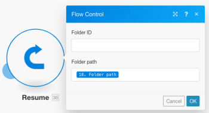

# Gestione avanzata degli errori in [!DNL Adobe Workfront Fusion]

Le tecniche avanzate di gestione degli errori includono filtraggio e nidificazione.

## Requisiti di accesso

Per utilizzare le funzionalità di questo articolo, è necessario disporre dei seguenti diritti di accesso:

<table style="table-layout:auto">
 <col> 
 <col> 
 <tbody> 
  <tr> 
   <td role="rowheader">[!DNL Adobe Workfront] piano*</td> 
   <td> 
[!UICONTROL Pro] o versione successiva
 </td> 
  </tr> 
  <tr data-mc-conditions=""> 
   <td role="rowheader">[!DNL Adobe Workfront] licenza*</td> 
   <td> 
[!UICONTROL Plan], [!UICONTROL Work]
 </td> 
  </tr> 
  <tr> 
   <td role="rowheader">Licenza [!UICONTROL Adobe Workfront Fusion]**</td> 
   <td>
   
Requisiti di licenza correnti: nessun requisito di licenza [!DNL Workfront Fusion].

   
Oppure

   
Requisito licenza legacy: [!UICONTROL [!DNL Workfront Fusion] per automazione e integrazione del lavoro] 

   </td> 
  </tr> 
  <tr> 
   <td role="rowheader">Prodotto</td> 
   <td>
   
Fabbisogno prodotto corrente: se si dispone del piano [!UICONTROL Select] o [!UICONTROL Prime] [!DNL Adobe Workfront], l'organizzazione deve acquistare [!DNL Adobe Workfront Fusion] e [!DNL Adobe Workfront] per utilizzare le funzionalità descritte in questo articolo. [!DNL Workfront Fusion] è incluso nel piano [!UICONTROL Ultimate] [!DNL Workfront].

   
Oppure

   
Requisiti del prodotto legacy: la tua organizzazione deve acquistare [!DNL Adobe Workfront Fusion] e [!DNL Adobe Workfront] per utilizzare le funzionalità descritte in questo articolo.

   </td> 
  </tr> 
 </tbody> 
</table>

Per conoscere il piano, il tipo di licenza o l&#39;accesso disponibili, contattare l&#39;amministratore [!DNL Workfront].

Per informazioni sulle [!DNL Adobe Workfront Fusion] licenze, vedere [[!DNL Adobe Workfront Fusion] licenze](../../workfront-fusion/get-started/license-automation-vs-integration.md).

## Filtro

Esistono due tipi di filtro che possono essere eseguiti su un percorso di gestore degli errori.

* [Aggiunta di un filtro alla route del gestore degli errori](#adding-a-filter-to-the-error-handler-route)
* [Aggiunta di un router seguito da filtri alla route del gestore errori](#adding-a-router-followed-by-filters-to-the-error-handler)

### Aggiunta di un filtro alla route del gestore degli errori

È possibile utilizzare un filtro per controllare gli errori gestiti dalla route del gestore degli errori. Questo consente di elaborare solo tipi specifici di errori. Se un errore non passa attraverso il filtro, verrà trattato come se non fosse stato definito alcun percorso del gestore degli errori per il modulo specificato.

>[!INFO]
>
>**Esempio:**
>
>

### Aggiunta di un [!UICONTROL router] seguito da filtri al gestore degli errori

>[!INFO]
>
>
>
>In questo esempio, l&#39;errore si verifica nel modulo [!UICONTROL Crea cartella] (A), che dispone di una route regolare e di una route del gestore degli errori. Quest&#39;ultimo è seguito da un router con una route che ha un filtro che definisce un tipo specifico di errore (Data Error Takes Place), e l&#39;altra che è la route predefinita per tutti gli altri errori. La prima route termina con la direttiva [!UICONTROL Riprendi] che contiene valori sostitutivi per lo scenario da riprendere dal modulo A ([!UICONTROL Crea una cartella]), mentre la seconda route termina con la direttiva [!UICONTROL Rollback] che interrompe immediatamente l&#39;esecuzione dello scenario.

Per ulteriori informazioni sui vari tipi di errore e sul modo in cui [!DNL Workfront Fusion] li elabora e li valuta, vedere [Errore di elaborazione in [!DNL Adobe Workfront Fusion]](../../workfront-fusion/errors/error-processing.md).

### Lo scenario di esempio

Puoi impostare questa scena di esempio per comprendere come funzionano questi filtri per la gestione degli errori.

Utilizza una cartella [!DNL Dropbox] esistente per caricare un file invece di crearne uno nuovo

Se si utilizza il modulo [!UICONTROL Crea una cartella] in [!DNL Dropbox] e esiste già una cartella con lo stesso nome, il modulo genererà un errore di dati come illustrato di seguito:

Lo scenario completo:

1. Il modulo [!UICONTROL Strumenti] > [!UICONTROL Imposta variabile] contiene il nome della cartella
1. Il modulo [!UICONTROL HTTP] >[!UICONTROL Get a file] recupera il file che deve essere caricato nella cartella
1. Il modulo [!UICONTROL Dropbox] >[!UICONTROL Crea cartella] genera un errore se esiste già una cartella con lo stesso nome di quella mappata nel modulo
1. La route del gestore degli errori (bolle trasparenti) contiene un router per filtrare gli errori
1. La prima route è per un tipo di errore specificato denominato Errore dati, in quanto ne sappiamo già:

   1. Se si verifica un errore di dati e i dettagli dell&#39;errore passano attraverso il filtro, il [!UICONTROL Dropbox] >[!UICONTROL Elenca tutti i file/sottocartelle in un modulo cartelle] elenca tutte le cartelle in [!DNL Dropbox]
   1. Il filtro successivo corrisponde ai nomi delle cartelle
   1. La direttiva [!UICONTROL Riprendi] specifica l&#39;ID della cartella e il percorso della cartella esistente e l&#39;esecuzione dello scenario riprende dal modulo [!UICONTROL Dropbox] >[!UICONTROL Crea una cartella] ma, invece di provare a creare una nuova cartella, questa volta utilizza i valori della direttiva [!UICONTROL Riprendi] per spostarsi al modulo successivo e caricare il file nella cartella esistente

1. La seconda route è per tutti gli altri errori e termina con la direttiva [!UICONTROL Rollback] che determina l&#39;interruzione immediata dello scenario

Di seguito una spiegazione dettagliata della quinta dichiarazione:

Per utilizzare la cartella esistente nei moduli successivi ([!UICONTROL Carica un file] di seguito), è necessario aggiungere al modulo una route del gestore degli errori e recuperare il percorso della cartella da mappare nel modulo direttiva [!UICONTROL Riprendi] che segue:

Il filtro della prima route è impostato per gestire solo l&#39;errore specifico (Errore dati) che viene visualizzato quando esiste già una cartella con lo stesso nome:

Il modulo [!UICONTROL Dropbox] >[!UICONTROL Elenca tutti i file in una cartella] è configurato per restituire tutte le cartelle nella cartella di destinazione. Il seguente filtro passa solo a quello che stavamo originariamente tentando di creare (il nome della cartella è memorizzato nel 33. Nome cartella (elemento):

Infine, la direttiva [!UICONTROL Riprendi] fornisce il percorso della cartella come output per il modulo non riuscito. L&#39;ID cartella è stato lasciato vuoto perché non è necessario dal modulo &#39;[!UICONTROL Carica un file]&#39;:

## Nidificazione

Indipendentemente da dove si trova un modulo, è possibile creare e implementare route del gestore degli errori su tutti i moduli, ad eccezione dei router. È quindi possibile creare una route di gestore errori per un modulo che fa già parte di una route di gestore errori esistente creata per un altro modulo.

Di seguito è riportato un esempio di route del gestore degli errori nidificata:

In questo scenario, la seconda route del gestore errori è nidificata sotto la prima route del gestore errori. Pertanto, se il [!UICONTROL Dropbox] >[!UICONTROL Creazione di un modulo cartella] rileva un errore, l&#39;esecuzione si sposta sulla route 1, se il filtro [!UICONTROL Errore dati] è passato, il modulo successivo viene eseguito seguito dal modulo direttiva [!UICONTROL Riprendi] se non si verifica un errore con il [!UICONTROL Dropbox] >[!UICONTROL Elenco di tutti i file/sottocartelle] in un modulo cartella.

Tuttavia, se si verifica un errore con questo modulo [!DNL Dropbox], l&#39;esecuzione si sposta sulla route 2 del gestore errori e termina con la direttiva [!UICONTROL Ignora]. Il modulo [!UICONTROL Riprendi direttiva] non è eseguito in questo caso.

Combinazione di gestori di errori di filtro e nidificazione.

