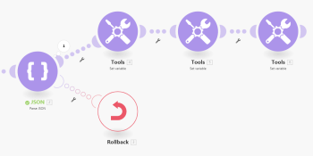

# Gestione degli errori di generazione [!DNL Adobe Workfront Fusion]

In alcuni casi, può essere utile interrompere con la forza l’esecuzione dello scenario seguito da [Ripristino](../../workfront-fusion/scenarios/scenario-execution-cycles-phases.md#rollback) o [Commit](../../workfront-fusion/scenarios/scenario-execution-cycles-phases.md#commit) fase o per interrompere l&#39;elaborazione di una route e, facoltativamente, memorizzarla nella coda di esecuzioni incomplete.

Attualmente le direttive per la gestione degli errori non possono essere utilizzate al di fuori dell&#39;ambito di un [route del gestore errori](../../workfront-fusion/errors/error-handling.md#error) e [!DNL Adobe Workfront Fusion] non offre un modulo che ti consenta di generare facilmente (generare) errori in modo condizionale.

Per informazioni sulle esecuzioni incomplete, vedi [Visualizzare e risolvere le esecuzioni incomplete in Adobe Workfront Fusion](../../workfront-fusion/scenarios/view-and-resolve-incomplete-executions.md).

Per informazioni sulle direttive sulla gestione degli errori, vedi [Direttive sulla gestione degli errori [!DNL Adobe Workfront Fusion]](../../workfront-fusion/errors/directives-for-error-handling.md).

## Requisiti di accesso

Per utilizzare le funzionalità di questo articolo, è necessario disporre dei seguenti diritti di accesso:

<table style="table-layout:auto">
 <col> 
 <col> 
 <tbody> 
  <tr> 
   <td role="rowheader">[!DNL Adobe Workfront] piano*</td> 
   <td> 
[!DNL Pro] o superiore
 </td> 
  </tr> 
  <tr data-mc-conditions=""> 
   <td role="rowheader">[!DNL Adobe Workfront] licenza*</td> 
   <td> 
[!UICONTROL Plan], [!UICONTROL Work]
 </td> 
  </tr> 
  <tr> 
   <td role="rowheader">Licenza [!UICONTROL Adobe Workfront Fusion]**</td> 
   <td> 
[!UICONTROL [!DNL Workfront Fusion] per automazione e integrazione del lavoro] 

[!UICONTROL [!DNL Workfront Fusion] per automazione del lavoro
  </td> 
  </tr> 
  <tr> 
   <td role="rowheader">Prodotto</td> 
   <td>La tua organizzazione deve acquistare [!DNL Adobe Workfront Fusion] nonché [!DNL Adobe Workfront] per utilizzare le funzionalità descritte in questo articolo.</td> 
  </tr> 
 </tbody> 
</table>

Per sapere quale piano, tipo di licenza o accesso hai, contatta il tuo [!DNL Workfront] amministratore.

Per informazioni su [!DNL Adobe Workfront Fusion] licenze, vedi [[!DNL Adobe Workfront Fusion licenses]](../../workfront-fusion/get-started/license-automation-vs-integration.md)

## Soluzione per il lancio

Per generare un errore in modo condizionato, è possibile configurare un modulo in modo che, facoltativamente, si verifichi un errore durante il suo funzionamento. Una possibilità è quella di utilizzare [!UICONTROL JSON] > [!UICONTROL Analizza JSON] modulo (vedi [Moduli JSON](../../workfront-fusion/apps-and-their-modules/json-modules.md)), configurata per generare facoltativamente un errore (BundleValidationError in questo caso):

È quindi possibile allegare una delle direttive di gestione degli errori al percorso di gestione degli errori a:

* Forza l&#39;esecuzione dello scenario per interrompere ed eseguire la fase di rollback: [!UICONTROL Ripristino]
* Forza l&#39;esecuzione dello scenario per interrompere ed eseguire la fase di commit: [!UICONTROL Commit]
* Interrompere l&#39;elaborazione di un percorso: [!UICONTROL Ignora]
* Interrompe l&#39;elaborazione di una route e archiviala nella cartella della coda di esecuzioni incomplete: [!UICONTROL Interruzione]

L’esempio seguente mostra l’utilizzo del [!DNL Rollback] direttiva:

