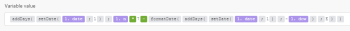
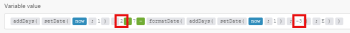
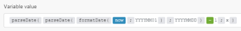

# Funzioni di data e ora in [!DNL Adobe Workfront Fusion]

## Requisiti di accesso

Per utilizzare le funzionalità di questo articolo, è necessario disporre dei seguenti diritti di accesso:

<table style="table-layout:auto">
 <col> 
 <col> 
 <tbody> 
  <tr> 
   <td role="rowheader">[!DNL Adobe Workfront] piano*</td> 
   <td> <p>[!DNL Pro] o superiore</p> </td> 
  </tr> 
  <tr data-mc-conditions=""> 
   <td role="rowheader">[!DNL Adobe Workfront] licenza*</td> 
   <td> <p>[!UICONTROL Plan], [!UICONTROL Work]</p> </td> 
  </tr> 
  <tr> 
   <td role="rowheader">Licenza [!UICONTROL Adobe Workfront Fusion]**</td> 
   <td> <p>[!UICONTROL [!DNL Workfront Fusion] per automazione e integrazione del lavoro] </p><p>[!UICONTROL [!DNL Workfront Fusion] per automazione del lavoro</p>  </td> 
  </tr> 
  <tr> 
   <td role="rowheader">Prodotto</td> 
   <td>La tua organizzazione deve acquistare [!DNL Adobe Workfront Fusion] nonché [!DNL Adobe Workfront] per utilizzare le funzionalità descritte in questo articolo.</td> 
  </tr> 
 </tbody> 
</table>

Per sapere quale piano, tipo di licenza o accesso hai, contatta il tuo [!DNL Workfront] amministratore.

Per informazioni su [!DNL Adobe Workfront Fusion] licenze, vedi [[!DNL Adobe Workfront Fusion] licenze](../../workfront-fusion/get-started/license-automation-vs-integration.md).

## [!UICONTROL formatDate (data; formato; [fuso orario])]

Utilizzare questa funzione quando si dispone di un valore Date, ad esempio `12-10-2021 20:30`, da formattare come valore di testo, ad esempio `Dec 10, 2021 8:30 PM`.

Questa funzione è utile, ad esempio, quando è necessario modificare il formato della data di un’app o di un servizio Web in quello di un’app o di un servizio Web collegati nello stesso scenario.

Per ulteriori informazioni, consulta [Data](../../workfront-fusion/mapping/item-data-types.md#date) e [Testo](../../workfront-fusion/mapping/item-data-types.md#text) nell&#39;articolo [Tipi di dati per elementi in Adobe Workfront Fusion](../../workfront-fusion/mapping/item-data-types.md).

### Parametri

<table style="table-layout:auto"> 
 <col> 
 <col> 
 <col> 
 <thead> 
  <tr> 
   <th>Parametro</th> 
   <th>Tipo di dati previsto* </th> 
   <th>Funzionamento</th> 
  </tr> 
 </thead> 
 <tbody> 
  <tr> 
   <td>[!UICONTROL date] </td> 
   <td>Data </td> 
   <td> <p>Converte un valore Date in un valore Text. </p> </td> 
  </tr> 
  <tr> 
   <td>[!UICONTROL format] </td> 
   <td>Testo </td> 
   <td> <p>Consente di specificare un formato utilizzando i token di formattazione per data/ora. Per ulteriori informazioni, consulta <a href="../../workfront-fusion/functions/tokens-for-date-and-time-formatting.md" class="MCXref xref">Token per la formattazione di data e ora in [!DNL Adobe Workfront Fusion]</a>.</p> <p class="example" data-mc-autonum="<b>Example: </b>"><span class="autonumber"><span><b>Esempio: </b></span></span><code>DD.MM.YYYY HH:mm</code> </p> </td> 
  </tr> 
  <tr> 
   <td>[!UICONTROL fuso orario] </td> 
   <td>Testo </td> 
   <td> <p>(Facoltativo) Consente di specificare il fuso orario utilizzato per la conversione. </p> <p>Per l'elenco dei fusi orari riconosciuti, vedere la colonna "Nome database TZ" in Wikipedia <a href="https://en.wikipedia.org/wiki/List_of_tz_database_time_zones">Elenco dei fusi orari del database tz</a>. Solo i valori elencati in questa colonna vengono riconosciuti dalla funzione come fuso orario valido. Qualsiasi altro valore viene ignorato e viene invece utilizzato il fuso orario Scenari specificato nel profilo. Per ulteriori informazioni, consulta l’articolo <a href="../../workfront-fusion/workfront-fusion-basics/change-profile-settings.md" class="MCXref xref">Modifica le impostazioni del profilo in [!DNL Adobe Workfront Fusion]</a>.</p> <p>Se ometti questo parametro, viene applicato il fuso orario Scenari specificato nelle impostazioni del profilo. </p> <p class="example" data-mc-autonum="<b>Example: </b>"><span class="autonumber"><span><b>Esempio: </b></span></span><code>Europe/Prague</code>, <code>UTC</code></p> </td> 
  </tr> 
 </tbody> 
</table>

Se viene fornito un tipo diverso, viene applicata la coercizione del tipo. Per ulteriori informazioni, consulta [Tipo di coercizione in [!DNL Adobe Workfront Fusion]](../../workfront-fusion/mapping/type-coercion.md).

### Valore restituito e tipo

La `formatDate` restituisce una rappresentazione testuale del valore Date specificato in base al formato e al fuso orario specificati. Il tipo di dati è Testo.

>[!INFO]
>
>**Esempi:** L&#39;impostazione relativa allo scenario e al fuso orario Web è stata entrambe impostata su `Europe/Prague` in questi esempi.
>
>
>
>* `formatDate(1. Date created;MM/DD/YYYY)`
   >
   >    Restituisce 10/01/2018
>
>* `formatDate(1. Date created; YYYY-MM-DD hh:mm A)`
   >
   >   Restituisce 2018-10-01 09:32 AM
>
>* `formatDate(1. Date created;DD.MM.YYYY HH:mm;UTC)`
   >
   >    Restituisce 01.10.2018 07:32
>
>* `formatDate(now;DD.MM.YYYY HH:mm)`
   >
   >    Restituisce 19.03.2019 15:30


## [!UICONTROL parseDate (testo; formato; [fuso orario])]

Utilizzare questa funzione quando un valore Testo rappresenta una data, ad esempio `12-10-2019 20:30` o `Aug 18, 2019 10:00 AM`) e si desidera convertirlo (analizzare) in un valore Date (una rappresentazione leggibile da un computer binario). Per ulteriori informazioni, consulta [Data](../../workfront-fusion/mapping/item-data-types.md#date) e [Testo](../../workfront-fusion/mapping/item-data-types.md#text) nell&#39;articolo [Tipi di dati degli elementi in [!UICONTROL Adobe Workfront Fusion]](../../workfront-fusion/mapping/item-data-types.md).

### Parametri

La seconda colonna indica il tipo previsto. Se viene fornito un tipo diverso, viene applicata la coercizione del tipo. Per ulteriori informazioni, consulta [Tipo di coercizione in [!DNL Adobe Workfront Fusion]](../../workfront-fusion/mapping/type-coercion.md).

<table style="table-layout:auto"> 
 <col> 
 <col> 
 <col> 
 <thead> 
  <tr> 
   <th>Parametro</th> 
   <th>Tipo di dati previsto* </th> 
   <th>Funzionamento</th> 
  </tr> 
 </thead> 
 <tbody> 
  <tr> 
   <td>[!UICONTROL text] </td> 
   <td>Testo </td> 
   <td> <p>Converte un valore Date in un valore Text. </p> </td> 
  </tr> 
  <tr> 
   <td>[!UICONTROL format] </td> 
   <td>Testo </td> 
   <td> <p>Consente di specificare un formato utilizzando i token di formattazione per data/ora. Per ulteriori informazioni, consulta <a href="../../workfront-fusion/functions/tokens-for-date-and-time-formatting.md" class="MCXref xref">Token per la formattazione di data e ora in Adobe Workfront Fusion</a>.</p> <p class="example" data-mc-autonum="<b>Example: </b>"><span class="autonumber"><span><b>Esempio: </b></span></span><code>DD.MM.YYYY HH:mm</code> </p> </td> 
  </tr> 
  <tr> 
   <td>[!UICONTROL fuso orario] </td> 
   <td>Testo </td> 
   <td> <p>(Facoltativo) Consente di specificare il fuso orario utilizzato per la conversione. </p> <p>Per l'elenco dei fusi orari riconosciuti, vedere la colonna "Nome database TZ" in Wikipedia <a href="https://en.wikipedia.org/wiki/List_of_tz_database_time_zones">Elenco dei fusi orari del database tz</a>. Solo i valori elencati in questa colonna vengono riconosciuti dalla funzione come fuso orario valido. Qualsiasi altro valore viene ignorato e viene invece utilizzato il fuso orario Scenari specificato nel profilo. Per ulteriori informazioni, consulta l’articolo <a href="../../workfront-fusion/workfront-fusion-basics/change-profile-settings.md" class="MCXref xref">Modificare le impostazioni del profilo in Adobe Workfront Fusion</a>.</p> <p>Se ometti questo parametro, viene applicato il fuso orario Scenari specificato nelle impostazioni del profilo.</p> <p class="example" data-mc-autonum="<b>Example: </b>"><span class="autonumber"><span><b>Esempio: </b></span></span><code>Europe/Prague</code>, <code>UTC</code></p> </td> 
  </tr> 
 </tbody> 
</table>

Se viene fornito un tipo diverso, viene applicata la coercizione del tipo. Per ulteriori informazioni, consulta [Tipo di coercizione in [!DNL Adobe Workfront Fusion]](../../workfront-fusion/mapping/type-coercion.md).

### Valore restituito e tipo

Questa funzione converte una stringa di testo in una data, in base al formato e al fuso orario specificati. Il tipo di dati del valore è Data.

>[!INFO]
>
>**Esempi:** Negli esempi seguenti, il valore Date restituito è espresso in base alla norma ISO 8601, ma il tipo di dati del risultato è Data.
>
>* `parseDate(2016-12-28;YYYY-MM-DD)`
   >
   >    Restituisce 2016-12-28T00:00:00,000Z
>
>* `parseDate(2016-12-28 16:03;YYYY-MM-DD HH:mm)`
   >
   >    Restituisce 2016-12-28T16:03:00,000Z
>
>* `parseDate(2016-12-28 04:03 pm; YYYY-MM-DD hh:mm a)`
   >
   >    Restituisce 2016-12-28T16:03:06,000Z
>
>* `parseDate(1482940986;X)`
>
>  Restituisce 2016-12-28T16:03:06,000Z

## [!UICONTROL addDays (data; numero)] {#adddays-date-number}

Restituisce una nuova data in seguito all’aggiunta di un numero specificato di giorni a una data. Per sottrarre giorni, immettere un numero negativo.

>[!INFO]
>
>**Esempi:**
>
>* `addDays(2016-12-08T15:55:57.536Z;2)`
   >
   >    Restituisce 2016-12-10T15:55:57,536Z
>
>* `addDays(2016-12-08T15:55:57.536Z;-2)`
   >
   >    Restituisce 2016-12-6T15:55:57,536Z


## [!UICONTROL addHours (data; numero)] {#addhours-date-number}

Restituisce una nuova data in seguito all’aggiunta di un numero specificato di ore a una data. Per sottrarre ore, immetti un numero negativo.

>[!INFO]
>
>**Esempi:**
>
>* `addHours(2016-12-08T15:55:57.536Z; 2)`
   >
   >    Restituisce 2016-12-08T17:55:57,536Z
>
>* `addHours(2016-12-08T15:55:57.536Z;-2)`
   >
   >    Restituisce 2016-12-08T13:55:57,536Z


## [!UICONTROL addMinutes (data; numero)] {#addminutes-date-number}

Restituisce una nuova data in seguito all’aggiunta di un numero specificato di minuti a una data. Per sottrarre minuti, immetti un numero negativo.

>[!INFO]
>
>**Esempi:**
>
>* `addMinutes(2016-12-08T15:55:57.536Z;2)`
   >
   >    Restituisce 2016-12-08T15:57:57,536Z
>
>* `addMinutes(2016-12-08T15:55:57.536Z;-2)`
   >
   >    Restituisce 2016-12-08T15:53:57,536Z


## [!UICONTROL addMonths (data; numero)] {#addseconds-date-number}

Restituisce una nuova data in seguito all’aggiunta di un numero specificato di mesi a una data. Per sottrarre mesi, immettere un numero negativo.

>[!INFO]
>
>**Esempi:**
>
>* `addMonths(2016-08-08T15:55:57.536Z;2)`
   >
   >    Restituisce 2016-10-08T15:55:57,536Z
>
>* `addMonths(2016-08-08T15:55:57.536Z;-2)`
   >
   >    Restituisce 2016-06-08T15:55:57,536Z


## [!UICONTROL addSeconds (date; numero)]

Restituisce una nuova data in seguito all’aggiunta di un numero specificato di secondi a una data. Per sottrarre i secondi, immetti un numero negativo.

>[!INFO]
>
>**Esempi:**
>
>* `addSeconds(2016-12-08T15:55:57.536Z;2)`
   >
   >   Restituisce 2016-12-08T15:55:59,536Z
>
>* `addSeconds(2016-12-08T15:55:57.536Z;-2)`
   >
   >   Restituisce 2016-12-08T15:55:55,536Z


## [!UICONTROL addYears (data; numero)]

Restituisce una nuova data in seguito all’aggiunta di un numero specificato di anni a una data. Per sottrarre anni, immettere un numero negativo.

>[!INFO]
>
>**Esempi:**
>
>* `addYears(2016-08-08T15:55:57.536Z;2)`
   >
   >    Restituisce 2018-08-08T15:55:57,536Z
>
>* `addYears(2016-12-08T15:55:57.536Z; -2)`
   >
   >    Restituisce 2014-08-08T15:55:57,536Z


## [!UICONTROL setSecond (data; numero)]

Questa funzione restituisce una nuova data con i secondi specificati nei parametri.

Specifica un numero da 0 a 59. Se il numero è al di fuori di tale intervallo, la funzione restituisce un secondo dal minuto precedente (per un numero negativo) o dal minuto successivo (per un numero positivo).

Se devi specificare un numero al di fuori dell’intervallo, ti consigliamo di utilizzare[!UICONTROL  addSeconds], come descritto in precedenza nella sezione [addSeconds (date; numero)](#addseconds-date-number).

>[!INFO]
>
>**Esempi:**
>
>* `setSecond(2015-10-07T11:36:39.138Z;10)`
   >
   >    Restituisce 2015-10-07T11:36:10,138Z
>
>* `setSecond(2015-10-07T11:36:39.138Z; 6)`
   >
   >    Restituisce 2015-10-07T11:37:01,138Z


## [!UICONTROL setMinute (data; numero)]

Questa funzione restituisce una nuova data con i minuti specificati nei parametri.

Specifica un numero da 0 a 59. Se il numero è al di fuori di tale intervallo, la funzione restituisce un minuto dall&#39;ora precedente (per un numero negativo) o dall&#39;ora successiva (per un numero positivo).

Per specificare un numero al di fuori dell’intervallo, è consigliabile utilizzare addMinutes, come descritto in precedenza in [addMinutes (data; numero)](#addminutes-date-number).

>[!INFO]
>
>**Esempi:**
>
>* `setMinute(2015-10-07T11:36:39.138Z;10)`
   >
   >    Restituisce 2015-10-07T11:10:39,138Z
>
>* `setMinute(2015-10-07T11:36:39.138Z;61)`
   >
   >    Restituisce 2015-10-07T12:01:39,138Z


## [!UICONTROL setHour (data; numero)]

Questa funzione restituisce una nuova data con l&#39;ora specificata nei parametri.

Specifica un numero da 0 a 23. Se il numero non rientra in questo intervallo, la funzione restituisce un&#39;ora dal giorno precedente (per un numero negativo) o dal giorno successivo (per un numero positivo).

Per specificare un numero al di fuori dell’intervallo, è consigliabile utilizzare addHours, come descritto in precedenza in [addHours (data; numero)](#addhours-date-number).

>[!INFO]
>
>**Esempi:**
>
>* `setHour(2015-08-07T11:36:39.138Z;6)`
   >
   >   Restituisce 2015-08-07T06:36:39,138Z
>
>* `setHour(2015-08-07T11:36:39.138;-6)`
   >
   >    Restituisce 2015-08-06T18:36:39,138Z


## [!UICONTROL setDay (data; numero/nome del giorno in inglese)]

Questa funzione restituisce una nuova data con il giorno specificato nei parametri .

Puoi utilizzare questa funzione per impostare il giorno della settimana, con domenica come 1 e sabato come 7. Se specifichi un numero compreso tra 1 e 7, la data risultante sarà compresa nella settimana corrente (da domenica a sabato). Se il numero è al di fuori di tale intervallo, la funzione restituisce un giorno dalla settimana precedente (per un numero negativo) o dalla settimana successiva (per un numero positivo).

Per specificare un numero al di fuori dell’intervallo, è consigliabile utilizzare addDays, come descritto in precedenza in [addDays (data; numero)](#adddays-date-number).

>[!INFO]
>
>**Esempi:**
>
>* `setDay(2018-06-27T11:36:39.138Z;Monday)`
   >
   >   Restituisce 2018-06-25T11:36:39,138Z
>
>* `setDay(2018-06-27T11:36:39.138Z;1)`
   >
   >   Restituisce 2018-06-24T11:36:39,138Z
>
>* `setDay(2018-06-27T11:36:39.138Z;7)`
   >
   >   Restituisce 2018-06-30T11:36:39,138Z


## [!UICONTROL setDate (data; numero)]

Questa funzione restituisce una nuova data con il giorno del mese specificato nei parametri .

Specifica un numero da 1 a 31. Se il numero è al di fuori di questo intervallo, la funzione restituisce un giorno dal mese precedente (per un numero negativo) o dal mese successivo (per un numero positivo).

>[!INFO]
>
>**Esempi:**
>
>* `setDate(2015-08-07T11:36:39.138Z;5)`
   >
   >   Restituisce 2015-08-05T11:36:39,138Z
>
>* `setDate(2015-08-07T11:36:39.138Z;32)`
   >
   >   Restituisce 2015-09-01T11:36:39,138Z


## [!UICONTROL setMonth (data; numero/nome del mese in inglese)]

Questa funzione restituisce una nuova data con il mese specificato nei parametri .

Specifica un numero da 1 a 12. Se il numero è al di fuori di questo intervallo, la funzione restituisce il mese dell&#39;anno precedente (per un numero negativo) o dell&#39;anno successivo (per un numero positivo).

>[!INFO]
>
>**Esempi:**
>
>* `setMonth(2015-08-07T11:36:39.138Z;5)`
   >
   >   Restituisce 2015-05-07T11:36:39,138Z
>
>* `setMonth(2015-08-07T11:36:39.138Z;17)`
   >
   >   Restituisce 2016-05-07T11:36:39,138Z
>
>* `setMonth(2015-08-07T11:36:39.138Z;january)`
   >
   >   Restituisce 2015-01-07T12:36:39,138Z


## [!UICONTROL setYear (data; numero)]

Restituisce una nuova data con l’anno specificato nei parametri.

>[!INFO]
>
>**Esempio:**
>
>* `setYear(2015-08-07T11:36:39.138Z;2017)`
   >
   >   Restituisce 2017-08-07T11:36:39,138Z


## [!UICONTROL dateDifference (Date1; Data2; Unità)]

Restituisce un numero che rappresenta la differenza nelle due date, espressa nell&#39;unità specificata.

Date2 viene sottratto da Date1.

Utilizza uno dei seguenti valori temporali per `unit` parametro:

* millisecondi
* secondi
* minuti
* ore
* giorni
* settimane
* mesi

Se non viene specificata alcuna unità, la funzione restituisce la differenza in millisecondi.

>[!INFO]
>
>**Esempi:**
>
>* `dateDifference(2021-05-11T18:10:00.000Z;2021-05-11T18:00:00.000Z)`
   >
   >    Restituisce `600,000`
>
>* `dateDifference(2021-05-11T18:10:00.000Z;2021-05-11T18:00:00.000Z;hours)`
   >
   >    Restituisce `4`
>
>* `dateDifference2021-06-11T18:10:00.000Z;2021-05-11T18:00:00.000Z;months)`
   >
   >    Restituisce `1`


## Esempi aggiuntivi

### Come calcolare n° giorno della settimana del mese

Questa sezione è adattata per [!DNL Workfront Fusion] dal [!DNL Exceljet] pagina web che spiega come ottenere l’ennesimo giorno della settimana in un mese.

Se devi calcolare una data corrispondente al n° giorno della settimana del mese (ad esempio, primo martedì, terzo venerdì e così via), puoi utilizzare la formula seguente:



```
{{addDays(setDate(1.date; 1); 1.n * 7 - formatDate(addDays(setDate(1.date; 1); "-" + 1.dow); "E"))}}
```

La formula contiene i seguenti elementi:

<table style="table-layout:auto"> 
 <col> 
 <col> 
 <tbody> 
  <tr> 
   <td><code>1.n</code> </td> 
   <td> <p> n° giorno:</p> 
    <ul> 
     <li><code>1</code> per il 1° martedì</li> 
     <li><code>2</code> per il 2° martedì</li> 
     <li><code>3</code> per il 3° martedì, e così via</li> 
    </ul> </td> 
  </tr> 
  <tr> 
   <td><code>2.dow</code> </td> 
   <td> <p> giorno della settimana:</p> 
    <ul> 
     <li><code>1</code> per lunedì</li> 
     <li><code>2</code> per martedì</li> 
     <li><code>3</code> per mercoledì</li> 
     <li><code>4</code> per giovedì</li> 
     <li><code>5</code> per venerdì</li> 
     <li><code>6</code> per sabato</li> 
     <li><code>7</code> per domenica</li> 
    </ul> </td> 
  </tr> 
  <tr> 
   <td><code>1.date</code> </td> 
   <td> <p> La data determina il mese. Per calcolare il n° giorno della settimana nel mese corrente, utilizza il <code>now</code> variabile.</p> </td> 
  </tr> 
 </tbody> 
</table>

Se si desidera calcolare un solo caso specifico, ad esempio ogni secondo mercoledì, è possibile sostituire gli elementi `1.n` e `2.dow` nella formula con i numeri corrispondenti. Per il secondo mercoledì del mese corrente, si utilizzano i seguenti valori:

* `1.n` = `2`
* `1.dow` = `3`
* `1.date` = `now`



### Spiegazione:

* `setDate(now;1)` restituisce il primo del mese corrente
* `formatDate(....;E)` restituisce il giorno della settimana (1, 2, ... 6)

## Come calcolare i giorni tra le date

Una possibilità è quella di utilizzare la seguente espressione:


```
{{round((2.value - 1.value) / 1000 / 60 / 60 / 24)}}
```

>[!NOTE]
>
>* Valori di `D1`e `D2` devono essere valori di tipo Data. Se si tratta di valori di tipo String (ad esempio, 20.10.2018), utilizza il `parseDate()` per convertirli in valori di tipo Date.
>
>* La `round()` viene utilizzata per i casi in cui una delle date rientra nel periodo di tempo legale e l&#39;altra no. In questi casi, la differenza in ore è di un&#39;ora in meno o più. È possibile dividerlo per 24 per un risultato non intero. Perdi un&#39;ora al giorno risparmi. Round lo appiattisce in modo da non avere una percentuale


### Come calcolare l’ultimo giorno/millisecondi del mese

Quando si specifica un intervallo di date, ad esempio in un modulo di ricerca, se l’intervallo si estende per l’intero mese precedente come intervallo chiuso (l’intervallo che include entrambi i punti limite), è necessario calcolare l’ultimo giorno del mese.

2019-09-01 ≤ D ≤ 2019-09-30

La formula seguente mostra un modo per calcolare l’ultimo giorno del mese precedente:


```
{{addDays(setDate(now; 1); -1)}}
```

In alcuni casi, è necessario calcolare non solo l’ultimo giorno del mese, ma letteralmente il suo ultimo millisecondo:

01/09/2019:00:00,000Z ≤ D ≤ 2019-09-30T23:59:59,999Z

Questa formula mostra un modo per calcolare l’ultimo millisecondo del mese precedente:


```
{{parseDate(parseDate(formatDate(now; "YYYYMM01"); "YYYYMMDD"; "UTC") - 1; "x")}}
```

Se hai bisogno che il risultato utilizzi l’impostazione del fuso orario, ometti l’argomento UTC:



`{{parseDate(parseDate(formatDate(now; "YYYYMM01"); "YYYYMMDD") - 1; "x")}}`

Tuttavia, è preferibile utilizzare invece l’intervallo a mezza apertura (l’intervallo che esclude uno dei suoi punti limite), specificando il primo giorno del mese successivo invece e sostituendo l’operatore &quot;minore o uguale a&quot; con &quot;minore di&quot; come segue:

`2019-09-01 ≤ D < 2019-10-01`

`2019-09-01T00:00:00.000Z ≤ D < 2019-10-01T00:00:00.000Z`
