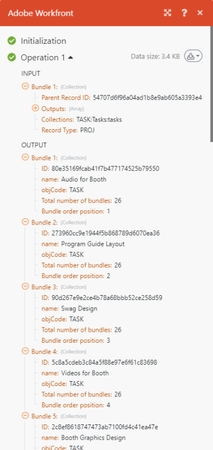

# Creare uno scenario di automazione delle esercitazioni in [!DNL Adobe Workfront Fusion]

Questo articolo descrive come creare uno scenario di automazione con Adobe Workfront Fusion. Gli scenari di automazione automatizzano i processi Workfront, inclusa la manipolazione e la trasformazione dei dati. In questo esempio viene illustrato il processo di creazione di uno scenario in cui viene eseguita la ricerca di un progetto e vengono quindi restituite tutte le attività associate a tale progetto.

Per istruzioni su come creare uno scenario di integrazione che colleghi applicazioni separate, consulta [Creare uno scenario di integrazione pratica in Adobe Workfront Fusion](../../workfront-fusion/get-started/create-a-practice-scenario.md).

Per ulteriori informazioni sulle funzionalità disponibili con ciascuna licenza di Workfront Fusion, vedere [Licenze Adobe Workfront Fusion](../../workfront-fusion/get-started/license-automation-vs-integration.md).

## Requisiti di accesso

Per utilizzare le funzionalità di questo articolo, è necessario disporre dei seguenti diritti di accesso:

<table style="table-layout:auto">
 <col> 
 <col> 
 <tbody> 
  <tr> 
   <td role="rowheader">[!DNL Adobe Workfront] piano*</td> 
   <td> 
[!DNL Pro] o superiore
 </td> 
  </tr> 
  <tr data-mc-conditions=""> 
   <td role="rowheader">[!DNL Adobe Workfront] licenza*</td> 
   <td> 
[!UICONTROL Plan], [!UICONTROL Work]
 </td> 
  </tr> 
  <tr> 
   <td role="rowheader">Licenza [!UICONTROL Adobe Workfront Fusion]**</td> 
   <td>
   
Fabbisogno di licenza corrente: No [!DNL Workfront Fusion] requisito di licenza.

   
Oppure

   
Requisito licenza legacy: [!UICONTROL [!DNL Workfront Fusion] per l'automazione e l'integrazione del lavoro] 

   </td> 
  </tr> 
  <tr> 
   <td role="rowheader">Prodotto</td> 
   <td>
   
Fabbisogno prodotto corrente: se si dispone di [!UICONTROL Select] o [!UICONTROL Prime] [!DNL Adobe Workfront] Pianifica, la tua organizzazione deve acquistare [!DNL Adobe Workfront Fusion] nonché [!DNL Adobe Workfront] per utilizzare la funzionalità descritta in questo articolo. [!DNL Workfront Fusion] è incluso in [!UICONTROL Ultimate] [!DNL Workfront] piano.

   
Oppure

   
Requisiti del prodotto legacy: la tua organizzazione deve acquistare [!DNL Adobe Workfront Fusion] nonché [!DNL Adobe Workfront] per utilizzare la funzionalità descritta in questo articolo.

   </td> 
  </tr> 
 </tbody> 
</table>
Per conoscere il piano, il tipo di licenza o l'accesso di cui si dispone, contattare [!DNL Workfront] amministratore.

Per informazioni su [!DNL Adobe Workfront Fusion] licenze, consulta [[!DNL Adobe Workfront Fusion] licenze](../../workfront-fusion/get-started/license-automation-vs-integration.md).

## Creare uno scenario di esercitazione

Il ruolo di [!DNL Adobe Workfront Fusion] automatizzare i processi in modo da potersi concentrare su nuove attività anziché ripetere più volte le stesse attività. Funziona tramite il collegamento di azioni all’interno e tra app e servizi per creare uno scenario che trasferisce e trasforma automaticamente i dati. Lo scenario in cui si creano controlli i dati in un’app o in un servizio ed elabora tali dati in modo da fornire il risultato desiderato.

Uno scenario è costituito da una serie di moduli che indicano come i dati devono essere trasformati all’interno di un’app o trasferiti tra app e servizi web.
Questo esempio illustra il processo di creazione di uno scenario che cerca un [!DNL Workfront] e restituisce le attività del progetto.

La creazione di uno scenario è costituita da diverse attività principali:

## Scegli le app e assegna un nome allo scenario

1. Accedi al tuo [!DNL Workfront Fusion] account.
1. Clic **[!UICONTROL Scenari]**  nel pannello a sinistra.

   >[!NOTE]
   >
   >Se il pannello di navigazione a sinistra o le relative icone non sono visibili, fare clic sul menu  icona.

   In grigio [!UICONTROL Cartelle] che viene visualizzato, puoi organizzare gli scenari in cartelle.

   Nella parte superiore dell&#39;area principale a destra è possibile visualizzare **[!UICONTROL Tutti]** scenari creati, il tuo **[!UICONTROL Scenari attivi]**, **[!UICONTROL Scenari inattivi]**, e **[!UICONTROL Concetti]**. I concetti sono scenari che richiedono ancora un po’ di lavoro prima [!DNL Workfront Fusion] può classificarli come attivi o inattivi.

<!--
   
-->

1. In [!UICONTROL Cartelle] fare clic sul pulsante **[!UICONTROL Aggiungi cartella]** icona , quindi digitare un nome come &quot;Scenari di esercitazione&quot; per la prima cartella.

1. Apri la cartella, quindi fai clic su **[!UICONTROL Crea un nuovo scenario]** nell’angolo superiore destro della pagina.

   La pagina di destinazione visualizzata consente di precaricare le app che desideri utilizzare nello scenario che stai per creare.

1. Per questo esercizio, cerca e seleziona la **[!DNL Workfront]** app.
1. Clic **[!UICONTROL Continua]** nell’angolo superiore destro.

   Viene visualizzato l’editor dello scenario, contenente un modulo vuoto al centro, il [!DNL Workfront] app precaricata e alcune opzioni nella barra degli strumenti nella parte inferiore.

<!--
   
-->

Quando si inizia a creare un nuovo scenario, è consigliabile iniziare con la creazione di un nome.

1. Seleziona la **[!UICONTROL Nuovo scenario]** nome segnaposto nell&#39;angolo superiore sinistro, quindi digitare un nome come &quot;Esercitazione scenario 1&quot;.
1. Continua con [Aggiungere e configurare il primo modulo](#add-and-configure-the-first-module) di seguito.

## Aggiungere e configurare il primo modulo

Il modulo vuoto con un punto interrogativo rappresenta il modulo trigger da aggiungere. Questo modulo avvia lo scenario ogni volta che viene eseguito. L’icona dell’orologio sul modulo vuoto indica che si tratta di un modulo pianificato.

Questo modulo conterrà i dati che si desidera controllare nello scenario.

Per questo esempio, non utilizziamo un modulo trigger. Invece, questo scenario inizia con una ricerca.

1. Fai clic sul modulo vuoto per scegliere l’app dalla quale selezionare un modulo.

   L’app precaricata in precedenza viene visualizzata accanto al modulo vuoto. Puoi aggiungere altre app che dispongono di moduli utilizzando [!UICONTROL Ricerca] casella.

   

1. Clic **[!DNL Workfront]**.

   L’elenco viene modificato in visualizza tutto [!DNL Workfront] moduli utilizzabili come modulo trigger.

1. Fai clic sul modulo di ricerca **[!UICONTROL Ricerca]**.

   Ora devi stabilire una connessione autenticata al tuo [!DNL Workfront] account. Ogni modulo che aggiungi a uno scenario deve avere una connessione alla relativa app.

1. In **[!DNL Workfront]** casella, sotto **[!UICONTROL Connessione]**, fai clic su **[!UICONTROL Aggiungi]**, quindi digita un nome per la connessione, ad esempio &quot;Account Workfront di Olivia&quot;, quindi fai clic su **[!UICONTROL Continua]**.
1. Autentica la connessione nella finestra visualizzata.

   Il processo di autenticazione di una connessione può variare leggermente da un’app all’altra. Il seguente processo è specifico per [!DNL Workfront], ma il processo è simile a quello di molte app.

   1. Immetti il [!DNL Workfront] , quindi fai clic su **[!UICONTROL Continua]**.
   1. Accedi a [!DNL Workfront].
   1. Esamina l’accesso che [!DNL Workfront Fusion] richiede, quindi fai clic su **[!UICONTROL Consenti accesso]**.

   Se hai bisogno di aiuto, consulta [Informazioni sulla connessione [!DNL Adobe Workfront Fusion] a un’app o a un servizio](../../workfront-fusion/connections/about-connecting-wf-fusion-to-app-or-service.md).

## Configurare il primo modulo

Dopo la connessione [!DNL Workfront Fusion] al tuo [!DNL Workfront] account, è possibile specificare un [!DNL Workfront] coda di richieste a cui hai accesso e i dati in essa contenuti che desideri elaborare per il primo modulo.

1. In [!UICONTROL Tipo di record] , seleziona **[!UICONTROL Progetto]**. Questo imposta il modulo in modo che esegua la ricerca solo nei progetti.

   >[!TIP]
   >
   >Puoi trovare **[!UICONTROL Progetto]** nell’elenco, se inizi a digitare la parola &quot;[!UICONTROL progetto].&quot;

1. In **[!UICONTROL Set di risultati]** , seleziona **[!UICONTROL Primo record corrispondente]**. In questo modo il modulo restituirà solo il primo record che soddisfa i criteri. Per questo esempio, è necessario restituire un solo record.
1. In **[!UICONTROL Criteri di ricerca]** , verrà impostato un filtro per restituire il progetto specifico.

   1. Nella prima casella sotto [!UICONTROL Criteri di ricerca], seleziona il campo di cui desideri cercare i valori. Per questo esempio, seleziona **[!UICONTROL Nome]**.
   1. Per l’operatore, seleziona [!UICONTROL Contiene (senza distinzione maiuscole/minuscole)]. Questo consente al modulo di trovare i progetti il cui nome contiene le parole scelte, anche se non si inserisce il nome completo o si inserisce il nome con lettere maiuscole non corrette.
   1. Nell’ultimo campo in [!UICONTROL Criteri di ricerca], immetti una parola o una frase che sai essere nel nome del progetto che stai cercando.

1. In **[!UICONTROL Uscite]** selezionare i campi che si desidera vengano generati dal modulo. Per questo esempio, seleziona la **[!UICONTROL ID]** e **[!UICONTROL Nome]** campi.

   >[!TIP]
   >
   >È possibile utilizzare **Cmd+F** ([!DNL Mac] OS) o **Ctrl+F** ([!DNL Windows] OS) per trovare rapidamente un campo.

1. Clic **[!UICONTROL OK]**.

   >[!NOTE]
   >
   >(Solo informativo) Poiché questo non è un modulo trigger, non puoi scegliere dove avviarlo. Quando utilizzi un modulo trigger, ora puoi selezionare dove avviarlo.
   >
   >
   >Per ulteriori informazioni, consulta [Scegli da dove inizia un modulo trigger [!DNL Adobe Workfront Fusion]](../../workfront-fusion/modules/choose-where-trigger-module-starts.md).

1. Fai clic con il pulsante destro del mouse sul modulo e fai clic su **[!UICONTROL Rinomina]**, quindi digita un nome che descriva le operazioni che desideri eseguire il modulo (ad esempio &quot;Cerca progetto&quot;), quindi fai clic su **[!UICONTROL OK]**.

   Il nome viene visualizzato appena sotto il modulo. Sotto, [!DNL Workfront Fusion] include una breve descrizione del tipo di azione eseguita dal modulo.

   

1. Continua con [Aggiungere e configurare il secondo modulo](#add-and-configure-the-second-module).

## Aggiungere e configurare il secondo modulo

1. Fare clic sul cerchio parziale a destra della sezione del modulo per **[!UICONTROL Aggiungi un altro modulo]**.
1. Seleziona [!DNL Workfront] dall’elenco delle applicazioni, scegli il modulo di ricerca **[!UICONTROL Leggi record correlati]**.
1. Connessione già creata a [!DNL Workfront] per il modulo precedente. Non è necessario crearlo di nuovo qui, ma è necessario assicurarsi che questo modulo utilizzi la stessa connessione del modulo precedente.\
   In **[!UICONTROL Connessione]** selezionare la connessione creata per il modulo precedente.
1. Clic **[!UICONTROL Tipo di record]**, quindi seleziona **[!UICONTROL Progetto]**, perché vogliamo leggere i record relativi a un progetto.

   >[!TIP]
   >
   >Puoi trovare **[!UICONTROL Progetto]** nell’elenco, se inizi a digitare la parola &quot;progetto&quot;.

1. Fai clic su **[!UICONTROL ID record principale]** campo. Questo campo richiede l&#39;ID Workfront del progetto da cui si desidera restituire le attività.

   Facendo clic sul campo si apre l’elenco delle variabili che è possibile utilizzare nel **[!UICONTROL ID record principale]** per identificare il progetto in Workfront.

   

1. Fai clic sulla variabile **[!UICONTROL ID]** per aggiungerlo al **[!UICONTROL ID record principale]** campo. Questo consente di utilizzare l’ID restituito dal primo modulo come identificatore del progetto con cui vuoi lavorare nel secondo modulo, in modo che le attività restituite appartengano a quel progetto.
1. In **[!UICONTROL Raccolte]** campo, seleziona **[!UICONTROL Attività]**. Questo indica che il modulo deve restituire le attività associate al progetto scelto.
1. Clic **[!UICONTROL OK]**

   Ora avete uno scenario di lavoro.

1. Assegna al secondo modulo un nome come &quot;Attività di ritorno associate al progetto&quot;, quindi continua con [Verifica lo scenario](#test-the-scenario).

## Verifica lo scenario

Prima di attivare lo scenario, è importante testarlo eseguendolo almeno una volta e visualizzando i risultati. Questo ti aiuta a capire come i dati scorrono attraverso lo scenario e a trovare eventuali errori.

Abbiamo scelto di restituire 1 progetto e le attività associate a quel progetto. Se esegui lo scenario, questo è ciò che dovrebbe accadere.

1. Clic **[!UICONTROL Esegui una volta]** nell’angolo inferiore sinistro dell’editor di scenari.
1. Al termine dell’esecuzione dello scenario, fai clic sulla bolla sopra il primo modulo.

   

   Nella casella visualizzata, puoi visualizzare informazioni sul bundle di dati elaborati dal modulo, inclusi i dati effettivi estratti dal progetto restituito dal modulo.

   

1. Fare clic sull&#39;indicatore del controllo di esecuzione sopra il secondo modulo per visualizzare l&#39;input delle informazioni e l&#39;output, ovvero una raccolta di attività contenute nel progetto.

   

   Per ulteriori informazioni su come leggere le informazioni sull’esecuzione di uno scenario, consulta i seguenti articoli:

   * Per informazioni generali, consulta [Flusso di esecuzione dello scenario in [!DNL Adobe Workfront Fusion]](../../workfront-fusion/scenarios/scenario-execution-flow.md).
   * Per informazioni sui bundle elaborati, consulta [Esecuzione di scenari, cicli e fasi in [!DNL Adobe Workfront Fusion]](../../workfront-fusion/scenarios/scenario-execution-cycles-phases.md).

1. In entrata [!DNL Workfront Fusion], fai clic su **[!UICONTROL Salva]**  nell’angolo in basso a sinistra per salvare i progressi sullo scenario.

   >[!IMPORTANT]
   >
   >Risparmia spesso quando affili e testa uno scenario.

>[!TIP]
>
>È consigliabile aggiungere note su ciascun modulo in modo facoltativo ma utile.
>
>1. Fare clic con il pulsante destro del mouse su una [!DNL Workfront] , quindi fai clic su **[!UICONTROL Aggiungi una nota]**.
>1. Nella nota visualizzata, digita una panoramica del modulo.
>
>    È possibile aggiungere più note per un modulo.
>
>1. Chiudi **[!UICONTROL Note]** area.
>
>     Dopo aver aggiunto una nota a uno scenario, sulla schermata viene visualizzato un punto arancione **[!UICONTROL Note]** icona  nella parte inferiore dell’editor dello scenario.
>
>1. Fai clic su **[!UICONTROL Note]** icona  per visualizzare le note.
>

## Attiva lo scenario

Questo scenario di esempio non ha un modulo trigger. Se si trattasse di uno scenario da utilizzare per dati reali, inizierebbe con un modulo trigger e l’ultima cosa da fare è attivarlo. Dopo aver attivato uno scenario, per impostazione predefinita viene eseguito ogni 15 minuti. Puoi modificare questa impostazione definendo quando e con quale frequenza desideri che venga eseguita.

Per ulteriori informazioni sull’attivazione degli scenari, consulta [Attivare o disattivare uno scenario in [!UICONTROL Adobe Workfront Fusion]](../../workfront-fusion/scenarios/activate-or-inactivate-scenario.md).

Per informazioni sulle pianificazioni, consulta [Pianificare uno scenario in [!UICONTROL Adobe Workfront Fusion]](../../workfront-fusion/scenarios/schedule-a-scenario.md).
