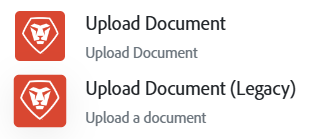

# Utilizzo di file di grandi dimensioni in Adobe Workfront Fusion

>[!IMPORTANT]
>
>La documentazione di Adobe Workfront Fusion è stata spostata in una nuova posizione.
>
>Le informazioni contenute in questo articolo sono ora disponibili nell’articolo:
>
>* [Utilizzo di file di grandi dimensioni](https://experienceleague.adobe.com/docs/workfront-fusion/using/references/scenarios/fusion-large-files.html)
>
>Aggiorna eventuali segnalibri.
>
>Questo articolo non è più in fase di aggiornamento e verrà rimosso nel prossimo futuro.

>[!IMPORTANT]
>
>La funzionalità per file di grandi dimensioni è disponibile solo per i clienti di Workfront Ultimate ed è un rollout graduale. Tutte le organizzazioni di Fusion che dispongono di un piano Workfront Ultimate disporranno di grandi capacità di file entro gennaio 2025.

In Workfront Fusion sono ora disponibili funzionalità di trasferimento dati migliorate che consentono di elaborare file di dimensioni notevolmente maggiori.

Per gestire file di grandi dimensioni, è necessario aggiornare gli scenari.

## Requisiti di accesso

+++ Espandi per visualizzare i requisiti di accesso per la funzionalità in questo articolo.

Per utilizzare le funzionalità di questo articolo, è necessario disporre dei seguenti diritti di accesso:

<table style="table-layout:auto">
 <col> 
 <col> 
 <tbody> 
  <tr> 
   <td role="rowheader">[!DNL Adobe Workfront] piano</td>
   <td> 
Nuovo: Ultmate
 
Oppure
 
Corrente: non disponibile
</td> 
  </tr> 
  <tr data-mc-conditions=""> 
   <td role="rowheader">[!DNL Adobe Workfront] licenza</td> 
   <td> 
Nuovo: [!UICONTROL Standard]

Oppure

Corrente: non disponibile
 </td> 
  </tr> 
  <tr> 
   <td role="rowheader">[!DNL Adobe Workfront Fusion] licenza**</td> 
   <td>
   
Corrente: nessun requisito di licenza [!DNL Workfront Fusion].

   
Oppure

   
Legacy: qualsiasi 

   </td> 
  </tr> 
  <tr> 
   <td role="rowheader">Prodotto</td> 
   <td>
   
Nuovo: [!DNL Workfront Fusion] incluso nel piano Ultimate Workfront.
 
Oppure

   
Corrente: non disponibile

   </td> 
  </tr>
 </tbody> 
</table>

Per ulteriori dettagli sulle informazioni contenute in questa tabella, vedere [Requisiti di accesso nella documentazione di Workfront](/help/quicksilver/administration-and-setup/add-users/access-levels-and-object-permissions/access-level-requirements-in-documentation.md).

Per informazioni sulle [!DNL Adobe Workfront Fusion] licenze, vedere [[!DNL Adobe Workfront Fusion] licenze](../../workfront-fusion/get-started/license-automation-vs-integration.md).

+++

## Connettori che supportano file di grandi dimensioni

Per la versione iniziale, i seguenti connettori supportano file di grandi dimensioni.

* Workfront > Carica documento
* Adobe Experience Manager Assets > Carica documento
* Workfront Proof > Carica file
* Adobe Authenticator > Effettua una chiamata API personalizzata
* HTTP

Altri connettori saranno supportati nelle versioni future.

## Aggiornare gli scenari per gestire file di grandi dimensioni

Il modulo Workfront > Carica documento è stato modificato per gestire file di dimensioni maggiori. Nella versione precedente di questo modulo ora vengono visualizzati `(Legacy)` aggiunti al nome del modulo. Nella maggior parte dei casi il modulo legacy continuerà a funzionare.

Se prevedi di lavorare con file di dimensioni maggiori, ti consigliamo di sostituire il modulo legacy con il nuovo modulo Carica documento. Il nuovo modulo Carica documento evita timeout e altri errori.

## Domande frequenti

### Qual è il nuovo limite di dimensione file?

Gli utenti possono ora elaborare file che superano il precedente limite di 1 GB, migliorando l&#39;efficienza e la produttività.  Anche se la piattaforma può supportare singoli file fino a 15 GB per una singola azione (ad esempio il caricamento di un file), ci sono altri fattori che influiscono sul trasferimento dei dati. Il limite di dimensione del file per una singola azione dipende in ultima analisi dal servizio Web a cui Fusion si connette. Il trasferimento di dati è l’elaborazione totale per una singola esecuzione. Ciò significa che più azioni in una singola esecuzione contribuiscono al trasferimento totale dei dati.

Fusion elabora i file fino al raggiungimento del limite di esecuzione di 40 minuti. Il caricamento, il download o l&#39;elaborazione di file di grandi dimensioni nello scenario Fusion potrebbe richiedere del tempo. Anche se non esiste un limite alle dimensioni dei singoli file, il tempo di esecuzione dello scenario è limitato a 40 minuti. Pertanto, se i file di grandi dimensioni fanno durare l’esecuzione più di 40 minuti, lo scenario non riesce. Il tempo di esecuzione di uno scenario può essere influenzato anche dalle dimensioni dello scenario, dalla complessità del modulo e dalla velocità di rete. Pertanto, si consiglia di considerare questi aspetti degli scenari quando si utilizzano file di grandi dimensioni.

### Come funziona il nuovo trasferimento di file di Fusion?

Quando Fusion elabora i file, i file più grandi vengono aggiunti all’archiviazione persistente (Bucket S3 o Archiviazione BLOB di Azure). Quando un modulo Fusion esegue un’azione sul file, come il caricamento o il download, Fusion utilizza il file nell’archiviazione persistente come origine invece che come memoria attiva.

### È possibile utilizzare file di grandi dimensioni con esecuzioni incomplete?

Sì, Fusion supporta esecuzioni incomplete con file di dimensioni maggiori. Tieni presente che le esecuzioni incomplete hanno dimensioni limitate per un’organizzazione e devono essere gestite attivamente.

### Posso usare file più grandi con qualsiasi connettore?

Ogni connettore Fusion deve essere aggiornato per supportare file di grandi dimensioni. I connettori supportati sono Workfront, HTTP e AEM Assets. I connettori Fusion sono ancora limitati dalle dimensioni del file supportate dal servizio web. I limiti di dimensione dei file sono generalmente inclusi nella documentazione API per gli endpoint del servizio web che scaricano e caricano i file.

### Questo influisce sulle operazioni?

No, il numero di operazioni eseguite da un modulo è lo stesso.

### Quando verrà aggiornata l’interfaccia utente di Fusion per visualizzare i dati di trasferimento dei file?

Stiamo lavorando attivamente agli aggiornamenti dell’interfaccia utente di Fusion per il trasferimento di file sulla dashboard e sulla pagina dei dettagli di esecuzione dello scenario, con una versione mirata nel primo trimestre del 2025.

### Quali sono alcuni modi per pensare ai nuovi limiti di elaborazione dei file che mi aiuteranno a progettare scenari?

Progettare uno scenario che funzioni entro il limite di esecuzione di 40 minuti può sembrare complicato. Durante la progettazione di uno scenario, è consigliabile tenere presente quanto segue:

* **Comprendere i requisiti aziendali per il tempo di esecuzione**: il limite della piattaforma Fusion per il tempo di esecuzione è di 40 minuti, ma si prevede che la maggior parte delle automazioni dei processi aziendali venga eseguita molto più rapidamente. Ad esempio, le automazioni avviate dall’utente con continuazione dipendente dai risultati dovrebbero essere completate al di sotto del limite di 40 minuti.
* **Considera il tempo di esecuzione durante la progettazione**: durante la progettazione dello scenario, è essenziale comprendere il tempo di esecuzione del modulo per le singole azioni sui file, ad esempio caricamenti e download. Questa conoscenza consente di pianificare scenari che richiedono più azioni sui file.  Per garantire la precisione del progetto, si consiglia di arrotondare il tempo di esecuzione del modulo per includere un buffer.
Ad esempio, se Fusion scarica un documento in 144 secondi (2,4 minuti), è possibile prevedere che una singola esecuzione possa eseguire più volte azioni simili. In questo esempio, l’esecuzione del modulo richiede 144 secondi ed è necessario pianificare un tempo di esecuzione di 3 minuti per il download. Se i tuoi requisiti includono sia un caricamento che un download, il tempo di esecuzione previsto sarebbe di circa 6 minuti. I tempi di esecuzione di Fusion sono limitati a 40 minuti.

* **Consolidare le azioni file**: l&#39;esempio più comune di azioni file in uno scenario Fusion è un download e un caricamento. La maggior parte degli scenari con solo queste due azioni verrà eseguita in pochi minuti. Se possibile, i progettisti di Fusion devono vincolare i loro scenari a un unico download e a un unico caricamento.

* **Calcola le dimensioni utilizzando il pannello di mappatura**: Workfront e altri servizi Web includono le dimensioni del file nell&#39;output del modulo di download. Puoi utilizzare questi dati per filtrare i file troppo grandi per il caricamento di un modulo o troppo grandi per il tempo di esecuzione dello scenario.

* **Isolare le azioni file nel proprio scenario quando si lavora con più file**: i progettisti di Fusion devono prendere in considerazione l&#39;isolamento delle azioni file in scenari separati. Ad esempio, uno scenario Fusion attivato da una nuova richiesta Workfront con più file allegati potrebbe dover contenere fino a 30 file. Dato che il caricamento e il download di ciascun file potrebbero richiedere fino a 3 minuti, l’elaborazione di tutti i file in una singola esecuzione supererebbe il limite di esecuzione di Fusion di 40 minuti. La soluzione consiste nel creare uno scenario di azioni file dedicato alla gestione del caricamento e del download di singoli file. Lo scenario attivato dalla richiesta viene iterato attraverso i file allegati, richiamando lo scenario di azioni file per ogni file utilizzando il modulo HTTP. Questo approccio garantisce che ogni file venga elaborato entro i limiti di tempo di esecuzione.

<!--
## Connectors that do not support large files

Some Fusion connectors do not support large files. For these connectors, Fusion's total processing capacity for files is **1 GB**. 

This limit is based on a total memory cost. Every operation contributes to that cost. If a single file of 400 MB is downloaded and uploaded then the total cost to the file capacity would be 800 MB.

The following connectors do **not** support large files. 

* Archive
* Box
* Convert
* CSV
* Datastores
* Flow control
* FTP
* JSON
* JWT
* Markdown
* Math
* Microsoft Word templates
* MIME
* Microsoft SQL
* SFTP
* Adobe Acrobat Sign
* SOAP
* Tools
* XML

If a connector is not on this list, it does not support large files. For these connectors, Fusion's total processing capacity for files is **1 GB**. 

This limit is based on a total memory cost. Every operation contributes to that cost. If a single file of 400 MB is downloaded and uploaded then the total cost to the file capacity would be 800 MB.-->

<!--## Connectors that support large files

The following connectors support large files.

Workfront
HTTP
Webhooks
Salesforce
Microsoft Email
Workfront Proof
AEM Assets
Email
Slack
Jira
Microsoft Excel
SharePoint
Frame.io
Adobe PDF Services
Marketo
Azure Devops 
Google Email
Jira Server
Google Sheets
Microsoft OneDrive
ServiceNow 
AWS S3
Bynder
OneDrive Business
Adobe Authenticator
Google Drive
Microsoft Dynamics
Google Docs
NetSuite
Airtable
Azure AD
QuickBase 
Adobe Target
Adobe Campaign Classic
Microsoft Calendar
Workfront Planning
HubSpot CRM  
DropBox
Cloud Convert
Egnyte
Adobe Firefly
OpenAI / Chat GPT
Allocadia
Cvent
GitLab 
Google Team Drive
Google Calendar
Workfront SDL Managed Translation
Widen
Workfront Boards
Google Slides
Qualtrics
Microsoft Power BI
Adobe Photoshop
Anaplan
DocuSign 
MariaDB
Adobe Creative Cloud Libraries
Figma
AEM Forms
Datadog
GitHub 
Google Forms
Adobe I/O Events
Trello
Workday
Adobe Journey Optimizer
Adobe Lightroom

If a file is not on this list, it does not support large files. For these connectors, Fusion's total processing capacity for files is **1 GB**. 

This limit is based on a total memory cost. Every operation contributes to that cost. If a single file of 400 MB is downloaded and uploaded then the total cost to the file capacity would be 800 MB.

-->
