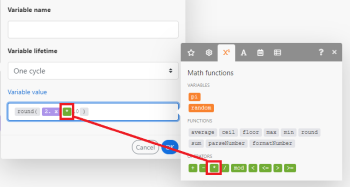

# Mappare informazioni da un modulo a un altro in [!DNL Adobe Workfront Fusion]

La mappatura è il processo di assegnazione degli output di un modulo, strutturati in elementi, ai campi di input di un altro modulo.

Il pannello di mappatura viene visualizzato quando si fa clic su un campo in cui si desidera inserire un valore generato da un modulo precedente in uno scenario. All&#39;interno di un modulo, in qualsiasi campo disponibile per la mappatura, puoi creare una formula utilizzando una combinazione qualsiasi di funzioni ed elementi mappati dal pannello di mappatura con testo statico digitato. Questi elementi possono essere nidificati uno all’interno dell’altro.

## Requisiti di accesso

Per utilizzare le funzionalità di questo articolo, è necessario disporre dei seguenti diritti di accesso:

<table style="table-layout:auto">
 <col> 
 <col> 
 <tbody> 
  <tr> 
    <td role="rowheader">[!DNL Adobe Workfront] piano*</td> 
   <td> 
[!DNL Pro] o superiore
 </td> 
  </tr> 
  <tr data-mc-conditions=""> 
   <td role="rowheader">[!DNL Adobe Workfront] licenza*</td> 
   <td> 
[!UICONTROL Plan], [!UICONTROL Work]
 </td> 
  </tr> 
  <tr> 
   <td role="rowheader">Licenza [!UICONTROL Adobe Workfront Fusion]**</td> 
   <td> 
[!UICONTROL [!DNL Workfront Fusion] per automazione e integrazione del lavoro] 
  </td> 
  </tr> 
  <tr> 
   <td role="rowheader">Prodotto</td> 
   <td>La tua organizzazione deve acquistare [!DNL Adobe Workfront Fusion] nonché [!DNL Adobe Workfront] per utilizzare le funzionalità descritte in questo articolo.</td> 
  </tr> 
 </tbody> 
</table>

Per sapere quale piano, tipo di licenza o accesso hai, contatta il tuo [!DNL Workfront] amministratore.

Per informazioni su [!DNL Adobe Workfront Fusion] licenze, vedi [[!DNL Adobe Workfront Fusion] licenze](../../workfront-fusion/get-started/license-automation-vs-integration.md).

## Bundle ed elementi

Il funzionamento di un modulo produce come output zero, uno o più bundle. Un bundle è costituito da uno o più elementi.

Per esplorare l’output di un modulo:

1. Fai clic su **[!UICONTROL Esegui una volta]** per eseguire il modulo.
1. Fai clic sulla bolla sopra il modulo.

   Viene visualizzato un registro contenente tutte le fasi del modulo. Puoi trovare il bundle o i bundle in uscita dalla fase operativa di un modulo nella sezione **[!UICONTROL Uscita]** intestazione. Ogni bundle contiene i suoi elementi e i valori di ogni elemento.

>[!INFO]
>
>**Esempio:** Questo esempio mostra il modulo [!UICONTROL E-mail] > [!UICONTROL Guarda le e-mail]. Si può vedere che ha eseguito 1 operazione producendo un singolo bundle che contiene vari elementi come `Date`, `Email ID (UID)`, `size`e così via.
>
>

>[!NOTE]
>
>Le uscite dai moduli racchiusi tra un [!UICONTROL Iteratore] e [!UICONTROL Aggregatore] non sono accessibili oltre [!UICONTROL Aggregatore] modulo .

## Mappare un elemento

Dopo aver creato una sequenza di moduli collegandone due o più, ogni modulo può elaborare i valori degli elementi generati dai moduli che lo precedono.

Per assegnare gli elementi ai campi di input di un modulo:

1. Fare clic sul modulo che deve elaborare l&#39;output del modulo o dei moduli precedenti.
1. Nel pannello Impostazioni modulo visualizzato, fare clic su un campo in cui si desidera utilizzare il valore di un elemento generato da uno o più moduli precedenti.

   Viene visualizzato il pannello di mappatura .

1. Fai clic su un elemento del pannello di mappatura per inserirlo nel campo .
1. (Facoltativo) Per cercare un particolare campo nel pannello di mappatura, fai clic sulla barra di ricerca del pannello di mappatura e digita il termine che desideri cercare. Fai clic sul campo quando viene visualizzato nell’elenco.

   I risultati della ricerca contengono il termine di ricerca e non distinguono tra maiuscole e minuscole.

Per ulteriori informazioni, consulta [Configura le impostazioni di un modulo in [!DNL Adobe Workfront Fusion]](../../workfront-fusion/modules/configure-a-modules-settings.md).

## Formule

È possibile mappare più elementi in un campo, combinarli con valori letterali (valori fissi) e utilizzare Operatori e Funzioni per creare formule complesse:

Puoi trovare le funzioni e gli operatori nel pannello di mappatura sotto una delle relative schede.

La prima scheda  (mostrato all’apertura del pannello) mostra gli elementi che è possibile mappare da altri moduli.

Le altre schede contengono i seguenti tipi di funzioni:

* **Funzioni generali**  - Vedi [Funzioni generali in [!DNL Adobe Workfront Fusion]](../../workfront-fusion/functions/general-functions.md) per ulteriori informazioni.

* **Funzioni matematiche**  - Vedi [Funzioni matematiche in [!DNL Adobe Workfront Fusion]](../../workfront-fusion/functions/math-functions.md) per ulteriori informazioni.

* **Funzioni di testo e binarie**  - Vedi [Funzioni stringa in [!DNL Adobe Workfront Fusion]](../../workfront-fusion/functions/string-functions.md) per ulteriori informazioni.

* **Data e ora**  - Vedi [Funzioni di data e ora in [!DNL Adobe Workfront Fusion]](../../workfront-fusion/functions/date-and-time-functions.md) e gli articoli seguenti per ulteriori informazioni.

   * [Token per la formattazione di data e ora in [!DNL Adobe Workfront Fusion]](../../workfront-fusion/functions/tokens-for-date-and-time-formatting.md)
   * [Token per l’analisi di data e ora in Adobe Workfront Fusion](../../workfront-fusion/functions/tokens-for-date-and-time-parsing.md)

* **Funzioni per l’utilizzo degli array**  - Vedi [Funzioni array in [!DNL Adobe Workfront Fusion]](../../workfront-fusion/functions/array-functions.md) per ulteriori informazioni.

>[!TIP]
>
>Quando si crea una formula complessa che si desidera riutilizzare in un altro campo, è possibile fare clic sul campo contenente la combinazione, utilizzare Comando-A o Ctrl-A per selezionarla, quindi copiarla e incollarla nell&#39;altro campo.

Per ulteriori informazioni sulla mappatura degli elementi che utilizzano le funzioni, consulta [Mappare gli elementi utilizzando le funzioni in [!DNL Adobe Workfront Fusion]](../../workfront-fusion/functions/map-using-functions.md).

## Raccolte

Alcuni elementi possono contenere più valori di vari tipi. Si tratta di elementi di tipo raccolta.

Puoi identificare un [!UICONTROL raccolta] digitare l&#39;elemento in base al piccolo rettangolo nero visualizzato a destra dell&#39;etichetta dell&#39;elemento e al relativo elenco espanso automaticamente di elementi secondari:

>[!NOTE]
>
>Nella maggior parte dei casi, mappa i sotto-elementi della raccolta anziché l&#39;elemento che rappresenta l&#39;intera raccolta.

Per ulteriori informazioni sulle raccolte, vedi [Tipi di dati degli elementi in [!UICONTROL Adobe Workfront Fusion]](../../workfront-fusion/mapping/item-data-types.md)

## Array

Alcuni elementi possono contenere più elementi dello stesso tipo. Si tratta di elementi di tipo array.

È possibile identificare un elemento di tipo matrice utilizzando le parentesi quadre alla fine dell&#39;etichetta dell&#39;elemento. Fai clic sul piccolo rettangolo nero a destra dell’etichetta dell’elemento per visualizzare gli elementi dell’elemento:

Per ulteriori informazioni sugli array, consulta [Tipi di dati degli elementi in [!DNL Adobe Workfront Fusion]](../../workfront-fusion/mapping/item-data-types.md)

### Mappare il primo elemento di un array

Se si esegue la mappatura di un array `Recipient name` viene visualizzato nel campo in questo modo:

Il numero tra parentesi quadre è un indice che determina quale elemento della matrice verrà utilizzato. Per impostazione predefinita, è impostato su 1.

### Mappare l’elemento n-esimo di un array

Per accedere a un altro elemento, fai clic sulle parentesi quadre e modifica il valore di indice:

### Mappare un elemento di un array con una determinata chiave

Alcuni array contengono diverse raccolte con elementi chiave e valore. Si tratta in genere di vari metadati, attributi e così via.

L&#39;esempio seguente mostra l&#39;output del [!DNL Jira] App.

In questo esempio, otteniamo un nome di file da una matrice di allegati per l&#39;allegato specifico con un ID di 10108.

Uscita da [!DNL Jira] si presenta così:

Il requisito tipico consiste nel cercare un elemento in base al suo valore chiave specificato e ottenere il valore corrispondente dall’elemento valore. Questo può essere ottenuto con una formula che utilizza una combinazione di `map()` e `get()` funzioni.

Di seguito è riportata una ripartizione dettagliata della formula:

1. Il primo parametro della `map()` è l&#39;intero elemento dell&#39;array.
1. Il secondo parametro è il nome non elaborato dell’elemento di valore. Per ottenere il nome non elaborato, passa il puntatore del mouse sull&#39;elemento nel [!UICONTROL mappatura] pannello:

   

   >[!NOTE]
   >
   >Tutti i parametri sono sensibili all’uso di maiuscole e minuscole. Anche se in questo particolare esempio l&#39;etichetta dell&#39;articolo differisce dal suo nome non elaborato solo in maiuscolo, è necessario utilizzare il nome non elaborato, che è tutto il valore minuscolo in contrasto con il valore dell&#39;etichetta Valore.

1. Il terzo parametro è il nome non elaborato dell’elemento chiave:

   

1. Il quarto parametro è il valore chiave dato.

Perché `map()` la funzione restituisce un array (poiché ci potrebbero essere più elementi con il valore chiave specificato), è necessario applicare il `get()` funzione per ottenere il suo primo elemento:

* Il primo parametro del `get()` è il risultato della `map()` funzione .

* Il secondo parametro è l&#39;indice dell&#39;elemento - uno.

Per ulteriori informazioni sulla `map()` funzione, vedere [Funzioni array in [!DNL Adobe Workfront Fusion]](../../workfront-fusion/functions/array-functions.md).

Per ulteriori informazioni sulla `get()` funzione, vedere [Funzioni generali in [!DNL Adobe Workfront Fusion]](../../workfront-fusion/functions/general-functions.md).

## Conversione di elementi in una serie di bundle

Gli array possono essere convertiti in una serie di bundle utilizzando [!UICONTROL Iteratore] modulo . Per ulteriori informazioni, consulta [[!UICONTROL Iteratore] modulo in [!UICONTROL Adobe Workfront Fusion]](../../workfront-fusion/modules/iterator-module.md).

## Risoluzione dei problemi

### Elementi mancanti nel pannello di mappatura

Per ciascun modulo, il pannello di mappatura visualizza tutti gli elementi di output, elencati dall’autore del modulo. In alcuni casi, questo elenco potrebbe essere incompleto per vari motivi e alcuni elementi potrebbero mancare. [!DNL Workfront Fusion] è in grado di individuare automaticamente gli elementi di output mancanti quando esegui il modulo nell’editor di scenari. La procedura esatta varia leggermente a seconda del tipo del modulo:

#### Trigger istantaneo

1. Fai clic con il pulsante destro del mouse sul modulo, quindi fai clic su **[!UICONTROL Esegui solo questo modulo]** nel menu visualizzato.

   Se non ci sono webhook in coda, il modulo attende che un nuovo webhook venga elaborato.

1. Genera un webhook.

   Ad esempio, il modulo webhook **[!DNL Slack]>[!UICONTROL Ascoltare nuovi eventi]** (che controlla i nuovi messaggi di canale in un canale) invia un messaggio al canale.

1. Al termine dell&#39;esecuzione del modulo, fai clic sulla bolla sopra il modulo per esaminarne l&#39;output completo.

   Il pannello di mappatura contiene tutti gli elementi rilevati nell’output del modulo.

#### Trigger di polling

1. Fai clic con il pulsante destro del mouse sul modulo, quindi fai clic su **[!UICONTROL Esegui solo questo modulo]** nel menu visualizzato.
1. Se non è presente alcun output, fai clic su **[!UICONTROL Scegli da dove iniziare]** e regolare le impostazioni.
1. Se non è presente alcun evento da elaborare, creane uno e torna al passaggio 2.

   Ad esempio, il modulo webhook **[!UICONTROL Gmail] >[!UICONTROL Guarda le e-mail]** invia un messaggio e-mail alla cartella che il modulo sta guardando.

1. Al termine dell&#39;esecuzione del modulo, fai clic sulla bolla sopra il modulo per esaminarne l&#39;output completo.

   Il pannello di mappatura ora contiene tutti gli elementi rilevati nell’output del modulo.

#### Altri moduli

Puoi scegliere di eseguire:

* L&#39;intero scenario (o solo la parte contenente il modulo)

   Se lo scenario inizia con un trigger, fai riferimento alla [Trigger istantaneo](#instant-trigger) o [Trigger di polling](#polling-trigger) sezione precedente.

* Solo il singolo modulo

Se scegli di eseguire solo il modulo singolo:

1. Fai clic con il pulsante destro del mouse sul modulo, quindi fai clic su **[!UICONTROL Esegui solo questo modulo]** nel menu visualizzato.
1. Fornisci valori di esempio per gli elementi di input, quindi fai clic su **[!UICONTROL OK]** .
1. Al termine dell&#39;esecuzione del modulo, fai clic sulla bolla sopra il modulo per esaminarne l&#39;output completo.

   Il pannello di mappatura ora contiene tutti gli elementi rilevati nell’output del modulo.
