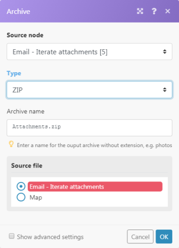

# [!UICONTROL Aggregatore] modulo in [!DNL Adobe Workfront Fusion]

Un modulo aggregatore è un tipo di modulo progettato per unire diversi bundle di dati in un unico bundle.

Per ulteriori informazioni sui tipi di moduli, consulta [Tipi di moduli](../../workfront-fusion/modules/module-types.md).

## Requisiti di accesso

Per utilizzare le funzionalità di questo articolo, è necessario disporre dei seguenti diritti di accesso:

<table style="table-layout:auto">
 <col> 
 <col> 
 <tbody> 
  <tr> 
    <td role="rowheader">[!DNL Adobe Workfront] piano*</td> 
   <td> 
[!DNL Pro] o superiore
 </td> 
  </tr> 
  <tr data-mc-conditions=""> 
   <td role="rowheader">[!DNL Adobe Workfront] licenza*</td> 
   <td> 
[!UICONTROL Plan], [!UICONTROL Work]
 </td> 
  </tr> 
  <tr> 
   <td role="rowheader">Licenza [!UICONTROL Adobe Workfront Fusion]**</td> 
   <td> 
[!UICONTROL [!DNL Workfront Fusion] per automazione e integrazione del lavoro] 
  </td> 
  </tr> 
  <tr> 
   <td role="rowheader">Prodotto</td> 
   <td>La tua organizzazione deve acquistare [!DNL Adobe Workfront Fusion] nonché [!DNL Adobe Workfront] per utilizzare le funzionalità descritte in questo articolo.</td> 
  </tr> 
 </tbody> 
</table>

Per sapere quale piano, tipo di licenza o accesso hai, contatta il tuo [!DNL Workfront] amministratore.

Per informazioni su [!DNL Adobe Workfront Fusion] licenze, vedi [[!DNL Adobe Workfront Fusion] licenze](../../workfront-fusion/get-started/license-automation-vs-integration.md).

## [!UICONTROL Aggregatore] modulo

Quando un [!UICONTROL Aggregatore] Il modulo viene eseguito ed esegue le seguenti operazioni:

* Accumula tutti i bundle ricevuti durante l&#39;operazione di un singolo modulo di origine.
* Trasmette un singolo bundle con un array contenente un elemento per ogni bundle accumulato. Il contenuto degli elementi dell&#39;array dipende da [!UICONTROL Aggregatore] modulo e relativa configurazione.

L&#39;immagine seguente mostra una configurazione tipica della [!UICONTROL Aggregatore] modulo :

<table style="table-layout:auto">
 <col> 
 <col> 
 <tbody> 
  <tr> 
   <td> 
[!UICONTROL Source Module]
 </td> 
   <td> 
Il modulo da cui verrà avviata l'aggregazione del bundle. Il modulo sorgente è di solito un iteratore o un modulo di ricerca che produce una serie di bundle. Quando si imposta il modulo di origine dell'aggregatore (e si chiude la configurazione dell'aggregatore), il percorso tra il modulo di origine e il modulo di aggregazione viene racchiuso in un'area grigia in modo da visualizzare chiaramente l'inizio e la fine dell'aggregazione. 
   
 
Per ulteriori informazioni sugli iteratori, vedi <a href="../../workfront-fusion/modules/iterator-module.md" class="MCXref xref">Modulo iteratore in [!DNL Adobe Workfront Fusion]</a>
 
Per ulteriori informazioni sui moduli di ricerca, vedi Moduli di ricerca in <a href="../../workfront-fusion/modules/module-types.md" class="MCXref xref">Tipi di moduli</a>.
 </td> 
  </tr> 
  <tr> 
   <td> 
[!UICONTROL Tipo di struttura di Target]
 </td> 
   <td> 
(Applicabile solo per il modulo [!UICONTROL Array aggregator].) La struttura del target in cui i dati devono essere aggregati. L'opzione predefinita, Personalizzato, consente di scegliere gli elementi da aggregare nel bundle di output dell'aggregatore a raggi A[!UICONTROL] <code>Array </code>articolo:
 
  
 
Una volta che si collegano più moduli dopo il modulo [!UICONTROL Array aggregator] e si torna alla configurazione del modulo, il menu a discesa del tipo di struttura [!UICONTROL Target] conterrà tutti i moduli seguenti e i relativi campi che sono di tipo Array of Collections, come mostrato nel campo [!UICONTROL Attachments] del [!DNL Slack] &gt; Modulo[!UICONTROL Create a Message] (Crea un messaggio):
 
  
 </td> 
  </tr> 
  <tr> 
   <td>[!UICONTROL Aggregated fields]</td> 
   <td>Selezionare i campi che si desidera includere nell'output del modulo aggregatore.</td> 
  </tr> 
  <tr> 
   <td> 
[!UICONTROL Group by]
 </td> 
   <td> 
L'output dell'aggregatore può essere suddiviso in diversi gruppi con l'aiuto del campo [!UICONTROL Group by] . Il campo [!UICONTROL Group by] può contenere una formula valutata per ciascun bundle di input dell'aggregatore. L'aggregatore quindi genera un bundle per ogni valore della formula distinta. Ogni bundle contiene due elementi:
 
    <ul> 
     <li><code>Key </code>contiene il valore distinto.</li> 
     <li><code>Array </code>contiene i dati aggregati dei bundle per i quali la formula è valutata al <code>Key </code>valore.</li> 
    </ul> </td> 
  </tr> 
  <tr> 
   <td> 
Interrompi elaborazione dopo un'aggregazione vuota
 </td> 
   <td> 
Per impostazione predefinita, il modulo [!UICONTROL Aggregator] restituisce il risultato dell'aggregazione anche nel caso in cui nessun bundle abbia raggiunto il modulo [!UICONTROL Aggregator] (ad esempio, perché sono stati tutti filtrati nel loro percorso). Se l’opzione [!UICONTROL Interrompe l’elaborazione dopo l’abilitazione di un’aggregazione vuota], il modulo [!UICONTROL Aggregator] non produrrà alcun bundle di output in questo caso e il flusso si arresterà.
 </td> 
  </tr> 
 </tbody> 
</table>

>[!NOTE]
>
>Bundle generati dai moduli tra il modulo di origine e il [!UICONTROL Aggregatore] il modulo non viene generato dal [!UICONTROL Aggregatore] , in modo che non siano accessibili dai moduli nel flusso dopo il [!UICONTROL Aggregatore]. Se hai bisogno di dati da un bundle messo in uscita da un modulo tra il modulo di origine e il [!UICONTROL Aggregatore] , assicurati di includere l’elemento specificato nel [!UICONTROL Aggregatore] configurazione del modulo (come nel [!UICONTROL Campi aggregati] campo nella configurazione del [!UICONTROL Aggregatore array] modulo).

>[!INFO]
>
>**Esempio:** Caso d’uso: Rimozione di tutti gli allegati e-mail e caricamento dello ZIP in [!DNL Dropbox]
>
>Lo scenario seguente mostra come:
>
>* Guarda una cassetta postale per le e-mail in arrivo: [!UICONTROL E-mail] >[!UICONTROL Guarda le e-mail] il trigger genera un bundle con l’elemento `Attachments[]`, array contenente tutti gli allegati dell’e-mail.
>
>* Itera gli allegati dell’e-mail: [!UICONTROL E-mail] >[!UICONTROL Itera allegati] L&#39;iteratore prende gli elementi dal `Attachments[]` array uno per uno e li invia ulteriormente come bundle separati.
>
>* Aggrega i bundle generati dalla [!UICONTROL E-mail] >[!UICONTROL Itera allegati] modulo: [!UICONTROL Archivia] >[!UICONTROL Creare un aggregatore di archivio] accumula tutti i bundle che riceve ed emette un singolo bundle contenente il file ZIP.
>
>* Carica il file ZIP risultante in [!DNL Dropbox]: [!DNL Dropbox] > [!UICONTROL Caricare un file] ottiene il file ZIP dal [!UICONTROL Archivia] > [!UICONTROL Creare un archivio] e lo carica in [!DNL Dropbox].
>
>
>
>Di seguito è riportato un esempio di configurazione del [!UICONTROL Archivia] > [!UICONTROL Creare un archivio] aggregatore:
>
>
