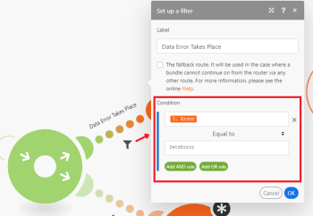

# [!UICONTROL Router] modulo in [!DNL Adobe Workfront Fusion]

Il [!UICONTROL Router] consente di diramare il flusso in più route ed elaborare i dati all&#39;interno di ciascuna route in modo diverso. Una volta al [!UICONTROL Router] il modulo riceve un bundle, lo inoltra a ogni route connessa nell&#39;ordine in cui le route sono state collegate al [!UICONTROL Router] modulo.

>[!NOTE]
>
>* Per verificare l&#39;ordine delle route, è possibile fare clic su [!UICONTROL Allineamento automatico] che organizzerà i percorsi in base all&#39;ordine dall&#39;alto verso il basso.
>
>  Per modificare l&#39;ordine, rimuovere [!UICONTROL Router] e ricollegare le route nell&#39;ordine desiderato.
>
>* Le route vengono elaborate in sequenza, non in parallelo. Un bundle viene inviato alla route successiva solo dopo che è stato completamente elaborato dalla route precedente.
>

## Requisiti di accesso

Per utilizzare le funzionalità di questo articolo, è necessario disporre dei seguenti diritti di accesso:

<table style="table-layout:auto">
 <col> 
 <col> 
 <tbody> 
  <tr> 
    <td role="rowheader">[!DNL Adobe Workfront] piano*</td> 
   <td> 
[!DNL Pro] o superiore
 </td> 
  </tr> 
  <tr data-mc-conditions=""> 
   <td role="rowheader">[!DNL Adobe Workfront] licenza*</td> 
   <td> 
[!UICONTROL Plan], [!UICONTROL Work]
 </td> 
  </tr> 
  <tr> 
   <td role="rowheader">Licenza [!UICONTROL Adobe Workfront Fusion]**</td> 
   <td>
   
Fabbisogno di licenza corrente: No [!DNL Workfront Fusion] requisito di licenza.

   
Oppure

   
Requisito licenza legacy: [!UICONTROL [!DNL Workfront Fusion] per l'automazione e l'integrazione del lavoro] 

   </td> 
  </tr> 
  <tr> 
   <td role="rowheader">Prodotto</td> 
   <td>
   
Fabbisogno prodotto corrente: se si dispone di [!UICONTROL Select] o [!UICONTROL Prime] [!DNL Adobe Workfront] Pianifica, la tua organizzazione deve acquistare [!DNL Adobe Workfront Fusion] nonché [!DNL Adobe Workfront] per utilizzare la funzionalità descritta in questo articolo. [!DNL Workfront Fusion] è incluso in [!UICONTROL Ultimate] [!DNL Workfront] piano.

   
Oppure

   
Requisiti del prodotto legacy: la tua organizzazione deve acquistare [!DNL Adobe Workfront Fusion] nonché [!DNL Adobe Workfront] per utilizzare la funzionalità descritta in questo articolo.

   </td> 
  </tr> 
 </tbody> 
</table>

Per conoscere il piano, il tipo di licenza o l&#39;accesso di cui si dispone, contattare [!DNL Workfront] amministratore.

Per informazioni su [!DNL Adobe Workfront Fusion] licenze, consulta [[!DNL Adobe Workfront Fusion] licenze](../../workfront-fusion/get-started/license-automation-vs-integration.md).

## Aggiunta di un [!UICONTROL Router] modulo a uno scenario

A [!UICONTROL Router] possono essere aggiunte a uno scenario in uno dei seguenti modi:

* Se si desidera collegare [!UICONTROL Router] dopo un modulo, fai clic sull’handle destro del modulo e inizia a digitare **[!UICONTROL router]** per cercarla, scegli **[!UICONTROL Controllo del flusso]** > **[!UICONTROL Router]** nell’elenco dei moduli visualizzato.

  

* Per inserire [!UICONTROL Router] tra due moduli, fai clic sull’icona a forma di chiave inglese posta sotto il percorso che collega i due moduli (oppure fai clic con il pulsante destro del mouse sul percorso) e scegli **[!UICONTROL Aggiungere un router]** dal menu.

  

* È possibile inserire un [!UICONTROL Router] modulo automaticamente. Ad esempio, nell’immagine seguente, per collegare il modulo nell’angolo inferiore destro a quello nell’angolo superiore sinistro (che è già collegato a quello nell’angolo superiore destro), trascina la maniglia sinistra del modulo inferiore destro e rilascialo sul modulo superiore sinistro.

  

## Filtri

È possibile inserire un filtro su un percorso dopo il [!UICONTROL Router] per filtrare i bundle come su qualsiasi altro percorso:

1. Fare clic su uno dei punti del percorso.

   

1. In **[!UICONTROL Impostare un filtro]** che viene visualizzata, aggiungi condizioni, quindi fai clic su **[!UICONTROL OK]** per salvare la configurazione del filtro.

   

Per ulteriori informazioni, consulta [Aggiungere un filtro a uno scenario in [!DNL Adobe Workfront Fusion]](../../workfront-fusion/scenarios/add-a-filter-to-a-scenario.md).

## Route di fallback

Impostazione del filtro su un ciclo di lavorazione dopo un [!UICONTROL Router] Il modulo contiene un’opzione speciale: La route di fallback:

Quando è abilitata, questa route viene utilizzata nel caso in cui un bundle non possa continuare da [!UICONTROL Router] tramite qualsiasi altra route, perché i filtri delle altre route l&#39;hanno filtrata.

La route di fallback si distingue con un segno di freccia diverso all&#39;interno della [!UICONTROL Router] modulo:

## If/Else

Un caso d’uso tipico della route di fallback consiste nel continuare il flusso con una route se la condizione è soddisfatta e con un’altra route in caso contrario, come nei passaggi seguenti:

1. Inserisci un [!UICONTROL Router] nel tuo scenario.
1. Connetti entrambe le route a [!UICONTROL Router] modulo .
1. Fai clic sulla prima route e specifica una condizione:

   

1. Fare clic sulla seconda route e attivare [!UICONTROL route di fallback] opzione:

   
