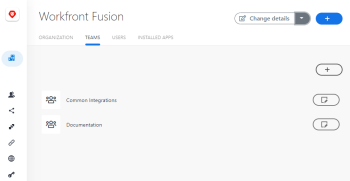

# [!DNL Adobe Workfront Fusion] organizzazioni e team

[!DNL Adobe Workfront Fusion]Le caratteristiche dell&#39;organizzazione e dei team consentono alle aziende di controllare l&#39;accesso a scenari e altre funzionalità in Fusion.

## Requisiti di accesso

Per utilizzare le funzionalità di questo articolo, è necessario disporre dei seguenti diritti di accesso:

<table style="table-layout:auto"> 
 <col> 
 <col> 
 <tbody> 
  <tr> 
    <td role="rowheader">[!DNL Adobe Workfront] piano*</td> 
   <td> 
[!DNL Pro] o superiore
 </td> 
  </tr> 
  <tr> 
   <td role="rowheader">Licenza [!UICONTROL Adobe Workfront Fusion]**</td> 
   <td>
   
Fabbisogno di licenza corrente: No [!DNL Workfront Fusion] requisito di licenza.

   
Oppure

   
Requisito licenza legacy: [!UICONTROL [!DNL Workfront Fusion] per l'automazione e l'integrazione del lavoro], [!UICONTROL [!DNL Workfront Fusion] per automazione lavoro]

   </td> 
  </tr> 
  <tr> 
   <td role="rowheader">Prodotto</td> 
   <td>
   
Fabbisogno prodotto corrente: se si dispone di [!UICONTROL Select] o [!UICONTROL Prime] [!DNL Adobe Workfront] Pianifica, la tua organizzazione deve acquistare [!DNL Adobe Workfront Fusion] nonché [!DNL Adobe Workfront] per utilizzare la funzionalità descritta in questo articolo. [!DNL Workfront Fusion] è incluso in [!UICONTROL Ultimate] [!DNL Workfront] piano.

   
Oppure

   
Requisiti del prodotto legacy: la tua organizzazione deve acquistare [!DNL Adobe Workfront Fusion] nonché [!DNL Adobe Workfront] per utilizzare la funzionalità descritta in questo articolo.

   </td> 
  </tr> 
  <tr data-mc-conditions=""> 
   <td role="rowheader">Configurazioni del livello di accesso*</td> 
   <td> 
     
Devi essere un [!DNL Workfront Fusion] per la tua organizzazione.

     
Devi essere un [!DNL Workfront Fusion] amministratore del team.

   </td> 
  </tr> 
 </tbody> 
</table>

Per conoscere il piano, il tipo di licenza o l&#39;accesso di cui si dispone, contattare [!DNL Workfront] amministratore.

**Per informazioni su [!DNL Adobe Workfront Fusion] licenze, consulta <a href="../../workfront-fusion/get-started/license-automation-vs-integration.md" class="MCXref xref">[!DNL Adobe Workfront Fusion] licenze</a>

## Organismi

[!DNL Workfront Fusion] gli utenti appartengono a un’organizzazione.

* [Ruoli organizzazione](#organization-roles)
* [Invito di utenti a un&#39;organizzazione](#inviting-users-to-an-organization)
* [Passare da un’organizzazione all’altra](#switch-between-organizations)

### Ruoli organizzazione

Un utente ha uno dei seguenti ruoli in un’organizzazione:

* **[!UICONTROL Proprietario]**: il proprietario dispone di tutte le autorizzazioni disponibili nell’organizzazione.
* **[!UICONTROL Amministratore]**: il ruolo di amministratore consente a un utente di creare e gestire team e utenti per l’organizzazione.
* **[!UICONTROL Membro]**: i membri possono utilizzare [!DNL Workfront Fusion] ma non è in grado di apportare modifiche organizzative.
* **[!UICONTROL Contabile]**: un ruolo di contabile consente agli utenti di visualizzare solo le informazioni sulle licenze nel dashboard dell’organizzazione.
* **[!UICONTROL Sviluppatore di app]**: la funzionalità per questo ruolo non è attualmente disponibile e verrà resa disponibile a breve. Non è consigliabile assegnare gli utenti a questo ruolo in questo momento.

### Invito di utenti a un&#39;organizzazione

Per impostazione predefinita, il proprietario di un’organizzazione (o l’utente autorizzato) può invitare un’altra persona a partecipare all’organizzazione.

Per invitare un utente a partecipare a un&#39;organizzazione:

1. Clic **[!UICONTROL Modifica dettagli]** nell&#39;angolo superiore destro dello schermo.
1. Seleziona **[!UICONTROL Invita un nuovo utente]**.

   

1. Inserisci l’indirizzo e-mail e il nome dell’utente.
1. Selezionare un ruolo per l&#39;utente. Per ulteriori informazioni sui ruoli, consulta [Ruoli organizzazione](#organization-roles) in questo documento.
1. (Facoltativo) Aggiungi una nota. Questa nota viene visualizzata nell&#39;e-mail di invito ricevuta dall&#39;utente.
1. Fai clic su **[!UICONTROL Salva]**.

[!DNL Fusion] invia un’e-mail con un invito all’organizzazione specifica e un [!UICONTROL Accetta Il Ruolo] pulsante.

Quando il destinatario fa clic sul pulsante, viene reindirizzato alla pagina dell’invito, dove può accettare l’invito.

L&#39;invito scadrà tra un giorno.

>[!NOTE]
>
>Se l’utente è nuovo su [!DNL Fusion], [!DNL Fusion] crea automaticamente un account per loro e invia un’e-mail con una password temporanea, chiedendo al nuovo utente di accedere e modificare la propria password.

### Passare da un’organizzazione all’altra

È possibile far parte di più organizzazioni in Fusion. Le risorse non sono condivise tra le organizzazioni.

Per cambiare organizzazione all’interno dell’esperienza unificata di Adobe, fai clic sul nome dell’organizzazione nell’angolo in alto a destra e seleziona la nuova organizzazione dal menu a discesa. Solo le organizzazioni con un account di Fusion verranno visualizzate nel menu a discesa, anche se sei membro di altre organizzazioni in Adobe.

## Team

I team sono gruppi di utenti che condividono l’accesso a risorse specifiche. Tali risorse possono includere:

* Scenari
* Connessioni
* Webhook
* Chiavi
* Archivi dati
* Strutture di dati
* Impostazioni delle notifiche e-mail

>[!NOTE]
>
>Poiché i team controllano l’accesso alle risorse, a volte è utile che abbiano un solo membro. Ad esempio, gli utenti in formazione possono creare connessioni con il proprio utente [!DNL Google] account. Tutti i membri del gruppo possono connettersi alla persona [!DNL Google] quindi, in questo caso è meglio che l’utente sia l’unico membro di un team di formazione.

Le organizzazioni possono disporre di tutti i team necessari e gli utenti possono appartenere a uno o più team.

Gli utenti possono selezionare il proprio team dall’elenco a discesa nel pannello di navigazione a sinistra. Gli utenti visualizzano solo i team di cui sono membri. La selezione di un team consente a un utente di accedere alle risorse del team.

* [Ruoli di team](#team-roles)
* [Gestione team](#team-management)

### Ruoli di team

Un utente ha uno dei seguenti ruoli in ciascuno dei propri team:

* **[!UICONTROL Amministratore team]**: oltre alle funzionalità degli altri ruoli del team, il ruolo Amministratore consente all’utente di aggiungere, rimuovere o modificare il ruolo di un membro del team.
* **[!UICONTROL Membro team]**: il ruolo di membro del team consente agli utenti di creare ed eseguire scenari.
* **[!UICONTROL Monitoraggio team]**: Il [!UICONTROL monitoraggio] Il ruolo consente agli utenti di accedere alle informazioni di esecuzione per gli scenari, ma non sono in grado di progettare scenari o di modificare il loro stato &quot;Attivo&quot;.
* **[!UICONTROL Operatore team]**: Il [!UICONTROL operatore] Il ruolo consente agli utenti di visualizzare i dati di esecuzione e modificare lo stato &quot;Attivo&quot; degli scenari.
* **[!UICONTROL Membro con restrizioni team]**: la funzionalità per questo ruolo non è attualmente disponibile e verrà resa disponibile a breve. Non è consigliabile assegnare gli utenti a questo ruolo in questo momento.

### Gestione team

* [Creare un team](#create-a-team)
* [Imposta opzioni di notifica team](#set-team-notification-options)

#### Creare un team

I proprietari e gli amministratori dell’organizzazione possono creare dei team.

Per creare un team:

1. Nel pannello di navigazione a sinistra, fai clic su **[!UICONTROL Organizzazione]**
1. Seleziona la **[!UICONTROL Team]** scheda.
1. Clic **[!UICONTROL Aggiungi un nuovo team]** nell’elenco dei team.
1. Immettere un nome per il nuovo team e fare clic su **Aggiungi**.

#### Imposta opzioni di notifica team

Le opzioni di notifica e-mail sono impostate a livello di team.

1. Nel pannello di navigazione a sinistra, fai clic su **[!UICONTROL Team]**
1. Seleziona la **[!UICONTROL Opzioni di notifica]** scheda.
1. Abilitare le notifiche che si desidera vengano ricevute dal team.

   <table style="table-layout:auto"> 
    <col> 
    <col> 
    <tbody> 
     <tr> 
      <td role="rowheader">'[!UICONTROL Warning in esecuzione scenario]'</td> 
      <td> 
Ricevi un’e-mail quando viene visualizzato un avviso in un’esecuzione di uno scenario
 </td> 
     </tr> 
     <tr> 
      <td role="rowheader">[!UICONTROL Errori nell'esecuzione dello scenario]</td> 
      <td>Ricevi un’e-mail quando si verifica un errore in un’esecuzione di uno scenario.</td> 
     </tr> 
     <tr> 
      <td role="rowheader"> 
[!UICONTROL Disattivazione scenario]
 </td> 
      <td>
Ricevi un’e-mail quando uno scenario si disattiva.

<b>Nota:</b> Viene inviata una notifica sulla disattivazione dello scenario solo quando lo scenario è stato disattivato automaticamente a causa di errori. Non ricevi notifiche su scenari disattivati manualmente.

In alcuni casi, uno scenario potrebbe essere disattivato dalla [!DNL Workfront Fusion] team tecnico perché lo scenario causa problemi di prestazioni o di altro tipo. In questi casi, non ricevi notifiche in [!DNL Workfront Fusion]. 
</td>

</tr>
</tbody>
</table>

Le modifiche alle opzioni di notifica vengono salvate automaticamente

#### Passa da un team all’altro

È possibile far parte di più team in Fusion. Poiché i team non condividono le risorse, potrebbe essere necessario cambiare team per accedere a scenari specifici o ad altre risorse.

Se la tua organizzazione non fa parte dell’esperienza unificata di Adobe, puoi cambiare team facendo clic sul nome del team nell’area di navigazione a sinistra, quindi selezionando un team dal menu a discesa.

Se il tuo team fa parte dell’esperienza unificata di Adobe, puoi selezionare un nuovo team facendo clic sul nome del team nell’intestazione e selezionando un team dal menu a discesa. Questa opzione è disponibile in tutte le pagine specifiche di un determinato team, ad esempio la pagina di uno scenario o la pagina Connessioni.

<!--

  

-->