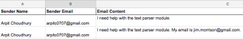

# [!DNL Adobe Workfront Fusion] esempio di scenario: Connessione di e-mail, [!UICONTROL Analizzatore di testo]e [!DNL Google Sheets]

Questo scenario consente di creare un registro di tutti i messaggi e-mail e di assegnargli tag per ulteriori azioni in un foglio di calcolo. Acquisisce un corpo e-mail in due tabelle separate in un foglio di calcolo utilizzando Espressioni regolari (Regex) come pattern di ricerca. Il primo pattern cerca una frase e il secondo cerca la stessa frase e un indirizzo e-mail.

## Requisiti di accesso

Per utilizzare le funzionalità di questo articolo, è necessario disporre dei seguenti diritti di accesso:

<table style="table-layout:auto"> 
 <col> 
 <col> 
 <tbody> 
  <tr> 
    <td role="rowheader">[!DNL Adobe Workfront] piano*</td> 
   <td> 
[!DNL Pro] o superiore
 </td> 
  </tr> 
  <tr data-mc-conditions=""> 
   <td role="rowheader">[!DNL Adobe Workfront] licenza*</td> 
   <td> 
[!UICONTROL Plan], [!UICONTROL Work]
 </td> 
  </tr> 
  <tr> 
   <td role="rowheader">Licenza [!UICONTROL Adobe Workfront Fusion]**</td> 
   <td> 
[!UICONTROL [!DNL Workfront Fusion] per automazione e integrazione del lavoro] 
  </td> 
  </tr> 
  <tr> 
   <td role="rowheader">Prodotto</td> 
   <td>La tua organizzazione deve acquistare [!DNL Adobe Workfront Fusion] nonché [!DNL Adobe Workfront] per utilizzare le funzionalità descritte in questo articolo.</td> 
  </tr> 
 </tbody> 
</table>

Per sapere quale piano, tipo di licenza o accesso hai, contatta il tuo [!DNL Workfront] amministratore.

Per informazioni su [!DNL Adobe Workfront Fusion] licenze, vedi [[!DNL Adobe Workfront Fusion] licenze](../../workfront-fusion/get-started/license-automation-vs-integration.md).

## Prerequisiti

Questa esercitazione richiede la conoscenza di base delle espressioni regolari. Per saperne di più su Regex, visita [https://regexone.com](https://regexone.com/).

Aggiungi il primo modulo e configuralo

1. Cerca e-mail e scegli **[!UICONTROL Guarda le e-mail]** come attivatore.

   >[!NOTE]
   >
   >Mentre è possibile collegare un [!DNL Google] conto che utilizza l&#39;Emodulo di posta elettronica, è inoltre possibile utilizzare un [!DNL Gmail] modulo .

1. Connetti uno dei due [!DNL Google] account o qualsiasi altro client e-mail basato su IMAP (ad esempio [!DNL Outlook]).
1. Una volta connesso, seleziona una cartella di cui desideri visualizzare le e-mail in arrivo, ad esempio [!UICONTROL Inbox].
1. Sotto [!UICONTROL Criteri], scegli **[!UICONTROL Tutte le e-mail]** (o limitalo per leggere o leggere e-mail).

   Puoi anche scegliere di contrassegnare le e-mail recuperate come lette o non lette.

1. Imposta la [!UICONTROL Numero massimo di risultati] a 1.

   

   Puoi modificarlo in base al volume dei messaggi ricevuti. Tuttavia, si consiglia di impostare un valore basso ed eseguire lo scenario più spesso.

1. Fai clic su **[!UICONTROL Mostra impostazioni avanzate]** in basso.

   

1. Filtrare le e-mail in base al [!UICONTROL Indirizzo mittente], [!UICONTROL Oggetto] e [!UICONTROL Frase].

   Questo ti consente di guardare solo le e-mail rilevanti. In questo esempio, abbiamo aggiunto solo un filtro Oggetto e lasciato gli altri 2 vuoti.

   >[!NOTE]
   >
   >Aggiungeremo un router per cercare frasi in un&#39;e-mail utilizzando [!UICONTROL Pattern di corrispondenza] iteratore e espressione regolare (Regex) come pattern di ricerca. Questo ci permette anche di creare uno scenario multiutilità.

1. Al termine della configurazione e viene richiesto di specificare dove iniziare a guardare le e-mail, fai clic su **[!DNL From now on]**.

   

1. Continua a [Cerca [!UICONTROL Controllo del flusso] e aggiungi un [!UICONTROL Router]](#search-for-flow-control-and-add-a-router)

## Cerca [!UICONTROL Controllo del flusso] e aggiungi un [!UICONTROL Router]

1. Aggiungere un router dopo un modulo per dividere o duplicare i dati prima di inviarli al modulo successivo.

   Qui abbiamo utilizzato un [!UICONTROL Router] per inviare il testo del corpo dell’e-mail a 2 tabelle separate in una [!DNL Google Sheet].

   

## Utilizza la [!UICONTROL Analizzatore di testo] Modulo

1. Aggiungi un [!UICONTROL Pattern di corrispondenza] trasformatore per cercare una frase in un’e-mail.

   Cercheremo la frase &quot;[!UICONTROL modulo parser di testo]&quot; in tutte le e-mail in arrivo per acquisire il testo del corpo e il nome del mittente di quelli che corrispondono a tale frase.

   1. Scrivere il pattern come espressione regolare:

      text\sparser\smodule

   1. (Facoltativo) Utilizza una qualsiasi delle altre opzioni Pattern.

      

      Multiline è utile se il testo contiene più righe ed è necessario cercare il pattern in ogni riga. Per questa esercitazione dobbiamo cercare il pattern nell’intero testo del corpo dell’e-mail, quindi lo lasceremo deselezionato.

   1. In [!UICONTROL Testo] campo , fai clic sull&#39;attributo **Contenuto testo** nell&#39;elenco.

      

      Questo è l’attributo che memorizza il testo dal corpo dell’e-mail in cui cercheremo il pattern.

1. Aggiungi un altro [!UICONTROL Pattern di corrispondenza] cerca la stessa frase e un indirizzo e-mail.

   Questa funzione è particolarmente utile se disponi di account cliente con più utenti. Per risparmiare tempo, puoi clonare il [!UICONTROL Analizzatore di testo] modulo appena creato e collegarlo al Router.

   

1. Modificate il pattern come segue:

   text\sparser\smodule.+\s([\w.-]+@[\w.-]+)

   

   Questo modello cerca la frase &quot;[!UICONTROL modulo parser di testo]&quot; e un indirizzo e-mail come john.doe@gmail.com e restituisce solo l’indirizzo e-mail.

   >[!NOTE]
   >
   >È importante scrivere il tuo regex in conformità con le specifiche degli indirizzi e-mail che accetti, ma quello di cui sopra si occupa degli indirizzi e-mail più standard.

   * Se desideri cercare solo l’indirizzo e-mail, puoi utilizzare il regex qui sotto:

      ([\w.-]+@[\w.-]+)

   * Puoi anche cercare solo i numeri di telefono utilizzando il regex qui sotto:

      ^[+]?\(?(\d{1,3})\)?[\s-]?\(?(\d{3})\)?[\s-]?\d{3}[\s-]?\d{3,4} Il pattern di cui sopra copre i formati più comuni in cui viene scritto un numero di telefono.
   Per testare i pattern, si consiglia di utilizzare [[!DNL https://regex101.com]](https://regex101.com/) con [!DNL javascript] come il Sapore.

   Il resto della configurazione rimane uguale a quello precedente.

## Aggiungi il [!DNL Google Sheets] moduli

Per [!DNL Sheets], devi innanzitutto creare un foglio di calcolo con le intestazioni richieste.

1. Crea un foglio di calcolo con le colonne in cui desideri acquisire i dati utente. (puoi anche utilizzare un file esistente).

   Ad esempio, creane uno chiamato &quot;Dati e-mail: Ticket di supporto&quot; con Nome mittente, Invia e-mail e Contenuto e-mail come colonne. Denomina il foglio di lavoro &quot;contiene: modulo parser di testo.&quot;

1. Aggiungi il [!UICONTROL Fogli Google] modulo con **[!UICONTROL Aggiungi una riga]** come azione.

   

1. Collega il tuo [!DNL Google] (se non lo hai già fatto). Scegliere il file creato in precedenza, quindi scegliere il foglio di lavoro in cui si acquisiscono i dati.

   La configurazione dovrebbe essere simile a questa:

   

1. Mappa gli attributi nei campi pertinenti (colonne) per completare la configurazione del modulo.

   

1. Clona il modulo appena creato e lo collega al secondo [!UICONTROL Analizzatore di testo] modulo .

   1. Passare al foglio di calcolo, duplicare il foglio di lavoro creato in precedenza e assegnargli un nome.

      Ad esempio, denominalo &quot;contiene: modulo parser testuale ed e-mail.&quot;

   1. Aggiungi un’altra colonna per memorizzare l’indirizzo e-mail contenuto nel corpo dell’e-mail.

      Ad esempio, denominalo &quot;Email Address Shared&quot;.

   1. Fai clic sul duplicato [!DNL Google Sheets] modulo per configurare la configurazione.
   1. Modificare il foglio di lavoro in quello appena creato.
   1. Mappare l&#39;output dal [!UICONTROL Pattern di corrispondenza] modulo ($1) nella colonna in cui si desidera memorizzare l&#39;indirizzo e-mail (Indirizzo e-mail condiviso).

      

      

   1. Fai clic su **[!UICONTROL OK]**, salva lo scenario e lo accetta per un&#39;esecuzione di test.

      Dovrai inviare due e-mail separate all’indirizzo e-mail connesso come segue:

      * Contenente la frase &quot;[!UICONTROL modulo parser di testo]&quot; (e nessun indirizzo e-mail)

         

      * Contenente la frase di cui sopra e un indirizzo e-mail

         

         Se non ci sono errori nella configurazione, vedrai che il primo foglio di lavoro acquisisce tutte le e-mail contenenti la frase &quot;[!UICONTROL modulo parser di testo]&quot; mentre il secondo foglio di lavoro acquisisce solo quelli che contengono la frase &quot;[!UICONTROL modulo parser di testo]&quot; e un indirizzo e-mail. Puoi fare riferimento alle schermate seguenti.

         Foglio di lavoro 1:

         

         Foglio di lavoro 2:

         

## Risorse

* [Esercizi gratuiti](https://regexone.com/) per informazioni sulle espressioni regolari
* [Informazioni sulla corrispondenza del numero di telefono](https://regexone.com/problem/matching_phone_numbers) utilizzo di Regex
* [Scopri la corrispondenza e-mail](https://regexone.com/problem/matching_emails) utilizzo di Regex
* [Test delle espressioni regolari](https://regex101.com/)
