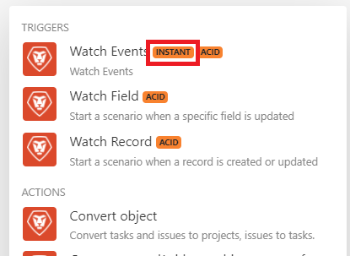

# Trigger istantanei (webhook) in [!DNL Adobe Workfront Fusion]

Molti servizi forniscono webhook per inviare notifiche istantanee ogni volta che si verifica un certo cambiamento nel servizio. Per elaborare queste notifiche, è consigliabile utilizzare attivatori istantanei. È possibile riconoscerli facilmente in [!DNL Adobe Workfront Fusion] a causa del tag :

Se il servizio non fornisce webhook, è necessario utilizzare i trigger di polling per eseguire periodicamente il polling del servizio.

## Requisiti di accesso

Per utilizzare le funzionalità di questo articolo, è necessario disporre dei seguenti diritti di accesso:

<table style="table-layout:auto"> 
 <col> 
 <col> 
 <tbody> 
  <tr> 
    <td role="rowheader">[!DNL Adobe Workfront] piano*</td> 
   <td> 
[!DNL Pro] o superiore
 </td> 
  </tr> 
  <tr data-mc-conditions=""> 
   <td role="rowheader">[!DNL Adobe Workfront] licenza*</td> 
   <td> 
[!UICONTROL Plan], [!UICONTROL Work]
 </td> 
  </tr> 
  <tr> 
   <td role="rowheader">Licenza [!UICONTROL Adobe Workfront Fusion]**</td> 
   <td> 
[!UICONTROL [!DNL Workfront Fusion] per automazione e integrazione del lavoro] 
 
[!UICONTROL [!DNL Workfront Fusion] per automazione del lavoro
  </td> 
  </tr> 
  <tr> 
   <td role="rowheader">Prodotto</td> 
   <td>La tua organizzazione deve acquistare [!DNL Adobe Workfront Fusion] nonché [!DNL Adobe Workfront] per utilizzare le funzionalità descritte in questo articolo.</td> 
  </tr> 
 </tbody> 
</table>

Per sapere quale piano, tipo di licenza o accesso hai, contatta il tuo [!DNL Workfront] amministratore.

Per informazioni su [!DNL Adobe Workfront Fusion] licenze, vedi [[!DNL Adobe Workfront Fusion] licenze](../../workfront-fusion/get-started/license-automation-vs-integration.md).

## Visualizza la coda di un webhook

Tutti i messaggi provenienti dai webhook in arrivo sono memorizzati nella coda del webhook.

1. Fai clic su **[!UICONTROL Webhook]** nel menu a sinistra.
1. Trova il Webhook per il quale desideri visualizzare la coda.
1. Fai clic sul pulsante con un&#39;icona del camion e il numero di webhook ricevuti.

   

   >[!NOTE]
   >
   >I dati del webhook in arrivo vengono sempre memorizzati in coda, indipendentemente da come hai impostato l&#39;opzione [!UICONTROL Dati] è confidenziale (descritto in [Il pannello delle impostazioni dello scenario in [!DNL Adobe Workfront Fusion]](../../workfront-fusion/scenarios/scenario-settings-panel.md)). Non appena i dati vengono elaborati in uno scenario, vengono eliminati definitivamente dal sistema.

## Pianifica attivatori istantanei

Se lo scenario contiene un trigger immediato, puoi pianificare l’esecuzione immediata dello scenario:

In questo caso, lo scenario viene eseguito immediatamente quando [!DNL Workfront Fusion] riceve nuovi dati dal servizio. Dopo l&#39;esecuzione dello scenario, viene conteggiata la quantità totale di webhook in sospeso in attesa nella coda e lo scenario esegue tutti i cicli in attesa di esecuzione dei webhook, elaborando un webhook per ciclo. Per ulteriori informazioni, consulta [Esecuzione di scenari, cicli e fasi in [!DNL Adobe Workfront Fusion]](../../workfront-fusion/scenarios/scenario-execution-cycles-phases.md).

>[!NOTE]
>
>* Un ciclo non è lo stesso di un&#39;esecuzione di scenario. Ci possono essere più cicli all&#39;interno di 1 esecuzione di scenario.
>* Quando esegui uno scenario con un trigger istantaneo pianificato per essere immediato, si applicano le seguenti eccezioni:
   >
   >     * L&#39;intervallo tra due esecuzioni non è soggetto all&#39;intervallo minimo secondo il piano tariffario.

      >
      >       Ad esempio, una volta terminato l&#39;esecuzione dello scenario, la coda del webhook viene controllata di nuovo. Se ci sono dei webhook in sospeso, lo scenario viene eseguito immediatamente di nuovo, elaborando nuovamente tutti i webhook in sospeso.
   >   
   >     * L&#39;impostazione di scenario Numero massimo di cicli viene ignorata e impostata su 100, il che significa che non più di 100 webhook in sospeso verranno elaborati durante un&#39;esecuzione di un singolo scenario (al tasso di 1 evento per un ciclo).
>

Se utilizzi un’impostazione di pianificazione diversa da [!UICONTROL Immediatamente], lo scenario viene eseguito a intervalli specificati. Poiché diversi webhook possono essere raccolti nella coda durante l&#39;intervallo, si consiglia di impostare il [[!UICONTROL Numero massimo di cicli]](../../workfront-fusion/scenarios/scenario-settings-panel.md#maximum) a un valore più alto del valore predefinito 1 per elaborare più webhook in un&#39;esecuzione di scenario:

1. Fai clic sul pulsante [!UICONTROL Impostazioni dello scenario] icona  in fondo al tuo scenario.
1. In **[!UICONTROL Impostazioni dello scenario]** nella casella visualizzata, digitare un numero **[!UICONTROL Numero massimo di cicli]** per indicare il numero di webhook dalla coda che si desidera eseguire ogni volta che si esegue lo scenario.

## Limiti di aliquota

Il limite attuale è di 5 webhook al secondo. Se il limite viene superato, viene restituito un codice di stato 429.

## Scadenza dei webhook inattivi

Viene rimosso un webhook che non è stato assegnato ad alcuno scenario per più di 120 ore.

## Payload Webhook

[!DNL Workfront Fusion] memorizza payload webhook per 30 giorni. L&#39;accesso a un payload webhook più di 30 giorni dopo la creazione causa l&#39;errore &quot;[!UICONTROL Impossibile leggere il file dall&#39;archivio.]&quot;

## Gestione degli errori

Quando si verifica un errore nello scenario con un attivatore immediato, lo scenario:

* Interrompe immediatamente - quando lo scenario è impostato per l&#39;esecuzione [!UICONTROL Immediatamente].
* Interrompe dopo 3 tentativi non riusciti (3 errori) - quando lo scenario è impostato per l&#39;esecuzione come pianificato.

Se si verifica un errore durante l&#39;esecuzione dello scenario, il webhook viene rimesso nella coda durante la fase di rollback dell&#39;attivatore immediato. In una situazione del genere, hai la possibilità di correggere lo scenario ed eseguirlo nuovamente. Per ulteriori informazioni, consulta [Ripristino](../../workfront-fusion/scenarios/scenario-execution-cycles-phases.md#rollback) nell&#39;articolo [Esecuzione di scenari, cicli e fasi in [!DNL Adobe Workfront Fusion]](../../workfront-fusion/scenarios/scenario-execution-cycles-phases.md).

Se nel tuo scenario è presente un modulo di risposta Webhook, l&#39;errore viene inviato alla risposta Webhook. Il modulo di risposta Webhook viene sempre eseguito per ultimo (nel caso in cui il [!UICONTROL commit automatico] nelle impostazioni Scenario non è abilitata. Per ulteriori informazioni, consulta [Risposta ai webhook](../../workfront-fusion/apps-and-their-modules/webhooks-updated.md#respondi) nell&#39;articolo [Webhook](../../workfront-fusion/apps-and-their-modules/webhooks-updated.md).

## Webhook personalizzati

Puoi creare i tuoi webhook. Per ulteriori informazioni, consulta [Webhook](../../workfront-fusion/apps-and-their-modules/webhooks-updated.md).

## Disattivazione Webhook

I webhook vengono disattivati automaticamente se si applica una delle seguenti funzioni:

* Il webhook non è stato collegato ad alcuno scenario per più di 5 giorni
* Il webhook viene utilizzato solo in scenari inattivi, che sono stati inattivi per più di 30 giorni.

I webhook disattivati vengono eliminati e non registrati automaticamente se non sono connessi ad alcuno scenario e sono stati disattivati per più di 30 giorni.

