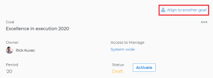

# Allineare gli obiettivi collegandoli in Obiettivi di Adobe Workfront

Se sei un singolo collaboratore con un obiettivo personale, potresti volerlo allineare agli obiettivi del tuo team per visualizzare in modo efficace l’avanzamento del tuo obiettivo nel contesto più ampio della strategia dell’organizzazione.

Quando tutti nella tua organizzazione hanno i loro obiettivi allineati agli obiettivi della tua organizzazione, possono vedere chiaramente in che modo i loro contributi individuali e gli sforzi del team aiutano a fare un grande passo avanti su priorità più grandi a livello aziendale. Per ulteriori informazioni sulle best practice per l’allineamento degli obiettivi, consulta [Panoramica sull’allineamento degli obiettivi in Obiettivi di Adobe Workfront](../../workfront-goals/goal-alignment/goal-alignment-overview.md).

Esistono due approcci per connettere gli obiettivi in Obiettivi di Adobe Workfront:

* Puoi creare l’allineamento tra gli obiettivi collegandoli tra loro.

* Puoi allineare manualmente due obiettivi oppure convertire i risultati e le attività di un obiettivo esistente in un altro obiettivo. Il risultato o l’attività convertiti diventano l’obiettivo secondario dell’obiettivo originale.

>[!IMPORTANT]
>
>Un obiettivo può avere un totale di 1000 indicatori di progresso.

Questo articolo descrive come allineare gli obiettivi collegandoli tra loro. Per informazioni sull’allineamento degli obiettivi tramite la conversione di risultati e attività in obiettivi, consulta [Allineare gli obiettivi convertendo risultati e attività in obiettivi](../../workfront-goals/goal-alignment/align-goals-by-converting-results-activities.md).

## Requisiti di accesso

Devi avere i seguenti:

<table style="table-layout:auto">
 <col>
 </col>
 <col>
 </col>
 <tbody>
  <tr>
   <td role="rowheader">Piano Adobe Workfront*</td>
   <td>
   
Nuovo piano: Seleziona o superiore

   Oppure
   
Piano corrente: Pro o superiore

   
   </td>
  </tr>
  <tr>
   <td role="rowheader">Licenza Adobe Workfront*</td>
   <td>
   
Licenza corrente: Collaboratore o versione successiva

   Oppure
   
Licenza legacy: richiesta o superiore
 </td>
  </tr>
  <tr>
   <td role="rowheader">Prodotto*</td>
   <td>
   
 Nuovo requisito del prodotto, uno dei seguenti: 

<ul>
<li>Un piano Select o Prime Adobe Workfront e un’ulteriore licenza Adobe Workfront Goals.</li>
<li>Un piano Workfront Ultimate che include gli obiettivi Workfront per impostazione predefinita. </li></ul>
   
Oppure

   
Fabbisogno di prodotto corrente: un piano Workfront e una licenza aggiuntiva per gli obiettivi Adobe Workfront. 
 
Per informazioni, consulta <a href="../../workfront-goals/goal-management/access-needed-for-wf-goals.md" class="MCXref xref">Requisiti per l’utilizzo degli obiettivi di Workfront</a>. 
 </td>
  </tr>
  <tr>
   <td role="rowheader">Livello di accesso</td>
   <td> 
Modifica accesso agli obiettivi
 </td>
  </tr>
  <tr>
   <td role="rowheader">Autorizzazioni oggetto</td>
   <td>
    
     
Visualizza o autorizzazioni superiori per l’obiettivo per visualizzarlo

     
Gestire le autorizzazioni per l’obiettivo per modificarlo

     
Per informazioni sulla condivisione degli obiettivi, consulta <a href="../../workfront-goals/workfront-goals-settings/share-a-goal.md" class="MCXref xref">Condividere un obiettivo in Obiettivi di Workfront</a>. 

     </td>
  </tr>
<tr>
   <td role="rowheader">
Modello di layout
</td>
   <td> 
A tutti gli utenti, inclusi gli amministratori di Workfront, deve essere assegnato un modello di layout che includa l’area Obiettivi nel menu principale. 
  
</td>
  </tr>
 </tbody>
</table>

*Per ulteriori informazioni, vedere [Requisiti di accesso nella documentazione di Workfront](/help/quicksilver/administration-and-setup/add-users/access-levels-and-object-permissions/access-level-requirements-in-documentation.md).

## Prerequisiti

Prima di iniziare, è necessario disporre dei seguenti elementi:

* Modello di layout che include l&#39;area Obiettivi nel menu principale.

## Allineare gli obiettivi collegandoli tra loro

<!--
Aligning goals by connecting them differs depending on what environment you use. 

### Align goals by connecting them in the Production environment

1. Create two goals that you want to align. For information about creating goals, see [Create goals in Adobe Workfront Goals](../../workfront-goals/goal-management/create-goals.md).
1. (Optional) Activate the goals that you want to align. You can align goals that have a Draft, Active, or Inactive status. For information about activating goals, see [Activate goals in Adobe Workfront Goals](../../workfront-goals/goal-management/activate-goals.md).
1. Go to the goal that you want to align (child goal) to another goal (parent goal) and click its name to open the **Goal Details** panel.

   For example, if you want Goal 2 to influence the progress of Goal 1, you must go to Goal 2. 

1. Click **Align to another goal** in the upper-right corner of the right panel.

   

1. Start typing the name of an existing goal or the name of an owner in the **Align to another goal** field, then select it when it appears in the list. Only goals that are from the same or future periods display in the list. 
1. Click **Save**.

   The goal you started with (Goal 2) is now the child goal of the goal you aligned it with (Goal 1).   
   The aligned goals display connected in the Goal Alignment section with Goal 2 as secondary to Goal 1.

   

1. (Optional) To view the goals in the Goal Alignment section, do one of the following:

   * Click the Goal Alignment section in the left panel and find the goals by applying the correct filter. For information about filtering information in Workfront Goals, see [Filter information in Adobe Workfront Goals](../../workfront-goals/goal-management/filter-information-wf-goals.md).
   * Click the Goal List, Check-in, or Pulse sections in the left panel and find one of the goals, then click the **Alignment icon**  next to the goal name to go directly to the goal in the Goal Alignment section.

   For information about the Goal Alignment section, see [Navigate the Goal Alignment section in Adobe Workfront Goals](../../workfront-goals/goal-alignment/navigate-goal-alignment-chart.md). 

1. (Optional) Add activities and results to either goal to indicate their progress. For information about adding activities and results, see the following articles:

   * [Add activities to goals in Adobe Workfront Goals](../../workfront-goals/results-and-activities/add-activities-to-goals.md) 
   * [Add results to goals in Adobe Workfront Goals](../../workfront-goals/results-and-activities/add-results-to-goals.md)

1. (Optional) Remove the alignment between two goals, when you consider that no longer is relevant to your organization's overall strategy For information about removing alignment between goals, see [Remove goal alignment in Adobe Workfront Goals](../../workfront-goals/goal-alignment/remove-goal-alignment.md).

-->
1. Creare due obiettivi da allineare. Per informazioni sulla creazione degli obiettivi, consulta [Creare gli obiettivi in Obiettivi di Adobe Workfront](../../workfront-goals/goal-management/create-goals.md).
1. (Facoltativo) Attiva gli obiettivi che desideri allineare. È possibile allineare gli obiettivi con stato Bozza, Attivo o Inattivo. Per informazioni sull’attivazione degli obiettivi, consulta [Attivare gli obiettivi in Obiettivi di Adobe Workfront](../../workfront-goals/goal-management/activate-goals.md).
1. Vai all’obiettivo che desideri allineare (obiettivo figlio) a un altro obiettivo (obiettivo padre) e fai clic sul nome per aprire la pagina dell’obiettivo.

   >[!INFO]
   >
   >Ad esempio, se desideri che l&#39;obiettivo 2 influenzi l&#39;avanzamento dell&#39;obiettivo 1, devi passare all&#39;obiettivo 2.

1. Clic **Dettagli obiettivo** nel pannello a sinistra.

1. In **Informazioni obiettivo principale** , fare clic su **Aggiungi** nel **Obiettivo principale** se non è presente alcun obiettivo principale,

   Oppure

   Fai clic sul nome dell’obiettivo principale per sceglierne un altro.

1. Inizia a digitare il nome di un obiettivo esistente nel **Obiettivo principale** , quindi selezionarlo quando viene visualizzato nell&#39;elenco. Nell’elenco vengono visualizzati solo gli obiettivi dello stesso periodo o di periodi futuri.

1. Fai clic su **Salva modifiche**.

   L’obiettivo con cui hai iniziato (Obiettivo 2) ora è l’obiettivo secondario dell’obiettivo principale con cui l’hai allineato (Obiettivo 1).\
   Gli obiettivi allineati vengono visualizzati connessi nella sezione Allineamento obiettivo con l’Obiettivo 2 secondario all’Obiettivo 1.
L’obiettivo secondario viene visualizzato nella sezione Indicatori di avanzamento dell’obiettivo principale mentre il suo avanzamento aggiorna l’avanzamento dell’obiettivo principale.

   

1. (Facoltativo) Per visualizzare gli obiettivi nella sezione Allineamento obiettivi, vai all’area Obiettivi di Workfront, quindi fai clic su **Allineamento obiettivo** nel pannello a sinistra. Per informazioni sulla sezione Allineamento obiettivo, consulta [Passare alla sezione Allineamento obiettivi in Obiettivi di Adobe Workfront](../../workfront-goals/goal-alignment/navigate-goal-alignment-chart.md).

1. (Facoltativo) Aggiungi attività e risultati a entrambi gli obiettivi per indicarne l’avanzamento. Per informazioni sull’aggiunta di attività e risultati, consulta i seguenti articoli:

   * [Aggiungere attività agli obiettivi in Obiettivi di Adobe Workfront](../../workfront-goals/results-and-activities/add-activities-to-goals.md)
   * [Aggiungere risultati agli obiettivi in Obiettivi di Adobe Workfront](../../workfront-goals/results-and-activities/add-results-to-goals.md)

1. (Facoltativo) Se ritieni che non sia più pertinente alla strategia complessiva della tua organizzazione, rimuovi l’allineamento tra due obiettivi. Per informazioni sulla rimozione dell&#39;allineamento tra gli obiettivi, vedere [Rimuovere l’allineamento dell’obiettivo in Obiettivi di Adobe Workfront](../../workfront-goals/goal-alignment/remove-goal-alignment.md).

