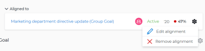
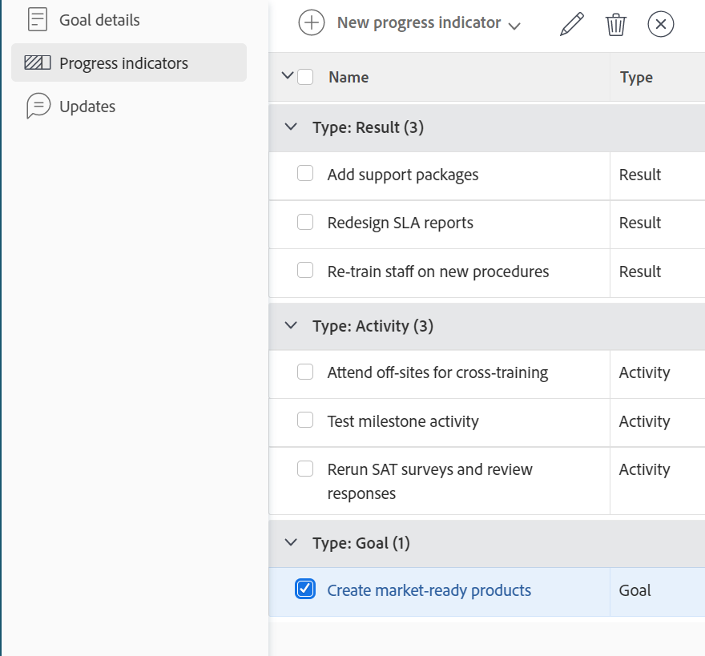

# Rimuovere l’allineamento dell’obiettivo in Obiettivi di Adobe Workfront

<!--Audited P&P only: 4/2025-->

È possibile rimuovere l’allineamento tra due obiettivi se non ha più senso collegarli.

Per informazioni sull&#39;allineamento degli obiettivi, vedere i seguenti articoli:

* [Allinea gli obiettivi collegandoli in Obiettivi Adobe Workfront](../../workfront-goals/goal-alignment/align-goals-by-connecting-them.md)
* [Allineare gli obiettivi convertendo risultati e attività in obiettivi](../../workfront-goals/goal-alignment/align-goals-by-converting-results-activities.md)

## Requisiti di accesso

>[!NOTE]
>
>La tua azienda potrebbe scegliere di continuare a utilizzare gli obiettivi di Adobe Workfront se ha acquistato questo pacchetto in passato. Per ulteriori dettagli, rivolgiti al rappresentante del tuo account.
>
>Adobe Workfront Goals non è più disponibile per l’acquisto.

+++ Espandi per visualizzare i requisiti di accesso per la funzionalità in questo articolo. 

<table style="table-layout:auto">
<col>
</col>
<col>
</col>
<tbody>
 <tr>
  <td> 
Pacchetto Adobe Workfront
 </td> 
   <td> 
   
Adobe Workfront Ultimate

   </td> 
  </tr> 
 <tr>
 <td role="rowheader">Licenza Adobe Workfront</td>
 <td>
 
Collaboratore o versione successiva

 
Richiedi o superiore
 </td>
 </tr>
  <tr>
 <td role="rowheader">Livello di accesso</td>
 <td> 
Modifica accesso agli obiettivi
 </td>
 </tr>
 <tr>
 <td role="rowheader">Autorizzazioni oggetto</td>
 <td>
  
Visualizza o autorizzazioni superiori per l’obiettivo per visualizzarlo

  
Gestire le autorizzazioni per l’obiettivo per modificarlo

</td>
 </tr>
   <td role="rowheader">
Modello layout
</td>
   <td> 
A tutti gli utenti, inclusi gli amministratori di sistema, deve essere assegnato un modello di layout che includa l'area Obiettivi nel menu principale. 
  
</td>
  </tr>
</tbody>
</table>

Per ulteriori informazioni, consulta [Requisiti di accesso nella documentazione di Workfront](/help/quicksilver/administration-and-setup/add-users/access-levels-and-object-permissions/access-level-requirements-in-documentation.md).

+++
<!--Old:
<table style="table-layout:auto">
<col>
</col>
<col>
</col>
<tbody>
 <tr>
 <td role="rowheader">Adobe Workfront plan*</td>
 <td> 
   
For the new plan and license structure:
  <ul><li>An Ultimate plan </li></ul>
   

For the current plan and license structure: 
<ul><li> A Pro or higher </li>
  <li>An Adobe Workfront Goals license in addition to a Workfront license.</li></ul>

   </td> 
 </tr>
 <tr>
 <td role="rowheader">Adobe Workfront license*</td>
 <td>
 
New license: Contributor or higher

 Or
 
Current license: Request or higher
 </td>
 </tr>
 <tr>
 <td role="rowheader">Product*</td>
 <td>
   
 New product requirement: Workfront

   Or
   
Current product requirement: In addition to a Workfront license, you must purchase a license for Adobe Workfront Goals. 
 
For information, see <a href="../../workfront-goals/goal-management/access-needed-for-wf-goals.md" class="MCXref xref">Requirements to use Workfront Goals</a>. 
 </td>
 </tr>
 <tr>
 <td role="rowheader">Access level</td>
 <td> 
Edit access to Goals
 </td>
 </tr>
 <tr data-mc-conditions="">
 <td role="rowheader">Object permissions</td>
 <td>
  
View or higher permissions to the goal to view it

  
Manage permissions to the goal to edit it

  
For information about sharing goals, see <a href="../../workfront-goals/workfront-goals-settings/share-a-goal.md" class="MCXref xref">Share a goal in Workfront Goals</a>. 

  </td>
 </tr>
   <td role="rowheader">
Layout template
</td>
   <td> 
All users, including Workfront administrators,  must be assigned a layout template that includes the Goals area in the Main Menu. 
  
</td>
  </tr>
</tbody>
</table>-->

## Prerequisiti

Prima di iniziare, è necessario disporre dei seguenti elementi:

* Un obiettivo principale a cui è associato almeno un obiettivo secondario. Gli obiettivi per bambini sono gli indicatori di progresso dell&#39;obiettivo.

## Considerazioni sulla rimozione dell’allineamento dell’obiettivo

Quando rimuovi l’allineamento tra due obiettivi, considera quanto segue:

* Per rimanere attivi, all&#39;obiettivo principale deve essere associato un altro obiettivo, attività o risultato.
* Non è possibile rimuovere un obiettivo figlio allineato da un obiettivo padre se è l&#39;unico indicatore di avanzamento dell&#39;obiettivo padre.
* L&#39;obiettivo secondario diventa un obiettivo autonomo quando ne rimuovete l&#39;allineamento all&#39;obiettivo principale.

## Rimuovere l’allineamento dell’obiettivo

<!--
Removing goal alignment differs depending on which environment you use.

### Remove goal alignment in the Production environment

1. Go to a child goal aligned to a parent goal. 
1. Click the goal name to open the **Goal Details** panel. 
1. Click the **gear icon**  next to the parent goal, then click **Remove alignment**.

   

   The goal becomes a standalone goal and its progress no longer influences the progress of the original parent goal. 

1. (Optional) Click **Undo** in the lower-left corner of the screen if you want to revert this change and keep the goals aligned. 
1. (Optional) Add activities and results to either goals to indicate their progress. For information about adding activities and results, see the following articles:

   * [Add activities to goals in Adobe Workfront Goals](../../workfront-goals/results-and-activities/add-activities-to-goals.md) 
   * [Add results to goals in Adobe Workfront Goals](../../workfront-goals/results-and-activities/add-results-to-goals.md)
-->

1. Accedi all&#39;area **Obiettivi** in Workfront e fai clic sul nome di un obiettivo per aprirne la pagina.
1. Dalla pagina dell&#39;obiettivo di un obiettivo principale, fai clic su **Indicatori di avanzamento** nel pannello a sinistra.

   

1. Nel raggruppamento **Tipo: Obiettivo**, seleziona un obiettivo, quindi fai clic sull&#39;icona **Disconnetti**  nella parte superiore dell&#39;elenco.

   Viene visualizzata la casella Disconnetti.

1. Fare clic su **Disconnetti** per disconnettere l&#39;obiettivo selezionato dal relativo elemento padre.

   L’obiettivo diventa autonomo e non viene più elencato come indicatore di avanzamento dell’obiettivo originale. L’avanzamento dell’obiettivo disconnesso non influenza più l’avanzamento dell’obiettivo originale.

   Nell’angolo superiore destro della pagina viene visualizzato un messaggio di successo per confermare che l’obiettivo è stato disconnesso.
