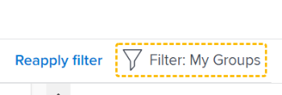

# Filtrare le informazioni in Obiettivi di Adobe Workfront

Puoi visualizzare gli obiettivi che tu o chiunque altro hai aggiunto negli Obiettivi di Adobe Workfront. Per informazioni sulla creazione degli obiettivi, consulta [Creare gli obiettivi in Obiettivi di Adobe Workfront](../../workfront-goals/goal-management/create-goals.md). Quando visualizzi gli obiettivi, puoi filtrare le informazioni in Obiettivi di Workfront per visualizzare solo gli obiettivi che ti interessano.

## Requisiti di accesso

Per eseguire le azioni descritte in questo articolo, è necessario disporre dei seguenti diritti di accesso:

<table style="table-layout:auto">
<col>
</col>
<col>
</col>
<tbody>
 <tr> 
   <td role="rowheader">Piano Adobe Workfront*</td> 
   <td> 
   
Per il nuovo piano e la nuova struttura delle licenze:
  <ul><li>Un piano Ultimate </li>
  Oppure
  <li>Una licenza aggiuntiva per Adobe Workfront Goals per i piani Prime o Select Adobe Workfront. </li></ul> 

Per il piano corrente e la struttura delle licenze: 
<ul><li> A Pro o superiore </li>
  <li>Una licenza Adobe Workfront Goals oltre a una licenza Workfront.</li></ul>

   </td> 
  </tr>
 <tr>
 <td role="rowheader">Licenza Adobe Workfront*</td>
 <td>
 
Nuova licenza: Collaboratore o versione successiva

 Oppure
 
Licenza corrente: richiesta o successiva
 
Per ulteriori informazioni, consulta <a href="../../administration-and-setup/add-users/access-levels-and-object-permissions/wf-licenses.md" class="MCXref xref">Panoramica sulle licenze di Adobe Workfront</a>.
 </td>
 </tr>
 <tr>
 <td role="rowheader">Prodotto*</td>
 <td>
 
 Nuovo requisito del prodotto, uno dei seguenti: 

<ul>
<li>Un piano Select o Prime Adobe Workfront e un’ulteriore licenza Adobe Workfront Goals.</li>
<li>Un piano Workfront Ultimate che include gli obiettivi Workfront per impostazione predefinita. </li></ul>
 
Oppure

 
Fabbisogno di prodotto corrente: un piano Workfront e una licenza aggiuntiva per gli obiettivi Adobe Workfront. 
 
Per informazioni, consulta <a href="../../workfront-goals/goal-management/access-needed-for-wf-goals.md" class="MCXref xref">Requisiti per l’utilizzo degli obiettivi di Workfront</a>. 
 </td>
 </tr>
 <tr>
 <td role="rowheader">Livello di accesso</td>
 <td> 
Modifica accesso agli obiettivi
 </td>
 </tr>
 <tr data-mc-conditions="">
 <td role="rowheader">Autorizzazioni oggetto</td>
 <td>
  

  
Visualizza o autorizzazioni superiori per l’obiettivo per visualizzarlo

  
Gestire le autorizzazioni per l’obiettivo per modificarlo

  
Per informazioni sulla condivisione degli obiettivi, consulta <a href="../../workfront-goals/workfront-goals-settings/share-a-goal.md" class="MCXref xref">Condividere un obiettivo in Obiettivi di Workfront</a>. 

  
 </td>
 </tr>
 <tr>
   <td role="rowheader">
Modello di layout
</td>
   <td> 
A tutti gli utenti, inclusi gli amministratori di Workfront, deve essere assegnato un modello di layout che includa l’area Obiettivi nel menu principale. 
  
</td>
  </tr>
</tbody>
</table>

*Per ulteriori informazioni, vedere [Requisiti di accesso nella documentazione di Workfront](/help/quicksilver/administration-and-setup/add-users/access-levels-and-object-permissions/access-level-requirements-in-documentation.md).

## Panoramica dei filtri negli Obiettivi di Workfront

>[!NOTE]
>
>Per trovare e focalizzare in modo efficiente gli obiettivi giusti, ti consigliamo di utilizzare i filtri in Obiettivi di Workfront. Questo consente di visualizzare le informazioni corrette prima di iniziare a gestire gli obiettivi che ritieni importanti. Per impostazione predefinita, in Obiettivi Workfront vengono visualizzati tutti gli obiettivi del sistema.

Puoi individuare e filtrare gli obiettivi nelle seguenti sezioni dell’area Obiettivi in Workfront:

* Elenco obiettivi
* Grafi
* Allineamento obiettivi

Per informazioni sulle sezioni dell&#39;area Obiettivi, vedere [Panoramica delle sezioni Obiettivi di Adobe Workfront](../../workfront-goals/goal-review-and-workfront-goals-sections/overview-of-wf-goals-sections.md).

>[!IMPORTANT]
>
>È possibile configurare i filtri per una sezione e mantenerli persistenti quando si passa a un’altra sezione di Obiettivi di Workfront.

Quando si lavora con i filtri negli Obiettivi di Workfront, considera quanto segue:

* Puoi creare e applicare un filtro senza salvarlo, oppure salvare un filtro da riutilizzare in un secondo momento.

  Esistono i seguenti scenari:

   * Quando salvi un filtro, questo diventa il filtro predefinito per te ogni volta che accedi a Workfront Goals.
   * Quando applichi un filtro senza salvarlo, puoi ripristinare gli elenchi originali aggiornando la pagina.

* Puoi solo visualizzare e applicare i filtri creati. I filtri creati da altri utenti vengono visualizzati solo per tali utenti.
* Non puoi condividere i filtri creati con altri utenti.

## Applicare un filtro rapido in Obiettivi di Workfront

Puoi utilizzare un filtro rapido in un elenco di obiettivi per individuare solo gli elementi che ti interessano. Non è possibile salvare i filtri rapidi e non sono persistenti. Workfront cancella i risultati di un filtro rapido quando aggiorni la pagina.

Per ulteriori informazioni, consulta [Applicare il filtro rapido a un elenco](../../workfront-basics/navigate-workfront/use-lists/apply-quick-filter-list.md).

## Creare e applicare un filtro in Obiettivi di Workfront

Il processo di creazione dei filtri è lo stesso per qualsiasi sezione degli Obiettivi di Workfront.

Puoi creare un filtro da zero o modificare uno dei filtri incorporati.

1. Vai a Obiettivi Workfront.

   Per informazioni sull’accesso agli obiettivi di Workfront, consulta [Accedere e aprire gli obiettivi in Obiettivi di Adobe Workfront](../../workfront-goals/goal-management/access-goals-in-wf-goals.md)

   Per impostazione predefinita, viene visualizzata la sezione Elenco obiettivi.

1. Clic **Filtro** nell&#39;angolo superiore destro dell&#39;elenco.

   

   Per impostazione predefinita, Workfront applica il **Tutti** filtro che visualizza tutti gli obiettivi nel sistema.

   >[!TIP]
   >
   >Non è possibile modificare o eliminare il filtro Tutto.

1. Esegui una delle operazioni seguenti:

   * Fai clic su uno dei seguenti filtri predefiniti per visualizzare gli obiettivi solo per i seguenti proprietari:

     <table style="table-layout:auto"> 
      <col> 
      <col> 
      <tbody> 
       <tr> 
        <td>Tutti</td> 
        <td> 
Tutti gli obiettivi nel sistema, indipendentemente da chi li ha creati, da quale periodo di tempo si riferiscono o da chi sia il proprietario. Questo è il filtro predefinito e non puoi modificarlo. 
 <!--
          
(NOTE: what the ALL filter displays might change; right now, it displays all, regardless of status, period, owner, etc)

         --> </td> 
       </tr> 
       <tr> 
        <td>Personale</td> 
        <td>Gli obiettivi di cui sei il proprietario.</td> 
       </tr> 
       <tr> 
        <td>I miei team</td> 
        <td> 
Gli obiettivi per i quali qualsiasi team è selezionato come proprietario. 
 
<b>SUGGERIMENTO</b>

     Non viene visualizzato alcun obiettivo se non si è assegnati ad alcun team. 
 </td>
     </tr> 
       <tr> 
        <td>I miei gruppi</td> 
        <td>Gli obiettivi per i quali uno qualsiasi dei tuoi gruppi è selezionato come proprietario. </td> 
       </tr> 
       <tr> 
        <td>Azienda</td> 
        <td> 
Gli obiettivi associati alla tua organizzazione. 
 
<b>SUGGERIMENTO</b>
        
In Obiettivi di Adobe Workfront, il filtro Azienda visualizza gli obiettivi per i quali l’organizzazione è selezionata come proprietario. 
 
Non è possibile cercare società utilizzando questo campo. Per impostazione predefinita, viene selezionata solo l’organizzazione proprietaria dell’istanza di Workfront. 
 
 </td> 
       </tr> 
      </tbody> 
     </table>

   * Passa il puntatore del mouse sul nome di un filtro, quindi fai clic sul pulsante **Modifica** icona  accanto al nome per personalizzarlo e aggiungere nomi specifici di utenti, team, gruppi o il nome dell’organizzazione, quindi selezionalo quando vengono visualizzati nell’elenco.

   * Clic **Nuovo filtro** per creare un nuovo filtro, seleziona una delle seguenti opzioni per personalizzare il nuovo filtro:

     <table style="table-layout:auto"> 
      <col> 
      <col> 
      <tbody> 
       <tr> 
        <td role="rowheader">Periodo</td> 
        <td>Seleziona un periodo di tempo nel menu a discesa. È possibile selezionare più periodi di tempo. </td> 
       </tr> 
       <tr> 
        <td role="rowheader">Stato</td> 
        <td> 
Seleziona uno stato nel menu a discesa tra le seguenti opzioni:
 
         <ul> 
          <li> 
Attiva
 </li> 
          <li> 
Bozza
 </li> 
          <li> 
Inattiva
 </li> 
          <li> 
Chiuso
 </li> 
         </ul> </td> 
       </tr> 
       <tr> 
        <td role="rowheader">Avanzamento</td> 
        <td> 
Seleziona un avanzamento nel menu a discesa tra le seguenti opzioni: 
 
         <ul> 
          <li> 
In difficoltà
 </li> 
          <li> 
A Rischio
 </li> 
          <li> 
Puntuale
 </li> 
         </ul> </td> 
       </tr> 
       <tr> 
        <td role="rowheader">Proprietario</td> 
        <td> 
Inizia a digitare il nome di un proprietario, quindi selezionalo quando viene visualizzato nell’elenco. 
 
Puoi digitare i nomi di utenti, team, gruppi o il nome della tua organizzazione oppure puoi scegliere tra opzioni predefinite. 
 
Le seguenti opzioni di filtro predefinite fanno sempre riferimento all’utente attualmente connesso: 
 
         <ul> 
          <li> 
<strong>Me</strong>: visualizza gli obiettivi di cui sei il proprietario.
 </li> 
          <li> 
<strong>Il mio team predefinito</strong> e <strong>Tutti i miei team</strong>: visualizza gli obiettivi di cui il team predefinito o uno qualsiasi dei team è designato come proprietario. 
 
Suggerimento: non viene visualizzato alcun obiettivo quando non si è assegnati ad alcun team. 
 </li> 
          <li> 
<strong>Il Mio Gruppo Predefinito</strong> e <strong>Tutti i Miei Gruppi</strong>: visualizza gli obiettivi per i quali il gruppo predefinito o uno qualsiasi dei gruppi è designato come proprietario.
 </li> 
         </ul> </td> 
       </tr> 
      </tbody> 
     </table>

1. (Facoltativo) Fai clic su **Reimposta** nell’angolo inferiore destro della casella filtro per cancellare tutti i campi selezionati e iniziare a creare il filtro da zero.
1. (Facoltativo) Fai clic su **Applica** per applicare il filtro senza salvare.

   Il filtro viene visualizzato nel **Non salvato** area del generatore di filtri come **Nuovo filtro**.

   Impossibile rinominare un filtro non salvato.

   I filtri non salvati vengono rimossi dall’area Obiettivi al successivo accesso a Workfront.

   >[!TIP]
   >
   >Puoi avere un solo nuovo filtro non salvato alla volta.

1. Clic **Salva** per salvare il filtro e utilizzarlo in un secondo momento, aggiungi un nome per il filtro nel **Aggiungi nome filtro** e fai clic su **Fine**.

   In questo modo il filtro viene salvato nella **Salvato** sezione del generatore di filtri. Puoi utilizzare questo filtro in futuro.

   L’ultimo filtro salvato e applicato viene visualizzato per impostazione predefinita al successivo accesso a Workfront

1. (Facoltativo) Fai clic su **freccia rivolta a sinistra** accanto a **Nuovo filtro** per uscire dal generatore di filtri e tornare all’elenco dei filtri.
1. (Facoltativo) Passa il puntatore del mouse sul nome di un filtro personalizzato, fai clic sul pulsante **Altro** , quindi fai clic su **Elimina**, quindi **Elimina**. Il filtro verrà eliminato e non sarà più possibile ripristinarlo.

   >[!TIP]
   >
   >Non è possibile eliminare i filtri predefiniti.

1. Fai clic su **Icona X** nell’angolo superiore destro del generatore di filtri per chiudere il generatore di filtri.

   Il nome del filtro attualmente applicato viene visualizzato a destra dell&#39;icona Filtro, nell&#39;angolo superiore destro dell&#39;elenco degli obiettivi.

   L’elenco degli obiettivi viene filtrato in base ai criteri di filtro.

1. (Facoltativo e condizionale) Quando visualizzi gli obiettivi nella sezione Allineamento obiettivi, fai clic su **Mostrale** se desideri visualizzare gli obiettivi esclusi.

   

   Il nome del filtro è evidenziato in giallo per indicare che viene ignorato.

   

1. (Facoltativo e condizionale) Fai clic su **Riapplica filtro** per applicare il filtro e omettere gli elementi visualizzati nel passaggio precedente.

