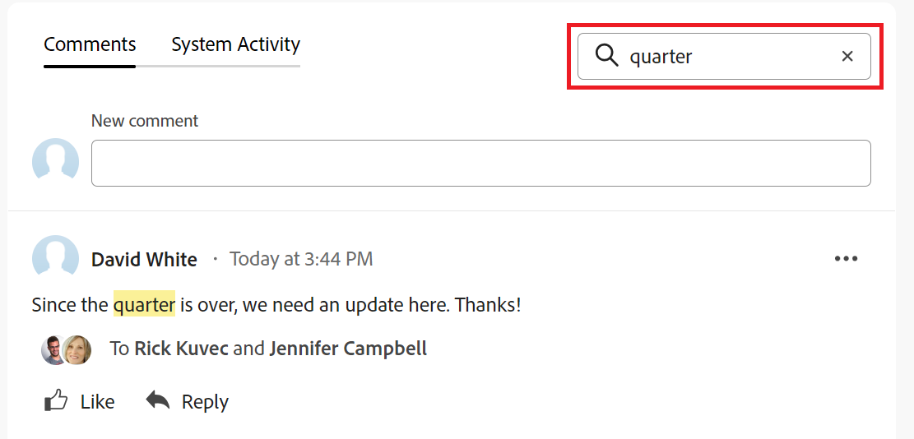

# Gestire i commenti sugli obiettivi in Obiettivi di Adobe Workfront

<!--Audited: 01/2024-->

<!--consider retiring this article when goals and all objects are in parity and we remove the legacy commenting from the system. From then on, there is just ONE way to comment and that will be documented in the Update Work article-->

<!--take "legacy" and "new commenting" references out when we remove the legacy - April 2024???-->

<!--The highlighted information on this page refers to functionality not yet generally available. It is available only in the Preview environment for all customers. 

For information about the current release schedule, see [First Quarter 2024 release overview](../../product-announcements/product-releases/24-q1-release-activity/24-q1-release-overview.md).-->

<!--
After the monthly releases to Production, the same features are also available in the Production environment for customers who enabled fast releases.   
For information about fast releases, see [Enable or disable fast releases for your organization](../../administration-and-setup/set-up-workfront/configure-system-defaults/enable-fast-release-process.md)  
-->

Puoi aggiungere commenti a tutti gli obiettivi che puoi visualizzare in Obiettivi di Adobe Workfront.

## Requisiti di accesso

Per eseguire le azioni descritte in questo articolo, è necessario disporre dei seguenti diritti di accesso:

<table style="table-layout:auto">
<col>
</col>
<col>
</col>
<tbody>
 <tr>
 <td role="rowheader">piano Adobe Workfront</td>
 <td>
 
Qualsiasi

</td>
 </tr>
 <tr>
 <td role="rowheader">Licenza Adobe Workfront*</td>
 <td>
 
Nuova licenza: Collaboratore o versione successiva

 Oppure
 
Licenza corrente: richiesta o successiva
 </td>
 </tr>
 <tr>
 <td role="rowheader">Prodotto*</td>
 <td>
 
 Nuovo fabbisogno del prodotto: se disponi del piano Select o Prime Adobe Workfront, devi acquistare anche un’ulteriore licenza Adobe Workfront Goals. Gli obiettivi Workfront sono inclusi nel piano Ultimate Workfront.

 Oppure
 
Fabbisogno prodotto corrente: è necessario acquistare una licenza aggiuntiva per gli obiettivi Adobe Workfront per accedere alle funzionalità descritte in questo articolo. 
 
Per informazioni, consulta <a href="../../workfront-goals/goal-management/access-needed-for-wf-goals.md" class="MCXref xref">Requisiti per l’utilizzo degli obiettivi di Workfront</a>. 
 </td>
 </tr>
 <tr>
 <td role="rowheader">Configurazione del livello di accesso</td>
 <td> 
Visualizzare o accedere più facilmente agli obiettivi
 
<b>NOTA</b>
Se non disponi dell’accesso, chiedi all’amministratore di Workfront se ha impostato restrizioni aggiuntive nel tuo livello di accesso. Per ulteriori informazioni, consulta <a href="../../administration-and-setup/add-users/configure-and-grant-access/grant-access-goals.md" class="MCXref xref">Concedere l’accesso agli obiettivi di Adobe Workfront</a></td>
 </tr>
 <tr data-mc-conditions="">
 <td role="rowheader">Autorizzazioni oggetto</td>
 <td>
  

  
Visualizza o autorizzazioni superiori per l’obiettivo

  
Per impostazione predefinita, gli utenti non hanno accesso agli obiettivi 

 
Per informazioni sulla condivisione degli obiettivi, consulta <a href="../../workfront-goals/workfront-goals-settings/share-a-goal.md" class="MCXref xref">Condividere un obiettivo in Obiettivi di Workfront</a>. 

  
 </td>
 </tr>
</tbody>
</table>

*Per informazioni sulla pianificazione, il tipo di licenza o l&#39;accesso disponibili, contattare l&#39;amministratore Workfront. Per ulteriori informazioni, consulta [Requisiti di accesso nella documentazione di Workfront](/help/quicksilver/administration-and-setup/add-users/access-levels-and-object-permissions/access-level-requirements-in-documentation.md).

## Prerequisiti

Prima di iniziare, è necessario disporre dei seguenti elementi:

* Modello di layout che include l&#39;area Obiettivi nel menu principale.

## Gestisci commenti obiettivo

Puoi aggiungere commenti agli obiettivi nella sezione Aggiornamenti della pagina di un obiettivo.

È possibile rispondere a o aggiungere un commento a quello aggiunto da altri utenti in quest&#39;area.

1. Fai clic su **Menu principale** icona  nell&#39;angolo superiore destro o **Menu principale** icona  nell’angolo superiore sinistro, se disponibile, fai clic su **Obiettivi**.
Verrà aperto l&#39;elenco degli obiettivi.
1. Individua l’obiettivo a cui desideri aggiungere commenti, quindi fai clic sul nome per aprire la pagina dell’obiettivo.
1. Clic  **Aggiornamenti** nel pannello a sinistra.
1. Per individuare un commento esistente, inizia a digitare una parola chiave (facoltativo) <!--or a user's name--> nel **Ricerca** nell&#39;angolo superiore destro del **Commenti** scheda.

   

   Parola chiave <!--or user--> La ricerca è evidenziata e i commenti che la contengono vengono visualizzati nella parte superiore della sezione Aggiornamenti.

   <!--change the NOTE below when functionality changes-->

   >[!NOTE]
   >
   >   È necessario cercare una parola inclusa in un commento o in una risposta. Impossibile cercare un utente o un team con tag.

   Per ulteriori informazioni, consulta [Aggiorna lavoro](../../workfront-basics/updating-work-items-and-viewing-updates/update-work.md)

1. Fai clic su **x** nel campo di ricerca per cancellare i risultati della ricerca e tornare alla pagina completa.
1. Fai clic su **Commenti** nell&#39;angolo superiore sinistro dell&#39;area Aggiornamenti.
1. Inizia a immettere un commento in **Nuovo commento** casella.

   

   >[!TIP]
   >
   >Se si esce dalla sezione Aggiornamenti prima di completare la digitazione e l&#39;invio di un commento, il commento nella pagina rimane in modalità bozza anche dopo la disconnessione e la riconnessione. Nella bozza vengono salvate anche tutte le immagini aggiunte al commento. Le bozze vengono salvate per 7 giorni dopo i quali vengono eliminate e non possono essere recuperate. I commenti bozza sono visibili solo all&#39;utente che li inserisce.

1. (Facoltativo) Per annullare o ripristinare una modifica, utilizzare i seguenti tasti di scelta rapida:
   * CTRL + Z (⌘+z per Mac) per annullare una modifica
   * CTRL+Y (⌘+y per Mac) per ripetere una modifica
1. (Facoltativo) Per aggiungere la formattazione RTF all&#39;aggiornamento, a un collegamento ipertestuale o a un&#39;immagine, utilizzare le opzioni disponibili sulla barra degli strumenti Testo formattato o le icone adiacenti. Per ulteriori informazioni, consulta [Aggiorna lavoro](../../workfront-basics/updating-work-items-and-viewing-updates/update-work.md).
1. (Facoltativo) In **Assegna tag a persone o team** , inizia a digitare il nome o l’e-mail di un utente o di un team che desideri includere in questo commento, quindi selezionalo quando viene visualizzato nell’elenco.
1. Seleziona la **Privato per la mia azienda** attiva per rendere visibile il commento solo agli utenti della tua azienda.

   >[!TIP]
   >
   >Per rendere disponibile questa opzione nell’area Aggiornamenti, devi aver specificato una società nel tuo profilo.

1. Clic **Invia**.

   >[!TIP]
   >
   >Se un altro utente invia un commento allo stesso elemento che si sta aggiornando, verrà visualizzata una linea rossa con un indicatore &quot;Nuovo&quot; per informare l&#39;utente dei commenti più recenti, nonché una notifica blu nella parte inferiore della schermata che indica il numero di nuovi commenti.
   >
   >L’indicatore viene visualizzato solo dopo che il commento è stato inviato sull’elemento e non quando il commento è ancora composto.
   >

1. (Facoltativo) Per modificare un commento, fai clic su **Altro** menu  a destra dell’icona Mi piace, quindi fai clic su **Modifica**.
1. Modificare le informazioni nel commento, aggiungere o rimuovere immagini o rimuovere gli utenti taggati.
Puoi modificare il commento entro 15 minuti dall’invio. A sinistra dell&#39;indicatore della data viene aggiunto un indicatore &quot;modificato&quot; che viene visualizzato quando il commento è stato aggiornato.

   

   >[!TIP]
   >
   > * Viene generata un’e-mail per avvisare gli utenti dell’aggiornamento solo quando invii l’aggiornamento originale. Dopo aver modificato l’aggiornamento, non viene generata alcuna e-mail.
   >
   > * Il timbro data è la data del commento originale e non la data dell’ultimo aggiornamento.

1. (Facoltativo) Fai clic su **Altro** menu , quindi fare clic su una delle opzioni seguenti per copiare le informazioni da un commento negli Appunti o in una nuova risposta:

   * **Copia collegamento** per copiare il collegamento di un aggiornamento, senza le risposte.
   * **Copia corpo del testo** per copiare il testo di un aggiornamento.
   * **Risposta preventivo** per aprire una nuova casella di commento in cui il commento originale viene citato in una nuova risposta ed è contrassegnato come un&#39;offerta di blocco.

     Per ulteriori informazioni, consulta [Aggiorna lavoro](../../workfront-basics/updating-work-items-and-viewing-updates/update-work.md).

1. (Facoltativo) Fai clic su **Altro** menu  a destra di un commento, quindi fai clic su **Elimina** per eliminare un commento aggiunto. Per ulteriori informazioni, consulta [Aggiorna lavoro](../../workfront-basics/updating-work-items-and-viewing-updates/update-work.md).
1. (Facoltativo) Fai clic su **Rispondi** per rispondere a un commento esistente, segui i passaggi 5-9 di cui sopra. Per ulteriori informazioni sulla risposta agli aggiornamenti, consulta [Rispondi agli aggiornamenti](../../workfront-basics/updating-work-items-and-viewing-updates/reply-to-updates.md). <!--insure this stays accurate-->
1. (Condizionale e facoltativo) Se altri utenti hanno aggiunto commenti visualizzati al di fuori dell’area visibile nella sezione Aggiornamenti, fai clic su **Visualizza** all&#39;interno del blu **banner nuovi commenti** nella parte inferiore dello schermo per visualizzare questi commenti.

   

   Ulteriori commenti vengono visualizzati nella parte inferiore dello schermo.
1. (Facoltativo) Fai clic su **Mi piace** icona per apprezzare un commento aggiunto da un altro utente. L’icona si aggiorna con il numero di Mi piace.

1. (Facoltativo) Fai clic su **Attività di sistema** per visualizzare gli aggiornamenti registrati dal sistema Quando un obiettivo viene aggiornato, Workfront genera una nota sull’aggiornamento e lo visualizza nella scheda Attività del sistema. Workfront registra inoltre un aggiornamento del sistema quando un risultato, un’attività o un progetto viene aggiunto all’obiettivo o quando viene aggiornato. <!--ensure the casing on the tab has not changed-->

