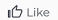

# Gestire i commenti sull’obiettivo in Obiettivi di Adobe Workfront

<!--consider retiring this article when goals and all objects are in parity - after the new commenting experience goes to production GA-->

<!--The highlighted information on this page refers to functionality not yet generally available. It is available only in the Preview environment.-->

Puoi aggiungere commenti a tutti gli obiettivi che puoi visualizzare in Obiettivi di Adobe Workfront.

<!--drafted for P&P:

<table style="table-layout:auto">
 <col>
 </col>
 <col>
 </col>
 <tbody>
  <tr>
   <td role="rowheader">Adobe Workfront plan*</td>
   <td>
   
Current plan: Select or higher

   Or
   
Legacy plan: Pro or higher

   
   </td>
  </tr>
  <tr>
   <td role="rowheader">Adobe Workfront license*</td>
   <td>
   
Current license: Contributor or higher

   Or
   
Legacy license: Request or higher
 
For more information, see <a href="../../administration-and-setup/add-users/access-levels-and-object-permissions/wf-licenses.md" class="MCXref xref">Adobe Workfront licenses overview</a>.
 </td>
  </tr>
  <tr>
   <td role="rowheader">Product</td>
   <td>
   
 Current product requirement: If you have the Select or Prime Adobe Workfront plan, you must also buy an additional Adobe Workfront Goals license.  Workfront Goals are included in the Ultimate Workfront Plan.

   Or
   
Legacy product requirement: You must purchase an additional license for the Adobe Workfront Goals to access functionality described in this article. 
 
For information, see <a href="../../workfront-goals/goal-management/access-needed-for-wf-goals.md" class="MCXref xref">Requirements to use Workfront Goals</a>. 
 </td>
  </tr>
  <tr>
   <td role="rowheader">Access level*</td>
   <td> 
Edit access to Goals
 
<b>NOTE</b>
If you still don't have access, ask your Workfront administrator if they set additional restrictions in your access level. For information on how a Workfront administrator can change your access level, see:

     <ul>
      <li> 
<a href="../../administration-and-setup/add-users/configure-and-grant-access/create-modify-access-levels.md" class="MCXref xref">Create or modify custom access levels</a> 
 </li>
      <li> 
<a href="../../administration-and-setup/add-users/configure-and-grant-access/grant-access-goals.md" class="MCXref xref">Grant access to Adobe Workfront Goals</a> 
 </li>
     </ul> 
 </td>
  </tr>
  <tr data-mc-conditions="">
   <td role="rowheader">Object permissions</td>
   <td>
    

     
View or higher permissions to the goal to view it

     
Manage permissions to the goal to edit it

     
For information about sharing goals, see <a href="../../workfront-goals/workfront-goals-settings/share-a-goal.md" class="MCXref xref">Share a goal in Workfront Goals</a>. 

    
 </td>
  </tr>
 </tbody>
</table>
-->

## Requisiti di accesso

Per eseguire le azioni descritte in questo articolo, è necessario disporre dei seguenti diritti di accesso:

<table style="table-layout:auto"> 
 <col> 
 <col> 
 <tbody> 
  <tr> 
   <td role="rowheader">piano Adobe Workfront*</td> 
   <td> 
Pro o superiore
 </td> 
  </tr> 
  <tr> 
   <td role="rowheader">Licenza Adobe Workfront*</td> 
   <td> 
Richiesta o superiore
 
Per ulteriori informazioni, consulta <a href="../../administration-and-setup/add-users/access-levels-and-object-permissions/wf-licenses.md" class="MCXref xref">Panoramica sulle licenze di Adobe Workfront</a>.
 </td> 
  </tr> 
  <tr> 
   <td role="rowheader">Prodotto</td> 
   <td> 
Devi acquistare una licenza aggiuntiva per la funzionalità Obiettivi di Adobe Workfront per accedere alla descritta in questo articolo. 
 
Per informazioni, consulta <a href="../../workfront-goals/goal-management/access-needed-for-wf-goals.md" class="MCXref xref">Requisiti per l'utilizzo degli obiettivi di Workfront</a>. 
 </td> 
  </tr> 
  <tr> 
   <td role="rowheader">Livello di accesso*</td> 
   <td> 
Visualizzare o accedere in modo più rapido agli obiettivi
 
<b>NOTA</b>
Se non disponi ancora dell’accesso, chiedi all’amministratore Workfront se ha impostato ulteriori restrizioni nel livello di accesso. Per informazioni su come un amministratore Workfront può modificare il livello di accesso, consulta:
 
     <ul> 
      <li> 
<a href="../../administration-and-setup/add-users/configure-and-grant-access/create-modify-access-levels.md" class="MCXref xref">Creare o modificare livelli di accesso personalizzati</a> 
 </li> 
      <li> 
<a href="../../administration-and-setup/add-users/configure-and-grant-access/grant-access-goals.md" class="MCXref xref">Concedere l’accesso agli obiettivi di Adobe Workfront</a> 
 </li> 
     </ul> 
 </td> 
  </tr> 
  <tr data-mc-conditions=""> 
   <td role="rowheader">Autorizzazioni oggetto</td> 
   <td> 
    
 
     
Visualizza o autorizzazioni superiori per gli obiettivi
 
     
Per informazioni sulla condivisione degli obiettivi, vedi <a href="../../workfront-goals/workfront-goals-settings/share-a-goal.md" class="MCXref xref">Condividere un obiettivo in Obiettivi di Workfront</a>. 
 
    
 </td> 
  </tr> 
 </tbody> 
</table>

*Per sapere quale piano, tipo di licenza o accesso si dispone, contattare l&#39;amministratore Workfront.

## Prerequisiti

È necessario disporre dei seguenti elementi prima di poter iniziare:

* Modello di layout che include l’area Obiettivi del menu principale.

## Individua la sezione Aggiornamenti

Puoi aggiungere commenti agli obiettivi nella sezione Aggiornamenti della pagina di un obiettivo.

È possibile rispondere a un commento aggiunto o come un commento aggiunto in questo campo.

1. Fai clic sul pulsante **Menu principale** icona  > **Obiettivi** nell&#39;angolo in alto a destra.
Viene aperto l’elenco degli obiettivi.
1. Individua l&#39;obiettivo a cui desideri aggiungere i commenti, quindi fai clic sul nome per aprire la pagina dell&#39;obiettivo.
1. Fai clic su  **Aggiornamenti** nel pannello a sinistra.
1. Fai clic sul pulsante **Commenti** nell’angolo in alto a sinistra dell’area Aggiornamenti.
1. Inizia a inserire un commento in **Nuovo commento** scatola.

   

   >[!TIP]
   >
   >Se passi dalla sezione Aggiornamenti prima di terminare la digitazione e l’invio di un commento, il commento viene mantenuto in modalità bozza anche dopo la disconnessione e il successivo accesso. I commenti creati sono visibili solo all’utente che li inserisce.

1. (Facoltativo) In **Assegnare tag a persone o team** area, inizia a digitare il nome o l’e-mail di un utente o di un team che desideri includere in questo commento, quindi selezionalo quando viene visualizzato nell’elenco.
1. (Facoltativo) Per modificare un commento, fai clic sul pulsante **Altro** menu  a destra dell&#39;icona Mi piace, quindi fai clic su **Modifica**.
1. Modifica le informazioni nel commento&lt;<!--, or remove any of the tagged users-->.
È possibile modificare il commento entro 15 dall’invio. Un indicatore &quot;Modificato&quot; viene aggiunto a sinistra del timbro data che viene visualizzato quando il commento è stato aggiornato.

   

   >[!TIP]
   >
   > Viene generato un messaggio e-mail per avvisare gli utenti dell’aggiornamento solo quando si invia l’aggiornamento originale. Dopo aver modificato l’aggiornamento non viene generato alcun messaggio e-mail.

   1. (Facoltativo) Fai clic sul pulsante **Altro** menu , quindi fai clic su una delle seguenti opzioni per copiare le informazioni da un commento agli Appunti:

      * **Copia collegamento** per copiare il collegamento di un aggiornamento, senza le risposte.
      * **Copia testo corpo** per copiare il testo di un aggiornamento.

         Per ulteriori informazioni, consulta [Aggiorna lavoro](../../workfront-basics/updating-work-items-and-viewing-updates/update-work.md).

1. Fai clic su **Invia**.

   >[!TIP]
   >
   >Se un altro utente invia un commento allo stesso elemento che stai aggiornando, ci sarà una linea rossa con un indicatore &quot;Nuovo&quot; per informarti dei commenti più recenti.
   >
   >L&#39;indicatore viene visualizzato solo dopo che il commento è stato inviato sull&#39;elemento e non quando il commento è ancora composto.
   >
   >L’indicatore &quot;Nuovo&quot; viene visualizzato solo quando l’utente che ha inserito un nuovo aggiornamento e l’utente che sta attualmente inserendo un aggiornamento utilizzano la nuova esperienza di commento.
   >

1. (Facoltativo) Fai clic sul pulsante **Altro** menu  a destra di un commento, quindi fai clic su **Elimina** per eliminare un commento aggiunto.
1. (Facoltativo) Fai clic su **Rispondi** per rispondere a un commento esistente, segui i passaggi 5-9 di cui sopra. <!--insure this stays accurate-->
1. (Facoltativo) Fai clic sul pulsante **Simile** icona Mi piace un commento aggiunto da qualcun altro. L’icona si aggiorna con il numero di Mi piace.
1. (Facoltativo) Per aggiungere formattazione RTF all’aggiornamento, utilizza tutti gli attributi nella barra degli strumenti RTF durante la digitazione. Per ulteriori informazioni, consulta [Aggiorna lavoro](../../workfront-basics/updating-work-items-and-viewing-updates/update-work.md).
1. (Facoltativo) Fai clic sul pulsante **Attività di sistema** per visualizzare gli aggiornamenti registrati dal sistema. Quando un obiettivo viene aggiornato, Workfront genera una nota sull’aggiornamento e la visualizza nella scheda Attività di sistema. Workfront registra inoltre un aggiornamento del sistema quando un risultato, un’attività o un progetto viene aggiunto all’obiettivo o quando viene aggiornato. <!--ensure the casing on the tab has not changed-->

<!--BELOW IS OLD, ATIIM/ WORKFRONT GOALS INFORMATION ABOUT COMMENTS: 

## Add comments to goals in the Check-in section

The Check-in section has been removed from the Preview environment. You can update goals by accessing the goal page. For information, see 
[Update goals in the Goal details section in Adobe Workfront Goals](../goal-management/update-goals-in-goal-details-panel.md). 

>[!TIP]
>
>You must have access to Edit Goals in your access level to view the Check-in section.

You can add comments to goals in the Check-in section of Workfront Goals, as part of updating your list of goals. For information about updating goals, see [Update goal progress in Adobe Workfront Goals](../../workfront-goals/goal-review-and-workfront-goals-sections/check-in-goals.md).

You can also like goal comments that other users have added to mark your approval of them in the Check-in section.

1. Click the **Main Menu** icon  > **Goals** in the upper-right corner.

   ( Add this when Shell is available to all: or (if available), click the **Main Menu** icon  in the upper-left corner))

   This opens the Workfront Goals area. 

1. Click the **Check-in** section in the left panel.

   

   Goals assigned to you or that have results and activities that are assigned to you display in this area. 

1. (Optional) Click the right-pointing arrow to the left of the goal name to expand the goal, if the goal is not already expanded. 
1. Type your comment in the **Add a comment to this goal (optional)** field, then click **Post**.

   Two most recent comments display by default under each goal.

1. Click **Show all comments** to display all comments on a goal. A number of total comments for the goal also displays. Comments display in the order they were entered, with the most recent first. 
1. (Optional) Click the **Like icon**  to like a comment. The icon updates with the number of likes. 

1. (Optional) Click the number of likes next to a comment and a list with the names of the users who liked the comment displays in the right panel.

   

1. (Conditional) Click **Back to Updates** to return to the Updates tab of the Goal Details panel, or click the **X icon** in the upper-right corner to close the right panel.

## Add comments to goals in the Pulse section

The Pulse section has been removed from the Preview environment. You can update goals by accessing the goal page. For information, see 
[Update goals in the Goal details section in Adobe Workfront Goals](../goal-management/update-goals-in-goal-details-panel.md). 

You can add comments to goals in the Pulse section of Workfront Goals, as part of reviewing goals that might affect yours. For information about reviewing goals in the Pulse section, see [Review goals in the Adobe Workfront Goals Pulse section](../../workfront-goals/goal-review-and-workfront-goals-sections/review-goals-in-pulse.md).

You can also like goal comments that other users have added to mark your approval of them in the Pulse section.

1. Click the **Main Menu** icon  > **Goals** in the upper-right corner.

   (Add this when Shell is available to all: or (if available), click the **Main Menu** icon  in the upper-left corner))

   This opens the Workfront Goals area. 

1. Click the Pulse section in the left panel.

   

   All current goals display in this section, regardless of their status.

1. Click **Add a comment**, then type your comment in the **Add a comment to this goal (optional)** field.
1. Click **Post**.

   Three comments display by default under each goal.

1. Click **Show all updates** to display all comments on a goal. A number of total comments for the goal also displays. Comments display in the order they were entered, with the most recent first. 
1. (Optional) Click the **Like icon**  to like a comment. The icon updates with the number of likes. 

1. (Optional) Click the number of likes next to a comment and a list with the names of the users who liked the comment displays in the right panel.

   

1. (Conditional) Click **Back to Updates** to return to the Updates tab of the Goal Details panel, or click the **X icon** in the upper-right corner to close the right panel.

-->

<!--
Locating goal comments differs depending on what environment you use. 

### Locate goal comments in the Production environment

You can add comments to goals in the following areas of Workfront Goals:

* The Goal Details panel
* The Check-in section 
* The Pulse section

Although the process for adding comments to goals is similar in these areas, there are differences in being able to edit, delete, or react to a comment when using one area versus another. When you enter a comment in any of these areas, the comment is visible in all areas where goal comments display.

>[!NOTE]
>
>You cannot add comments to results and activities.

-->

<!--
## Add comments to goals in the Goal Details panel

Adding comments to goals differs depending on what environment you use.

### Add comments to goals in the Production environment

You can add comments to goals in the Goal Details panel, as part of updating an individual goal.

You can edit or delete a comment that you entered in this area, or you can like comments.

1. Click the **Main Menu** icon  > **Goals** in the upper-right corner.

   (Add this when Shell is available to all: or (if available), click the **Main Menu** icon  in the upper-left corner))
   

   This opens the Workfront Goals area. 

1. Locate the goal you want to add comments to, then click its name to open the Goal Details panel to the right. 
1. Click the **Updates** tab.
1. Type your comment in the **Comment here** field, then click **Post**. 
1. (Optional and conditional) Select the **Comments** option at the top of the list to view your comment at the top of the list. It is enabled by default and comments display here with the most recent comment first. 
1. (Optional) Click **Edit** to edit your comment, then click **Save** to save your changes, or **Cancel** to revert to the original update.

   >[!TIP]
   >
   >* You can only edit comments you entered. 
   >* There is no time limit for how long after you enter a comment you are allowed to edit it.

1. (Optional) Click **Delete** to delete your comment, then click **Yes, Delete** to confirm.

   >[!TIP]
   >
   >* You can only delete comments you entered. 
   >* There is no time limit for how long after you enter a comment you are allowed to delete it.

1. (Optional) Click the **Like icon**  to like a comment that someone else added. The icon updates with the number of likes. 

1. (Optional) Click the number of likes next to a comment and a list with the names of the users who liked the comment displays in the right panel.

   <!--
   
(NOTE: this functionality might change)

   

   

1. (Conditional) Click **Back to Updates** to return to the Updates tab of the Goal Details panel, or click the **X icon** in the upper-right corner to close the right panel.

-->