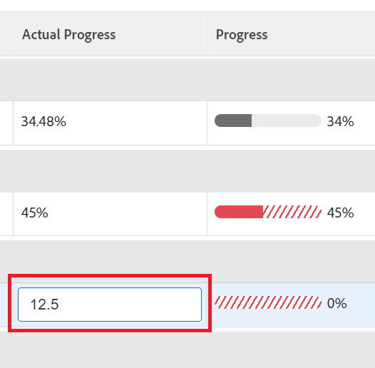

# Aggiornare lo stato dell’obiettivo negli obiettivi di Adobe Workfront

Devi rivedere periodicamente i tuoi obiettivi e aggiornarne i progressi per assicurarti che non siano in ritardo o siano in pericolo di non essere raggiunti.

<!--And: take this last sentence ^^ out when you update this for goal redesign production.-->

## Requisiti di accesso

<!--drafted for P&P release:

You must have the following: 

<table style="table-layout:auto">
 <col>
 </col>
 <col>
 </col>
 <tbody>
  <tr>
   <td role="rowheader">Adobe Workfront plan*</td>
   <td>
   
Current plan: Select or higher

   Or
   
Legacy plan: Pro or higher

   
   </td>
  </tr>
  <tr>
   <td role="rowheader">Adobe Workfront license*</td>
   <td>
   
Current license: Contributor or higher

   Or
   
Legacy license: Request or higher
 
For more information, see <a href="../../administration-and-setup/add-users/access-levels-and-object-permissions/wf-licenses.md" class="MCXref xref">Adobe Workfront licenses overview</a>.
 </td>
  </tr>
  <tr>
   <td role="rowheader">Product</td>
   <td>
   
 Current product requirement: If you have the Select or Prime Adobe Workfront plan, you must also buy an additional Adobe Workfront Goals license.  Workfront Goals are included in the Ultimate Workfront Plan.

   Or
   
Legacy product requirement: You must purchase an additional license for the Adobe Workfront Goals to access functionality described in this article. 
 
For information, see <a href="../../workfront-goals/goal-management/access-needed-for-wf-goals.md" class="MCXref xref">Requirements to use Workfront Goals</a>. 
 </td>
  </tr>
  <tr>
   <td role="rowheader">Access level*</td>
   <td> 
Edit access to Goals
 
<b>NOTE</b>
If you still don't have access, ask your Workfront administrator if they set additional restrictions in your access level. For information on how a Workfront administrator can change your access level, see:

     <ul>
      <li> 
<a href="../../administration-and-setup/add-users/configure-and-grant-access/create-modify-access-levels.md" class="MCXref xref">Create or modify custom access levels</a> 
 </li>
      <li> 
<a href="../../administration-and-setup/add-users/configure-and-grant-access/grant-access-goals.md" class="MCXref xref">Grant access to Adobe Workfront Goals</a> 
 </li>
     </ul> 
 </td>
  </tr>
  <tr data-mc-conditions="">
   <td role="rowheader">Object permissions</td>
   <td>
    

     
View or higher permissions to the goal to view it

     
Manage permissions to the goal to edit it

     
For information about sharing goals, see <a href="../../workfront-goals/workfront-goals-settings/share-a-goal.md" class="MCXref xref">Share a goal in Workfront Goals</a>. 

    
 </td>
  </tr>
 </tbody>
</table>

-->

Devi disporre dei seguenti elementi:

<table style="table-layout:auto"> 
 <col> 
 <col> 
 <tbody> 
  <tr> 
   <td role="rowheader">piano Adobe Workfront*</td> 
   <td> 
Pro o superiore
 </td> 
  </tr> 
  <tr> 
   <td role="rowheader">Licenza Adobe Workfront*</td> 
   <td> 
Richiesta o superiore
 
Per ulteriori informazioni, consulta <a href="../../administration-and-setup/add-users/access-levels-and-object-permissions/wf-licenses.md" class="MCXref xref">Panoramica sulle licenze di Adobe Workfront</a>.
 </td> 
  </tr> 
  <tr> 
   <td role="rowheader">Prodotto</td> 
   <td> 
Devi acquistare una licenza aggiuntiva per la funzionalità Obiettivi di Adobe Workfront per accedere alla descritta in questo articolo. 
 
Per informazioni, consulta <a href="../../workfront-goals/goal-management/access-needed-for-wf-goals.md" class="MCXref xref">Requisiti per l'utilizzo degli obiettivi di Workfront</a>. 
 </td> 
  </tr> 
  <tr> 
   <td role="rowheader">Configurazioni a livello di accesso*</td> 
   <td> 
Modificare l’accesso a Obiettivi o versioni successive
 
<b>NOTA</b>
Se non disponi ancora dell’accesso, chiedi all’amministratore Workfront se ha impostato ulteriori restrizioni nel livello di accesso. Per informazioni su come un amministratore Workfront può modificare il livello di accesso, consulta:
 
     <ul> 
      <li> 
<a href="../../administration-and-setup/add-users/configure-and-grant-access/create-modify-access-levels.md" class="MCXref xref">Creare o modificare livelli di accesso personalizzati</a> 
 </li> 
      <li> 
<a href="../../administration-and-setup/add-users/configure-and-grant-access/grant-access-goals.md" class="MCXref xref">Concedere l’accesso agli obiettivi di Adobe Workfront</a> 
 </li> 
     </ul> 
 </td> 
  </tr> 
  <tr data-mc-conditions=""> 
   <td role="rowheader">Autorizzazioni oggetto</td> 
   <td> 
    
 
     
Gestione delle autorizzazioni per l'obiettivo
 
     
Per informazioni sulla condivisione degli obiettivi, vedi <a href="../../workfront-goals/workfront-goals-settings/share-a-goal.md" class="MCXref xref">Condividere un obiettivo in Obiettivi di Workfront</a>. 
 
    
 </td> 
  </tr> 
 </tbody> 
</table>

*Per sapere quale piano, tipo di licenza o accesso si dispone, contattare l&#39;amministratore Workfront.

## Prerequisiti

È necessario disporre dei seguenti elementi prima di poter iniziare:

* Modello di layout che include l’area Obiettivi del menu principale.
* Un obiettivo attivo. Non è possibile aggiornare l&#39;avanzamento degli obiettivi che sono bozze, inattivi o chiusi.

## Considerazioni sull’aggiornamento degli obiettivi

Quando aggiorni gli obiettivi, considera quanto segue:

* Obiettivi di Workfront calcola automaticamente l&#39;avanzamento di un obiettivo quando si aggiorna l&#39;avanzamento dei relativi indicatori di avanzamento.

   >[!TIP]
   >
   >Non è possibile aggiornare i progressi direttamente su un obiettivo. È necessario aggiornare l&#39;avanzamento degli indicatori di avanzamento dell&#39;obiettivo (attività, risultati, progetti collegati) che a loro volta aggiornano l&#39;avanzamento dell&#39;obiettivo. Per aggiornare l’avanzamento dei progetti, è necessario aggiornare le attività del progetto.

   Vedi anche i seguenti articoli:

   * Per informazioni sull’aggiunta di attività agli obiettivi, consulta [Aggiungere attività agli obiettivi in Obiettivi di Adobe Workfront](../../workfront-goals/results-and-activities/add-activities-to-goals.md).
   * Per informazioni sull’aggiunta di risultati agli obiettivi, consulta [Aggiungere risultati agli obiettivi in Obiettivi di Adobe Workfront](../../workfront-goals/results-and-activities/add-results-to-goals.md).
   * Per informazioni sul modo in cui gli obiettivi di Workfront calcolano il progresso di un obiettivo, vedi [Panoramica dell’avanzamento e della condizione dell’obiettivo in Obiettivi di Adobe Workfront](../../workfront-goals/goal-management/calculate-goal-progress.md).

* È necessario creare obiettivi e attivarli prima di poter aggiornare i relativi progressi.

   Vedi anche i seguenti articoli:

   * Per informazioni sulla creazione degli obiettivi, vedi [Creare obiettivi in Obiettivi di Adobe Workfront](../../workfront-goals/goal-management/create-goals.md).
   * Per informazioni sull’attivazione degli obiettivi, consulta la [Attivare gli obiettivi in Obiettivi di Adobe Workfront](../../workfront-goals/goal-management/activate-goals.md).

   >[!IMPORTANT]
   >
   >Non è possibile aggiornare l’avanzamento degli obiettivi che vengono redatti, chiusi o inattivi.

* La prima volta che tu o un altro utente aggiorni l&#39;avanzamento di un risultato o di un&#39;attività su un obiettivo, le modifiche dell&#39;obiettivo Avanzamento da Nuovo e Obiettivi di Workfront iniziano a registrare l&#39;avanzamento e gli aggiornamenti dello stato di avanzamento sull&#39;obiettivo.

<!--

## Update goal progress by using Check-in in the Production environment

>[!IMPORTANT]
>
>  The Check-in functionality has been removed from the Preview environment and will be removed from Workfront Goals with the 23.1 release. See the [Update goal progress in the Preview environment](#update-goal-progress-in-the-preview-environment) section in this article to update goal progress in Preview. 

You can check in on goals at the individual goal level, or you can check in on multiple goals from the Check-in section of Workfront Goals.

* [Update individual goals](#update-individual-goals) 
* [Update goals in the Check-in section](#update-goals-in-the-check-in-section)

### Update individual goals {#update-individual-goals}

When you check in on a goal at the goal level, you can update the progress of the results and activities that are assigned to you or other users.

For information about how to update additional information about results and activities, see [Edit results and activities in Adobe Workfront Goals](../../workfront-goals/results-and-activities/edit-results-and-activities.md).

1. Click the **Main Menu** icon  > **Goals** in the upper-right corner.

   (!-- Add this when Shell is available to all: or (if available), click the **Main Menu** icon  in the upper-left corner)
   --)

   This opens the Workfront Goals area.

   All goals display by default. 

1. (Optional) Click any of the following sections in the left panel to access a list of goals:

   * Goal Alignment 
   * Pulse 
   * Check-in

   Or

   From the Goal List, click the name of a goal to open the **Goal Details** panel on the right.

   >[!TIP]
   >
   >You must have Edit access to Goals in your Access Level to view the Check-in section or the Check in button.

1. Click **Check in**.

   

   The progress of results and activities becomes editable.

1. Update the current progress on each of the results. Depending on what type of result you selected, you can do one of the following:

   * Update the quantity 
   * Update the currency amount
   * Update the percent complete

1. Update the percent complete on the Manual progress bar activity.

   >[!TIP]
   >
   >When you add projects as activities to your goals, you cannot manually update projects at the goal level. Workfront automatically updates project progress based on the project of their tasks. When the project percent complete updates in Workfront, the goal progress associated with the project also updates automatically.

1. Click **Back to Summary** to return to the Goal Details panel.

   Your goal progress updates as you update the results and activities of your goal. 

1. Click the **X icon** in the upper-right corner of the Goal Details panel to close it.

### Update goals in the Check-in section {#update-goals-in-the-check-in-section}

You can use the Check-in section to check in on goals when you want to quickly provide updates for several goals at the same time.

>[!TIP]
>
>You can access the Check-in section from any of the following sections:
>
>* Goal List 
>* Goal Alignment 
>* Pulse 
>

When you check in on a goal in the Check-in section, you can update the progress of the results and activities that are assigned only to you. You cannot update the progress of results and activities that are assigned to other users in this section.

1. Click the **Main Menu** icon  > **Goals** in the upper-right corner.

   (!-- Add this when Shell is available to all: or (if available), click the **Main Menu** icon  in the upper-left corner)
   --)

   This opens the Workfront Goals area and the Goal List section displays by default. 

1. Click Check-in in the left panel.

   Or

   (Conditional) If you are in the Goal List, Goal Alignment, or Pulse sections, click the **Check in** button in the upper-right of the screen. This opens the Check-in section.

   

   Goals display in a list and results and activities are listed under each goal.

   

1. (Optional) Click **Show all results**, **Show all activities**, or **Show all aligned goals** to the far right of the goal name to display all results, activities, and aligned goals of a goal whose progress you want to update.

   >[!CAUTION]
   >
   >You cannot directly update aligned goals, but you can update their results and activities.

1. Update the current progress on each of the results assigned to you. Depending on what type of result you selected, you can do one of the following:

   * Update the quantity 
   * Update the currency amount
   * Update the percent complete

   The result and the goal progress updated automatically and you receive a confirmation of your changes.

1. Update the percent complete on your Manual progress bar activity.

   >[!TIP]
   >
   >When you add projects as activities to your goals, you cannot manually update projects at the goal level. Workfront automatically updates project progress based on the project of their tasks. When the project percent complete updates in Workfront, the goal progress associated with the project also updates automatically.

   The activity and the goal progress updated automatically and you receive a confirmation of your changes.

1. (Optional) Add a comment for your goal, then click **Post** to save your comment.

-->

Per aggiornare i progressi relativi agli obiettivi:

1. Fai clic sul pulsante **Menu principale** icona  > **Obiettivi** nell&#39;angolo in alto a destra.

   <!-- Add this when Shell is available to all: or (if available), click the **Main Menu** icon  in the upper-left corner)
   -->

   Viene aperto l’elenco degli obiettivi. Per impostazione predefinita, vengono visualizzati tutti gli obiettivi a cui hai accesso.

   In alternativa, potete fare clic su Allineamento obiettivo nel pannello a sinistra.

1. Nell’Elenco obiettivi, fai clic sul nome di un obiettivo per aprire la pagina dell’obiettivo.
1. Fai clic su **Indicatori di progresso** nel pannello a sinistra.

   Nell&#39;elenco Indicatori di avanzamento vengono visualizzati tutti gli indicatori di avanzamento per l&#39;obiettivo selezionato.

   >[!NOTE]
   >
   >  * Puoi aggiornare solo i risultati e le attività.
   >  * È necessario aggiornare gli indicatori di avanzamento degli obiettivi figlio per mostrare i progressi relativi agli obiettivi figlio.
   >  * Per visualizzare l’avanzamento dei progetti, è necessario aggiornare le attività dei progetti collegati.

      >   
      >    A sua volta, il progresso degli obiettivi dei bambini e il progresso dei progetti guidano il progresso dell&#39;obiettivo selezionato.

1. Per aggiornare l’avanzamento di un risultato o di un’attività, fai clic sul valore all’interno del **Avanzamento effettivo** colonna del risultato o dell&#39;attività e digitare un numero per aggiornare il valore, quindi premere Invio.

   

   La barra di avanzamento per l&#39;indicatore di avanzamento nella colonna Avanzamento e l&#39;avanzamento dell&#39;obiettivo nell&#39;intestazione dell&#39;obiettivo si aggiornano immediatamente.

