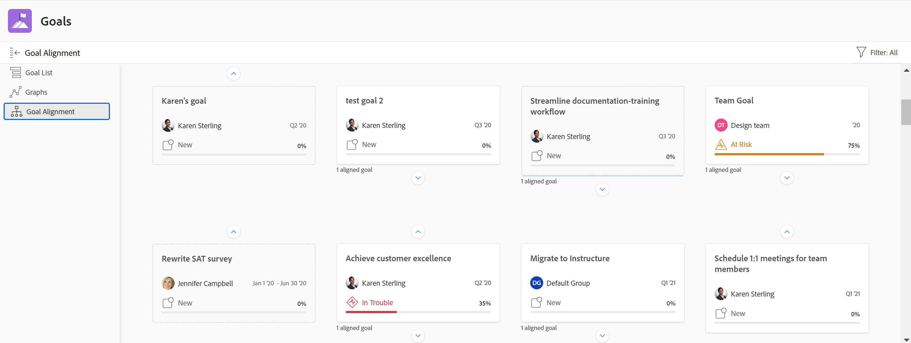

# Panoramica delle sezioni Obiettivi di Adobe Workfront

Per utilizzare le funzionalità descritte in questo articolo, l’organizzazione deve disporre dei seguenti elementi:

* Per il nuovo piano e la nuova struttura delle licenze:

   * Un piano Ultimate

     Oppure

     Una licenza aggiuntiva per Adobe Workfront Goals per i piani Prime o Select Adobe Workfront. Per informazioni, vedere [Piano Adobe Workfront](https://www.workfront.com/plans).

* Per il piano corrente e la struttura delle licenze:

   * A Pro o superiore
   * Una licenza Adobe Workfront Goals oltre a una licenza Workfront.

Contatta il tuo account manager Workfront per saperne di più su una licenza Workfront Goals.

Dopo che l’amministratore di Workfront ti ha concesso l’accesso agli obiettivi di Workfront, puoi visualizzare gli obiettivi che tu o chiunque altro nell’organizzazione hai creato nell’area Obiettivi di Workfront.

Puoi accedere agli elenchi di obiettivi o di singoli obiettivi e gestirli da diverse sezioni di Obiettivi Workfront. La sezione utilizzata dipende dallo scopo che si desidera raggiungere mentre si lavora con gli obiettivi.

Puoi applicare i filtri per visualizzare solo gli obiettivi che ti interessano in ogni sezione.

>[!TIP]
>
>I filtri aggiornati in una sezione vengono applicati automaticamente alle sezioni Elenco obiettivi, Grafici e Allineamento obiettivi. In questo modo, è possibile aggiornarle una sola volta. Per ulteriori informazioni, consulta [Filtrare le informazioni negli Obiettivi di Adobe Workfront](../../workfront-goals/goal-management/filter-information-wf-goals.md).

Di seguito è riportata una breve panoramica delle sezioni degli Obiettivi di Workfront e delle opzioni disponibili per la gestione degli obiettivi. Per ulteriori informazioni sulle azioni aggiuntive che è possibile eseguire all’interno di ogni sezione degli Obiettivi di Workfront, consigliamo anche i seguenti articoli:

* [Crea obiettivi in Obiettivi Adobe Workfront](../../workfront-goals/goal-management/create-goals.md)
* [Aggiornamento dell&#39;avanzamento dell&#39;obiettivo negli Obiettivi di Adobe Workfront](../../workfront-goals/goal-review-and-workfront-goals-sections/check-in-goals.md)
* [Filtrare le informazioni negli obiettivi di Adobe Workfront](../../workfront-goals/goal-management/filter-information-wf-goals.md)

## Elenco obiettivi

Puoi utilizzare l’Elenco obiettivi per rivedere gli obiettivi che appartengono a te, ai tuoi team, ai tuoi gruppi o alla tua organizzazione. Puoi visualizzare gli obiettivi in qualsiasi stato e da qualsiasi periodo di tempo.

Per informazioni sulla navigazione nell&#39;elenco degli obiettivi e sulla gestione degli obiettivi, vedere [Gestire gli obiettivi nell&#39;elenco degli obiettivi di Adobe Workfront](../../workfront-goals/goal-review-and-workfront-goals-sections/manage-goals-in-goal-list.md).

Utilizza Elenco obiettivi per effettuare le seguenti operazioni:

* Visualizza gli obiettivi che appartengono a te, ai tuoi team, ai tuoi gruppi o all’organizzazione.
* Esamina gli obiettivi e le relative informazioni (ad esempio nome, proprietario, avanzamento o condizione).
* Aggiungi nuovi obiettivi.

  Per ulteriori informazioni, consulta [Creare gli obiettivi in Obiettivi di Adobe Workfront](../../workfront-goals/goal-management/create-goals.md).

* Accedi alla pagina di un obiettivo e modifica e aggiorna l’obiettivo, i suoi risultati o le attività

  Per ulteriori informazioni, consulta [Modificare gli obiettivi in Obiettivi di Adobe Workfront](../../workfront-goals/goal-management/edit-goals.md).

* Modificare gli obiettivi.

## Grafi

Puoi utilizzare la sezione Grafici per ottenere una visione olistica dello stato degli obiettivi che appartengono a te o alla tua organizzazione. Puoi visualizzare informazioni sull’avanzamento degli obiettivi in qualsiasi stato da qualsiasi periodo di tempo in questa sezione.

Per informazioni sull&#39;utilizzo della sezione Grafici, vedere [Esaminare i grafici per comprendere le tendenze di avanzamento degli obiettivi in Obiettivi di Adobe Workfront](../../workfront-goals/goal-review-and-workfront-goals-sections/review-goal-graphs.md).

Utilizzare la sezione Grafici per effettuare le seguenti operazioni:

* Visualizza le prestazioni degli obiettivi che appartengono a te, ai tuoi team, ai tuoi gruppi o all’organizzazione.
* Visualizzare il numero di obiettivi con un determinato stato di avanzamento.
* Comprendi il rendimento dei tuoi obiettivi su base settimanale.

## Allineamento obiettivi

Se gli obiettivi sono allineati tra loro, puoi utilizzare la sezione Allineamento obiettivi per visualizzare e rivedere tutti gli obiettivi dell’organizzazione e il loro allineamento. Gli obiettivi allineati vengono visualizzati qui sulle schede collegate per illustrare il loro allineamento l&#39;uno all&#39;altro. Gli obiettivi principali vengono visualizzati per primi, mentre quelli secondari vengono sovrapposti. Puoi visualizzare gli obiettivi in qualsiasi stato e da qualsiasi periodo di tempo in questa sezione.

Per informazioni sull&#39;esplorazione della sezione Allineamento obiettivo per gestire gli obiettivi, vedere [Passare alla sezione Allineamento obiettivo in Obiettivi di Adobe Workfront](../../workfront-goals/goal-alignment/navigate-goal-alignment-chart.md).

Per informazioni sull&#39;allineamento degli obiettivi, vedere i seguenti articoli:

* [Allinea gli obiettivi collegandoli in Obiettivi Adobe Workfront](../../workfront-goals/goal-alignment/align-goals-by-connecting-them.md)
* [Allineare gli obiettivi convertendo risultati e attività in obiettivi](../../workfront-goals/goal-alignment/align-goals-by-converting-results-activities.md)

Utilizzare la sezione Allineamento obiettivo per effettuare le seguenti operazioni:

* Visualizza gli obiettivi che appartengono a te o alla tua organizzazione in formato scheda.
* Visualizzare la gerarchia degli obiettivi e gli obiettivi secondari allineati.
* Accedi alla pagina dell’obiettivo e aggiorna l’obiettivo, i relativi risultati o le attività.

<!--
## Pulse

 The Pulse section has been removed from the Preview environment and will be removed from Workfront Goals with the 23.1 release. Use the Goal List area to review goals that you or your teams are responsible for. 

You can use the Pulse section to review and request updates to goals that might influence the progress of your goals. These could be your own goals, or goals that belong to your teams, groups, or your organization. You can view goals in any status and from any time period in this section.

>[!TIP]
>
>Only goals that have been checked in on at least once display in the Pulse section.

For information about reviewing goals using the Pulse section, see [Review goals in the Adobe Workfront Goals Pulse section](../../workfront-goals/goal-review-and-workfront-goals-sections/review-goals-in-pulse.md).

Use the Pulse section to do the following:

* View goals that belong to your teams, groups, or organization. 
* Review goal progress and updates, including aligned goals, their results, and activities. 
* Make or ask for updates to a goal by adding a comment. 
* Access the Goal Details panel and edit and update the goal, its results, or activities.
* Add new goals. 
* Check in on goals.

  >[!TIP]
  >
  >Clicking Check in opens the Check-in section in the left panel.

## Check-in

 The Check-in section has been removed from the Preview environment and will be removed from Workfront Goals with the 23.1 release. Use the Goal List area to review goals that you or your teams are responsible for.

You must have access to Edit Goals in your access level before you can access the Check- in section. For information about granting access to Goals, see  [Grant access to Adobe Workfront Goals](../../administration-and-setup/add-users/configure-and-grant-access/grant-access-goals.md).

You can use the Check-in section to update active goals and any results and activities that you are the owner of. You can primarily view only goals in an Active status in this section. Children goals aligned to active parents also display in the Check-in section, regardless of their status.

>[!IMPORTANT]
>
>* A goal displays in the Check-in section only if it is assigned to you or if it has a result or activity that is assigned to you. 
>* If a goal assigned to you is the child goal of a parent that is not assigned to you and your goal (the child goal) is closed, inactive, or a draft, the parent goal does not display in your Check-in section. 
>

For information about managing goals in the Goal List, see [Manage goals in the Goal List of Adobe Workfront Goals](../../workfront-goals/goal-review-and-workfront-goals-sections/manage-goals-in-goal-list.md).

Use the Check-in section to do the following:

* Review goal progress and updates, including aligned goals, their results, and activities. 
* Update the progress on the results and activities that are assigned to you. For information about updating goals by checking in on them, see [Update goal progress in Adobe Workfront Goals](../../workfront-goals/goal-review-and-workfront-goals-sections/check-in-goals.md).

  >[!IMPORTANT]
  >
  >You can check in only on the results and activities assigned to you in the Check-in section, and not those that are assigned to other entities.

* Add a comment to a goal, then click Post to make or ask for updates to a goal. 
* Access the Goal Details panel and edit and update the goal, its results, or activities.
* Add new goals.
-->
