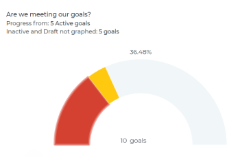

# Rivedi i grafici per comprendere le tendenze di avanzamento degli obiettivi in Obiettivi di Adobe Workfront

<!-- drafted mostly for P&P release-->

Puoi visualizzare lo stato complessivo dei tuoi obiettivi e la loro tendenza di avanzamento nel tempo nella sezione Grafici degli Obiettivi di Adobe Workfront. I grafici in questa sezione non suddividono l’avanzamento di ciascun obiettivo, ma forniscono invece un’istantanea olistica dello stato di avanzamento di tutti gli obiettivi e della loro tendenza di avanzamento nel tempo durante un periodo specificato.

>[!IMPORTANT]
>
>Puoi visualizzare il conteggio totale degli obiettivi nella sezione Grafici per un periodo di tempo selezionato. Tuttavia, nel calcolare lo stato di avanzamento complessivo dell’obiettivo e la percentuale di completamento, in Obiettivi Workfront vengono presi in considerazione solo gli obiettivi con lo stato Attivo e Chiuso.

## Requisiti di accesso

Per eseguire le azioni descritte in questo articolo, è necessario disporre dei seguenti diritti di accesso:

<table style="table-layout:auto">
<col>
</col>
<col>
</col>
<tbody>
 <tr> 
   <td role="rowheader">Piano Adobe Workfront*</td> 
   <td> 
   
Per il nuovo piano e la nuova struttura delle licenze:
  <ul><li>Un piano Ultimate </li></ul>
   

Per il piano corrente e la struttura delle licenze: 
<ul><li> A Pro o superiore </li>
  <li>Una licenza Adobe Workfront Goals oltre a una licenza Workfront.</li></ul>

   </td> 
  </tr>
 <tr>
 <td role="rowheader">Licenza Adobe Workfront*</td>
 <td>
 
Nuova licenza: Collaboratore o versione successiva

 Oppure
 
Licenza corrente: richiesta o successiva
 
Per ulteriori informazioni, vedere <a href="../../administration-and-setup/add-users/access-levels-and-object-permissions/wf-licenses.md" class="MCXref xref">Panoramica delle licenze di Adobe Workfront</a>.
 </td>
 </tr>
 <tr>
 <td role="rowheader">Prodotto*</td>
 <td>
 
 Nuovo requisito del prodotto, uno dei seguenti: 

<ul>
<li>Un piano Select o Prime Adobe Workfront e un’ulteriore licenza Adobe Workfront Goals.</li>
<li>Un piano Workfront Ultimate che include gli obiettivi Workfront per impostazione predefinita. </li></ul>
 
Oppure

 
Fabbisogno di prodotto corrente: un piano Workfront e una licenza aggiuntiva per gli obiettivi Adobe Workfront. 
 
Per informazioni, vedere <a href="../../workfront-goals/goal-management/access-needed-for-wf-goals.md" class="MCXref xref">Requisiti per l'utilizzo degli obiettivi di Workfront</a>. 
 </td>
 </tr>
 <tr>
 <td role="rowheader">
Livello di accesso
</td>
 <td> 
Modifica accesso agli obiettivi
 </td>
 </tr>
 <tr data-mc-conditions="">
 <td role="rowheader">Autorizzazioni oggetto</td>
 <td>
  

  
Visualizza o autorizzazioni superiori per l’obiettivo per visualizzarlo

  
Gestire le autorizzazioni per l’obiettivo per modificarlo

  
Per informazioni sulla condivisione degli obiettivi, vedere <a href="../../workfront-goals/workfront-goals-settings/share-a-goal.md" class="MCXref xref">Condividere un obiettivo in Obiettivi di Workfront</a>. 

  
 </td>
 </tr>
 <tr>
   <td role="rowheader">
Modello di layout
</td>
   <td> 
A tutti gli utenti, inclusi gli amministratori di Workfront, deve essere assegnato un modello di layout che includa l’area Obiettivi nel menu principale. 
  
</td>
  </tr>
</tbody>
</table>

*Per ulteriori informazioni, consulta [Requisiti di accesso nella documentazione di Workfront](/help/quicksilver/administration-and-setup/add-users/access-levels-and-object-permissions/access-level-requirements-in-documentation.md).

## Tipi di grafici in Obiettivi Workfront

Nella sezione Grafici o Obiettivi Workfront sono disponibili i seguenti grafici:

<table style="table-layout:auto"> 
 <col> 
 <col> 
 <tbody> 
  <tr> 
   <td role="rowheader">Grafico Stato Obiettivo</td> 
   <td> 
Grafico di misura che visualizza quanto segue:
 
    <ul> 
     <li>Numero totale di obiettivi per il periodo di tempo selezionato. Gli obiettivi con qualsiasi stato vengono presi in considerazione. </li> 
     <li>Stato di avanzamento degli obiettivi con stato Attivo e Chiuso.</li> 
    </ul> 
Per informazioni sul modo in cui Workfront Goals calcola lo stato di avanzamento, vedere <a href="../../workfront-goals/goal-management/calculate-goal-progress.md" class="MCXref xref">Panoramica sull'avanzamento e sulla condizione dell'obiettivo in Adobe Workfront Goals</a>.
 </td> 
  </tr> 
  <tr> 
   <td role="rowheader">Grafico Stato Obiettivo</td> 
   <td> 
Un grafico a linee che mostra gli aggiornamenti apportati agli obiettivi con incrementi settimanali durante la durata dell’obiettivo. Il grafico dell’avanzamento dell’obiettivo mostra quanto segue:
 
    <ul> 
     <li>Percentuale media di completamento prevista ed effettiva di tutti gli obiettivi attivi e chiusi nel periodo selezionato. La percentuale di completamento dell’avanzamento viene suddivisa in incrementi settimanali contrassegnati da nodi. </li> 
     <li>Percentuale media complessiva di avanzamento per obiettivi attivi e chiusi dalla settimana precedente. </li> 
    </ul> 
Suggerimento: il grafico avanzamento obiettivo potrebbe non visualizzare informazioni quando vengono apportati aggiornamenti agli obiettivi oltre il periodo di tempo selezionato. 
 </td> 
  </tr> 
 </tbody> 
</table>

## Esaminare l’avanzamento dell’obiettivo nei grafici

1. Fai clic sull&#39;icona **Main Menu**  > **Goals** nell&#39;angolo superiore destro.

   <!-- Add this when Shell is available to all: or (if available), click the **Main Menu** icon  in the upper-left corner)
   -->

   Verrà aperta l&#39;area Obiettivi Workfront.

1. Fai clic su **Grafici** nel pannello a sinistra.

   

   Viene visualizzata la sezione Grafici.

   Per impostazione predefinita, gli obiettivi visualizzati nella sezione Grafici sono limitati dai seguenti criteri:

   * Filtri applicati all&#39;area Grafici.
   * Obiettivi con stato Attivo e Bozza.

1. (Facoltativo) Seleziona il tipo di informazioni da visualizzare aggiornando i filtri nell’angolo superiore destro della sezione Grafici.

   Per ulteriori informazioni sul filtro degli obiettivi, vedere [Filtrare le informazioni negli Obiettivi di Adobe Workfront](../../workfront-goals/goal-management/filter-information-wf-goals.md).

   >[!TIP]
   >
   >Se si è scelto di visualizzare più periodi di tempo, per ogni periodo di tempo vengono visualizzati un grafico di stato (indicatore) e un grafico di avanzamento (linea).

1. Rivedi le informazioni nella tabella seguente quando rivedi il Grafico stato obiettivo.

   

   | Numero totale di obiettivi | Il numero nella parte inferiore del grafico indica il numero di tutti gli obiettivi nel periodo selezionato, in tutti gli stati selezionati. |
   |---|---|
   | Percentuale media di completamento | Nella parte superiore del grafico questo numero indica la percentuale media di completamento degli obiettivi attivi e chiusi nel periodo di tempo selezionato. |
   | Obiettivi e loro progressi | Il numero di obiettivi per ogni segmento di stato di avanzamento, quando passi il cursore sui segmenti del grafico. Nei segmenti vengono conteggiati solo gli obiettivi con lo stato Attivo o Chiuso. |

1. Rivedi le informazioni nella tabella seguente quando visualizzi il grafico Progresso obiettivo.

   

   <table style="table-layout:auto"> 
    <col> 
    <col> 
    <tbody> 
     <tr> 
      <td>Avanzamento linea di base</td> 
      <td>La linea di pendenza verde indica la percentuale complessiva di completamento prevista per gli obiettivi attivi e chiusi per il periodo di tempo selezionato. Tutti gli obiettivi entro un periodo di tempo dovrebbero essere completati, pertanto lo stato di avanzamento di base è sempre del 100% alla fine del periodo. </td> 
     </tr> 
     <tr> 
      <td>Avanzamento effettivo</td> 
      <td> 
La linea blu indica la percentuale complessiva effettiva di completamento media degli obiettivi attivi e chiusi per il periodo di tempo selezionato, con incrementi settimanali. Ogni settimana durante la durata dell’obiettivo viene contrassegnata da un nodo nella riga. 
 </td> 
     </tr> 
    </tbody> 
   </table>

1. Passa il cursore del mouse su un nodo della settimana nel grafico di avanzamento dell’obiettivo ed esamina quanto segue:

   * **Data settimana**: il mese, il giorno e l&#39;anno della settimana selezionata.
   * **Avanzamento**: media della percentuale effettiva di completamento di tutti gli obiettivi per la settimana selezionata.
   * **Previsione**: media della percentuale di completamento prevista di tutti gli obiettivi per la settimana selezionata.

1. (Facoltativo) Fai clic su **Avanzamento** nella parte inferiore del grafico di avanzamento per rimuovere la linea di avanzamento complessiva effettiva

   Oppure

   Fai clic su **Previsione** nella parte inferiore del grafico dell&#39;avanzamento per rimuovere l&#39;avanzamento previsto dal grafico.

 
