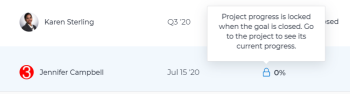

# Aggiungere progetti agli obiettivi in Obiettivi di Adobe Workfront

<!--
THIS MIGHT NEED TO BE RENAMED BECAUSE THERE WILL BE OTHER OBJECTS CONNECTED TO GOALS IN THE FUTURE
-->

Puoi collegare i progetti agli obiettivi per indicare il progresso dell’obiettivo, in base all’avanzamento effettivo del progetto. Il progetto diventa un indicatore di avanzamento per l’obiettivo.

Collegando i progetti agli obiettivi è possibile collegare la pianificazione strategica (obiettivi) dell&#39;organizzazione al lavoro effettivo che le persone stanno eseguendo e completando ogni giorno (progetti).

>[!IMPORTANT]
>
>Gli obiettivi a livello di progetto creati nell’area Business Case di un progetto non sono collegati a obiettivi strategici creati in Obiettivi di Workfront. Per informazioni sugli obiettivi del progetto Business Case, vedi [Creare gli obiettivi del caso aziendale](../../manage-work/projects/define-a-business-case/create-business-case-goals.md).

## Requisiti di accesso

<!--drafted for P&P release: replace the table below with this: 

<table style="table-layout:auto">
 <col>
 </col>
 <col>
 </col>
 <tbody>
  <tr>
   <td role="rowheader">Adobe Workfront plan*</td>
   <td>
   
Current plan: Select or higher

   Or
   
Legacy plan: Pro or higher

   
   </td>
  </tr>
  <tr>
   <td role="rowheader">Adobe Workfront license*</td>
   <td>
   
Current license: Contributor or higher

   Or
   
Legacy license: Request or higher
 
For more information, see <a href="../../administration-and-setup/add-users/access-levels-and-object-permissions/wf-licenses.md" class="MCXref xref">Adobe Workfront licenses overview</a>.
 </td>
  </tr>
  <tr>
   <td role="rowheader">Product</td>
   <td>
   
 Current product requirement: If you have the Select or Prime Adobe Workfront plan, you must also buy an additional Adobe Workfront Goals license.  Workfront Goals are included in the Ultimate Workfront Plan.

   Or
   
Legacy product requirement: You must purchase an additional license for the Adobe Workfront Goals to access functionality described in this article. 
 
For information, see <a href="../../workfront-goals/goal-management/access-needed-for-wf-goals.md" class="MCXref xref">Requirements to use Workfront Goals</a>. 
 </td>
  </tr>
  <tr>
   <td role="rowheader">Access level*</td>
   <td> 
Edit access to Goals
 
<b>NOTE</b>
If you still don't have access, ask your Workfront administrator if they set additional restrictions in your access level. For information on how a Workfront administrator can change your access level, see:

     <ul>
      <li> 
<a href="../../administration-and-setup/add-users/configure-and-grant-access/create-modify-access-levels.md" class="MCXref xref">Create or modify custom access levels</a> 
 </li>
      <li> 
<a href="../../administration-and-setup/add-users/configure-and-grant-access/grant-access-goals.md" class="MCXref xref">Grant access to Adobe Workfront Goals</a> 
 </li>
     </ul> 
 </td>
  </tr>
  <tr data-mc-conditions="">
   <td role="rowheader">Object permissions</td>
   <td>
    

     
View or higher permissions to the goal to view it

     
Manage permissions to the goal to edit it

     
For information about sharing goals, see <a href="../../workfront-goals/workfront-goals-settings/share-a-goal.md" class="MCXref xref">Share a goal in Workfront Goals</a>. 

    
 </td>
  </tr>
 </tbody>
</table>

-->
Devi disporre dei seguenti elementi:

<table style="table-layout:auto"> 
 <col> 
 <col> 
 <tbody> 
  <tr> 
   <td role="rowheader">piano Adobe Workfront*</td> 
   <td> 
Pro o superiore
 </td> 
  </tr> 
  <tr> 
   <td role="rowheader">Licenza Adobe Workfront*</td> 
   <td> 
Richiesta o superiore
 
Per ulteriori informazioni, consulta <a href="../../administration-and-setup/add-users/access-levels-and-object-permissions/wf-licenses.md" class="MCXref xref">Panoramica sulle licenze di Adobe Workfront</a>.
 </td> 
  </tr> 
  <tr> 
   <td role="rowheader">Prodotto</td> 
   <td> 
Devi acquistare una licenza aggiuntiva per la funzionalità Obiettivi di Adobe Workfront per accedere alla descritta in questo articolo. 
 
Per informazioni, consulta <a href="../../workfront-goals/goal-management/access-needed-for-wf-goals.md" class="MCXref xref">Requisiti per l'utilizzo degli obiettivi di Workfront</a>. 
 </td> 
  </tr> 
  <tr> 
   <td role="rowheader">Configurazioni a livello di accesso*</td> 
   <td> 
Modifica l'accesso agli obiettivi
 
<b>NOTA</b>

Se non disponi ancora dell’accesso, chiedi all’amministratore Workfront se ha impostato ulteriori restrizioni nel livello di accesso. Per informazioni su come un amministratore Workfront può modificare il livello di accesso, consulta:
 
     <ul> 
      <li> 
<a href="../../administration-and-setup/add-users/configure-and-grant-access/create-modify-access-levels.md" class="MCXref xref">Creare o modificare livelli di accesso personalizzati</a> 
 </li> 
      <li> 
<a href="../../administration-and-setup/add-users/configure-and-grant-access/grant-access-goals.md" class="MCXref xref">Concedere l’accesso agli obiettivi di Adobe Workfront</a> 
 </li> 
     </ul> 
 </td> 
  </tr> 
  <tr data-mc-conditions=""> 
   <td role="rowheader">Autorizzazioni oggetto</td> 
   <td> 
    
 
     
Gestione delle autorizzazioni per l'obiettivo
 
     
Per informazioni sulla condivisione degli obiettivi, vedi <a href="../../workfront-goals/workfront-goals-settings/share-a-goal.md" class="MCXref xref">Condividere un obiettivo in Obiettivi di Workfront</a>. 
 
    
 </td> 
  </tr> 
 </tbody> 
</table>

*Per sapere quale piano, tipo di licenza o accesso si dispone, contattare l&#39;amministratore Workfront.

Per ulteriori informazioni sull&#39;accesso agli obiettivi di Workfront, vedi [Requisiti per l&#39;utilizzo degli obiettivi di Workfront](../goal-management/access-needed-for-wf-goals.md).

## Considerazioni sul collegamento di progetti agli obiettivi

* Puoi aggiungere a un obiettivo un progetto che soddisfi i seguenti criteri:

   * Devi disporre almeno delle autorizzazioni per visualizzarlo.

      >[!NOTE]
      >
      >Se si perdono le autorizzazioni per visualizzare il progetto dopo aver collegato il progetto all’obiettivo, è comunque possibile visualizzare le informazioni sul progetto per l’obiettivo, ma non è più possibile accedere al progetto.

   * Il progetto non deve trovarsi in uno stato Morto.

* È possibile associare più progetti a un obiettivo.
* È possibile associare lo stesso progetto a più obiettivi.
* Non puoi aggiornare manualmente l’avanzamento di un progetto dall’obiettivo a cui è associato. Al contrario, Workfront calcola la percentuale di completamento del progetto e obiettivi Workfront calcola l&#39;avanzamento dell&#39;obiettivo utilizzando questa percentuale di completamento. Questo aggiorna l’obiettivo in tempo reale dopo l’aggiornamento della percentuale del progetto.
* La durata del progetto può essere al di fuori del periodo di tempo di un obiettivo. Se un progetto dura più della scadenza dell’obiettivo, puoi comunque chiuderlo e considerarlo completato, ma la percentuale di completamento dell’obiettivo non sarà del 100%. La percentuale di completamento del progetto non viene più aggiornata sull&#39;obiettivo.

<!--this is no longer visible in the new redesigned interface for goals: logged a bug for this: https://experience.adobe.com/#/@adobeinternalworkfront/so:hub-Hub/workfront/issue/63ceb049000080d30022aab9a359f6f1/updates - but confirmed that this will not be brought back at least for now - Jan 2023. 

There is an indication on the goal list that the project no longer updates progress for the goal.

  
-->

* Quando elimini un progetto allegato a un obiettivo, anche il progetto viene eliminato dall’obiettivo.

   >[!CAUTION]
   >
   >Se l’obiettivo era attivo prima dell’eliminazione del progetto e non vi sono altri indicatori di avanzamento sull’obiettivo, l’obiettivo diventa Inattivo.

## Aggiungere progetti agli obiettivi

1. Fai clic sul pulsante **Menu principale**  (crea questo progetto per Shell: o fai clic su **Menu principale**  nell’angolo in alto a sinistra, se disponibile.) , quindi **Obiettivi**.
1. Nell’Elenco obiettivi, fai clic sul nome di un obiettivo per aprire la pagina dell’obiettivo.
1. Fai clic su **Indicatori di progresso** nel pannello a sinistra.
1. Da **Nuovo indicatore di avanzamento** menu a discesa, fai clic su **Aggiungi progetto esistente**.

   Viene visualizzata la casella Aggiungi progetti all’obiettivo .
1. (Facoltativo) Aggiorna **Visualizza**, **Filtro** oppure **Raggruppamento** facendo clic sulle rispettive icone nell’angolo in alto a destra dell’elenco per modificare la modalità di visualizzazione dell’elenco dei progetti.
1. (Facoltativo) Fai clic sul pulsante **Ricerca** icona  inizia a digitare il nome di un progetto per individuarlo rapidamente nell’elenco.
1. Seleziona i progetti da aggiungere all’obiettivo, quindi fai clic su **Aggiungi**.

   I progetti selezionati vengono aggiunti all’obiettivo e vengono visualizzati nella sezione Indicatori di avanzamento della pagina dell’obiettivo, nella sezione **Progetto** raggruppamento.

   Dopo aver attivato l’obiettivo, l’avanzamento dell’obiettivo viene aggiornato automaticamente quando l’avanzamento di un progetto viene aggiornato. Per informazioni sull&#39;attivazione di un obiettivo, vedi [Attivare gli obiettivi in Obiettivi di Adobe Workfront](../goal-management/activate-goals.md).

## Individua informazioni di progetto sugli obiettivi

Le seguenti informazioni sul progetto sono visibili a livello di obiettivo nella sezione Indicatori di avanzamento della pagina di un obiettivo:

<table>
  <tr>
   <td>Nome progetto
   </td>
   <td>Eventuali modifiche nel nome del progetto si rifletteranno anche nel progetto connesso.
   </td>
  </tr>
  <tr>
   <td>Proprietario progetto
   </td>
   <td>Eventuali modifiche apportate al proprietario del progetto si rifletteranno anche nel progetto connesso.
   </td>
  </tr>
    <tr>
   <td>Avanzamento corrente
   </td>
   <td> 
Percentuale di completamento del progetto. Non è possibile aggiornare manualmente la percentuale di completamento del progetto dall'obiettivo. Workfront la calcola automaticamente in base alla percentuale di completamento delle attività. 

   </td>
  </tr>
  <tr>
   <td>Avanzamento
   </td>
   <td>La percentuale di completamento del progetto rappresentata da una barra. Qualsiasi modifica nella percentuale di completamento del progetto aggiorna automaticamente l’avanzamento dell’obiettivo, a meno che l’obiettivo non venga chiuso.
   </td>
  </tr>

</table>

## Individuare le informazioni sull’obiettivo nei progetti

Le seguenti informazioni sull’obiettivo sono visibili in un elenco o in un rapporto di progetto:

| Informazioni sull’obiettivo | Descrizione |
|---|---|
| Obiettivi | Elenco di tutti gli obiettivi a cui è associato un progetto. |
| Gerarchia degli obiettivi | La gerarchia a cui appartiene un obiettivo. Solo i genitori dell&#39;obiettivo e l&#39;obiettivo vengono visualizzati in questo campo. Gli obiettivi dei bambini non vengono visualizzati. |
| Numero di obiettivi collegati | Numero di obiettivi collegati a un progetto. |
