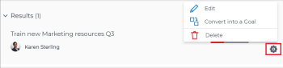

# Modificare risultati e attività in Obiettivi di Adobe Workfront

Dopo che l’amministratore di Adobe Workfront ti ha concesso l’accesso corretto agli Obiettivi di Adobe Workfront, puoi creare e modificare obiettivi, risultati e attività.

Per informazioni sulla creazione di obiettivi, risultati e attività, consulta i seguenti articoli:

* [Crea obiettivi in Obiettivi Adobe Workfront](../../workfront-goals/goal-management/create-goals.md)
* [Guida introduttiva ai risultati e alle attività negli Obiettivi di Adobe Workfront](../../workfront-goals/results-and-activities/get-started-with-results-and-activities.md)
* [Aggiungi risultati agli obiettivi in Obiettivi di Adobe Workfront](../../workfront-goals/results-and-activities/add-results-to-goals.md)
* [Aggiungere attività agli obiettivi in Obiettivi di Adobe Workfront](../../workfront-goals/results-and-activities/add-activities-to-goals.md)

## Requisiti di accesso

>[!NOTE]
>
>La tua azienda potrebbe scegliere di continuare a utilizzare gli obiettivi di Adobe Workfront se ha acquistato questo pacchetto in passato. Per ulteriori dettagli, rivolgiti al rappresentante del tuo account.
>
>Adobe Workfront Goals non è più disponibile per l’acquisto.

+++ Espandi per visualizzare i requisiti di accesso per la funzionalità in questo articolo. 

<table style="table-layout:auto">
<col>
</col>
<col>
</col>
<tbody>
 <tr>
  <td> 
Pacchetto Adobe Workfront
 </td> 
   <td> 
   
Adobe Workfront Ultimate

   </td> 
  </tr>
 <tr>
 <td role="rowheader">Licenza Adobe Workfront</td>
 <td>
 
Collaboratore o versione successiva

Richiedi o superiore
</td>
 </tr>
  <tr>
 <td role="rowheader">Configurazione del livello di accesso</td>
 <td> 
Modifica accesso agli obiettivi
 </td>
 </tr>
 <tr data-mc-conditions="">
 <td role="rowheader">Autorizzazioni oggetto</td>
 <td>
  

  
Visualizza o autorizzazioni superiori per l’obiettivo per visualizzarlo

  
Gestire le autorizzazioni per l’obiettivo per modificarlo

  
 </td>
 </tr>
<tr>
   <td role="rowheader">
Modello layout
</td>
   <td> 
A tutti gli utenti, inclusi gli amministratori di sistema, deve essere assegnato un modello di layout che includa l'area Obiettivi nel menu principale. 
  
</td>
  </tr>
</tbody>
</table>

Per ulteriori informazioni, consulta [Requisiti di accesso nella documentazione di Workfront](/help/quicksilver/administration-and-setup/add-users/access-levels-and-object-permissions/access-level-requirements-in-documentation.md).

+++

<!--Old:
<table style="table-layout:auto">
<col>
</col>
<col>
</col>
<tbody>
 <tr> 
   <td role="rowheader">Adobe Workfront plan*</td> 
   <td> 
   
For the new plan and license structure:
  <ul><li>An Ultimate plan </li></ul>
   

For the current plan and license structure: 
<ul><li> A Pro or higher </li>
  <li>An Adobe Workfront Goals license in addition to a Workfront license.</li></ul>

   </td> 
  </tr>
 <tr>
 <td role="rowheader">Adobe Workfront license*</td>
 <td>
 
New license: Contributor or higher

 Or
 
Current license: Request or higher
 
For more information, see <a href="../../administration-and-setup/add-users/access-levels-and-object-permissions/wf-licenses.md" class="MCXref xref">Adobe Workfront licenses overview</a>.
 </td>
 </tr>
 <tr>
 <td role="rowheader">Product*</td>
 <td>
 
 New product requirement, one of the following: 

<ul>
<li>A Select or Prime Adobe Workfront plan and an additional Adobe Workfront Goals license.</li>
<li>An Ultimate Workfront plan which includes Workfront Goals by default. </li></ul>
 
Or

 
Current product requirement: A Workfront plan and an additional license for Adobe Workfront Goals. 
 
For information, see <a href="../../workfront-goals/goal-management/access-needed-for-wf-goals.md" class="MCXref xref">Requirements to use Workfront Goals</a>. 
 </td>
 </tr>
 <tr>
 <td role="rowheader">
Access level
</td>
 <td> 
Edit access to Goals
 </td>
 </tr>
 <tr data-mc-conditions="">
 <td role="rowheader">Object permissions</td>
 <td>
  

  
View or higher permissions to the goal to view it

  
Manage permissions to the goal to edit it

  
For information about sharing goals, see <a href="../../workfront-goals/workfront-goals-settings/share-a-goal.md" class="MCXref xref">Share a goal in Workfront Goals</a>. 

  
 </td>
 </tr>
 <tr>
   <td role="rowheader">
Layout template
</td>
   <td> 
All users, including Workfront administrators,  must be assigned a layout template that includes the Goals area in the Main Menu. 
  
</td>
  </tr>
</tbody>
</table>-->

## Considerazioni durante la modifica di risultati e attività

<!--
According to Vazgen, access levels will add more considerations.)
-->

* Puoi modificare i risultati e le attività che appartengono agli obiettivi creati o che disponi delle autorizzazioni necessarie per gestire.
* Non è possibile modificare l’avanzamento di progetti connessi a obiettivi come attività da Obiettivi di Workfront. L’avanzamento dei progetti viene aggiornato al completamento delle attività nel progetto. Puoi rimuovere i progetti dall’obiettivo disconnettendoli. Per ulteriori informazioni, vedere la sezione &quot;Disconnetti progetti&quot; nell&#39;articolo [Rimuovere risultati, attività e progetti dagli obiettivi in Obiettivi di Adobe Workfront](../../workfront-goals/results-and-activities/remove-results-activities-from-goals.md).

  >[!NOTE]
  >
  >Se le seguenti informazioni sul progetto vengono aggiornate a livello di progetto, Workfront Goals le aggiorna automaticamente a livello di obiettivo:
  >
  >   
  >   
  >   * Proprietario del progetto
  >   * Nome progetto
  >   * Percentuale di completamento progetto
  >   
  >   
  >Per informazioni sulla connessione dei progetti agli obiettivi, vedere [Aggiungere progetti agli obiettivi in Obiettivi di Adobe Workfront](../../workfront-goals/results-and-activities/connect-projects-to-goals-overview.md).

* Puoi eliminare i risultati e le attività dagli obiettivi quando non sono più rilevanti per il loro avanzamento. Non è possibile recuperare i risultati e le attività eliminati. Per informazioni sull&#39;eliminazione di risultati e attività, vedere [Rimuovere risultati, attività e progetti dagli obiettivi in Obiettivi di Adobe Workfront](../../workfront-goals/results-and-activities/remove-results-activities-from-goals.md).
* Puoi modificare i risultati e le attività associate agli obiettivi da qualsiasi periodo di tempo, incluso il passato.
* La modifica dei risultati e delle attività ne aggiorna le impostazioni e non lo stato di avanzamento. È necessario aggiornare l’avanzamento dei risultati e delle attività. Per informazioni sull&#39;aggiornamento dell&#39;avanzamento di obiettivi, risultati e attività, vedere [Aggiornare l&#39;avanzamento dell&#39;obiettivo in Obiettivi di Adobe Workfront](../../workfront-goals/goal-review-and-workfront-goals-sections/check-in-goals.md).

## Modifica risultati

<!--
Editing results differs depending on which environment you use.

### Edit results in the Production environment

1. Go to the goal for which you want to edit a result and click the goal name to open the **Goal Details** panel.
1. Click **Results**.
1. Click the **gear icon**  to the right of the result you want to edit.

   

1. Click **Edit** to edit the following information:

   | Field |Description|
   |---|---|
   | Name |The name of the result. |
   | Owner |The owner of result.  |
   | Value |How you measure the progress of the result. |
   | Initial |The original value of the result. |
   | Target |The desired value when the result is completed. |

1. Click **Save**.
-->

1. Fai clic sull&#39;icona **Main Menu** , quindi su **Goals**.
1. Nell&#39;elenco Obiettivo fare clic sul nome di un obiettivo per aprire la pagina obiettivo.
1. Fai clic su **Indicatori di avanzamento** nel pannello a sinistra.
1. Selezionare un risultato nell&#39;elenco Indicatori di avanzamento e fare clic sull&#39;icona **Modifica** .

   Viene visualizzata la casella Modifica risultato (Edit Result).

   

1. Modifica le seguenti informazioni:
   * **Nome risultato**: nome del risultato. Utilizza un nome descrittivo che illustra il risultato da ottenere per completare l’obiettivo.
   * **Proprietario risultato**: proprietario del risultato. Il proprietario deve essere un utente Workfront attivo.
   * **Tipo di valore**: come misurare l&#39;avanzamento del risultato.
   * **Valore iniziale**: il valore originale del risultato.
   * **Valore di destinazione**: il valore desiderato al completamento del risultato.
Per ulteriori informazioni sui campi dei risultati, vedere [Aggiungere risultati agli obiettivi](../results-and-activities/add-results-to-goals.md).
1. Fai clic su **Salva**.

## Modifica attività

<!--
Editing activities differs depending on which environment you use.

### Edit activities in the Production environment

>[!TIP]
>
>You cannot edit the Activity Type after you saved an activity on a goal.

1. Go to the goal for which you want to edit an activity and click the goal name to open the **Goal Details** panel.
1. Click **Activities**.
1. Click the **gear icon**  to the right of the activity you want to edit .

   

1. Click **Edit** to edit the following information:

   | Field |Description |
   |---|---|
   | Name |The name of the activity. |
   | Owner |The owner of activity.  |

1. Click **Save**.
-->

1. Fai clic sull&#39;icona **Main Menu** , quindi su **Goals**.
1. Nell&#39;elenco Obiettivo fare clic sul nome di un obiettivo per aprire la pagina obiettivo.
1. Fai clic su **Indicatori di avanzamento** nel pannello a sinistra.
1. Selezionare un&#39;attività nell&#39;elenco Indicatori di avanzamento e fare clic sull&#39;icona **Modifica** .

   Viene visualizzata la casella Modifica attività.

   

1. Modifica le seguenti informazioni:

   * **Nome attività**: nome dell&#39;attività. Utilizza un nome descrittivo che illustra l’attività da eseguire per indicare che l’obiettivo è stato completato.
   * **Proprietario attività:** Proprietario dell&#39;attività. Il proprietario deve essere un utente Workfront attivo.

   Per ulteriori informazioni sui campi attività, vedere [Aggiungere attività agli obiettivi](../results-and-activities/add-activities-to-goals.md).

1. Fai clic su **Salva**.
