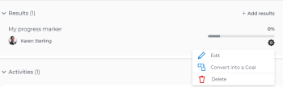

# Rimuovere gli indicatori di progresso dagli obiettivi in Obiettivi di Adobe Workfront

<!-- for goal redesign PRODUCTION RELEASE: Should this article be called "Remove or disconnect progress indicators from goals" when this is available to ALL progress indicators (including "disconnect goals")-- if yes, updte the title everywhere else where this is linked?
-->

Puoi rimuovere risultati, attività e progetti dagli obiettivi se non sono più rilevanti.

Per informazioni sulla creazione di obiettivi e sull’aggiunta di risultati e attività, consulta i seguenti articoli:

* [Crea obiettivi in Obiettivi Adobe Workfront](../../workfront-goals/goal-management/create-goals.md)
* [Aggiungi attività agli obiettivi in Obiettivi di Adobe Workfront](../../workfront-goals/results-and-activities/add-activities-to-goals.md)
* [Aggiungi risultati agli obiettivi in Obiettivi di Adobe Workfront](../../workfront-goals/results-and-activities/add-results-to-goals.md)
* [Modificare risultati e attività in Obiettivi di Adobe Workfront](../../workfront-goals/results-and-activities/edit-results-and-activities.md)

Gli obiettivi possono anche essere allineati agli obiettivi principali, diventando obiettivi secondari. Gli obiettivi figlio sono anche indicatori di progresso degli obiettivi padre.

È possibile rimuovere l’allineamento tra gli obiettivi rimuovendo la connessione tra di essi. Per informazioni, consulta [Rimuovere l&#39;allineamento dell&#39;obiettivo negli Obiettivi di Adobe Workfront](../goal-alignment/remove-goal-alignment.md).

## Requisiti di accesso

>[!NOTE]
>
>La tua azienda potrebbe scegliere di continuare a utilizzare gli obiettivi di Adobe Workfront se ha acquistato questo pacchetto in passato. Per ulteriori dettagli, rivolgiti al rappresentante del tuo account.
>
>Adobe Workfront Goals non è più disponibile per l’acquisto.

+++ Espandi per visualizzare i requisiti di accesso per la funzionalità in questo articolo. 

<table style="table-layout:auto">
<col>
</col>
<col>
</col>
<tbody>
 <tr>
  <td> 
Pacchetto Adobe Workfront
 </td> 
   <td> 
   
Adobe Workfront Ultimate

   </td> 
  </tr>
 <tr>
 <td role="rowheader">Licenza Adobe Workfront</td>
 <td>
 
Collaboratore o versione successiva

Richiedi o superiore
</td>
 </tr>
  <tr>
 <td role="rowheader">Configurazione del livello di accesso</td>
 <td> 
Modifica accesso agli obiettivi
 </td>
 </tr>
 <tr data-mc-conditions="">
 <td role="rowheader">Autorizzazioni oggetto</td>
 <td>
  

  
Visualizza o autorizzazioni superiori per l’obiettivo per visualizzarlo

  
Gestire le autorizzazioni per l’obiettivo per modificarlo

  
 </td>
 </tr>
<tr>
   <td role="rowheader">
Modello layout
</td>
   <td> 
A tutti gli utenti, inclusi gli amministratori di sistema, deve essere assegnato un modello di layout che includa l'area Obiettivi nel menu principale. 
  
</td>
  </tr>
</tbody>
</table>

Per ulteriori informazioni, consulta [Requisiti di accesso nella documentazione di Workfront](/help/quicksilver/administration-and-setup/add-users/access-levels-and-object-permissions/access-level-requirements-in-documentation.md).

+++

<!--Old:
<table style="table-layout:auto">
<col>
</col>
<col>
</col>
<tbody>
 <tr> 
   <td role="rowheader">Adobe Workfront plan*</td> 
   <td> 
   
For the new plan and license structure:
  <ul><li>An Ultimate plan </li></ul>
   

For the current plan and license structure: 
<ul><li> A Pro or higher </li>
  <li>An Adobe Workfront Goals license in addition to a Workfront license.</li></ul>

   </td> 
  </tr>
 <tr>
 <td role="rowheader">Adobe Workfront license*</td>
 <td>
 
New license: Contributor or higher

 Or
 
Current license: Request or higher
 
For more information, see <a href="../../administration-and-setup/add-users/access-levels-and-object-permissions/wf-licenses.md" class="MCXref xref">Adobe Workfront licenses overview</a>.
 </td>
 </tr>
 <tr>
 <td role="rowheader">Product*</td>
 <td>
 
 New product requirement, one of the following: 

<ul>
<li>A Select or Prime Adobe Workfront plan and an additional Adobe Workfront Goals license.</li>
<li>An Ultimate Workfront plan which includes Workfront Goals by default. </li></ul>
 
Or

 
Current product requirement: A Workfront plan and an additional license for Adobe Workfront Goals. 
 
For information, see <a href="../../workfront-goals/goal-management/access-needed-for-wf-goals.md" class="MCXref xref">Requirements to use Workfront Goals</a>. 
 </td>
 </tr>
 <tr>
 <td role="rowheader">Access level</td>
 <td> 
Edit access to Goals
 </td>
 </tr>
 <tr data-mc-conditions="">
 <td role="rowheader">Object permissions</td>
 <td>
  

  
View or higher permissions to the goal to view it

  
Manage permissions to the goal to edit it

  
For information about sharing goals, see <a href="../../workfront-goals/workfront-goals-settings/share-a-goal.md" class="MCXref xref">Share a goal in Workfront Goals</a>. 

  
 </td>
 </tr>
 <tr>
   <td role="rowheader">
Layout template
</td>
   <td> 
All users, including Workfront administrators,  must be assigned a layout template that includes the Goals area in the Main Menu. 
  
</td>
  </tr>
</tbody>
</table>-->

## Prerequisiti

Devi avere un obiettivo associato a risultati, attività o progetti.

## Considerazioni sulla rimozione di risultati, attività e disconnessione di progetti dagli obiettivi

* Puoi rimuovere risultati e attività solo da obiettivi attivi.
* Puoi rimuovere risultati e attività da un obiettivo eliminandoli. Non è possibile recuperare i risultati e le attività eliminati.
* Quando rimuovi il risultato o l’attività da un obiettivo, l’avanzamento del risultato o dell’attività rimosso influisce sull’avanzamento complessivo dell’obiettivo.
* Non è possibile eliminare un progetto da un obiettivo, ma è possibile disconnetterlo dall’obiettivo. Disconnettendo il progetto dall’obiettivo, la percentuale di completamento del progetto non influisce più sull’avanzamento dell’obiettivo.

  Per informazioni su come i progetti influenzano l&#39;avanzamento dell&#39;obiettivo, vedi [Aggiungere progetti agli obiettivi in Obiettivi di Adobe Workfront](../../workfront-goals/results-and-activities/connect-projects-to-goals-overview.md).

* Non è possibile rimuovere un risultato o un’attività da un obiettivo e non è possibile disconnettere un obiettivo figlio o un progetto, se sono l’ultimo indicatore di avanzamento dell’obiettivo.
* Se un progetto viene eliminato dall’area Progetti e rappresenta l’ultimo indicatore di avanzamento di un obiettivo, l’obiettivo diventa Inattivo.

## Elimina risultati e attività dagli obiettivi

Per rimuovere risultati e attività da un obiettivo, devi eliminarli. L&#39;eliminazione di risultati e attività da un obiettivo è identica.

<!--
How you delete results and activities differs depending on the environment you use.

### Delete results and activities in the Production environment

1. Click the **Main Menu** icon  > **Goals** in the upper-right corner.

   (!-- Add this when Shell is available to all: or (if available), click the **Main Menu** icon  in the upper-left corner)
   --)

   This opens the Workfront Goals area and the Goal List displays by default. 

1. Click the name of a goal you want to remove results and activities from.

   This opens the Goal Details panel on the right.

1. Click **Results** to remove results or **Activities** to remove activities. 

1. Click the **gear icon**  to the right of the result or activity name, then click **Delete** > **Yes, delete**.

   

   The result or activity is deleted and cannot be recovered. The percent complete of the goal updates to exclude the deleted activity or result.

-->

1. Fai clic sull&#39;icona **Main Menu**  nell&#39;angolo superiore destro, quindi fai clic su **Goals**.

   <!-- Add this when Shell is available to all: or (if available), click the **Main Menu** icon  in the upper-left corner)
   -->
   Viene visualizzata l&#39;area Obiettivi di Workfront e l&#39;elenco Obiettivi viene visualizzato per impostazione predefinita.

1. Fai clic sul nome di un obiettivo da cui desideri rimuovere risultati e attività.

   Viene visualizzata la pagina dell’obiettivo.

1. Fai clic su **Indicatori di avanzamento** nel pannello a sinistra.

1. Seleziona un risultato o un&#39;attività, quindi fai clic sull&#39;icona **Elimina**  nella parte superiore dell&#39;elenco.

1. Fai clic su **Elimina** per confermare l&#39;eliminazione. Il risultato o l’attività viene eliminato e non può essere recuperato. La percentuale di completamento degli aggiornamenti dell’obiettivo per escludere l’attività o il risultato eliminato.

## Rimuovi progetti dagli obiettivi

<!--
Dsconnecting projects from goals differs depending on the environment you use.

### Disconnect projects from goals in the Production environment

1. Click the **Main Menu** icon  > **Goals** in the upper-right corner.

   (!-- Add this when Shell is available to all: or (if available), click the **Main Menu** icon  in the upper-left corner)
   --)

   This opens the Workfront Goals area and the Goal List displays by default. 

1. Click the name of a goal you want to remove results and activities from.

   This opens the Goal Details panel on the right.

1. Click the **right-pointing arrow** to the left of the Activities sections to expand it. 
1. Click the **gear icon**  to the right of the project name, then click **Disconnect**.

   

   The project is disconnected from the goal. The percent complete of the goal updates to exclude the percent complete of the disconnected project.
-->

1. Fai clic sull&#39;icona **Main Menu** nell&#39;angolo superiore destro, quindi fai clic su **Goals**.

   <!-- Add this when Shell is available to all: or (if available), click the **Main Menu** icon  in the upper-left corner)
   -->

   Viene visualizzata l&#39;area Obiettivi di Workfront e l&#39;elenco Obiettivi viene visualizzato per impostazione predefinita.

1. Fai clic sul nome di un obiettivo da cui desideri rimuovere risultati e attività.

   Viene visualizzata la pagina dell’obiettivo.
1. Fai clic su **Indicatori di avanzamento** nel pannello a sinistra.
1. Seleziona un progetto, quindi fai clic sull&#39;icona **Disconnetti**  nella parte superiore dell&#39;elenco.
1. Fai clic su **Disconnetti** per confermare.

   Il progetto non è più connesso all’obiettivo. La percentuale di completamento degli aggiornamenti dell’obiettivo per escludere il progetto disconnesso.

