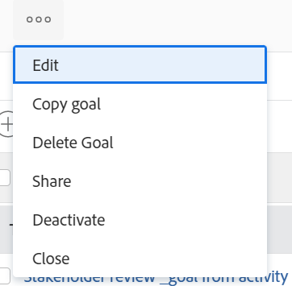

# Condividere un obiettivo in Obiettivi di Adobe Workfront

Quando condividi un obiettivo, assegni le autorizzazioni di gestione a un obiettivo a chi non lo ha creato.

## Requisiti di accesso

Devi avere i seguenti:

<table style="table-layout:auto">
<col>
</col>
<col>
</col>
<tbody>
 <tr> 
   <td role="rowheader">Piano Adobe Workfront*</td> 
   <td> 
   
Per il nuovo piano e la nuova struttura delle licenze:
  <ul><li>Un piano Ultimate </li>
  Oppure
  <li>Una licenza aggiuntiva per Adobe Workfront Goals per i piani Prime o Select Adobe Workfront. </li></ul> 

Per il piano corrente e la struttura delle licenze: 
<ul><li> A Pro o superiore </li>
  <li>Una licenza Adobe Workfront Goals oltre a una licenza Workfront.</li></ul>

   </td> 
  </tr>
 <tr>
 <td role="rowheader">Licenza Adobe Workfront*</td>
 <td>
 
Nuova licenza: Collaboratore o versione successiva

 Oppure
 
Licenza corrente: richiesta o successiva
 </td>
 </tr>
 <tr>
 <td role="rowheader">Prodotto*</td>
 <td>
 
 Nuovo requisito del prodotto, uno dei seguenti: 

<ul>
<li>Un piano Select o Prime Adobe Workfront e un’ulteriore licenza Adobe Workfront Goals.</li>
<li>Un piano Workfront Ultimate che include gli obiettivi Workfront per impostazione predefinita. </li></ul>
 
Oppure

 
Fabbisogno di prodotto corrente: un piano Workfront e una licenza aggiuntiva per gli obiettivi Adobe Workfront. 
 
Per informazioni, vedere <a href="../../workfront-goals/goal-management/access-needed-for-wf-goals.md" class="MCXref xref">Requisiti per l'utilizzo degli obiettivi di Workfront</a>. 
 </td>
 </tr>
 <tr>
 <td role="rowheader">Livello di accesso</td>
 <td> 
Modifica accesso agli obiettivi
 </td>
 </tr>
 <tr data-mc-conditions="">
 <td role="rowheader">Autorizzazioni oggetto</td>
 <td>
  

  
Visualizza o autorizzazioni superiori per l’obiettivo per visualizzarlo

  
Gestire le autorizzazioni per l’obiettivo per modificarlo

  
Per informazioni sulla condivisione degli obiettivi, vedere <a href="../../workfront-goals/workfront-goals-settings/share-a-goal.md" class="MCXref xref">Condividere un obiettivo in Obiettivi di Workfront</a>. 

  
 </td>
 </tr>
<tr>
   <td role="rowheader">
Modello di layout
</td>
   <td> 
A tutti gli utenti, inclusi gli amministratori di Workfront, deve essere assegnato un modello di layout che includa l’area Obiettivi nel menu principale. 
  
</td>
  </tr>
</tbody>
</table>

*Per ulteriori informazioni, consulta [Requisiti di accesso nella documentazione di Workfront](/help/quicksilver/administration-and-setup/add-users/access-levels-and-object-permissions/access-level-requirements-in-documentation.md).

## Considerazioni sulla condivisione degli obiettivi

* Gli utenti possono disporre delle seguenti autorizzazioni per un obiettivo:

  <table style="table-layout:auto"> 
   <col> 
   </col> 
   <col> 
   </col> 
   <tbody> 
   <tr> 
      <td role="rowheader">
<b>Autorizzazioni obiettivo</b>
</td> 
      <td>
      
<b>Descrizione</b>
 </td> 
   </tr> 
   <tr> 
      <td role="rowheader">
Visualizza
</td> 
      <td>
      
Gli utenti dispongono delle autorizzazioni per visualizzare l’obiettivo, ma non possono modificare le informazioni per l’obiettivo, né aggiungere o modificare informazioni per i risultati o per le attività, aggiornare lo stato o eliminare l’obiettivo.
      
      
Per impostazione predefinita, tutti gli utenti con accesso agli obiettivi possono visualizzare tutti gli obiettivi nel sistema. Gli utenti possono copiare l’obiettivo se dispongono dell’accesso di modifica per gli obiettivi nel proprio livello di accesso.
 </td> 
   </tr> 
   <tr> 
      <td role="rowheader">
Gestire
</td> 
      <td> 
Gli utenti possono modificare tutte le informazioni per l’obiettivo, inclusi i risultati, o le attività, inclusa la loro eliminazione.
 
      
Solo i creatori o gli utenti di un obiettivo a cui sono state specificatamente assegnate le autorizzazioni di gestione possono gestire un obiettivo.
 
      Solo gli utenti con le autorizzazioni di gestione di un obiettivo possono condividere l’obiettivo con altri utenti in modo da assegnare loro le autorizzazioni di gestione per l’obiettivo. 
 </td> 
   </tr> 
   </tbody> 
   </table>

* Puoi condividere con altri i seguenti tipi di obiettivi:

   * Un obiettivo che hai creato
   * Obiettivo creato da un altro utente a cui sono state assegnate le autorizzazioni di gestione.

* Se disponi delle autorizzazioni di gestione per un obiettivo, puoi modificare le autorizzazioni sull’obiettivo per il creatore dell’obiettivo. Per impostazione predefinita, quando creano l’obiettivo dispongono delle autorizzazioni di gestione, ma è possibile modificarne le autorizzazioni in Visualizza.

## Condividere un obiettivo

1. Fai clic sull&#39;icona **Main Menu**  > **Goals** nell&#39;angolo superiore destro.

   <!-- Add this when Shell is available to all: or (if available), click the **Main Menu** icon  in the upper-left corner)
   -->

   Viene visualizzato l’elenco Obiettivo.

1. Fai clic sul nome di un obiettivo nell’elenco. Viene visualizzata la pagina dell’obiettivo.

1. Fai clic sull&#39;icona **Altro** accanto al nome dell&#39;obiettivo, quindi fai clic su **Condividi**.

   

   Viene visualizzata la casella Accesso obiettivo (Goal Access).

   

1. Esegui una delle operazioni seguenti:

   * Selezionare l&#39;impostazione **Gestisci a livello di sistema** per assegnare le autorizzazioni di gestione a tutti gli utenti del sistema che dispongono dell&#39;accesso di modifica agli obiettivi nel proprio livello di accesso. Questa opzione è deselezionata per impostazione predefinita per tutti i nuovi obiettivi.
   * Inizia a digitare il nome di un utente a cui desideri assegnare le autorizzazioni di gestione nella casella **Concedi accesso di gestione a**. Seleziona il nome quando viene visualizzato nel’elenco.

     >[!TIP]
     >
     >Puoi condividere un obiettivo solo con altri utenti. Non puoi condividere gli obiettivi con gruppi, team o la tua azienda.

1. Fai clic su **Condividi**.

   L&#39;obiettivo viene condiviso con gli utenti specificati. Un’etichetta &quot;a livello di sistema&quot; o il nome degli utenti che dispongono delle autorizzazioni di gestione per l’obiettivo vengono visualizzati nel campo Accesso a gestione del pannello Dettagli obiettivo.

## Opzioni di autorizzazione per obiettivo

Nella tabella seguente sono elencate le autorizzazioni che è possibile concedere durante la condivisione di un obiettivo. Per ulteriori informazioni sull&#39;accesso degli utenti in base alla licenza, vedere [Concedere l&#39;accesso agli obiettivi di Adobe Workfront](../../administration-and-setup/add-users/configure-and-grant-access/grant-access-goals.md).

<table border="1" cellspacing="15" cellpadding="1"> 
 <col> 
 </col> 
 <col> 
 </col> 
 <col> 
 </col> 
 <thead> 
  <tr> 
   <th> 
<strong>Azioni</strong> 
 </th> 
   <th> 
<strong>Gestisci</strong> 
 </th> 
   <th> 
<strong>Visualizza</strong> 
 </th> 
  </tr> 
 </thead> 
 <tbody> 
  <tr> 
   <td> 
Visualizza obiettivo
 </td> 
   <td> 
✓
 </td> 
   <td> 
✓
 </td> 
  </tr> 
  <tr> 
   <td> 
Visualizzare risultati o attività
 </td> 
   <td> 
✓
 </td> 
   <td> 
✓
 </td> 
  </tr> 
  <tr> 
   <td>Copia obiettivo* </td> 
   <td>✓ </td> 
   <td>✓</td> 
  </tr> 
  <tr data-mc-conditions=""> 
   <td>Convertire risultati o attività in altri obiettivi*</td> 
   <td>✓</td> 
   <td>✓</td> 
  </tr> 
  <tr> 
   <td>Visualizza progetti aggiunti come attività** </td> 
   <td>✓</td> 
   <td>✓</td> 
  </tr> 
  <tr> 
   <td>Modifica obiettivo</td> 
   <td>✓</td> 
   <td> </td> 
  </tr> 
  <tr> 
   <td>Modifica risultati o attività</td> 
   <td>✓</td> 
   <td> </td> 
  </tr> 
  <tr> 
   <td>Aggiungere risultati o attività per l’obiettivo</td> 
   <td>✓</td> 
   <td> </td> 
  </tr> 
  <tr> 
   <td>Associa un progetto come attività all’obiettivo**</td> 
   <td>✓</td> 
   <td> </td> 
  </tr> 
  <tr> 
   <td> 
Elimina obiettivo
 </td> 
   <td> 
✓
 </td> 
   <td> 
 
 </td> 
  </tr> 
  <tr> 
   <td> 
Eliminare risultati o attività
 </td> 
   <td> 
✓
 </td> 
   <td> 
 
 </td> 
  </tr> 
  <tr> 
   <td>Disconnetti progetti dall’obiettivo</td> 
   <td>✓</td> 
   <td> </td> 
  </tr> 
 </tbody> 
</table>

*Per convertire i risultati e le attività in obiettivi, è necessario disporre dell’accesso di modifica per gli obiettivi nel proprio livello di accesso.

**Devi avere accesso a Visualizza progetti e alle autorizzazioni di visualizzazione per i progetti aggiunti o che desideri aggiungere all’obiettivo per visualizzarli.

Per informazioni sul livello di accesso al progetto, vedere [Concedere l&#39;accesso ai progetti](../../administration-and-setup/add-users/configure-and-grant-access/grant-access-projects.md).

Per informazioni sulle autorizzazioni del progetto, vedere [Condividere un progetto in Adobe Workfront](../../workfront-basics/grant-and-request-access-to-objects/share-a-project.md).

 
