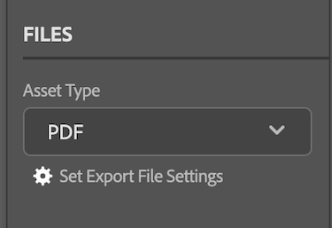

# Carica documenti da [!DNL Illustrator]

Puoi caricare i tuoi progetti come documenti per una rapida revisione e approvazione o semplicemente per archiviarli in [!DNL Adobe Workfront].

## Requisiti di accesso

Per eseguire i passaggi descritti in questo articolo, è necessario disporre dei seguenti diritti di accesso:

<table style="table-layout:auto"> 
 <col> 
 <col> 
 <tbody> 
  <!-- <tr> 
   <td role="rowheader">[!DNL Adobe Workfront] plan*</td> 
   <td> 
[!UICONTROL Pro] or higher
 </td> 
  </tr> 
  <tr data-mc-conditions=""> 
   <td role="rowheader">[!DNL Adobe Workfront] license*</td> 
   <td> 
[!UICONTROL Work] or [!UICONTROL Plan]
 </td> 
  </tr> 
  <tr> -->
   <td role="rowheader">Prodotto</td> 
   <td>Devi avere un [!DNL Adobe Creative Cloud] oltre a una licenza [!DNL Workfront] licenza.</td> 
  </tr> 
  <tr> 
   <td role="rowheader">Configurazioni a livello di accesso*</td> 
   <td> 
Modifica accesso ai documenti
 
Nota: Se non hai ancora accesso, chiedi [!DNL Workfront] amministratore se imposta ulteriori restrizioni nel livello di accesso. Per informazioni su come [!DNL Workfront] l'amministratore può modificare il livello di accesso, vedi <a href="../../administration-and-setup/add-users/configure-and-grant-access/create-modify-access-levels.md" class="MCXref xref">Creare o modificare livelli di accesso personalizzati</a>.
 </td> 
  </tr> 
  <tr> 
   <td role="rowheader">Autorizzazioni oggetto</td> 
   <td> 
Consente di visualizzare l'accesso all'oggetto in cui si desidera caricare un documento.
 
Per informazioni sulla richiesta di accesso aggiuntivo, vedi <a href="../../workfront-basics/grant-and-request-access-to-objects/request-access.md" class="MCXref xref">Richiedere l’accesso agli oggetti </a>.
 </td> 
  </tr> 
 </tbody> 
</table>

&#42;Per sapere quale piano, tipo di licenza o accesso hai, contatta il tuo [!DNL Workfront] amministratore.

## Prerequisiti

* È necessario installare [!DNL Adobe Workfront for design and video] plugin prima di poter caricare documenti da [!DNL Illustrator].

   Per istruzioni, consulta [Installa [!DNL Adobe Workfront for design and video]](/help/quicksilver/workfront-integrations-and-apps/adobe-workfront-for-creative-cloud/wf-install-cc.md).

## Caricare documenti in [!DNL Illustrator]

1. Fai clic sul pulsante **[!UICONTROL Menu]** nell&#39;angolo in alto a destra, quindi seleziona **[!UICONTROL Elenco lavori]**. È inoltre possibile utilizzare il menu per passare agli oggetti principali.

   

1. Passa all&#39;elemento di lavoro in cui desideri caricare un documento.
1. Fai clic sul pulsante **[!UICONTROL Documento]** icona  nella barra di navigazione.

1. Fai clic su **[!UICONTROL Nuovo file]** vicino al fondo del plugin.
1. (Facoltativo) Digita un commento nella sezione **[!UICONTROL Aggiornamenti]** area.
1. Scegli la **[!UICONTROL Tipo di risorsa]** dal menu a discesa.
1. Apri **[!UICONTROL Imposta le impostazioni del file di esportazione]** finestra di dialogo, quindi configura le opzioni di esportazione desiderate in base al tipo di risorsa scelto in precedenza.

   
1. Fai clic su **[!UICONTROL Carica]**.
Il documento viene visualizzato nel [!UICONTROL Documenti] nell’area del plug-in e nell’app desktop.