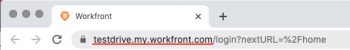

# Installa e apri [!DNL Adobe Workfront for XD]

È possibile installare [!DNL Adobe Workfront for XD] plug-in da Adobe Marketplace. Il plug-in supporta le seguenti lingue:

* Inglese
* Francese
* Tedesco
* Italiano
* Spagnolo
* Portoghese
* Giapponese
* Cinese semplificato
* Cinese tradizionale
* Coreano

## Requisiti di accesso

Per eseguire i passaggi descritti in questo articolo, è necessario disporre dei seguenti diritti di accesso:

<table style="table-layout:auto"> 
 <col> 
 </col> 
 <col> 
 </col> 
 <tbody> 
 <!-- <tr> 
   <td role="rowheader">[!DNL Adobe Workfront] plan*</td> 
   <td> 
[!UICONTROL Pro] or higher
 </td> 
  </tr> 
  <tr data-mc-conditions=""> 
   <td role="rowheader">[!DNL Adobe Workfront] license*</td> 
   <td> 
[!UICONTROL Work] or [!UICONTROL Plan]
 </td> 
  </tr> -->
  <tr> 
   <td role="rowheader">Prodotto</td> 
   <td>Devi avere un [!DNL Adobe Creative Cloud] oltre a una licenza [!DNL Workfront] licenza.</td> 
  </tr> 
 </tbody> 
</table>

&#42;Per sapere quale piano, tipo di licenza o accesso hai, contatta il tuo [!DNL Workfront] amministratore.

## Prerequisiti

* È necessario installare [!DNL Adobe XD] prima di installare il plug-in Workfront.

## Installa il [!DNL Adobe Workfront for XD] plug-in per la tua organizzazione

Se sei un [!DNL Adobe Admin Console] amministratore, puoi includere il plug-in [!DNL Creative Cloud] pacchetti di distribuzione. Per ulteriori informazioni, consulta [Includere i plug-in nel pacchetto](https://helpx.adobe.com/in/enterprise/using/manage-extensions.html).

[Guarda un&#39;esercitazione video qui](https://www.youtube.com/watch?v=zzvXNLIBzrc){target=_blank}.

## Installa il [!DNL Adobe Workfront for XD] plug-in singolarmente

È possibile installare [!DNL Adobe Workfront for XD] plug-in per te stesso dal [!DNL Adobe Exchange].

1. Vai a [Pagina di installazione di Adobe Workfront for XD](https://exchange.adobe.com/apps/cc/4c3566f9?pluginId=4c3566f9&amp;workflow=share) su Adobe Exchange.
1. Nella finestra di dialogo visualizzata, fai clic su **Apri [!DNL Adobe Creative Cloud] app desktop**.
1. Una volta [!DNL Adobe XD] viene aperto il gestore dei plug-in, fai clic su **[!UICONTROL Installa]**.
1. Leggere le informazioni nella finestra di dialogo, quindi fare clic su **[!UICONTROL OK]**.
1. Per informazioni su come aprire il plug-in, consulta la sezione seguente.

## Apri [!DNL Adobe Workfront for XD] plugin

1. Aperto [!DNL Adobe XD].

1. Crea un nuovo file o apri un file esistente.

1. Nell’angolo in basso a sinistra, fai clic sul pulsante **Plug-in** icona.

1. In **[!UICONTROL Pannello Plug-in]**, trova **[!UICONTROL Adobe Workfront per XD]**.

1. Per informazioni su come accedere al plug-in, consulta la sezione seguente.

## Accedi a [!DNL Adobe Workfront for XD]

1. Assicurati che il pannello Plugin sia aperto, quindi fai clic su **[!DNL Adobe Workfront for XD]**.
1. Inserisci il tuo dominio, quindi fai clic su **[!UICONTROL Accedere]**. Viene visualizzata una pagina del browser.

   >[!TIP]
   >
   >* Per trovare il dominio, apri un browser e passa al [!DNL Workfront] e copia la prima parte dell’URL:\
      >
   >
   > * Se l’istanza Workfront è integrata con Experience Cloud, chiedi all’amministratore di fornirti il dominio Workfront che si trova in Prodotto > Workfront nell’Admin Console.

1. Nel browser, immetti [!DNL Workfront] credenziali, quindi fai clic su **[!DNL Log in]**. Se la tua azienda utilizza un Single Sign-On (SSO), verrai indirizzato alla pagina del tuo provider SSO per effettuare l&#39;accesso.

   >[!NOTE]
   >
   >Potrebbe non essere richiesto di entrare nel [!DNL Workfront] credenziali se hai effettuato l&#39;accesso di recente.

   Segui le istruzioni per accedere a [!DNL Workfront].

   >[!NOTE]
   >
   >* [!DNL Workfront] si connette a [!DNL Adobe Creative Cloud] utilizzando OAuth 2.0, uno standard sicuro utilizzato dalla maggior parte delle integrazioni basate su web per l’autenticazione e l’autorizzazione degli utenti.
   >* Quando viene richiesto di immettere il [dominio o host] del tuo [!DNL Workfront] account, digitare il formato: *la tua azienda&#39;sDomain.my.workfront.com*. Il dominio della tua azienda è in genere il nome della tua azienda.

1. Fai clic su **[!UICONTROL Consenti accesso]** per completare l&#39;accesso, e tornare al [!DNL Adobe XD] per vedere il tuo lavoro.

 
