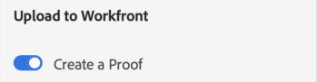

# Carica [!DNL XD] tavole da disegno come bozze in [!DNL Workfront]

Puoi caricare le tue tavole da disegno come bozze direttamente in [!DNL Adobe Workfront] per una revisione e approvazione completa.

## Requisiti di accesso

+++ Espandi per visualizzare i requisiti di accesso per la funzionalità in questo articolo.

Per eseguire i passaggi descritti in questo articolo, è necessario disporre dei seguenti diritti di accesso:

<table style="table-layout:auto"> 
 <col> 
 <col> 
 <tbody> 
  <tr> 
   <td role="rowheader">[!DNL Adobe Workfront] piano*</td> 
   <td> 
Piano corrente: [!UICONTROL Pro] o versione successiva
 
oppure
 
Piano legacy: [!UICONTROL Premium]
 
Per ulteriori informazioni sulla verifica dell'accesso con i diversi piani, vedere .
 </td> 
  </tr> 
  <tr> 
   <td role="rowheader">[!DNL Adobe Workfront] licenza*</td> 
   <td> 
Piano corrente: [!UICONTROL Lavoro] o [!UICONTROL Bozza]
 
Piano legacy: qualsiasi (per l’utente deve essere abilitata la verifica)
 </td> 
  </tr> 
  <tr> 
   <td role="rowheader">Prodotto</td> 
   <td>È necessario disporre di una licenza [!DNL Adobe Creative Cloud] oltre a una licenza [!DNL Workfront].</td> 
  </tr> 
  <tr> 
   <td role="rowheader">Profilo autorizzazione bozza </td> 
   <td>[!UICONTROL Manager] o versione successiva</td> 
  </tr> 
  <tr> 
   <td role="rowheader">Autorizzazioni oggetto</td> 
   <td> 
Modifica accesso a [!UICONTROL Documents]
 
Per informazioni sulla richiesta di accesso aggiuntivo, vedere <a href="../../workfront-basics/grant-and-request-access-to-objects/request-access.md" class="MCXref xref">Richiedere l'accesso agli oggetti </a>.
 </td> 
  </tr> 
 </tbody> 
</table>

&#42;Per conoscere il piano, la mansione o il profilo di autorizzazione della bozza di cui si dispone, contattare l&#39;amministratore [!DNL Workfront] o [!DNL Workfront Proof].

+++

## Prerequisiti

* È necessario installare il plug-in [!DNL Adobe Workfront for XD] prima di caricare le bozze in [!DNL Adobe XD].

  Per istruzioni, vedere [Installa [!DNL Adobe Workfront for XD]](/help/quicksilver/workfront-integrations-and-apps/adobe-workfront-for-creative-cloud/wf-adobe-xd-install.md).

## Caricare una bozza statica

1. Fai clic sull&#39;icona **[!UICONTROL Menu]** in alto a destra, quindi seleziona **[!UICONTROL Elenco lavori]**. È inoltre possibile utilizzare il menu per passare agli oggetti padre.

   

1. Vai all’elemento di lavoro in cui desideri caricare una bozza statica.
1. Fai clic sull&#39;icona **[!UICONTROL Documento]**  nella barra di navigazione.

1. Fai clic su **[!UICONTROL Nuovo file]** nella parte inferiore del plug-in.
1. Selezionate le tavole da disegno da caricare.

   >[!TIP]
   >
   >* Le tavole da disegno verranno visualizzate nella bozza nell’ordine in cui sono state selezionate. La prima tavola da disegno selezionata sarà la prima pagina della bozza e così via.
   >* Per selezionare rapidamente più di una tavola da disegno, fate clic e trascinate il mouse sulle tavole da disegno desiderate. Ciò non consente di controllare l&#39;ordine delle tavole da disegno nella bozza.

1. Abilita **[!UICONTROL Crea una bozza]**.

1. Denomina la bozza.

1. Scegli il tipo di approvazione della bozza desiderato:

   <table style="table-layout:auto"> 
    <col> 
    <col> 
    <tbody> 
     <tr> 
      <td role="rowheader">[!UICONTROL Basic]: </td> 
      <td> 
I processi di approvazione di base sono ad hoc e possono includere revisori diversi, a seconda delle necessità: 
 
       <ul> 
        <li> 
(Facoltativo) Aggiungi <strong>Approvatori</strong> nella casella.
 </li> 
       </ul> </td> 
     </tr> 
     <tr> 
      <td role="rowheader">[!UICONTROL Automatizzato]</td> 
      <td> 
I processi di approvazione automatizzati sono pregenerati dagli amministratori e includono revisori e fasi specifici. Per ulteriori informazioni, vedere <a href="../../review-and-approve-work/proofing/proofing-overview/automated-workflow.md" class="MCXref xref">Panoramica del flusso di lavoro automatico</a>.
 
       <ul> 
        <li> 
Scegli un [!UICONTROL Workflow Template] dal menu a discesa.
 </li> 
       </ul> </td> 
     </tr> 
    </tbody> 
   </table>

{{adjust-proof-settings}}

1. (Facoltativo) Digita un commento nell&#39;area **[!UICONTROL Aggiornamenti]**.

   

1. Scegliere il formato di esportazione dal menu a discesa **[!UICONTROL Tipo risorsa]**.

1. (Facoltativo) Se selezioni PDF come tipo di risorsa e hai selezionato più di una tavola da disegno, scegli se desideri esportare le tue tavole da disegno come **[!UICONTROL File di PDF singola]s** o **M[!UICONTROL File di PDF multiple]**.

1. (Facoltativo) Denomina il PDF.

   

1. Fai clic su **[!UICONTROL Carica]**.\
   Il documento verrà visualizzato nell&#39;area [!UICONTROL Documenti] del plug-in e dell&#39;app desktop.

## Caricare una bozza interattiva {#upload-an-interactive-proof}

È possibile creare una bozza interattiva per le tavole da disegno con il plug-in [!DNL Workfront for Adobe]. Si tratta di un processo in due fasi. Innanzitutto devi creare un collegamento interattivo, quindi caricare la bozza in un elemento di lavoro.

### Creare un collegamento interattivo per la tavola da disegno  {#create-an-interactive-link-for-your-art-board}

1. Apri la tavola da disegno, quindi fai clic su **[!UICONTROL Condividi]** nell&#39;area in alto a sinistra dello schermo.
1. Specifica le impostazioni del collegamento:

   1. Denomina il collegamento.
   1. Scegliere un&#39;impostazione di visualizzazione.
   1. Nella sezione **[!UICONTROL Accesso al collegamento]**, assicurati che sia selezionato **[!UICONTROL Chiunque abbia questo collegamento]**.

      Devi abilitare questo tipo di accesso per generare una bozza interattiva.

   1. Fare clic su **[!UICONTROL Crea collegamento]**.

1. Fai clic nuovamente su **[!UICONTROL Progettazione]** nell&#39;area in alto a sinistra dello schermo. Passa alla sezione [Carica una bozza interattiva](#upload-an-interactive-proof) di seguito.

   >[!NOTE]
   >
   >Potrebbe essere necessario riaprire il pannello del plug-in nell’angolo in basso a sinistra dello schermo.

### Caricare una bozza interattiva

1. Fai clic sull&#39;icona **[!UICONTROL Menu]** in alto a destra, quindi seleziona **[!UICONTROL Elenco lavori]**. È inoltre possibile utilizzare il menu per passare agli oggetti padre.

   

1. Vai all’elemento di lavoro in cui desideri caricare una bozza interattiva.
1. Fai clic sull&#39;icona **[!UICONTROL Documento]**  nella barra di navigazione.

1. Fai clic su **[!UICONTROL Nuovo file]** nella parte inferiore del plug-in.
1. Abilita **[!UICONTROL Crea una bozza]**.

1. Scegli il tipo di approvazione della bozza desiderato:

   <table style="table-layout:auto"> 
    <col> 
    <col> 
    <tbody> 
     <tr> 
      <td role="rowheader">[!UICONTROL Basic]: </td> 
      <td> 
I processi di approvazione di base sono ad hoc e possono includere revisori diversi, a seconda delle necessità: 
 
       <ul> 
        <li> 
(Facoltativo) Aggiungi <strong>Approvatori</strong> nella casella.
 </li> 
       </ul> </td> 
     </tr> 
     <tr> 
      <td role="rowheader">[!UICONTROL Automatizzato]</td> 
      <td> 
I processi di approvazione automatizzati sono pregenerati dagli amministratori e includono revisori e fasi specifici. Per ulteriori informazioni, vedere <a href="../../review-and-approve-work/proofing/proofing-overview/automated-workflow.md" class="MCXref xref">Panoramica del flusso di lavoro automatico</a>.
 
       <ul> 
        <li> 
Scegli un [!UICONTROL Workflow Template] dal menu a discesa.
 </li> 
       </ul> </td> 
     </tr> 
    </tbody> 
   </table>

{{adjust-proof-settings}}

1. (Facoltativo) Digita un commento nell&#39;area **[!UICONTROL Aggiornamenti]**.

   

1. Nel menu a discesa **[!UICONTROL Tipo risorsa]**, scegli il collegamento appena creato nella scheda **Collegamenti condivisi**. Per ulteriori informazioni, vedere [Creare un collegamento interattivo per la tavola da disegno](#create-an-interactive-link-for-your-artboard).\
   

1. Fai clic su **[!UICONTROL Carica]**.

   Il documento verrà visualizzato nell&#39;area [!UICONTROL Documenti] del plug-in e dell&#39;app desktop.

   >[!IMPORTANT]
   >
   >Gli utenti devono avere accesso a [!UICONTROL Visualizzatore bozze desktop] per rivedere e approvare le bozze interattive. Per ulteriori informazioni, vedere [Installare [!UICONTROL Desktop Proofing Viewer]](../../review-and-approve-work/proofing/use-the-desktop-proofing-viewer/installing-desktop-proofing-viewer.md).

## Carica una nuova versione di bozza

Puoi caricare una nuova versione di una bozza. Il plug-in ricorda il flusso di lavoro di verifica impostato nella versione precedente, ma puoi modificarlo se lo desideri.

1. Fai clic sull&#39;icona **[!UICONTROL Menu]** in alto a destra, quindi seleziona **[!UICONTROL Elenco lavori]**. È inoltre possibile utilizzare il menu per passare agli oggetti padre.

   

1. Vai all’elemento di lavoro necessario per caricare un documento in.
1. Fai clic sull&#39;icona **[!UICONTROL Documento]** nella barra di navigazione.

1. Fai clic su **[!UICONTROL Nuova versione]** nella parte inferiore del plug-in.
1. Abilita **[!UICONTROL Crea una bozza]**.
1. Selezionate le tavole da disegno da caricare.

   >[!NOTE]
   >
   >Se volete caricare una nuova versione di un .svg, .png o .jpg, potete caricare una sola tavola da disegno.

1. Scegli il tipo di approvazione della bozza desiderato:

   <table style="table-layout:auto"> 
    <col> 
    <col> 
    <tbody> 
     <tr> 
      <td role="rowheader">[!UICONTROL Basic]: </td> 
      <td> 
I processi di approvazione di base sono ad hoc e possono includere revisori diversi, a seconda delle necessità: 
 
       <ul> 
        <li> 
(Facoltativo) Aggiungi <strong>Approvatori</strong> nella casella.
 </li> 
       </ul> </td> 
     </tr> 
     <tr> 
      <td role="rowheader">[!UICONTROL Automatizzato]</td> 
      <td> 
I processi di approvazione automatizzati sono pregenerati dagli amministratori e includono revisori e fasi specifici. Per ulteriori informazioni, vedere <a href="../../review-and-approve-work/proofing/proofing-overview/automated-workflow.md" class="MCXref xref">Panoramica del flusso di lavoro automatico</a>.
 
       <ul> 
        <li> 
Scegli un [!UICONTROL Workflow Template] dal menu a discesa.
 </li> 
       </ul> </td> 
     </tr> 
    </tbody> 
   </table>

{{adjust-proof-settings}}

1. Scegliere il formato di esportazione dal menu a discesa **[!UICONTROL Tipo risorsa]**.

   

1. (Facoltativo) Digita un commento nell&#39;area **[!UICONTROL Aggiornamenti]**.

   

1. (Facoltativo) Se selezioni PDF come tipo di risorsa e hai selezionato più di una tavola da disegno, scegli se desideri esportare le tue tavole da disegno come **[!UICONTROL File di PDF singola]s** o **M[!UICONTROL File di PDF multiple]**.

1. (Facoltativo) Denomina il PDF.

   Opzioni PDF

1. Fai clic su **[!UICONTROL Carica]**.\
   Il documento verrà visualizzato nell&#39;area [!UICONTROL Documenti] del plug-in e dell&#39;app desktop.
