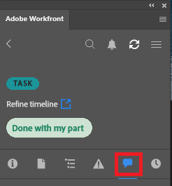

# Aggiorna il tuo lavoro utilizzando il plug-in [!DNL Adobe Workfront]

È possibile aggiornare il lavoro da una delle seguenti [!DNL Adobe Creative Cloud] applicazioni:

{{cc-app-list}}

## Requisiti di accesso

+++ Espandi per visualizzare i requisiti di accesso per la funzionalità in questo articolo.

Per eseguire i passaggi descritti in questo articolo, è necessario disporre dei seguenti diritti di accesso:

<table style="table-layout:auto"> 
 <col> 
 </col> 
 <col> 
 </col> 
 <tbody> 
  <tr> 
   <!--<td role="rowheader">[!DNL Adobe Workfront] plan*</td> 
   <td> 
[!UICONTROL Pro] or higher
 </td> 
  </tr> 
  <tr data-mc-conditions=""> 
   <td role="rowheader">[!DNL Adobe Workfront] license*</td> 
   <td> 
[!UICONTROL Work] or [!UICONTROL Plan]
 </td> 
  </tr> -->
  <tr> 
   <td role="rowheader">Prodotto</td> 
   <td>È necessario disporre di una licenza [!DNL Adobe Creative Cloud] oltre a una licenza [!DNL Workfront].</td> 
  </tr> 
  <tr> 
   <td role="rowheader">Autorizzazioni oggetto</td> 
   <td> 
Accesso [!UICONTROL View] all'oggetto da aggiornare. 
 
Per informazioni sulla richiesta di accesso aggiuntivo, vedere <a href="../../workfront-basics/grant-and-request-access-to-objects/request-access.md" class="MCXref xref">Richiedere l'accesso agli oggetti </a>.
 </td> 
  </tr> 
 </tbody> 
</table>

&#42;Per conoscere il piano, il tipo di licenza o l&#39;accesso di cui si dispone, contattare l&#39;amministratore [!DNL Workfront].

+++

## Prerequisiti

{{cc-install-prereq}}

## Pubblica un aggiornamento

Puoi aggiornare il lavoro da una delle seguenti aree nel plug-in:

<table style="table-layout:auto"> 
 <col> 
 <col> 
 <tbody> 
  <tr> 
   <td> 
    <ul> 
     <li>Progetti</li> 
     <li>Attività</li> 
     <li>Sottoattività</li> 
    </ul> </td> 
   <td> 
    <ul> 
     <li>Problemi</li> 
     <li>Documenti</li> 
    </ul> </td> 
  </tr> 
 </tbody> 
</table>

Per pubblicare un aggiornamento:

1. Fai clic sull&#39;icona **[!UICONTROL Menu]** in alto a destra, quindi seleziona **[!UICONTROL Elenco lavori]**. È inoltre possibile utilizzare il menu per passare agli oggetti padre.

   

1. Dalla **[!UICONTROL Elenco lavori]**, seleziona l&#39;elemento di lavoro a cui pubblicare un aggiornamento.
1. Fai clic su **[!UICONTROL Aggiorna]** nella barra di navigazione.\
   

1. Fai clic su **[!UICONTROL Nuovo aggiornamento]**.
1. Digita il tuo aggiornamento.
1. (Facoltativo) Per assegnare un tag a un utente, digita il simbolo @ e il nome dell’utente, quindi scegli il loro nome dal menu a discesa.
1. Fai clic su **[!UICONTROL Invia]**. Gli aggiornamenti vengono sincronizzati in tempo reale con l’applicazione web Adobe Workfront.
