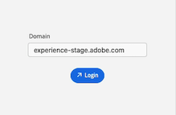

# Installa e apri [!DNL Adobe Workfront for design and video]

È possibile installare [!DNL Adobe Workfront for design and video] da [!DNL Adobe Marketplace]. Questo plug-in supporta le seguenti applicazioni Creative Cloud:

{{cc-plugin-app-list}}

[!DNL Adobe Workfront for design and video] supporta le seguenti lingue:

* Inglese
* Francese
* Tedesco
* Italiano
* Spagnolo
* Giapponese
* Portoghese
* Cinese semplificato
* Cinese tradizionale
* Coreano

>[!NOTE]
>
>Sono disponibili istruzioni di installazione separate per [!DNL Photoshop] e [!DNL XD]. Per ulteriori informazioni, vedere [Installa [!DNL Adobe Workfront for Photoshop]](/help/quicksilver/workfront-integrations-and-apps/adobe-workfront-for-creative-cloud/wf-cc-install-ps.md) e [Installa [!DNL Adobe Workfront for XD]](/help/quicksilver/workfront-integrations-and-apps/adobe-workfront-for-creative-cloud/wf-adobe-xd-install.md).

## Requisiti di accesso

+++ Espandi per visualizzare i requisiti di accesso per la funzionalità descritta in questo articolo.

<table style="table-layout:auto"> 
 <col> 
 </col> 
 <col> 
 </col> 
 <tbody> 
 <!-- <tr> 
   <td role="rowheader">[!DNL Adobe Workfront] package/td> 
   <td> 
Any
 </td> 
  </tr> 
  <tr data-mc-conditions=""> 
   <td role="rowheader">[!DNL Adobe Workfront] license*</td> 
   <td>
   
Standard

    
Work or higher
 </td> 
  </tr> -->
  <tr> 
   <td role="rowheader">Prodotti aggiuntivi</td> 
   <td>
È necessario disporre di una licenza [!DNL Adobe Creative Cloud] oltre a una licenza [!DNL Workfront].
</td> 
  </tr> 
 </tbody> 
</table>

Per informazioni, consulta [Requisiti di accesso nella documentazione di Workfront](/help/quicksilver/administration-and-setup/add-users/access-levels-and-object-permissions/access-level-requirements-in-documentation.md).

+++

## Prerequisiti

* È necessario installare l&#39;app [!DNL Creative Cloud] che si desidera utilizzare prima di installare il plug-in Workfront per tale app.

## Installa [!DNL Workfront for design and video] per la tua organizzazione

Se sei un amministratore di [!DNL Adobe Admin Console], puoi includere [!DNL Adobe Workfront for design and video] nei pacchetti di distribuzione di [!DNL Creative Cloud]. Per ulteriori informazioni, vedere [Inclusione di plug-in nel pacchetto](https://helpx.adobe.com/in/enterprise/using/manage-extensions.html).

[Visualizza un&#39;esercitazione video qui](https://www.youtube.com/watch?v=zzvXNLIBzrc){target=_blank}.

Gli amministratori di [!DNL Adobe Admin Console] possono anche creare pacchetti di solo plug-in da distribuire agli utenti. Per ulteriori informazioni, consulta [Creare [!UICONTROL [!DNL Adobe Workfront] per [!DNL Creative Cloud]] pacchetti per i tuoi utenti in [!DNL Adobe Admin Console]](/help/quicksilver/administration-and-setup/configure-integrations/create-plugin-only-packages.md)

## Installa [!DNL Workfront for design and video] singolarmente

È possibile installare [!DNL Adobe Workfront for design and video] da [!DNL Adobe Exchange].

1. Vai alla [pagina di installazione di Adobe Workfront for Design and Video](https://adobe.com/go/cc_plugins_discover_plugin?pluginId=108938&workflow=share) in Adobe Exchange.
1. Nella finestra di dialogo visualizzata, fai clic su **Apri [!DNL Adobe Creative Cloud] app desktop**.
1. Una volta aperto Gestione plug-in [!DNL Adobe Creative Cloud], fare clic su **[!UICONTROL Installa]**.
1. Leggere le informazioni nella finestra di dialogo, quindi fare clic su **[!UICONTROL OK]**.
1. Una volta installato [!DNL Workfront for design and video], apri l&#39;app [!DNL Creative Cloud] necessaria e individua il plug-in [!DNL Workfront] nel pannello dei plug-in.

1. Per informazioni su come aprire [!DNL Workfront for design and video], passare alla sezione seguente.

## Apri [!DNL Adobe Workfront for design and video]

1. Apri il plug-in Creative Cloud che desideri utilizzare.

1. Crea un nuovo progetto o aprirne uno esistente.

1. Nel menu principale, fai clic su **Windows** > **Estensioni** > **Menu Adobe Workfront**.

   >[!NOTE]
   >
   >Se utilizzi Premiere Pro, per accedere a questo menu devi avere un progetto aperto.

   

   >[!TIP]
   >
   >Se non vedi [!DNL Adobe Workfront for design and video] dopo averlo aperto dal menu Estensioni, potrebbe trovarsi dietro l&#39;app Creative Cloud. Prova a ridurre a icona l’app per trovare il plug-in.

1. Per informazioni su come accedere a [!DNL Adobe Workfront for design and video], passare alla sezione seguente.

## Accedi a [!DNL Adobe Workfront for design and video]

1. Dal menu **[!UICONTROL Plugin]** nella parte superiore dello schermo, selezionare **[!UICONTROL Pannello plug-in]**.
1. Seleziona **[!DNL Adobe Workfront for design and video]**.
1. Immetti il dominio, quindi fai clic su **[!UICONTROL Accedi]**. Viene visualizzata una pagina del browser.

   >[!TIP]
   >
   >* Per trovare il dominio, aprire un browser, accedere all&#39;istanza [!DNL Workfront] e copiare la prima parte dell&#39;URL:
   >
   >
   >
   >* Se l&#39;istanza di Workfront è integrata con Experience Cloud e il dominio inizia con `experience.adobe.com`, chiedi all&#39;amministratore di fornirti il dominio di Workfront che si trova in Prodotto > Workfront in Admin Console.

1. Nel browser, immetti le tue credenziali di [!DNL Workfront], quindi fai clic su **[!UICONTROL Accedi]**. Se l&#39;azienda utilizza un Single Sign-On (SSO), verrà visualizzata la pagina del provider SSO per l&#39;accesso.

   >[!NOTE]
   >
   >Non ti verrà richiesto di immettere le credenziali di [!DNL Adobe] se hai effettuato l&#39;accesso di recente.

1. Seguire le istruzioni per accedere a [!DNL Workfront].

   >[!NOTE]
   >
   >* [!DNL Workfront] si connette a [!DNL Adobe Creative Cloud] utilizzando OAuth 2.0, uno standard sicuro utilizzato dalla maggior parte delle integrazioni basate sul Web per l&#39;autenticazione e l&#39;autorizzazione degli utenti.

1. Fai clic su **[!UICONTROL Consenti accesso]** per completare l&#39;accesso.
1. Torna a [!DNL Adobe Photoshop] per visualizzare il tuo lavoro.

### Risoluzione dei problemi di accesso

**Errore &quot;Si è verificato un errore&quot; durante il tentativo di accesso**

Non puoi usare un URL che inizia con `experience.adobe.com` per accedere al plug-in.

 

Per risolvere il problema:

1. Elimina la cartella in cui è memorizzato il dominio del plug-in.

   >[!TIP]
   >
   >In un Mac, vai al Finder, premi **Comando+Maiusc+G**, vai a  `~/Library/Application Support/Workfront`, quindi eliminare la cartella **Workfront**.

1. Torna al plug-in e immetti il dominio Workfront. Il dominio deve essere `company-name.my.workfront.com` e non `experience.adobe.com`.

   Per [trovare il dominio Workfront](/help/quicksilver/wf-api/tips-tricks-and-troubleshooting/locate-domain-for-api.md) se usi Adobe Unified Experience, vai a Configurazione, Informazioni cliente.
