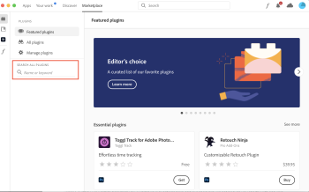

# Installa e apri [!DNL Adobe Workfront for design and video]

È possibile installare [!DNL Adobe Workfront for design and video] plug-in da [!DNL Adobe Marketplace]. Questo plug-in supporta le seguenti applicazioni Creative Cloud:

{{cc-plugin-app-list}}

Il plug-in supporta le seguenti lingue:

* Inglese
* Francese
* Tedesco
* Italiano
* Spagnolo
* Giapponese
* Portoghese
* Cinese semplificato
* Cinese tradizionale

<!-- * Korean -->

>[!NOTE]
>
>Sono disponibili istruzioni di installazione separate per [!DNL Photoshop] e [!DNL XD]. Per ulteriori informazioni, consulta [Installa [!DNL Adobe Workfront for Photoshop]](/help/quicksilver/workfront-integrations-and-apps/adobe-workfront-for-creative-cloud/wf-cc-install-ps.md) e [Installa [!DNL Adobe Workfront for XD]](/help/quicksilver/workfront-integrations-and-apps/adobe-workfront-for-creative-cloud/wf-adobe-xd-install.md).

## Requisiti di accesso

Per eseguire i passaggi descritti in questo articolo, è necessario disporre dei seguenti diritti di accesso:

<table style="table-layout:auto"> 
 <col> 
 <col> 
 <tbody> 
 <!-- <tr> 
   <td role="rowheader">[!DNL Adobe Workfront] plan*</td> 
   <td> 
[!UICONTROL Pro] or higher
 </td> 
  </tr> 
  <tr data-mc-conditions=""> 
   <td role="rowheader">[!DNL Adobe Workfront] license*</td> 
   <td> 
[!UICONTROL Work] or [!UICONTROL Plan]
 </td> 
  </tr> -->
  <tr> 
   <td role="rowheader">Prodotto</td> 
   <td>Devi avere un [!DNL Adobe Creative Cloud] oltre a una licenza [!DNL Workfront] licenza.</td> 
  </tr> 
 </tbody> 
</table>

&#42;Per sapere quale piano, tipo di licenza o accesso hai, contatta il tuo [!DNL Workfront] amministratore.

## Prerequisiti

* È necessario installare [!DNL Creative Cloud] app da utilizzare prima di installare il plug-in.

## Installa il [!DNL Adobe Workfront for design and video] plugin

>[!TIP]
>
>Se sei un [!DNL Adobe Admin Console] amministratore, puoi includere il plug-in [!DNL Creative Cloud] pacchetti di distribuzione. Per ulteriori informazioni, consulta [Includere i plug-in nel pacchetto](https://helpx.adobe.com/in/enterprise/using/manage-extensions.html).

Per installare [!DNL Adobe Workfront for design and video] plugin:

1. Apri [!DNL Adobe Creative Cloud] app.
1. Fai clic sul pulsante **[!UICONTROL Marketplace]** nella parte superiore della finestra.
1. In **[!UICONTROL Cerca tutti i plug-in]** casella, tipo *Workfront*, quindi premi **[!UICONTROL Invio]**.

   

1. Quando [!DNL Adobe Workfront for design and video] il plugin appare nei risultati della ricerca, fai clic su **[!UICONTROL Get]**.
1. Leggere le informazioni nella finestra di dialogo, quindi fare clic su **[!UICONTROL OK]**.
1. Una volta installato il plug-in, apri la [!DNL Creative Cloud] l&#39;applicazione necessaria e individuare il plug-in Workfront nel pannello dei plug-in.

   <!-- new screen -->

1. Per informazioni su come aprire il plug-in, consulta la sezione seguente.

## Apri [!DNL Adobe Workfront for design and video] plugin

1. Apri il plugin Creative Cloud che desideri utilizzare.

1. Crea un nuovo progetto o ne apri uno esistente.

1. Nel menu principale, fai clic su **Windows** > **Estensioni** > **Menu Adobe Workfront**.

   >[!NOTE]
   >
   >Se utilizzi Premiere Pro, devi avere un progetto aperto per accedere a questo menu.

   

   >[!TIP]
   >
   >Se il plug-in non viene visualizzato dopo averlo aperto dal menu Estensioni, potrebbe trovarsi dietro l’app Creative Cloud. Prova a ridurre al minimo l’app per trovare il plug-in.

1. Per informazioni su come accedere al plug-in, consulta la sezione seguente.

## Accedi a [!DNL Adobe Workfront for design and video]

1. Da **[!UICONTROL Plug-in]** nella parte superiore dello schermo, seleziona **[!UICONTROL Pannello plug-in]**.
1. Seleziona **[!DNL Adobe Workfront for design and video]**.
1. Inserisci il tuo dominio, quindi fai clic su **[!UICONTROL Accedere]**. Viene visualizzata una pagina del browser.

   >[!TIP]
   >
   >Per trovare il dominio, apri un browser e passa al [!DNL Workfront] e copia la prima parte dell’URL:\
   >   >

1. Nel browser, immetti [!DNL Workfront] credenziali, quindi fai clic su **[!UICONTROL Accedere]**. Se la tua azienda utilizza un Single Sign-On (SSO), verrai indirizzato alla pagina del tuo provider SSO per effettuare l&#39;accesso.

   >[!NOTE]
   >
   >Potrebbe non essere richiesto di entrare nel [!DNL Workfront] credenziali se hai effettuato l&#39;accesso di recente.

1. Segui le istruzioni per accedere a [!DNL Workfront].

   >[!NOTE]
   >
   >* [!DNL Workfront] si connette a [!DNL Adobe Creative Cloud] utilizzando OAuth 2.0, uno standard sicuro utilizzato dalla maggior parte delle integrazioni basate su web per l’autenticazione e l’autorizzazione degli utenti.
   >* Quando viene richiesto di immettere il [dominio o host] del tuo [!DNL Workfront] account, digitare il formato: *la tua azienda&#39;sDomain.my.workfront.com*. Il dominio della tua azienda è in genere il nome della tua azienda.

1. Fai clic su **[!UICONTROL Consenti accesso]** per completare l&#39;accesso.
1. Torna a [!DNL Adobe Photoshop] per vedere il tuo lavoro.

