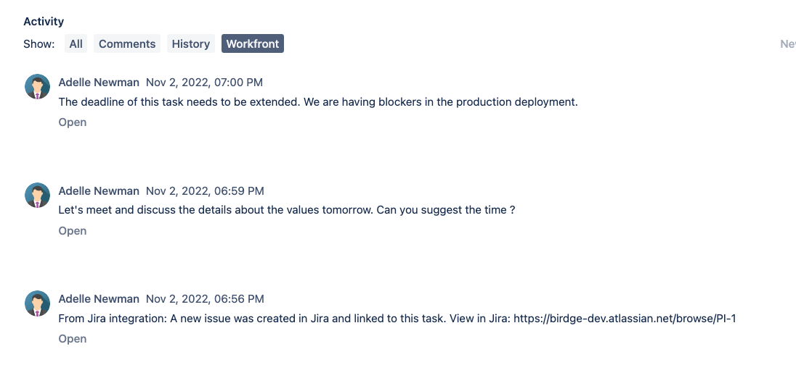

# Collega elementi tra [!DNL Adobe Workfront] e [!DNL Jira]

Puoi collegare [!DNL Jira] questioni [!DNL Adobe Workfront] attività o problemi automaticamente o manualmente.

Un solo elemento in [!DNL Workfront] può essere collegato a un elemento in [!DNL Jira]. Non puoi mai collegarne uno [!DNL Workfront] elemento a più [!DNL Jira] questioni, né una [!DNL Jira] problema a più [!DNL Workfront] oggetti.

## Requisiti di accesso

Devi disporre dei seguenti elementi:

<table style="table-layout:auto"> 
 <col> 
 <col> 
 <tbody> 
  <tr> 
   <td role="rowheader"><a href="https://www.workfront.com/plans" target="_blank">[!DNL [!DNL Adobe Workfront] piano]</a>*</td> 
   <td> 
[!UICONTROL Pro] o superiore
 </td> 
  </tr> 
  <tr> 
   <td role="rowheader"><a href="../../administration-and-setup/add-users/access-levels-and-object-permissions/wf-licenses.md" class="MCXref xref">Adobe [!DNL Workfront] panoramica delle licenze</a>*</td> 
   <td> 
Piano
 </td> 
  </tr> 
  <tr> 
   <td role="rowheader">Accesso a Jira</td> 
   <td> 
Accesso amministratore di sistema
 
<b>IMPORTANTE</b>

È consigliabile creare account di amministratore di sistema separati in [!DNL Jira] e [!DNL Workfront] per dedicare a questa integrazione, anziché utilizzare quelle esistenti che potrebbero essere collegate agli utenti.
 </td>
</tr> 
  <tr> 
   <td role="rowheader">Configurazioni a livello di accesso*</td> 
   <td> 
Devi essere un [!DNL Workfront] amministratore. Per informazioni su [!DNL Workfront] amministratori, consulta <a href="../../administration-and-setup/add-users/configure-and-grant-access/grant-a-user-full-administrative-access.md" class="MCXref xref">Concedere a un utente pieno accesso amministrativo</a>.
 
<b>NOTA</b>

Se non hai ancora accesso, chiedi [!DNL Workfront] amministratore se imposta ulteriori restrizioni nel livello di accesso. Per informazioni su come [!DNL Workfront] l&#39;amministratore può modificare il livello di accesso, vedi <a href="../../administration-and-setup/add-users/configure-and-grant-access/create-modify-access-levels.md" class="MCXref xref">Creare o modificare livelli di accesso personalizzati</a>.
 </td>
</tr> 
 </tbody> 
</table>

&#42;Per sapere quale piano, tipo di licenza o accesso hai, contatta il tuo [!DNL Workfront] amministratore.

## Prerequisiti

Prima di poter collegare elementi tra [!DNL Workfront] e [!DNL Jira], devi

* Installa [!DNL Workfront] per [!DNL Jira]

   Per istruzioni sull&#39;installazione di Workfront per Jira, vedi [Installa Adobe Workfront per Jira](../../workfront-integrations-and-apps/use-workfront-with-jira/install-workfront-for-jira.md).

* Configura [!DNL Workfront] per Jira

   Per istruzioni su come configurare Workfront per Jira, vedi [Configurare Adobe Workfront per Jira](../../workfront-integrations-and-apps/use-workfront-with-jira/configure-workfront-for-jira.md).

## Collegamento automatico [!DNL Workfront] elementi a [!DNL Jira] questioni

Come [!DNL Workfront] amministratore, puoi definire i trigger che possono creare automaticamente un problema in [!DNL Jira] ogni volta che determinate condizioni sono soddisfatte su un&#39;attività o su un problema in [!DNL Workfront]. Workfront e [!DNL Jira] gli elementi diventano collegati.

Dopo aver completato la configurazione di [!DNL Workfront] per Jira, quando un elemento viene creato o aggiornato in [!DNL Workfront] per far corrispondere i trigger, viene creato automaticamente un nuovo elemento in [!DNL Jira].\
Gli utenti Workfront che creano e aggiornano elementi Workfront non hanno bisogno di un [!DNL Jira] licenza per attivare la creazione di elementi in [!DNL Jira].

Per ulteriori informazioni sulla definizione automatica dei trigger per la creazione di problemi Jira, vedi  [Configura [!DNL Adobe Workfront] per Jira](../../workfront-integrations-and-apps/use-workfront-with-jira/configure-workfront-for-jira.md).

>[!NOTE]
>
>Puoi creare [!DNL Jira] elementi automaticamente allegando un modello a un progetto. Se il modello contiene attività con assegnazioni che soddisfano il [!DNL Jira] trigger, le nuove attività generano nuovi [!DNL Jira] problemi.

Collegamento automatico di un [!DNL Workfront] emissione a un [!DNL Jira] il problema è identico al collegamento automatico di un [!DNL Workfront] a un [!DNL Jira] problema.

Per collegare automaticamente un [!DNL Workfront] a un [!DNL Jira] problema:

1. Assicurati che il tuo [!DNL Jira] l&#39;amministratore di sistema ha configurato i trigger per la creazione automatica [!DNL Jira] quando [!DNL Workfront] gli elementi vengono assegnati, quindi accedi a [!DNL Workfront] con un livello di accesso che consente di creare un&#39;attività.

   Per ulteriori informazioni sull’accesso alle attività, consulta [Concedere l’accesso alle attività](../../administration-and-setup/add-users/configure-and-grant-access/grant-access-tasks.md).

1. Vai a un progetto e seleziona **[!UICONTROL Attività]**  nel pannello a sinistra.

1. Fai clic su **[!UICONTROL Nuova attività]**

   Oppure

   Seleziona un’attività esistente, quindi fai clic su **Modifica**.

1. Specifica o aggiorna uno dei campi disponibili per l’attività.
1. Fai clic su **[!UICONTROL Assegnazioni]** e assegna l&#39;attività a un utente, ruolo o team specificato come attivatore nel [!DNL Jira] integrazione.

1. Fai clic su **Salva modifiche**.

   In Workfront viene creata una nuova attività.

   In **[!UICONTROL Aggiornamenti]** area della nuova attività, c&#39;è un commento per indicare che è stato creato anche un nuovo problema in [!DNL Jira].

   

1. (Facoltativo) Fai clic sul collegamento al problema Jira per aprirlo in Jira.

   Oppure

   Fai clic sul pulsante **[!UICONTROL Vai a Jira]** nel collegamento **[!UICONTROL Integrazioni]** area **[!UICONTROL Dettagli]** per aprire la sezione o l&#39;intestazione dell&#39;attività o del problema [!DNL Jira] problema.

   L&#39;amministratore di sistema o di gruppo deve aggiungere [!UICONTROL Integrazioni] al modello di layout per visualizzarlo nell&#39;intestazione dell&#39;attività o del problema. Per informazioni, consulta [Personalizzare le intestazioni degli oggetti utilizzando un modello di layout](../../administration-and-setup/customize-workfront/use-layout-templates/customize-object-headers.md).

   Qualsiasi [!DNL Jira] l&#39;utente può iniziare immediatamente a lavorare sugli elementi creati automaticamente da [!DNL Workfront] e i relativi aggiornamenti verranno trasferiti a [!DNL Workfront] senza necessità di una licenza per [!DNL Workfront] per farlo.

   Solo i campi che hai impostato come [!DNL Workfront] amministratore configurato durante la configurazione del [!DNL Workfront] i componenti aggiuntivi vengono aggiornati.

   Per ulteriori informazioni sulla sincronizzazione dei campi tra Workfront e Jira, consulta la sezione [Configurare Workfront per Jira](../../workfront-integrations-and-apps/use-workfront-with-jira/configure-workfront-for-jira.md#configuring-the-add-on-for-jira) sezione  [Configurare Adobe Workfront per Jira](../../workfront-integrations-and-apps/use-workfront-with-jira/configure-workfront-for-jira.md).

   >[!NOTE]
   >
   >La [!DNL Jira] il problema non è assegnato a nessuno in [!DNL Jira] quando viene creato automaticamente da Workfront.

## Collegamento manuale [!DNL Jira] questioni [!DNL Workfront] items

Dopo la creazione degli elementi in [!DNL Jira] e [!DNL Workfront], indipendentemente l&#39;uno dall&#39;altro, puoi collegare manualmente un [!DNL Jira] problema a un esistente [!DNL Workfront] attività o problema.\
Non è possibile collegare manualmente un [!DNL Workfront] elemento da [!DNL Workfront] a un [!DNL Jira] oggetto.

>[!NOTE]
>
>Se la [!DNL Jira] il problema non si trova in un progetto che non è identificato come trigger nel [!DNL Workfront] L&#39;integrazione non può essere collegata manualmente a un elemento Workfront quando si utilizza l&#39;integrazione con [!DNL Jira] On-Premise.\
>Per ulteriori informazioni sulla configurazione dei trigger per il flusso di lavoro da Workfront a Jira, vedi [Collegamento automatico di elementi Workfront a problemi Jira](#automatically-link-workfront-items-to-jira-issues).

Quando [!DNL Workfront] e [!DNL Jira] gli elementi sono collegati, alcuni campi di un elemento possono essere aggiornati automaticamente sull’altro.\
Per ulteriori informazioni sull’aggiornamento degli elementi collegati, consulta [Aggiorna gli elementi collegati tra Jira e Adobe Workfront](../../workfront-integrations-and-apps/use-workfront-with-jira/update-linked-items-between-jira-wf.md).

Collegamento manuale [!DNL Jira] questioni [!DNL Workfront] articoli:

1. (Condizionale) Accedi a [!DNL Workfront] e trova un problema o un&#39;attività a cui desideri effettuare il collegamento [!DNL Jira] problema.
1. (Condizionale) Dalla barra degli indirizzi dell’elemento, copia il **URL** dell’elemento in Workfront.

   Oppure

   Da [!UICONTROL Dettagli] area , copia il **[!UICONTROL Numero di riferimento]** dell’elemento in Workfront.

   >[!NOTE]
   >
   >Devi avere un [!DNL Workfront] licenza di accesso a [!DNL Workfront]. In caso contrario, un [!DNL Workfront] l&#39;utente deve fornire queste informazioni.

1. In [!DNL Jira], individua un problema a cui desideri collegare manualmente [!DNL Workfront] oggetto.
1. In [!DNL Workfront] pannello a destra, incolla **URL** o **[!UICONTROL Numero di riferimento]** del [!DNL Workfront] elemento a cui si desidera collegarsi.\
   

1. Fai clic su **[!UICONTROL Collegamento]**.

   I due elementi diventano collegati e il [!DNL Workfront] il pannello a destra è compilato con le informazioni provenienti da [!DNL Workfront] oggetto.

   I seguenti [!DNL Workfront] i campi sono visibili in [!DNL Jira], per impostazione predefinita, nella [!DNL Workfront] pannello a destra:

   * La **[!UICONTROL Nome]** dell&#39;articolo: Puoi accedere al [!DNL Workfront] facendo clic sul nome nel pannello.
   * **[!UICONTROL Nome progetto]**
   * La **[!UICONTROL Stato]** dell&#39;articolo
   * La **[!UICONTROL Priorità]** dell&#39;articolo
   * La data in cui è stata creata [!DNL Workfront]
   * La **[!UICONTROL Orari pianificati]** dell&#39;articolo
   * La **[!UICONTROL Numero di riferimento]**: Puoi accedere al [!DNL Workfront] facendo clic su [!UICONTROL Numero di riferimento] nel pannello.

Per ulteriori informazioni sull’abilitazione della visualizzazione di campi aggiuntivi nel pannello di destra, consulta [Configura la sincronizzazione dei campi tra [!DNL Jira] e [!DNL Workfront] Elementi](../../workfront-integrations-and-apps/use-workfront-with-jira/configure-workfront-for-jira.md#setting-up-field-synchronization) sezione [Configura [!DNL Adobe Workfront for Jira]](../../workfront-integrations-and-apps/use-workfront-with-jira/configure-workfront-for-jira.md). Un commento da [!DNL Workfront] l’amministratore associato all’integrazione viene registrato nel **[!DNL Workfront]** della scheda [!DNL Jira] problema di confermare che un nuovo [!DNL Jira] elemento creato. Il commento contiene un collegamento al [!DNL Jira] problema.

## Scollega elementi tra [!DNL Jira] e [!DNL Workfront]

Elementi collegati tra [!DNL Jira] e [!DNL Workfront] può essere scollegato manualmente da [!DNL Jira].\
Non è possibile scollegare un [!DNL Workfront] elemento dal [!DNL Jira] controparte [!DNL Workfront].

Per scollegare manualmente un elemento collegato devi disporre del seguente accesso:

* Utente che ha collegato manualmente gli elementi
* Tu sei il [!DNL Jira] amministratore di sistema

Solo un [!DNL Workfront] L’amministratore può scollegare gli elementi collegati automaticamente.

Per scollegare una [!DNL Jira] problema da [!DNL Workfront] articolo:

1. In [!DNL Jira], passa a un problema collegato a un [!DNL Workfront] attività o problema.
1. Vai a [!DNL Workfront] nel pannello a destra, quindi fai clic sul pulsante **[!UICONTROL Scollega]** icona, quindi fai clic su **[!UICONTROL Scollega]**.\
   \
   Collegamento precedente [!DNL Jira] e [!DNL Workfront] Gli elementi ora non sono collegati. Tutti i campi, i commenti o i documenti che in futuro potrebbero essere aggiornati singolarmente non vengono aggiornati sulla loro controparte precedente nell’altra applicazione.
