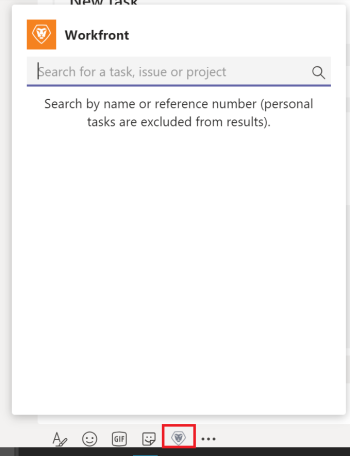

# Accesso [!DNL Adobe Workfront] da [!DNL Microsoft Teams]

Puoi accedere a [!DNL Adobe Workfront] da [!DNL Microsoft Teams] ed eseguire diverse azioni in [!DNL Workfront] digitando i comandi in [!DNL Workfront] canale bot o qualsiasi altro canale del team.

Puoi effettuare le seguenti operazioni in [!DNL Workfront] da [!DNL Microsoft Teams]:

* Cercare progetti, attività o problemi
* Creare attività personali
* Rispondi alle notifiche
* Gestisci approvazioni documenti

I comandi utilizzati da [!DNL Microsoft Teams] per eseguire queste azioni sono diverse a seconda del canale a cui desideri accedere [!DNL Workfront] da.

>[!NOTE]
>
>[!DNL Microsoft Teams] non supporta più [!DNL Internet Explorer]. Per utilizzare [!DNL Adobe Workfront for Microsoft Teams integration], è necessario utilizzare un browser web diverso da [!DNL Internet Explorer].

## Requisiti di accesso

Per eseguire i passaggi descritti in questo articolo, è necessario disporre dei seguenti diritti di accesso:

<table style="table-layout:auto"> 
 <col> 
 <col> 
 <tbody> 
  <tr> 
   <td role="rowheader">[!DNL Adobe Workfront] piano*</td> 
   <td> 
Qualsiasi
 </td> 
  </tr> 
  <tr> 
   <td role="rowheader">[!DNL Adobe Workfront] licenza*</td> 
   <td> 
[!UICONTROL Work], [!UICONTROL Plan]
 </td> 
  </tr> 
 </tbody> 
</table>

&#42;Per sapere quale piano, tipo di licenza o accesso hai, contatta il tuo [!DNL Workfront] amministratore.

## Prerequisiti

Puoi creare attività personali in [!DNL Adobe Workfront] da [!DNL Microsoft Teams] se sono soddisfatte le seguenti condizioni:

* Installazione e configurazione di un proprietario del team [!DNL Workfront for Microsoft Teams] per la tua squadra.
* Accesso effettuato [!DNL Workfront] da [!DNL Microsoft Teams].

## Accesso [!DNL Workfront] dal [!DNL Workfront] canale chat bot

1. Apri **[!DNL Workfront]** canale chat bot.
1. Fai clic sul pulsante **[!DNL Workfront]** sotto il campo di testo per visualizzare la casella di ricerca.

   

1. Inizia a digitare il nome di un progetto, un&#39;attività o un problema.

   Per informazioni sulla ricerca di elementi, consulta la sezione . [Cerca e condividi [!DNL Adobe Workfront] elementi in [!DNL Microsoft Teams]](../../workfront-integrations-and-apps/using-workfront-with-microsoft-teams/search-for-and-share-wf-items-in-ms-teams.md) in the article [Search for and share [!DNL Adobe Workfront] elementi in [!DNL Microsoft Teams]](../../workfront-integrations-and-apps/using-workfront-with-microsoft-teams/search-for-and-share-wf-items-in-ms-teams.md).

1. Fai clic sul pulsante **[!UICONTROL Inserisci qui le tue domande]** campo .

   

1. Esegui una delle operazioni seguenti:

   * Fai clic su **[!UICONTROL Cosa posso fare?]**, quindi **[!UICONTROL Accedere]** o **[!UICONTROL Esci]** di [!DNL Workfront], crea un **[!UICONTROL Nuova attività]** (compito personale) in [!DNL Workfront]o ottenere **[!UICONTROL Aiuto]** elencando i comandi disponibili.

   * Accesso [!DNL Workfront] direttamente digitando un comando nel **[!UICONTROL Inserisci qui le tue domande]** campo .

      I comandi non sono sensibili all’uso di maiuscole e minuscole.

      La [!DNL Workfront] bot risponde alla tua richiesta nel [!DNL Workfront] canale chat bot.

## Accesso [!DNL Workfront] da un canale del team

1. Apri un canale del team e digita **@[!DNL Workfront]**, quindi seleziona **[!DNL Workfront].**

1. Fai clic su **[!UICONTROL Ricerca]** per cercare un progetto, un&#39;attività o un problema.

   Per informazioni sulla ricerca di elementi, consulta la sezione [Cerca e condividi [!DNL Adobe Workfront] elementi in [!DNL Microsoft Teams]](../../workfront-integrations-and-apps/using-workfront-with-microsoft-teams/search-for-and-share-wf-items-in-ms-teams.md) section in the [Search for and share [!DNL Adobe Workfront] elementi in [!DNL Microsoft Teams]](../../workfront-integrations-and-apps/using-workfront-with-microsoft-teams/search-for-and-share-wf-items-in-ms-teams.md) articolo.

1. Digitare uno dei comandi seguenti per eseguire queste azioni in Workfront.\
   I comandi non sono sensibili all’uso di maiuscole e minuscole:

   * **[!UICONTROL Accedere]** per accedere a [!DNL Workfront]
   * **[!DNL Log out]** per disconnettersi da Workfront
   * **[!DNL New task]** per creare una nuova attività personale

      Per informazioni sulla creazione di nuove attività da [!DNL Microsoft Teams], vedi [Crea [!DNL Adobe Workfront] compiti da [!DNL Microsoft Teams]](../../workfront-integrations-and-apps/using-workfront-with-microsoft-teams/create-workfront-tasks-from-ms-teams.md).

   * **[!UICONTROL Aiuto]** per visualizzare un elenco di tutti i comandi disponibili.

      La [!DNL Workfront] bot risponde alla tua richiesta nel [!DNL Workfront] canale chat bot.

1. Vai a [!DNL Workfront] canale chat bot per accedere [!DNL Workfront] e completa la tua richiesta.
