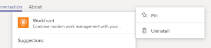
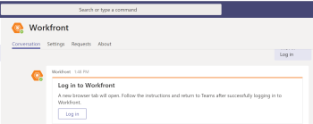

# Installa [!DNL Adobe Workfront] per Microsoft Teams

La [!DNL Adobe Workfront for Microsoft Teams] l’app ti consente di eseguire azioni di base in [!DNL Workfront] senza lasciare il tuo [!DNL Microsoft Teams] canali di chat.

>[!NOTE]
>
>[!DNL Microsoft Teams] non supporta più [!DNL Internet Explorer]. Per utilizzare [!DNL Adobe Workfront for Microsoft Teams integration], è necessario utilizzare un browser web diverso da [!DNL Internet Explorer].

## Requisiti di accesso

Per eseguire i passaggi descritti in questo articolo, è necessario disporre dei seguenti diritti di accesso:

<table style="table-layout:auto"> 
 <col> 
 <col> 
 <tbody> 
  <tr> 
   <td role="rowheader">[!DNL Adobe Workfront] piano*</td> 
   <td> 
Qualsiasi
 </td> 
  </tr> 
  <tr> 
   <td role="rowheader">[!DNL Adobe Workfront] licenza*</td> 
   <td> 
[!UICONTROL Work], [!UICONTROL Plan]
 </td> 
  </tr> 
 </tbody> 
</table>

&#42;Per sapere quale piano, tipo di licenza o accesso hai, contatta il tuo [!DNL Workfront] amministratore.

## Prerequisiti

È necessario essere un proprietario del team in [!DNL Microsoft Teams] per installare [!DNL Workfront] per [!DNL Microsoft Teams].

## Installa [!DNL Workfront for Microsoft Teams]

Come proprietario del team in [!DNL Microsoft Teams], è possibile installare [!DNL Workfront for Microsoft Teams] app per ogni tuo team da [!DNL Microsoft] Archiviare o da un file fornito da [!DNL Workfront].

* [Installa [!DNL Workfront for Microsoft Teams] da Microsoft Store](#install-workfront-for-microsoft-teams-from-the-microsoft-store)
* [Installa [!DNL Workfront for Microsoft Teams] da un file privato](#install-workfront-for-microsoft-teams-from-a-private-file)

### Installa [!DNL Workfront for Microsoft Teams] dal [!DNL Microsoft] Store

1. Accedi a [!DNL Microsoft Teams] come proprietario del team.
1. Selezionare il team per il quale si desidera installare il [!DNL Workfront for Microsoft Teams] app.
1. Fai clic su **[!UICONTROL Store]** sulla barra di navigazione laterale.

   

1. In **[!UICONTROL Cerca tutto]** casella, tipo *[!DNL Workfront]*.

1. Fai clic sul pulsante **[!DNL Workfront]** e segui le istruzioni della procedura guidata.
1. (Consigliato) Seleziona un team dal **[!UICONTROL Aggiungi a un team]** menu a discesa e abilita **[!UICONTROL Sì]** per aggiungere l’app a un team.

   

1. Seleziona **[!UICONTROL Generale]** per utilizzare l&#39;app in quel canale per il team selezionato, quindi fai clic su **[!UICONTROL Configurazione]**.

   

1. Al termine dell&#39;installazione, viene visualizzata una notifica che informa che l&#39;installazione è riuscita nel [!UICONTROL Generale] canale del team selezionato. Tutti i membri del team possono visualizzare questa notifica.
1. (Facoltativo) Fissa [!DNL Workfront] app per un accesso più semplice:

   1. Fai clic sul pulsante **[!UICONTROL Altro]** nel campo del messaggio [!UICONTROL Generale] canale.

   1. Passa il puntatore del mouse sopra [!DNL Workfront] nell&#39;elenco, quindi fai clic su **[!UICONTROL Altro]** a destra.

      

   1. Fai clic su **[!UICONTROL Pin]**.

      Questo aggiunge un [!DNL Workfront] sotto il campo chat. È possibile accedere rapidamente al [!UICONTROL Ricerca] zona da qui.

      Per informazioni sulla ricerca [!DNL Workfront] elementi, vedi [Cerca e condividi [!DNL Adobe Workfront] elementi in [!DNL Microsoft Teams]](../../workfront-integrations-and-apps/using-workfront-with-microsoft-teams/search-for-and-share-wf-items-in-ms-teams.md).

1. Fai clic su **[!UICONTROL Accedi a[!DNL Workfront]]** accesso [!DNL Workfront from Microsoft Teams].

   Per informazioni sull&#39;accesso a [!DNL Workfront], vedi [Accedi a Workfront dai Microsoft Teams](#log-in-to-workfront-from-microsoft-teams) in questo articolo.

### Installa [!DNL Workfront for Microsoft Teams] da un file privato

Se la tua organizzazione limita l&#39;accesso al download di app da [!DNL Microsoft] Archivia, devi contattare il nostro team di supporto e richiedere un file privato del [!DNL Workfront for Microsoft Teams] per installare l’app.

Per informazioni su come contattare il nostro team di supporto, consulta [Contatta l’Assistenza clienti](../../workfront-basics/tips-tricks-and-troubleshooting/contact-customer-support.md).

Per installare [!DNL Workfront for Microsoft Teams] da un file privato:

1. Salva il file privato ricevuto da [!DNL Workfront] sul computer.
1. Accedi a [!DNL Microsoft Teams] come [!DNL Microsoft] proprietario del team.
1. Fai clic sul pulsante **[!UICONTROL Altro]** icona del team per il quale desideri installare [!DNL Workfront for Microsoft Teams].

   

1. Fai clic su **[!UICONTROL Gestisci team]**.
1. Seleziona la **[!UICONTROL App]** scheda , quindi fai clic su **[!UICONTROL Caricare un’app personalizzata]** nell&#39;angolo in basso a destra dello schermo.

1. Cercare il file privato salvato sul computer, quindi seguire i passaggi per l&#39;installazione [!DNL Workfront for Microsoft Teams].
1. Al termine dell&#39;installazione, nel canale Generale del team selezionato viene visualizzata una notifica dell&#39;avvenuta riuscita dell&#39;installazione. Tutti i membri del team possono visualizzare questa notifica.
1. (Facoltativo) Fai clic sul pulsante **[!UICONTROL Altro]** sotto l&#39;icona **[!UICONTROL Inserisci qui le tue domande]** campo .

1. (Facoltativo) Passate il puntatore del mouse sopra il [!DNL Workfront] nell&#39;elenco, quindi fai clic su **[!UICONTROL Altro]** a destra.

   

1. (Facoltativo) Fai clic su **[!UICONTROL Pin]**.

   Questo aggiunge un [!DNL Workfront] sotto l&#39;icona [!UICONTROL Inserisci qui le tue domande] campo . È possibile accedere rapidamente al [!UICONTROL Ricerca] zona da qui.\
   Per informazioni sulla ricerca di elementi Workfront, vedi [Cerca e condividi [!DNL Adobe Workfront] elementi in [!DNL Microsoft Teams]](../../workfront-integrations-and-apps/using-workfront-with-microsoft-teams/search-for-and-share-wf-items-in-ms-teams.md).

## Accedi a [!DNL Workfront] da [!DNL Microsoft] Team

Come [!DNL Microsoft Teams] proprietario del team, è necessario installare [!DNL Workfront for Microsoft Teams] app per il tuo team prima che tu o chiunque altro possa accedere a [!DNL Workfront from Microsoft Teams].

Quando hai effettuato l’accesso a [!DNL Workfront] da [!DNL Microsoft Teams], è possibile ricevere [!DNL Workfront] le notifiche [!DNL Workfront] canale bot o puoi eseguire determinate azioni in [!DNL Workfront] da [!DNL Microsoft Teams].

Per informazioni sull’installazione di [!DNL Workfront] app, vedi [Installa [!DNL Workfront for Microsoft Teams]](#install-workfront-for-microsoft-teams) in questo articolo.

Per informazioni sull&#39;accesso [!DNL Workfront] da [!DNL Microsoft Teams] per eseguire determinate azioni, vedi [Accesso [!DNL Adobe Workfront] da [!DNL Microsoft Teams]](../../workfront-integrations-and-apps/using-workfront-with-microsoft-teams/access-workfront-from-ms-teams.md).

Per accedere a [!DNL Workfront] da [!DNL Microsoft Teams]:

1. Vai a **[!UICONTROL Generale]** canale del team in cui [!DNL Workfront for Microsoft Teams] l&#39;app è stata installata e fai clic su **[!UICONTROL Accedere a Workfront]**.

   La [!DNL Workfront] il canale chat bot viene aggiunto al tuo [!DNL Microsoft Teams] canali di chat.

   

1. Vai a [!DNL Workfront] canale chat bot in [!DNL Microsoft Teams] e tipo *[!UICONTROL accedere]* in **[!UICONTROL Inserisci qui le tue domande]** campo .

   Oppure

   Fai clic su **[!UICONTROL Accedere]**.

   

   Viene visualizzata una nuova scheda del browser.

1. Segui le istruzioni per accedere a [!DNL Workfront] utilizzando l’URL SAML (Enhanced Authentication, OAuth 2.0 o Security Assertion Markup Language).

   >[!NOTE]
   >
   >* Quando viene richiesto di accedere al dominio del [!DNL Workfront] account, digitare il formato: *la tua azienda&#39;sDomain.my.workfront.com*. Il dominio della tua azienda è in genere il nome della tua azienda.
   >* L’autenticazione avanzata non è disponibile finché non viene [!DNL Workfront] l&#39;amministratore lo abilita per questa integrazione.

1. Chiudi la scheda del browser utilizzata per accedere e tornare a [!DNL Microsoft Teams].

   Viene visualizzata una notifica nel [!DNL Workfront] canale chat di bot per confermare l&#39;accesso a [!DNL Workfront] con successo.
