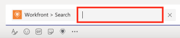

# Cerca e condividi [!DNL Adobe Workfront] elementi in [!DNL Microsoft Teams]

>[!IMPORTANT]
>
>Poiché [Microsoft sta eseguendo la transizione al nuovo client Teams](https://learn.microsoft.com/it-it/microsoftteams/teams-classic-client-end-of-availability), il client Teams classico non sarà più disponibile dopo il 1° luglio 2025. Per continuare a utilizzare Microsoft Teams e le app integrate come Workfront, è necessario effettuare la transizione al nuovo client Teams prima di tale data.
>
>L’integrazione aggiornata di Workfront è ora disponibile e completamente compatibile con la nuova esperienza Teams. Nella maggior parte dei casi, Workfront verrà visualizzato automaticamente dopo la transizione degli utenti. In caso contrario, l’integrazione potrà essere installata manualmente dall’App Store di Microsoft Teams. Per installare o verificare l’integrazione di Workfront nel nuovo client Teams, consulta [Installare  [!DNL Adobe Workfront]  per Microsoft Teams](/help/quicksilver/workfront-integrations-and-apps/using-workfront-with-microsoft-teams/install-workfront-ms-teams.md).

Puoi cercare [!DNL Workfront] elementi in qualsiasi canale [!DNL Adobe Workfront] in [!DNL Microsoft Teams] e condividerli con i membri dei tuoi team.

* [Prerequisiti per la condivisione di [!DNL Workfront] elementi in [!DNL Microsoft Teams]](#prerequisites-for-sharing-workfront-items-in-microsoft-teams-prerequisites-for-sharing-workfront-items-in-microsoft-teams)
* [Cerca e condividi [!DNL Workfront] elementi in [!DNL Microsoft Teams]](#search-for-and-share-adobe-workfront-items-in-microsoft-teams)

## Requisiti di accesso

+++ Espandi per visualizzare i requisiti di accesso per la funzionalità descritta in questo articolo.

<table style="table-layout:auto"> 
 <col> 
 <col> 
 <tbody> 
  <tr> 
   <td role="rowheader">Pacchetto Adobe Workfront</td> 
   <td> 
Qualsiasi
 </td> 
  </tr> 
  <tr> 
   <td role="rowheader">Licenza di Adobe Workfront</td> 
   <td> 
Standard

   
Work o successiva
 </td> 
  </tr> 
 </tbody> 
</table>

Per informazioni, consulta [Requisiti di accesso nella documentazione di Workfront](/help/quicksilver/administration-and-setup/add-users/access-levels-and-object-permissions/access-level-requirements-in-documentation.md).

+++

## Prerequisiti per condividere [!DNL Workfront] elementi in [!DNL Microsoft Teams] {#prerequisites-for-sharing-workfront-items-in-microsoft-teams}

È possibile cercare e condividere [!DNL Workfront] elementi in [!DNL Microsoft Teams] se sono soddisfatte le seguenti condizioni:

* Il proprietario del team ha installato e configurato [!DNL Workfront for Microsoft Teams] per il team.
* Sei connesso a [!DNL Workfront] da [!UICONTROL Microsoft Teams].

Per informazioni sull&#39;installazione di [!UICONTROL Workfront per Microsoft Teams] e l&#39;accesso a [!UICONTROL Workfront] da [!DNL Microsoft Teams], vedere [Installare Adobe Workfront per Microsoft Teams](../../workfront-integrations-and-apps/using-workfront-with-microsoft-teams/install-workfront-ms-teams.md).

>[!NOTE]
>
>[!DNL Microsoft Teams] non supporta più [!DNL Internet Explorer]. Per utilizzare [!DNL Adobe Workfront for Microsoft Teams integration], è necessario utilizzare un browser diverso da [!DNL Internet Explorer].

## Cerca e condividi [!DNL Workfront] elementi in [!DNL Microsoft Teams] {#search-for-and-share-workfront-items-in-microsoft-teams}

È possibile cercare i seguenti [!DNL Workfront] elementi da un canale [!DNL Microsoft Teams]:

* Progetti
* Attività

  >[!NOTE]
  >
  >Non è possibile cercare le attività personali.

* Problemi

Dopo aver trovato gli elementi cercati, puoi condividerli con altri utenti in [!DNL Microsoft Teams].

Per cercare un elemento [!DNL Workfront] da [!DNL Microsoft Teams] e condividerlo con altri utenti:

1. In [!DNL Microsoft Teams], accedi a qualsiasi canale di chat e fai clic sull&#39;icona **[!DNL Workfront]**.
1. Cercare l&#39;elemento [!DNL Workfront] effettuando una delle seguenti operazioni:

   * Fare clic sull&#39;icona [!DNL Workfront] sotto il campo della conversazione.\

     \
      A seconda delle impostazioni, questa icona potrebbe essere visualizzata sotto l&#39;icona **[!UICONTROL Altro]**.\
      \
      La casella **[!UICONTROL Cerca]** viene visualizzata per impostazione predefinita.

   * Digita *@[!DNL Workfront]* da qualsiasi canale, seleziona Workfront, quindi seleziona **[!UICONTROL Cerca].**

     

1. Nella casella [!UICONTROL ricerca] fornita, inizia a digitare il nome o il numero di riferimento di un progetto, un&#39;attività o un problema e fai clic su di esso quando viene visualizzato nell&#39;elenco.\
   \
   Aggiunge una scheda con l&#39;elemento [!DNL Workfront] nel campo della chat. Alcune informazioni sull’elemento sono incluse nella scheda, tra cui il nome dell’elemento, l’oggetto principale, lo stato, la priorità e la percentuale di completamento.

1. (Facoltativo) Aggiungi un commento sotto la scheda [!DNL Workfront], quindi fai clic su **[!UICONTROL Invia]** o premi Invio.\
   Questo invia il messaggio con l&#39;elemento [!DNL Workfront] al tuo canale.\
   Tutti i membri del canale possono visualizzare questo messaggio, incluse le informazioni sulla scheda [!DNL Workfront].

1. Fare clic su **[!UICONTROL Visualizza in Workfront]** per visualizzare l&#39;elemento in [!DNL Workfront].\
   Solo gli utenti con una licenza [!DNL Workfront] possono visualizzare un elemento in [!DNL Workfront].
