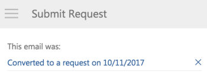

# Crea un [!DNL Adobe Workfront] richiesta di [!UICONTROL Outlook] email

Puoi creare una [!DNL Adobe Workfront] richiesta da un&#39;e-mail in Outlook.

Quando crei una [!DNL Workfront] richiesta basata su un’e-mail, il contenuto dell’e-mail (incluso l’oggetto e il corpo) è incluso nella richiesta per impostazione predefinita.

>[!NOTE]
>
>Non è possibile creare un [!DNL Workfront] richiesta di un [!UICONTROL Outlook] cassetta postale.

## Requisiti di accesso

Per eseguire i passaggi descritti in questo articolo, è necessario disporre dei seguenti diritti di accesso:

<table style="table-layout:auto"> 
 <col> 
 <col> 
 <tbody> 
  <tr> 
   <td role="rowheader">[!DNL Adobe Workfront] piano*</td> 
   <td> 
Qualsiasi
 </td> 
  </tr> 
  <tr> 
   <td role="rowheader">[!DNL Adobe Workfront] licenza*</td> 
   <td> 
[!UICONTROL Work], [!UICONTROL Plan]
 </td> 
  </tr> 
 </tbody> 
</table>

&#42;Per sapere quale piano, tipo di licenza o accesso hai, contatta il tuo [!DNL Workfront] amministratore.

## Prerequisiti

Le [!DNL Workfront] l&#39;amministratore deve abilitare [!DNL Outlook for Office] con [!DNL Workfront] prima di poter utilizzare questa integrazione.

## Creare una richiesta da un [!DNL Outlook] email

Per creare una [!DNL Workfront] Richiesta da [!DNL Outlook]:

1. Seleziona l’e-mail che contiene le informazioni da includere in un [!DNL Workfront] richiesta.
1. Fai clic sul pulsante **[!DNL Workfront]** nell’angolo in alto a destra del messaggio e-mail per visualizzare il componente aggiuntivo Workfront.\
   Potrebbe essere necessario fare clic sulla freccia rivolta verso il basso in alto a destra del messaggio e-mail per accedere al [!DNL Workfront] icona.

1. Fai clic sul pulsante **[!UICONTROL Menu]** per visualizzare l’elenco delle opzioni disponibili [!DNL Workfront] opzioni.

   

1. Fai clic su **[!UICONTROL Invia richiesta]**.
1. In **[!UICONTROL Selezionare un tipo di richiesta]** seleziona la coda di richiesta in cui desideri inviare la richiesta.

   

1. Specifica le seguenti informazioni:\
   A seconda della configurazione della coda di richiesta, i campi disponibili potrebbero variare. Per un elenco completo e una descrizione dei campi possibili, vedi [Creazione e invio [!DNL Adobe Workfront] requests](../../manage-work/requests/create-requests/create-submit-requests.md) articolo.

   * **[!UICONTROL Oggetto]:** Specifica un oggetto per la richiesta. Per impostazione predefinita, viene utilizzato l’oggetto dell’e-mail.
   * **[!UICONTROL Descrizione]:** Specifica una descrizione per la richiesta. Per impostazione predefinita, viene utilizzato il corpo dell’e-mail.
   * **[!UICONTROL Documenti]:** Allega tutti i documenti che desideri includere nella richiesta. È possibile allegare i documenti tramite trascinamento o facendo clic su **[!UICONTROL Seleziona file]** e navigando verso e selezionando il documento.\

      Per impostazione predefinita, nella richiesta sono inclusi tutti i documenti allegati all’e-mail.

1. Fai clic su **[!UICONTROL Invia richiesta]**.\
   La richiesta viene inviata a [!DNL Workfront], nella coda di richiesta specificata.

1. (Facoltativo) Torna a [!DNL Outlook], quindi seleziona l’e-mail originale.\
   Nella parte superiore del [!DNL Workfront] nel pannello dei componenti aggiuntivi, osserva la conferma con un collegamento che l’e-mail è stata aggiunta a Workfront come richiesta. Il collegamento include la data in cui è stato convertito.\
   
