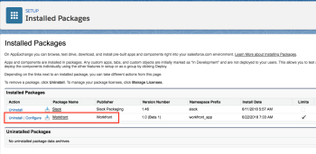

# Installa [!DNL Adobe Workfront for Salesforce]

Per installare l’app prima che diventi disponibile nella [!DNL Salesforce AppExchange], vedi [Installazione [!DNL Workfront for Salesforce] prima che diventi disponibile nel [!DNL AppExchange] Marketplace](#installing-workfront-for-salesforce-before-it-becomes-available-in-the-appexchange-marketplace-installing-workfront-for-salesforce-before-it-becomes-available-in-the-appexchange-marketplace).

Come [!DNL Salesforce] e [!DNL Adobe Workfront] amministratore, è possibile installare [!DNL Workfront for Salesforce] consente [!DNL Salesforce] utenti da inviare [!DNL Workfront] richiede e crea automaticamente progetti senza mai lasciare Salesforce.

Per informazioni generali su cosa ci si può aspettare installando [!DNL Workfront for Salesforce], vedi [[!DNL Adobe Workfront for Salesforce] panoramica](../../workfront-integrations-and-apps/using-workfront-with-salesforce/workfront-for-salesforce-overview.md).

* [Prerequisiti per l’installazione e l’utilizzo [!DNL Workfront for Salesforce]](#prerequisites-for-installing-and-using-workfront-for-salesforce-prerequisites-for-installing-and-using-workfront-for-salesforce)
* [Installazione [!DNL Workfront for Salesforce]](#install-adobe-workfront-for-salesforce)

## Requisiti di accesso

Per utilizzare la funzionalità descritta in questo articolo, è necessario disporre dei seguenti diritti di accesso:

<table style="table-layout:auto"> 
 <col> 
 <col> 
 <tbody> 
  <tr> 
   <td role="rowheader">[!DNL Adobe Workfront] piano*</td> 
   <td> 
[!UICONTROL Pro] o superiore
 </td> 
  </tr> 
  <tr> 
   <td role="rowheader">[!DNL Adobe Workfront] licenza*</td> 
   <td> 
[!UICONTROL Plan]
 </td> 
  </tr>  </tbody> 
</table>

&#42;Per sapere quale piano, tipo di licenza o accesso hai, contatta il tuo [!DNL Workfront] amministratore.

## Prerequisiti per l’installazione e l’utilizzo [!DNL Workfront for Salesforce] {#prerequisites-for-installing-and-using-workfront-for-salesforce}

* Devi avere un [!DNL Salesforce] istanza con accesso a un account amministratore di sistema per installare l’app.
* Devi avere un [!DNL Workfront] istanza con accesso a un account amministratore di sistema per configurare l’integrazione.
* [!UICONTROL Salesforce] gli utenti devono avere [!DNL Workfront] per poter

   * Crea [!DNL Workfront] richieste da [!DNL Salesforce] o
   * Visualizza [!DNL Workfront] richieste o progetti in Salesforce.

## Installazione [!DNL Workfrontfor Salesforce] {#installing-workfront-for-salesforce}

Devi essere un [!DNL Salesforce] e [!DNL Workfront] amministratore di sistema per installare e configurare [!DNL Workfront for Salesforce].

Le sottosezioni seguenti descrivono come installare [!DNL Workfront] per [!DNL Salesforce] Ambiente di produzione. Puoi seguire gli stessi passaggi per l’installazione di [!DNL Workfront] per [!DNL Salesforce] Ambiente sandbox.

* [Installazione [!DNL Workfront for Salesforce] prima che diventi disponibile nel [!DNL AppExchange] Marketplace](#installing-workfront-for-salesforce-before-it-becomes-available-in-the-appexchange-marketplace-installing-workfront-for-salesforce-before-it-becomes-available-in-the-appexchange-marketplace)
* [Installazione [!DNL Workfront for Salesforce] in [!DNL Salesforce Classic] Framework](#installing-workfront-for-salesforce-in-the-salesforce-classic-framework)
* [Installazione [!DNL Workfront for Salesforce] in [!DNL Salesforce Lightning Experience] Framework](#installing-workfront-for-salesforce-in-the-salesforce-lightning-experience-framework)

### Installazione [!DNL Workfront for Salesforce] prima che diventi disponibile nel [!DNL AppExchange] Marketplace {#installing-workfront-for-salesforce-before-it-becomes-available-in-the-appexchange-marketplace}

[!DNL Workfront for Salesforce] sarà disponibile nella sezione [!DNL Salesforce AppExchange] presto.

Per installare l’app prima che sia disponibile:

1. Nell&#39;ambiente di produzione, vai a

   `https://login.salesforce.com/packaging/installPackage.apexp?p0=04t4K000002aUZY`

   Nell’ambiente Sandbox, vai a

   `https://test.salesforce.com/packaging/installPackage.apexp?p0=04t4K000002aUZY`

1. Controlla la **[!UICONTROL Sì, concedi l&#39;accesso a questi siti web di terze parti]** scatola.

   

   Viene visualizzata una schermata di caricamento che potrebbe richiedere un po&#39; di tempo per l&#39;installazione.

1. Fai clic su **[!UICONTROL Fine]** al completamento dell&#39;installazione.

1. Passa a **[!UICONTROL Configurazione>Controlli di sicurezza>Impostazioni del sito remoto]**.
1. (Condizionale) Se non visualizzi il tuo [!DNL Workfront] URL elencato in **[!UICONTROL Tutti i siti remoti]** elenco, fai clic su **[!UICONTROL Nuovo sito remoto]**.

1. Specifica la **[!UICONTROL Nome del sito remoto]**.

   Ad esempio, *[!DNL Workfront]*.

1. Specifica la **[!UICONTROL URL sito remoto]**.

   Ad esempio: *yourDomain.my.workfront.com*.

1. Fai clic su **[!UICONTROL Salva]**.

   La [!DNL Workfront] l&#39;app è ora installata nel tuo [!DNL Salesforce] e **[!UICONTROL Opportunità di lavoro]** e **[!UICONTROL Account di lavoro]** [!UICONTROL Effetto visivo] Le pagine sono state create nel tuo ambiente.

   [!DNL Salesforce] gli utenti possono utilizzare l’app una volta che aggiungi l’ [!DNL Workfront] sezione [!UICONTROL Opportunità] o [!UICONTROL Account] layout di pagina.\
   Per informazioni sulla configurazione della sezione Workfront per gli utenti, consulta [Configurare la sezione Adobe Workfront per gli utenti Salesforce](../../workfront-integrations-and-apps/using-workfront-with-salesforce/configure-wf-section-for-salesforce-users.md).

### Installazione [!DNL Workfront] per [!DNL Salesforce] in [!DNL Salesforce Classic] Framework

1. Accedi a [!DNL Salesforce] come amministratore di sistema.
1. Vai a **Configurazione.**
1. In **Crea** sezione, fai clic su **AppExchange Marketplace**.

1. In **Ricerca nelle app di AppExchange** casella, tipo **Workfront**.

1. Fai clic sull’app quando la trovi, quindi fai clic su **Scarica subito**.
1. Fai clic su **[!UICONTROL Installa in produzione]** per installare [!DNL Workfront] nella tua app [!DNL Salesforce] Ambiente di produzione. (consigliato)
1. Seleziona la **[!UICONTROL Ho letto e accetto i termini e le condizioni]** dopo aver letto e concordato i termini e le condizioni.
1. Fai clic su **[!UICONTROL Conferma e installa]**.
1. Seleziona **[!UICONTROL Installa per tutti gli utenti]** (consigliato), quindi fai clic su **[!UICONTROL Installa]**.

1. (Condizionale) Se ti viene richiesto se desideri approvare un accesso di terze parti, devi selezionare **[!UICONTROL Sì, concedi l&#39;accesso a questi siti web di terze parti]**, quindi fai clic su **[!UICONTROL Continua]**.

1. Fai clic su **[!UICONTROL Fine]** al completamento dell&#39;installazione.

   La [!DNL Workfront] l&#39;app è elencata in **[!UICONTROL Pacchetti installati]**.

   

1. Passa a **[!UICONTROL Configurazione>Controlli di sicurezza>Impostazioni del sito remoto]**.
1. (Condizionale) Se non visualizzi il tuo [!DNL Workfront] URL elencato in **[!UICONTROL Tutti i siti remoti]** elenco, fai clic su **[!UICONTROL Nuovo sito remoto]**.\
   

1. Specifica la **[!UICONTROL Nome del sito remoto]**.\
   Ad esempio, *[!DNL Workfront]*.

1. Specifica la **[!UICONTROL URL sito remoto]**.\
   Ad esempio: *yourDomain.my.workfront.com*.

1. Fai clic su **[!UICONTROL Salva]**.\
   La [!DNL Workfront] l&#39;app è ora installata nel tuo [!DNL Salesforce] e **[!UICONTROL Opportunità di lavoro]** e **[!UICONTROL Account di lavoro]** [!UICONTROL Effetto visivo] Le pagine sono state create nel tuo ambiente.\
   [!DNL Salesforce] gli utenti non possono ancora utilizzare l’app finché non aggiungi l’ [!DNL Workfront] sezione [!UICONTROL Opportunità] o [!UICONTROL Account] layout di pagina.\
   Per informazioni sulla configurazione della [!DNL Workfront] per gli utenti, consulta [Configura le [!DNL Adobe Workfront] sezione per [!DNL Salesforce] utenti](../../workfront-integrations-and-apps/using-workfront-with-salesforce/configure-wf-section-for-salesforce-users.md).

### Installazione [!DNL Workfront for Salesforce] in [!DNL Salesforce Lightning Experience] Framework

1. Accedi a [!DNL Salesforce] come amministratore di sistema.
1. Fai clic sul pulsante **[!UICONTROL Configurazione] icona**, quindi fai clic su **[!UICONTROL Configurazione]**.

1. In **[!UICONTROL STRUMENTI DI PIATTAFORMA]** sezione, espandi **[!UICONTROL App].**

1. Clic **[!DNL AppExchange Marketplace]**.
1. In **[!UICONTROL Ricerca [!DNL AppExchange] App]** casella, tipo **[!DNL Workfront]**.

1. Fai clic sull’app quando la trovi, quindi fai clic su **[!UICONTROL Scarica subito]**.
1. Fai clic su **[!UICONTROL Apri schermata di accesso]**.\
   Devi accedere con il tuo [!DNL Workfront] account amministratore per [!DNL Salesforce].

1. Fai clic su **[!UICONTROL Consenti]**.
1. In **[!UICONTROL Installa in questa organizzazione]** casella, fai clic su **[!UICONTROL Installa qui]** per installare [!DNL Workfront] nel tuo [!DNL Salesforce] Ambiente di produzione. (consigliato)

1. Seleziona la **[!UICONTROL Ho letto e accetto i termini e le condizioni]** dopo aver letto e concordato i termini e le condizioni.
1. Fai clic su **[!UICONTROL Conferma e installa]**.
1. Seleziona **[!UICONTROL Installa per tutti gli utenti]** (consigliato), quindi fai clic su **[!UICONTROL Installa]**.

1. (Condizionale) Se ti viene richiesto se desideri approvare un accesso di terze parti, devi selezionare **[!UICONTROL Sì, concedi l&#39;accesso a questi siti web di terze parti]**, quindi fai clic su **[!UICONTROL Continua]**.

1. Fai clic su **[!UICONTROL Fine]** al completamento dell&#39;installazione.

   La [!DNL Workfront] l&#39;app è elencata in **[!UICONTROL Pacchetti installati]**.

   

1. Passa a **[!UICONTROL Configurazione].**
1. In **[!UICONTROL IMPOSTAZIONI]** sezione , espandi &#x200B;**[!UICONTROL Sicurezza].**

1. Fai clic su **[!UICONTROL Impostazioni del sito remoto]**.
1. (Condizionale) Se non visualizzi il tuo [!DNL Workfront] URL elencato in **[!UICONTROL Tutti i siti remoti]** elenco, fai clic su **[!UICONTROL Nuovo sito remoto]**.

   

1. Specifica la **[!UICONTROL Nome del sito remoto]**.

   Ad esempio, *[!DNL Workfront]*.

1. Specifica la **[!UICONTROL URL sito remoto]**.

   Ad esempio: *yourDomain.my.workfront.com*.

1. Fai clic su **[!UICONTROL Salva]**.

   La [!DNL Workfront] l&#39;app è ora installata nel tuo [!DNL Salesforce] e **[!DNL Workfront]** viene ora aggiunto all’ambiente.

   [!UICONTROL Salesforce] gli utenti possono utilizzare [!DNL Workfront] una volta aggiunta la [!DNL Workfront] sezione [!UICONTROL Opportunità] o [!UICONTROL Account] layout di pagina.\
   Per informazioni sulla configurazione della [!DNL Workfront] per gli utenti, consulta [Configura le [!DNL Adobe Workfront] sezione per [!DNL Salesforce] utenti](../../workfront-integrations-and-apps/using-workfront-with-salesforce/configure-wf-section-for-salesforce-users.md).
