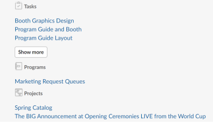
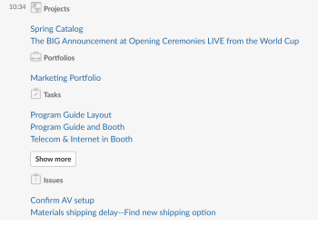

# Accedi ai tuoi preferiti e agli articoli recenti da [!DNL Slack]

Dopo aver installato e configurato [!DNL Adobe Workfront for Slack], puoi visualizzare il tuo [!UICONTROL Workfront] Preferiti ed elementi recenti e di accesso da entrambi gli elenchi [!DNL Slack].

Per ulteriori informazioni sulla configurazione [!DNL Workfront with Slack], vedi [Configura [!DNL Adobe Workfront for Slack]](../../workfront-integrations-and-apps/using-workfront-with-slack/configure-workfront-for-slack.md).

## Requisiti di accesso

Devi disporre dei seguenti elementi:

<table style="table-layout:auto"> 
 <col> 
 <col> 
 <tbody> 
  <tr> 
   <td role="rowheader"><a href="https://www.workfront.com/plans" target="_blank">[!DNL [!DNL Adobe Workfront] piano]</a>*</td> 
   <td> 
[!UICONTROL Pro] o superiore
 </td> 
  </tr> 
 </tbody> 
</table>

&#42;Per sapere quale piano, tipo di licenza o accesso hai, contatta il tuo [!DNL Workfront] amministratore.\

## Prerequisiti

Prima di poter accedere ai preferiti e agli elementi recenti da [!DNL Slack], devi

* Configura [!DNL Workfront for Slack]\
   Per istruzioni sulla configurazione [!DNL Workfront for Slack], vedi [Configura [!DNL Adobe Workfront for Slack]](../../workfront-integrations-and-apps/using-workfront-with-slack/configure-workfront-for-slack.md).

## Accedi alle [!UICONTROL Preferiti] elenco da [!DNL Slack]

1. Accedi al tuo [!DNL Slack] istanza ed accesso a [!DNL Workfront] da [!DNL Slack].\
   Per ulteriori informazioni sull&#39;accesso a [!DNL Workfront] da [!DNL Slack], consulta &quot;Accesso a [!DNL Workfront] da [!DNL Slack]&quot; sezione in [Accesso [!DNL Adobe Workfront] da [!DNL Slack]](../../workfront-integrations-and-apps/using-workfront-with-slack/access-workfront-from-slack.md).

1. Da qualsiasi canale, inizia a digitare il seguente comando nel [!UICONTROL message] campo: `/workfront favorites`

   >[!NOTE]
   >
   >I comandi sono sensibili all’uso di maiuscole e minuscole. Puoi avviare il comando con `/wf` anziché `/workfront`.

   Viene visualizzato un elenco dei Preferiti.

* 

1. (Facoltativo) Fai clic su **[!UICONTROL Mostra altro]** per elencare altri Preferiti.
1. Fai clic sul nome di un preferito per aprirlo in [!DNL Workfront] in una nuova scheda del browser.

## Accedi all&#39;elenco degli elementi recenti da [!DNL Slack]

1. Accedi al tuo [!DNL Slack] istanza ed accesso a [!DNL Workfront] dallo Slack.\
   Per ulteriori informazioni sull&#39;accesso a [!DNL Workfront] da [!DNL Slack], consulta &quot;Accesso a [!DNL Workfront] da [!DNL Slack]&quot; sezione in [Accesso [!DNL Adobe Workfront] da [!DNL Slack]](../../workfront-integrations-and-apps/using-workfront-with-slack/access-workfront-from-slack.md).

1. Da qualsiasi canale, inizia a digitare il seguente comando nel [!UICONTROL message] campo: `/workfront recent`

   >[!NOTE]
   >
   >I comandi sono sensibili all’uso di maiuscole e minuscole. Puoi avviare il comando con `/wf` anziché `/workfront`.

   Viene visualizzato un elenco degli elementi recenti, nell’ordine in cui sono stati aperti per ultimi, con quelli più recenti nella parte superiore. Gli elementi sono elencati tre alla volta e sono raggruppati per tipo di oggetto.\
   

1. (Facoltativo) Fai clic su **[!UICONTROL Mostra altro]** per elencare gli elementi più recenti.
1. (Facoltativo) Fai clic sul nome di un elemento a cui hai recentemente effettuato l’accesso per aprirlo in [!DNL Workfront] in una nuova scheda del browser.
