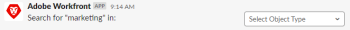

# Cerca [!DNL Adobe Workfront] oggetti da [!DNL Slack]

È possibile cercare [!DNL Adobe Workfront] oggetti da [!DNL Slack], se la tua istanza di [!DNL Slack] ha avuto [!DNL Workfront] app installata.

Per ulteriori informazioni sulla configurazione [!DNL Workfront] con [!DNL Slack], vedi [Configura [!DNL Adobe Workfront] per [!DNL Slack]](../../workfront-integrations-and-apps/using-workfront-with-slack/configure-workfront-for-slack.md).

## Requisiti di accesso

Devi disporre dei seguenti elementi:

<table style="table-layout:auto"> 
 <col> 
 </col> 
 <col> 
 </col> 
 <tbody> 
  <tr> 
   <td role="rowheader"><a href="https://www.workfront.com/plans" target="_blank">[!DNL [!DNL Adobe Workfront] piano]</a>*</td> 
   <td> 
[!UICONTROL Pro] o superiore
 </td> 
  </tr> 
 </tbody> 
</table>

&#42;Per sapere quale piano, tipo di licenza o accesso hai, contatta il tuo [!DNL Workfront] amministratore.\

## Prerequisiti

Prima di poter cercare [!DNL Workfront] oggetti da [!DNL Slack], devi

* Configura [!DNL Workfront] per [!DNL Slack]\
   Per istruzioni sulla configurazione [!DNL Workfront for Slack], vedi [Configura [!DNL Adobe Workfront for Slack]](../../workfront-integrations-and-apps/using-workfront-with-slack/configure-workfront-for-slack.md).

## Cerca [!DNL Workfront] oggetti da [!DNL Slack]:

1. Accedi al tuo [!DNL Slack] istanza ed accesso a [!DNL Workfront] da [!DNL Slack].\
   Per ulteriori informazioni sull&#39;accesso a [!DNL Workfront] da [!DNL Slack], consulta &quot;Accesso a [!DNL Workfront] da [!DNL Slack]&quot; sezione in [Accesso [!DNL Adobe Workfront] da [!DNL Slack]](../../workfront-integrations-and-apps/using-workfront-with-slack/access-workfront-from-slack.md).

1. Da qualsiasi canale, inizia a digitare uno dei seguenti comandi nel campo messaggio:

   `/workfront search <keyword>`

   Oppure

   `/wf search <keyword>`

   >[!NOTE]
   >
   >I comandi sono sensibili all’uso di maiuscole e minuscole. La parola chiave non fa distinzione tra maiuscole e minuscole e deve essere inserita senza parentesi graffe o virgolette.\
   >   >

1. Nel campo visualizzato, selezionare un tipo di oggetto tra i seguenti:

   * Progetto
   * Attività
   * Problema
   * Rapporto
   * Persone
   * Modello
   * Documento
   * Portfolio
   * Programma
   * Dashboard
   * Azienda
   * Nota

      È possibile selezionare un solo tipo di oggetto alla volta.\
      Viene visualizzato un elenco di elementi corrispondenti ai criteri di ricerca.

1. Fai clic sul nome di un elemento in cui aprirlo [!DNL Workfront] in una nuova scheda del browser.
